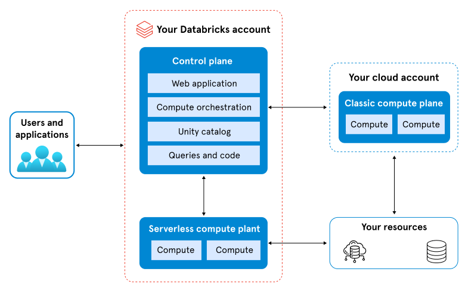
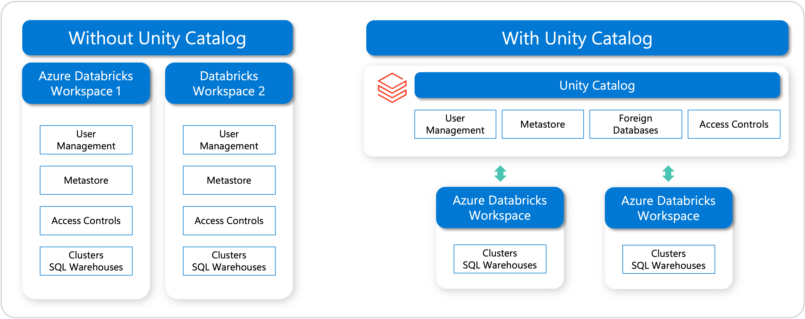

# Explore Azure Databricks

> **Module:** Explore Azure Databricks (8 Units · Intermediate)
> **Source:** [Microsoft Learn](https://learn.microsoft.com/en-gb/training/modules/explore-azure-databricks/)
> **In one line:** Azure Databricks is a cloud service that provides a **scalable platform for data analytics using Apache Spark**.

---

## 📌 Learning objectives

By the end of this module you should be able to:

- **Provision** an Azure Databricks workspace
- **Identify** core workloads for Azure Databricks
- **Use** the data governance tools — **Unity Catalog** and **Microsoft Purview**
- **Describe** the key concepts of an Azure Databricks solution

**Prerequisite:** A fundamental knowledge of data analytics concepts (the [Azure Data Fundamentals](https://learn.microsoft.com/en-us/credentials/certifications/azure-data-fundamentals) certification is a good starting point).

---

## 1. Get started with Azure Databricks

To use Azure Databricks you must create an **Azure Databricks workspace** in your Azure subscription. A *workspace* is an Azure Databricks deployment in a cloud service account — a **unified environment** for working with Databricks assets for a specified set of users.

### Ways to create a workspace

| Method | Tool |
|--------|------|
| UI | Azure portal |
| Infrastructure as Code | ARM / Bicep / Terraform template |
| PowerShell | `New-AzDatabricksWorkspace` cmdlet |
| CLI | `az databricks workspace create` |

### What you must specify when creating a workspace

- **Workspace name**
- **Region** — see [Azure services available by region](https://azure.microsoft.com/explore/global-infrastructure)
- **Pricing tier:**
  - **Premium** — Role-based access controls, Unity Catalog, SQL, Mosaic AI, serverless compute, Genie Code, and other enterprise features.
  - **Trial** — a 14-day free trial of a Premium-level workspace.
  - > ⚠️ **The Standard tier is no longer available for new workspaces (as of April 1, 2026).** All new workspaces are created on **Premium**.
- **Workspace type:**
  - **Serverless** — pre-configured with serverless compute and managed storage. *Recommended for most use cases.*
  - **Hybrid** (a.k.a. **Classic**) — provisions compute and storage in *your* Azure subscription. Best for custom networking or on-premises connectivity.
- **Managed Resource Group name** *(optional)* — an auto-created resource group where Azure provisions and manages the infrastructure resources Databricks needs.

> 💡 **Tip:** A **Free Edition** exists for students/educators — no time limit, no payment — but it has daily usage limits and no access to classic compute.

### Create a workspace with the CLI

```bash
az databricks workspace create \
    --resource-group myresourcegroup \
    --name mydatabricksws \
    --location westus2 \
    --sku premium
```

### Equivalent PowerShell cmdlet

```powershell
New-AzDatabricksWorkspace -Name mydatabricksws -ResourceGroupName myresourcegroup -Location westus2 -ManagedResourceGroupName databricks-group -Sku premium
```

### Navigating the Workspace UI

After provisioning, you use the **web-based workspace UI** to create and manage resources (Spark clusters, notebooks, queries) and to work with data in files and tables.

- **Homepage** — shortcuts to common tasks: import data, create a notebook, create a query, configure an AutoML experiment.
- **Sidebar** — common categories (Workspace, Recents, Catalog, Jobs & Pipelines, Compute, Marketplace), then broken out by product area:
  - **SQL** — SQL Editor, Queries, Dashboards, Genie, Alerts, Query History, SQL Warehouses
  - **Data Engineering** — Job Runs, Data Ingestion
  - **Machine Learning** — Playground, Experiments, Features, Models, Serving
- **+ New button** — create workspace objects (notebooks, queries, repos, dashboards, alerts, jobs, pipelines, experiments, models, serving endpoints) or compute resources (clusters, SQL warehouses, ML endpoints).
- **Top search bar** — search all workspace objects in one place, plus recently viewed items.
- **Multi-language UI** — change under *username → Settings → Preferences*.

### Get help from Genie Code

**Genie Code** (formerly *Databricks Assistant*) is an **AI-powered pair programmer** that generates, explains, and fixes code or queries directly in notebooks, dashboards, and files.

- Helps identify/correct errors, create visualizations, diagnose job issues, and filter/analyze data with natural-language prompts.
- Surfaces relevant guidance from Azure Databricks documentation.
- **Agent mode** (GA) — extends Genie Code so it can *autonomously plan and complete multi-step data tasks* for data science, data engineering, and dashboard authoring.
- Uses **Unity Catalog metadata** (tables, columns, descriptions) to personalize responses to your organization's data.

---

## 2. Identify Azure Databricks workloads

Azure Databricks supports many workloads: **Machine Learning & LLMs, Data Science, Data Engineering, BI & Data Warehousing, and Streaming Processing.**

### 🛠️ Data Engineering

An integrated environment with **Apache Spark** for big-data processing in a **data lakehouse**. Supports **Python, R, Scala, and SQL**. Enables data exploration, visualization, and building data pipelines — with collaboration between data scientists and engineers.

### 🤖 Machine Learning

Build, train, and deploy ML models at scale.

- Includes **MLflow** — an open-source platform to manage the ML lifecycle (experimentation, reproducibility, deployment).
- Supports frameworks such as **TensorFlow, PyTorch, and Scikit-learn**.

### 📊 SQL

For analysts who work through SQL. Uses **SQL warehouses** with a familiar **SQL editor, dashboards, and automatic visualizations** — ideal for quick ad-hoc queries and reports over large datasets.

> ⚠️ **SQL warehouses require the Premium tier.**

---

## 3. Understand key concepts

Azure Databricks is a **single service platform** combining multiple technologies for working with data at scale. The key concepts:

### Workspaces

A **secure, collaborative environment** where you access and organize all Databricks assets — notebooks, clusters, jobs, libraries, dashboards, and experiments.

- Opened from the Azure portal via **Launch Workspace**.
- Provides a **web UI** plus **REST APIs**.
- Organize into **folders**; apply **permissions** at different levels.
- Supports multi-user **collaboration** (engineers, analysts, scientists).
- Tied to **Unity Catalog** (when enabled) for centralized governance.
- Linked to an **underlying Azure resource group** (including a managed resource group) holding compute, networking, and storage.

### Notebooks

Interactive, web-based documents combining **runnable code, visualizations, and narrative text**.

- Support **Python, R, Scala, SQL** — switch languages within one notebook using **magic commands**.
- Good for exploratory analysis, visualization, ML experiments, and building pipelines.
- **Real-time collaboration** — multiple users edit/run cells, add comments.
- Can be **version-controlled, scheduled as jobs, or exported**.
- Two cell types:
  - **Code cells** — runnable code.
  - **Markdown cells** — text and graphics.
- You can run a single cell, a group of cells, or the whole notebook.

### Clusters

Azure Databricks uses a **two-layer architecture**:

- **Control Plane** — internal layer **managed by Microsoft**; handles backend services for your Databricks account.
- **Compute Plane** — external layer that **processes the data**; lives in **your Azure subscription**.



**Clusters** are the core computational engines:

- Each cluster = one **driver node** (coordinates execution) + one or more **worker nodes** (distributed computation).
- Can be **fixed-size** or **auto-scaling** (add/remove workers by demand → efficiency + cost control).

**Compute options:**

| Type | Description | Best for |
|------|-------------|----------|
| **Serverless compute** | Fully managed, on-demand, auto-scaling | Fast startup, minimal management, elastic scaling |
| **Classic compute** | User-provisioned clusters, full control (VM sizes, libraries, runtime) | Specialized workloads needing customization/consistent performance |
| **SQL warehouses** | Compute optimized for SQL/BI queries; serverless *or* classic | SQL analytics & BI |

### Databricks Runtime

A set of **customized builds of Apache Spark** with performance improvements and extra libraries (ML, graph processing, genomics).

- Multiple versions including **long-term support (LTS)** releases.
- Each release specifies its Spark version, release date, and end-of-support date.
- Lifecycle stages:
  - **Legacy** — available but no longer recommended.
  - **Deprecated** — marked for removal in a future release.
  - **End of Support (EoS)** — no further patches/fixes.
  - **End of Life (EoL)** — retired and no longer available.
- Apply a maintenance update by **restarting your cluster**.

### Lakeflow Jobs

**Workflow automation & orchestration** — reliably schedule, coordinate, and run data-processing tasks (instead of running code manually).

- A **job** is a container for one or more **tasks** (run a notebook, execute a Spark job, call external code, …).
- **Triggers:** on a **schedule** (e.g. nightly), in response to an **event**, or **manually**.
- Critical for **production workloads** — consistent pipelines, controlled ML training/deployment, accurate downstream data.

### Delta Lake

An **open-source storage framework** that adds **transactional features** on top of cloud object storage (e.g. Azure Data Lake Storage). Fixes traditional data-lake issues (inconsistent data, partial writes, concurrency).

**Key features:**

- **ACID transactions** (atomicity, consistency, isolation, durability) — reliable reads/writes.
- **Scalable metadata handling** — tables grow to billions of files.
- **Data versioning & rollback** — time-travel queries and recovery.
- **Unified batch and streaming** — same table for real-time ingestion and historical batch.

> **Delta tables** are the **default table format in Azure Databricks** — new data gets transactional guarantees by default. Work with them via **SQL** or the **DataFrame API**.

### Databricks SQL

Brings **data warehousing** to the Lakehouse — query & visualize open-format data directly in the data lake using **ANSI SQL**.

- **Premium tier only.**
- Includes a **SQL editor**, **dashboards & visualization tools**, and integration with external BI/analytics tools.

### SQL Warehouses

All Databricks SQL queries run on **SQL warehouses** (formerly *SQL endpoints*) — scalable compute **decoupled from storage**.

| Type | Highlights | When to use |
|------|-----------|-------------|
| **Serverless** | Instant & elastic; fast startup + autoscaling; low management; cost-efficient | Default choice for most cases |
| **Pro** | Supports Photon & Predictive IO, **not** Intelligent Workload Management | When serverless is unavailable, or custom networking (federation / hybrid / on-prem) is required |
| **Classic** | Runs in **your own Azure subscription**; ~4 min startup; less responsive scaling; Photon only (no Predictive IO / IWM) | Only basic interactive exploration when serverless/pro aren't options |

### MLflow

An **open-source platform** to manage the **end-to-end ML lifecycle** — track experiments, manage models, and move models from development to production. Also supports **generative AI workflows** and includes tools for evaluating/improving **AI agents**.

---

## 4. Data governance using Unity Catalog & Microsoft Purview

Data governance ensures data is managed **securely, efficiently, and compliantly**.

**The problem:** Data is scattered across databases, warehouses, data lakes, and multiple catalogs — in formats like Parquet, CSV, and Delta Lake — plus unstructured files and other assets (ML models, notebooks, dashboards). This fragmentation creates **silos**.

**Governance challenges affect the value of data & AI:**

- **Fragmented governance** → compliance, security, and quality risks + operational inefficiency.
- **Limited connectivity** → vendor lock-in, poor interoperability, higher costs, harder scaling/collaboration.
- **Lack of built-in intelligence** → restricts use by nontechnical users, slows innovation and decision-making.

**The solution:** Azure Databricks + **Unity Catalog** + **Microsoft Purview**.

### Unity Catalog

A **centralized** way to manage **access, discovery, lineage, audit logs, and quality monitoring** across data and AI assets. Applies **consistently across all workspaces in a region**.



- **Metastore** — the **top-level metadata container** (data assets + governing permissions). Typically **one metastore per region**, shared by multiple workspaces.

**Three-level hierarchy:**

```sql
catalog.schema.table_or_other_object
```

- **Catalogs** — group assets, usually aligned to teams or environments.
- **Schemas** (a.k.a. *databases*) — subdivisions within catalogs (e.g. by project/use case).
- **Objects** — tables (managed/external), views, volumes, functions, and models.

**Managed vs. external tables:**

| | Managed table | External table |
|--|--------------|----------------|
| **Storage** | Unity Catalog handles it (always **Delta Lake**) | Managed externally |
| **Governance** | Unity Catalog | Unity Catalog (access from Databricks) |
| **Formats** | Delta only | Delta, CSV, JSON, Parquet, etc. |

**Fine-grained access control** via ANSI SQL across levels — metastore, catalog, schema, down to **rows and columns**:

```sql
GRANT CREATE TABLE ON SCHEMA mycatalog.myschema TO `finance-team`;
```

**Discovery:** Use the **Catalog Explorer** and search. Assets have **tags, comments, and AI-generated descriptions**. Explore with **lineage**, table insights, and Entity Relationship diagrams. Unity Catalog logs **access, audit trails, and lineage down to the column level**.

> Unity Catalog is **enabled by default** in most accounts when you create a workspace.

### Microsoft Purview

A **data governance service** spanning **on-premises, multiple clouds, and SaaS** platforms — with data discovery, classification, lineage tracking, and access governance.

Integrated with Databricks + Unity Catalog, Purview discovers Lakehouse data and ingests metadata into the **Data Map**, acting as a **central catalog** across sources.

With this integration you can:

- **Scan** Azure Databricks in **public and private networks** (via the managed Microsoft Purview integration runtime).
- Scan the **entire Unity Catalog metastore** or only selective catalogs.
- Extract comprehensive Unity Catalog metadata (metastore, catalogs, schemas, tables/views, columns, …).
- Automatically **classify** data using built-in or custom rules to find **sensitive data**.
- Get detailed **data lineage** across systems and processes.
- Run scans **on-demand** or on a **daily/weekly/monthly schedule**.

> Purview can also scan the workspace-level **Hive metastore** in Azure Databricks.

---

## 5. Summary

Azure Databricks is a **cloud-based data analytics platform** providing a **unified environment for data engineering, machine learning, and analytics**. Built on **Apache Spark** (fast, easy-to-use, sophisticated analytics) and integrated with other Azure services for a seamless experience across data prep, ML, and analysis.

**In this module you learned to:**

- ✅ Provision an Azure Databricks workspace
- ✅ Identify core workloads for Azure Databricks
- ✅ Use data governance tools — Unity Catalog and Microsoft Purview
- ✅ Describe key concepts of an Azure Databricks solution

---

## 🧠 Quick revision cheat-sheet

| Concept | Remember this |
|---------|---------------|
| **Workspace** | Unified, collaborative environment for all Databricks assets |
| **Pricing tiers** | **Premium** (all enterprise features) / **Trial** (14-day). *Standard retired Apr 1, 2026* |
| **Workspace types** | **Serverless** (recommended) / **Hybrid/Classic** (your subscription) |
| **Genie Code** | AI pair programmer (formerly Databricks Assistant); has **Agent mode** |
| **Architecture** | **Control Plane** (Microsoft-managed) + **Compute Plane** (your subscription) |
| **Cluster** | 1 **driver node** + N **worker nodes**; can **auto-scale** |
| **Runtime lifecycle** | Legacy → Deprecated → EoS → EoL |
| **Delta Lake** | ACID, scalable metadata, versioning/time-travel, batch+streaming. **Default table format** |
| **Lakeflow Jobs** | Orchestration; job = container of **tasks**; triggered by schedule/event/manual |
| **Unity Catalog** | `catalog.schema.object`; **metastore** = top level (1 per region); managed vs. external tables |
| **SQL Warehouses** | **Serverless** / **Pro** / **Classic** |
| **Microsoft Purview** | Cross-platform governance; Data Map; classify sensitive data; scan on-demand/scheduled |
| **MLflow** | Open-source end-to-end ML lifecycle management |