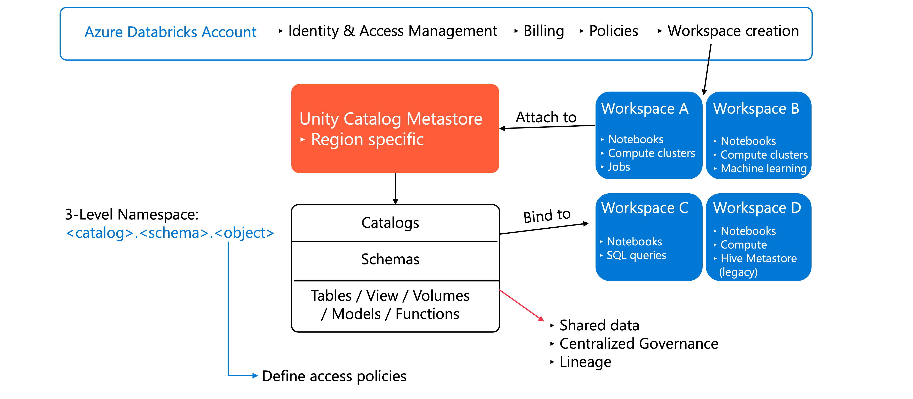
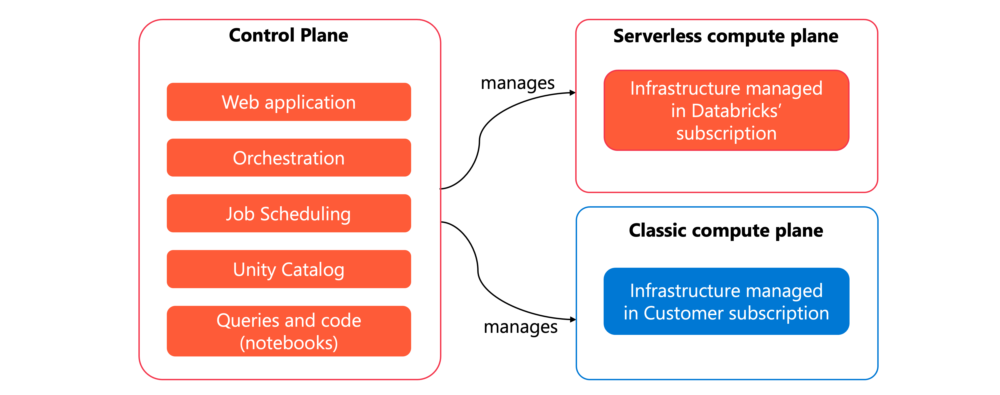
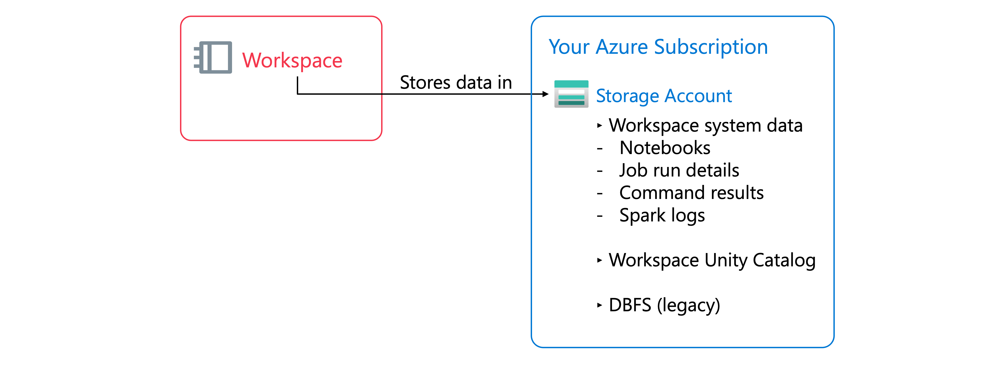
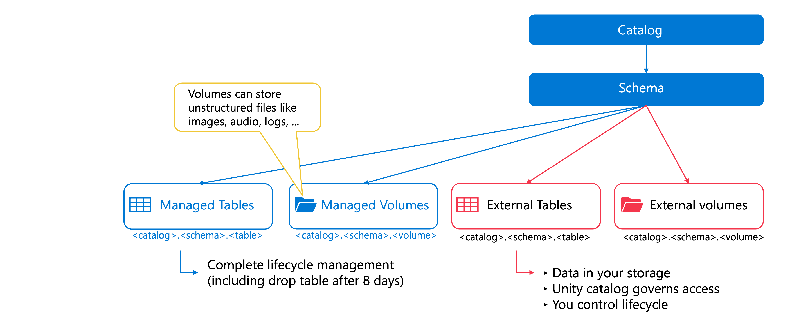
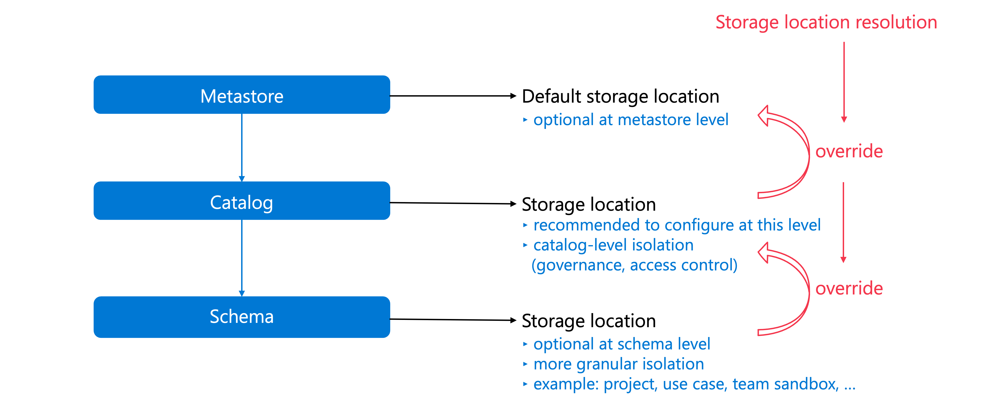
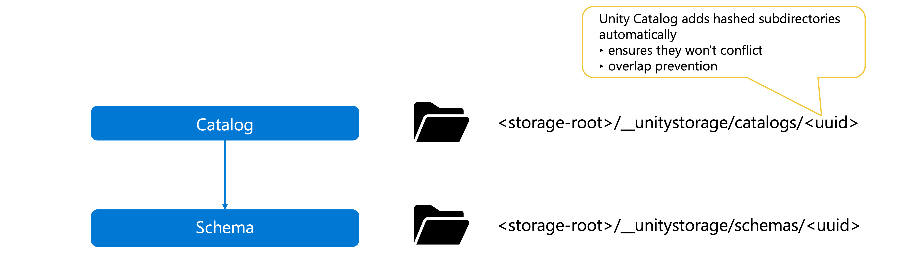
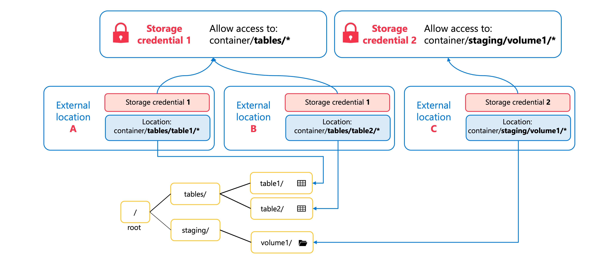
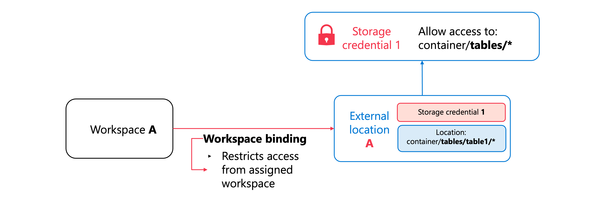
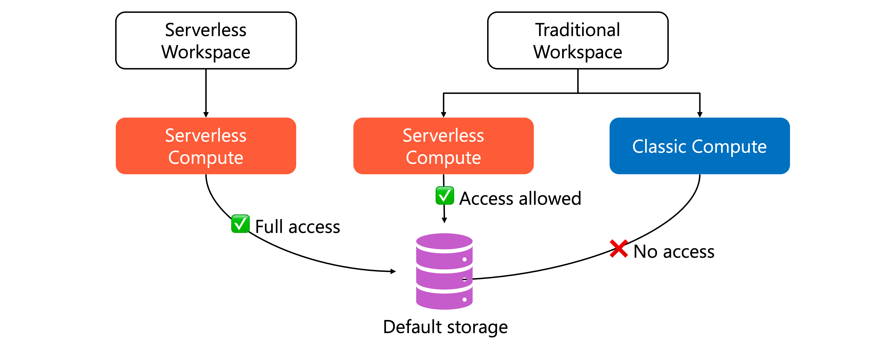

# Understand Azure Databricks Architecture

> **Module:** Understand Azure Databricks architecture (7 Units · Intermediate · Data Engineer)
> **Source:** [Microsoft Learn](https://learn.microsoft.com/en-gb/training/modules/understand-azure-databricks-architecture/)
> **In one line:** Azure Databricks separates **control** and **compute** planes and organizes resources through a **hierarchy** (account → workspace → Unity Catalog), with several **storage options** (managed, external, default).

---

## 📌 Learning objectives

By the end of this module you should be able to:

- Describe the Azure Databricks **account hierarchy** and how it organizes resources
- Explain the difference between **control plane** and **compute plane**
- Understand the role of **workspace storage**
- Describe **default storage** capabilities in serverless workspaces
- Explain how **external locations** connect cloud storage to Unity Catalog
- Understand how **Unity Catalog managed storage** organizes data across catalogs and schemas

**Prerequisites:** Basic cloud-storage concepts · familiarity with Databricks workspaces · Unity Catalog fundamentals.

---

## 1. Azure Databricks architecture

Understanding the architecture helps you decide how to **organize data, configure compute, and manage security**. It determines how workloads run, where data resides, and how components interact.

### Account hierarchy

Resources are organized in a hierarchy that starts at the **account** level.



| Level | What it is / what you do here |
|-------|-------------------------------|
| **Account** | Top-level construct for the whole organization. Manage identity & access, create/configure workspaces, attach Unity Catalog metastores, oversee billing & policies. |
| **Metastore** | Top-level metadata container in Unity Catalog. Registers data & AI assets (tables, views, volumes, models, functions) + governing permissions. **Region-specific**; workspaces on the same metastore share a unified view. |
| **Workspace** | Collaboration environment where you run compute workloads (ingestion, exploration, jobs, ML training). Isolated per project, but shares account-level governance. You can create **multiple workspaces** per account. |

**Unity Catalog namespace** — a three-level structure:

```
<catalog-name>.<schema-name>.<object-name>
```

- Unlike the legacy **Hive metastore** (per-workspace), Unity Catalog metastores operate at the **account level** → define access policies **once**, apply everywhere.
- **Hive metastore (legacy):** when a workspace is UC-enabled, the legacy store appears as a catalog named `hive_metastore` — query with `hive_metastore.<schema>.<table>`. Databricks recommends **migrating to Unity Catalog** for better security, centralized governance, and auditing.

> **Key idea — separation of concerns:** organization-wide policies at the **account** level, project isolation in **workspaces**, central data governance through **Unity Catalog**.

### Control plane vs. compute plane

Azure Databricks splits its architecture into two planes.



| Plane | Where it runs | What it does |
|-------|--------------|--------------|
| **Control plane** | Managed by Azure Databricks (in the Databricks account) | Hosts the web app/UI, configuration, monitoring. Handles **orchestration, job scheduling, cluster management**. **Does NOT process your data.** |
| **Compute plane** | Depends on type (see below) | **Where your data processing happens.** |

**Two types of compute plane:**

- **Serverless compute** — runs in a **serverless compute plane inside your Azure Databricks account** (not your Azure subscription). Databricks fully manages and auto-scales the infra. Includes network boundaries to isolate workspaces + extra security between clusters. No VNets or compute to manage yourself.
- **Classic compute** — runs in **your own Azure subscription** (the classic compute plane). Databricks creates compute inside each workspace's VNet in your subscription → natural isolation and more control over networking/security.

> 📝 **Note:** Classic workspaces are called **Hybrid workspaces** in the Azure portal.

### Workspace storage

Storage differs by workspace type:

- **Classic workspaces** → have a **workspace storage account** in *your* Azure subscription.
- **Serverless workspaces** → use **default storage** (fully managed, inside the Databricks account).



Regardless of type, workspace storage holds **two categories** of data:

| Category | Contents |
|----------|----------|
| **Workspace file system data** | Assets you create via the UI — notebooks, SQL queries, dashboards, alerts, repos, libraries, small config files (Python/YAML). |
| **Workspace system data** | Generated internally by Databricks — SQL query results, job run results, notebook revisions, query plans (observability), cluster logs. |

- In **classic workspaces**, both categories live in the workspace storage account in your subscription. If auto-enabled for Unity Catalog, it also holds the default **workspace catalog** (users create assets in the default schema; access is via UC's governance layer, **no direct storage access**).
- The classic storage account may also contain **DBFS (Databricks File System)** under the `dbfs:/` namespace. ⚠️ **DBFS root and DBFS mounts are legacy/deprecated** — use **Unity Catalog managed tables and volumes** instead.

> 💡 Knowing where data resides lets you apply the right controls — e.g. enabling **firewall support** on the workspace storage account.

---

## 2. Unity Catalog managed storage

Organizations often need specific data in designated storage locations (prod vs. dev, sensitive vs. operational). **Managed storage** meets these needs while keeping centralized governance.

### What is managed storage?

Cloud storage locations where Unity Catalog stores **data + metadata files** for **managed tables** and **managed volumes**.

- **Tables** → structured data in tabular format.
- **Volumes** → governance for **nontabular** data (images, audio, logs, any unstructured files).



- With managed tables/volumes, Unity Catalog handles the **complete lifecycle** — storage, organization, and deletion. (Contrast: **external** tables/volumes, where *you* manage the lifecycle and UC only governs access.)
- You just specify a cloud storage path; UC does the rest.
- **Dropping a managed table** → UC marks the data files for deletion after **8 days** and removes metadata.

**Two key purposes:**
1. **Physical data isolation** — separate containers/paths.
2. **Alignment with org structure & compliance** — map catalogs/schemas to storage locations that meet policy.

### Managed storage & the Unity Catalog hierarchy

The three-level namespace (**catalog → schema → table**) has three matching levels where managed storage can be defined.



| Level | Purpose | Notes |
|-------|---------|-------|
| **Metastore level** | Optional default/fallback for catalogs/schemas without their own location | New UC-enabled workspaces **don't** include metastore-level storage; Databricks recommends catalog-level instead. |
| **Catalog level** ⭐ | Aligns with org units, lifecycle stages, or data classification | **Recommended** — clear boundary for governance & access (e.g. prod catalog → one container, dev catalog → another). |
| **Schema level** | Most granular — projects, use cases, team sandboxes | Use for **fine-grained data isolation** when needed. |

### Storage location resolution

When creating a managed table/volume, UC resolves the storage location from **most specific → most general**:

```
Schema location?  → use it
   ↓ (none)
Catalog location? → use it   ← most common / recommended
   ↓ (none)
Metastore location? → use it
   ↓ (none)
❌ Can't create managed tables/volumes — configure a location first
```

> Start with **catalog-level** storage for most cases; add **schema-level** when you need more granular control.

### Storage root vs. storage location

You provide a cloud path as the **storage root** — but UC **doesn't** store data directly there. It **auto-adds hashed subdirectories** so every catalog/schema is unique, even if they share a storage root.



- Catalogs → `__unitystorage/catalogs/<uuid>`
- Schemas → `__unitystorage/schemas/<uuid>`
- **Storage location** = storage root **+** these generated subdirectories (where data actually lives).

**Benefits:** multiple catalogs/schemas can share one base root without conflict; no manual path management.

**Overlap prevention:** UC validates that a managed storage path **doesn't overlap** with other managed locations, external tables, or external volumes — overlapping requests are **rejected** to protect the governance model.

---

## 3. External storage

**External locations** securely connect cloud storage (e.g. Azure Data Lake Storage containers) to your workspaces while keeping governance and access control.

### What are external locations?

Unity Catalog objects that define secure connections to cloud storage. Each combines **two components**:

1. A **cloud storage path**
2. A **storage credential** that authorizes access to that path



- A **storage credential** = an authentication mechanism (Azure **managed identity** or service principal), defined once in UC, referencing an identity in your Azure tenant.
- One storage credential can be referenced by **multiple** external locations within the same security boundary.
- External locations can point to **Azure Data Lake Storage**, **AWS S3** (read-only), or **Cloudflare R2**. For Azure Databricks you'll typically use **ADLS** (native UC integration, read + write).

### Why do we need external locations?

Two purposes:

1. **External tables and volumes** — register existing data that's stored/managed *outside* UC. Files stay in their original location (managed by your cloud provider/other platforms); UC governs access. Good for large existing datasets, shared data, or keeping lifecycle control outside Databricks.
2. **Managed storage locations** — use an external location to define *where* UC should store **managed** tables/volumes. UC manages the lifecycle, but data resides in cloud storage **you** own.

**The key difference — who manages the data:**

| Aspect | External Tables/Volumes | Managed Storage Locations |
|--------|------------------------|---------------------------|
| **Data management** | *You* manage the data files | Unity Catalog manages the data |
| **Data location** | Remains in original location | Stored in a location you specify |
| **Use case** | Existing or shared data | New data managed by Unity Catalog |

### Storage credentials

UC securable objects that encapsulate the authentication mechanism for cloud storage. Defined **once**, referenced across many external locations (no auth in notebooks/queries).

| Mechanism | Notes |
|-----------|-------|
| **Azure managed identities** ⭐ | **Recommended.** Azure manages the credential lifecycle — no passwords, no secrets to rotate; supports firewall-protected storage accounts. |
| **Service principals** | **Legacy.** Requires an app identity in Microsoft Entra ID + manual client-secret rotation. |

- Storage credentials are **metastore-level** objects available to all attached workspaces; only privileged users can use them to create external locations.

> 📝 A detailed walkthrough of creating/configuring external storage comes in a later module.

### Workspace binding

By default an external location is accessible from **all** workspaces on the metastore. **Workspace binding** restricts it to **designated workspaces**.



- When enabled, users can only access it from **assigned** workspaces — **regardless of their UC privileges** (an extra access-control layer).
- Applies **independently** to both **external locations** and **storage credentials** (e.g. bind production credentials to production workspaces only).
- Useful when workspaces represent different **environments** (prod vs. dev) or when compliance mandates data be reachable only from specific compute.

---

## 4. Default storage

**Default storage** is a fully managed object-storage platform **built into** Azure Databricks — immediate storage with no external accounts or credentials to configure.

### What is it & where is it available?

- Used across **both classic and serverless** workspaces for internal features — **Data Classification, Anomaly detection, Clean Rooms, Knowledge Assistant** all store operational data here.
- In **serverless** workspaces it's also the primary storage for **workspace system data** and the **catalogs you create** (a default catalog is auto-provisioned; you can add catalogs using default storage or your own cloud storage).

**Creating new catalogs in default storage** is available **exclusively in serverless workspaces**. Classic workspaces can *access* default-storage catalogs, **but only when using serverless compute**.



Serverless workspaces use default storage for **three areas**: (1) internal operations + system data, (2) workspace-level files/artifacts, (3) catalogs storing managed tables/volumes.

### Benefits & considerations

| Feature | ✅ Benefits | ⚠️ Considerations |
|---------|-----------|-------------------|
| **Configuration & setup** | No separate storage accounts, credentials, or permissions to manage — instant data access | Serverless workspaces only; not for orgs needing full control over storage infra |
| **Compute requirements** | Instant, scalable serverless compute; consistent model | **All access requires serverless compute** — classic clusters **can't** read/write default-storage catalogs; existing classic workloads need migration |
| **Governance & security** | Integrates with Unity Catalog privilege model; manage access with SQL `GRANT` instead of cloud RBAC | Limited to UC mechanisms; orgs needing cloud-native RBAC should use external storage |
| **Workspace isolation** | Catalogs only accessible from the creating workspace by default — natural dev/test/prod isolation | Cross-workspace access needs explicit **catalog binding** |
| **Data lifecycle** | Automatic cleanup of data files when you drop managed tables/volumes — no orphaned data | Only for **managed** tables/volumes; external tables manage their own lifecycle |
| **External access** | BI tools (Power BI, Tableau) connect via Databricks **ODBC/JDBC** drivers | Tools that read Delta/Iceberg metadata files directly **can't** access default storage; no direct file access — external pipelines need external storage |

> **Best for:** new serverless workloads, dev environments, and features that require it. For production with external access or classic compute → use **external storage**.

---

## 5. Summary

Azure Databricks architecture = **hierarchical organization** + **separation of control and compute planes**.

- **Accounts** organize resources across **workspaces** and **metastores**; **Unity Catalog** governs data centrally.
- **Control plane** → orchestration. **Compute planes** (**serverless** or **classic**) → process data in isolated, secure environments.
- **Storage options:**
  - **Default storage** — fully managed, zero-config, serverless-only (needs serverless compute).
  - **External locations** — bridge UC to your existing cloud storage via **storage credentials**.
  - **Managed storage** — you control data *placement* (catalog/schema level); UC handles the *lifecycle* (incl. auto-cleanup).

The **account hierarchy** gives governance boundaries, the **plane separation** enables secure scaling, and the **storage options** balance convenience vs. control.

---

## 🧠 Quick revision cheat-sheet

| Concept | Remember this |
|---------|---------------|
| **Hierarchy** | Account → Workspace → Unity Catalog (`catalog.schema.object`) |
| **Metastore** | Top-level UC metadata container; **region-specific**; shared across workspaces |
| **Hive metastore** | Legacy, per-workspace; appears as `hive_metastore` catalog; migrate to UC |
| **Control plane** | Databricks-managed; UI, orchestration, scheduling — **no data processing** |
| **Serverless compute** | Runs in **Databricks account**; fully managed, auto-scaled |
| **Classic compute** | Runs in **your Azure subscription** (VNet); called **Hybrid** in the portal |
| **Workspace storage** | File system data (notebooks, dashboards…) + system data (query/job results, logs) |
| **DBFS** | Legacy/deprecated (`dbfs:/`) — use UC managed tables & volumes |
| **Managed storage** | UC owns lifecycle; drop table → files deleted after **8 days** |
| **Storage resolution** | Schema → Catalog → Metastore (specific → general) |
| **Storage root vs. location** | Root = your path; location = root + `__unitystorage/.../<uuid>` |
| **External location** | Cloud path **+** storage credential |
| **Storage credential** | **Managed identity** (recommended) vs. service principal (legacy); metastore-level |
| **Workspace binding** | Restrict external location / credential to specific workspaces |
| **Default storage** | Built-in, zero-config; **serverless only**; classic needs serverless compute to access |
| **Volumes** | Governance for **nontabular / unstructured** data |