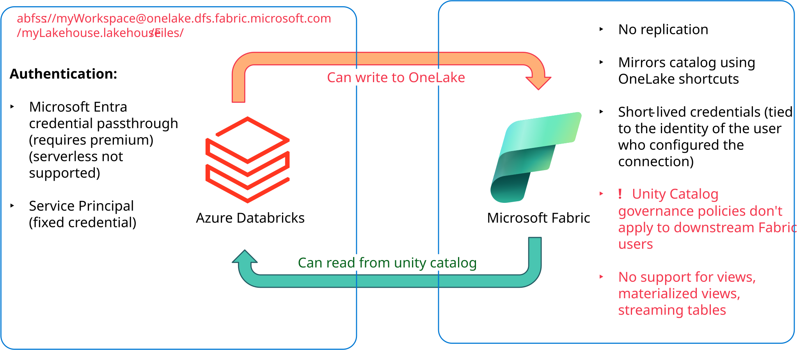
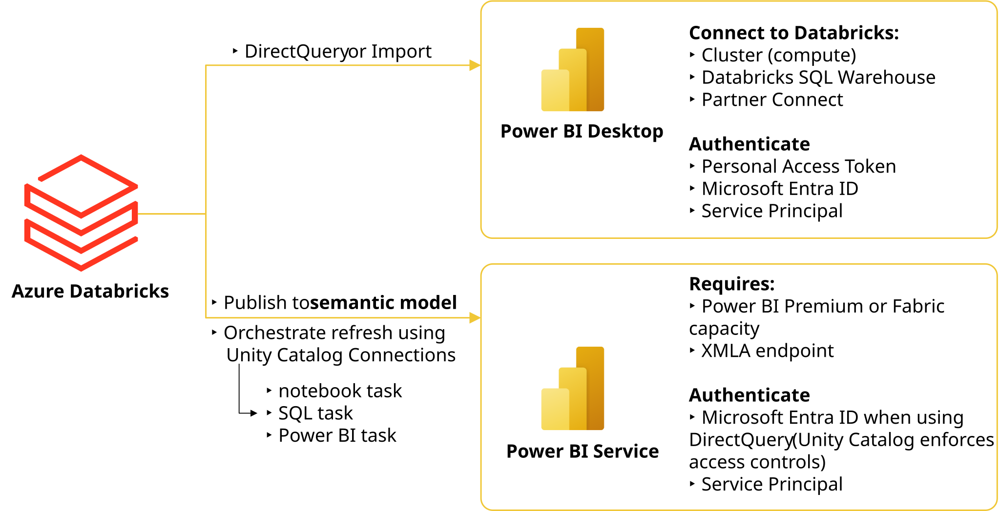
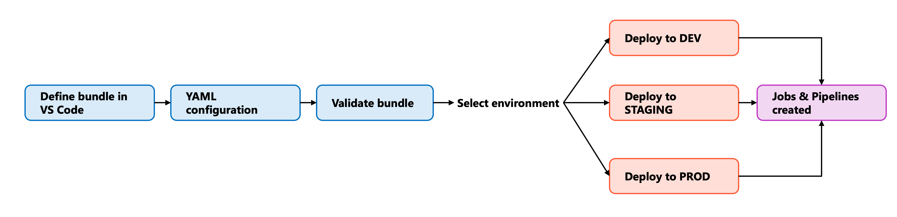
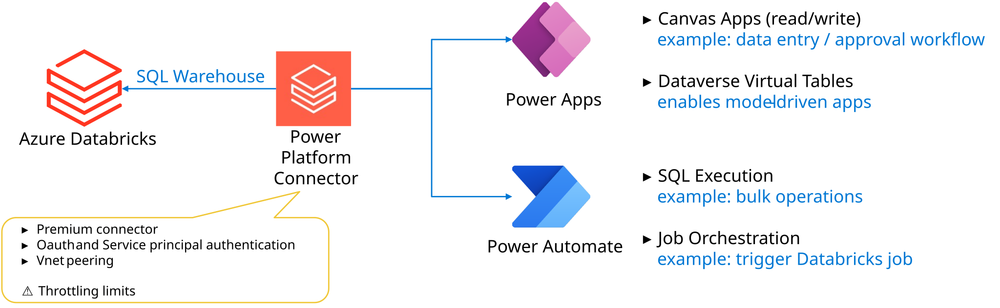
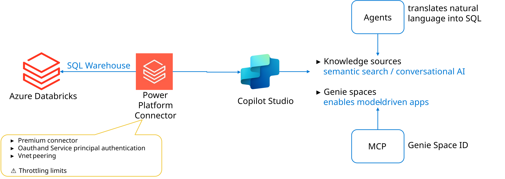
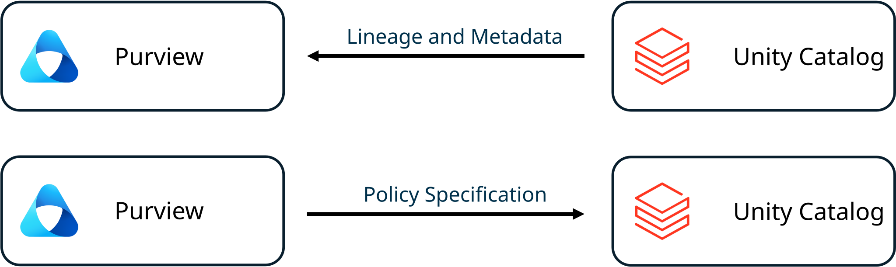
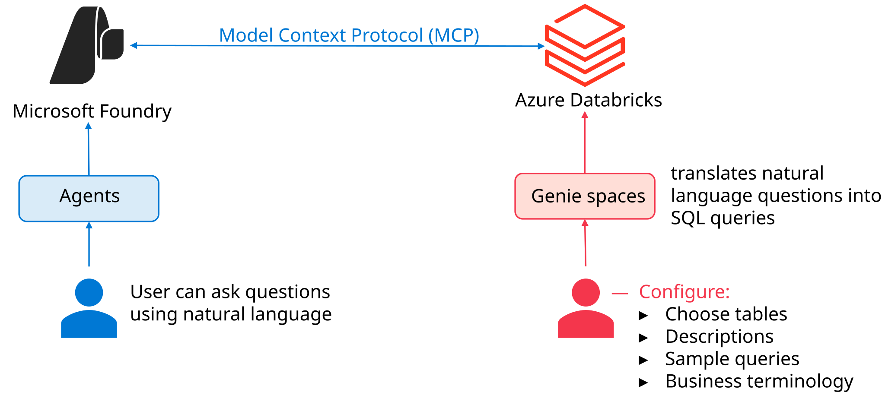

# Understand Azure Databricks Integrations

> **Module:** Understand Azure Databricks Integrations (10 Units · Intermediate · Data Engineer)
> **Source:** [Microsoft Learn](https://learn.microsoft.com/en-gb/training/modules/understand-azure-databricks-integrations/)
> **In one line:** Azure Databricks integrates with **Fabric, Power BI, VS Code, Power Platform, Copilot Studio, Purview, and Foundry** — with **Unity Catalog** as the central governance layer throughout.

---

## 📌 Learning objectives

By the end of this module you should be able to explain how Azure Databricks integrates with:

- **Microsoft Fabric** — bidirectional data access
- **Power BI** — reporting & BI
- **VS Code** — local development with remote execution
- **Power Platform** — apps & automation over governed data
- **Copilot Studio** — AI agents accessing Databricks data
- **Microsoft Purview** — data governance
- **Microsoft Foundry** — AI agents connecting to Genie spaces

**Prerequisites:** Basic Databricks concepts · Unity Catalog & data governance · Delta Lake tables & SQL warehouses.

> 🔑 **Recurring theme:** almost every integration uses a **SQL warehouse** as the compute entry point and relies on **OAuth (Microsoft Entra ID)** vs. **service principal** authentication — OAuth passes each user's identity so Unity Catalog enforces per-user permissions; service principals use one fixed identity for automation.

---

## 1. Integration with Microsoft Fabric

Fabric and Databricks **complement** each other: Databricks = large-scale processing & ML; Fabric = unified platform with integrated BI/reporting. The integration is **bidirectional**.



| Direction | Mechanism |
|-----------|-----------|
| **Fabric reads Unity Catalog data** | Fabric **reads** UC tables without copying |
| **Databricks writes to OneLake** | Databricks **writes** processed data to Fabric's OneLake |

### Access Unity Catalog data from Fabric

- Create a **Mirrored Azure Databricks Catalog** in Fabric → it mirrors the catalog structure and auto-creates **OneLake shortcuts** for each Delta table (pointing to data in ADLS). **No data is copied** — Fabric uses UC's open APIs to get credentials.
- Uses **short-lived credentials** (refresh hourly, revocable in UC). Data stays in a **single location**.
- ⚠️ **Security implication:** Fabric authorizes using the **identity that configured the connection**, *not* the querying user. **UC governance policies don't apply to downstream Fabric users** — any Fabric user with connection access can query the table.
- The configuring user needs the **`EXTERNAL USE SCHEMA`** privilege on the schemas being shared (downstream users don't).
- **Limitations:** no views, materialized views, streaming tables, Delta Sharing catalogs, or tables with row filters/column masks. **Delta format only.** Doesn't work with private endpoints/IP access lists. UC lineage doesn't track Fabric operations.

### Write data to OneLake from Databricks

- Connect using the **Azure Blob Filesystem (ABFS) driver** with OneLake endpoints:
  ```
  abfss://myWorkspace@onelake.dfs.fabric.microsoft.com/myLakehouse.lakehouse/Files/
  ```
- **Two auth methods:**
  - **Microsoft Entra credential passthrough** — user identities flow through; needs a **premium workspace** + ADLS credential passthrough. ⚠️ **Not supported on serverless compute.**
  - **Service principal** — fixed credential; works with **traditional clusters AND serverless compute**. Better for automation/jobs.
- Workflow: load → transform with Spark → write to OneLake → immediately available to Power BI, warehouses, other Fabric services.

### Key considerations

- **OneLake security** can partly address the governance gap: sync a Microsoft Entra group (Automatic Identity Management grants it UC privileges) → assign it a **OneLake Data Access Role** in Fabric.
- For **row-level filters / column masks at the individual user level → use Power BI DirectQuery** (it honors UC permissions directly).
- **Cost:** Fabric reads need running Fabric capacity; cross-region writes incur network transfer costs.
- Both patterns use **ADLS** as the shared storage foundation.

---

## 2. Integration with Power BI

Power BI adds interactive visualizations & BI over Databricks-managed data via **multiple connection methods**.



### Connect Power BI Desktop to Azure Databricks

- Connect to **clusters** or **SQL warehouses**. **Use SQL warehouses with DirectQuery** for best performance + serverless scaling.
- Fastest setup: **Partner Connect** (Marketplace → Power BI tile → download connection file). Or configure manually with **Server Hostname** + **HTTP Path**.
- **Connectivity modes:**
  - **Import** — loads data into Power BI; fast queries, needs periodic refresh.
  - **DirectQuery** — queries Databricks live; real-time, needs running compute.
- 📝 **Since Feb 2026:** new connections default to the **ADBC (Arrow Database Connectivity)** driver — columnar, Apache Arrow-based, more efficient. Existing connections stay on ODBC unless you set `Implementation="2.0"`.
- 📝 Power BI Desktop **requires Windows** (use a Windows VM otherwise).

### Publish to the Power BI service from Azure Databricks

- Publish **from** Databricks: **Catalog Explorer** → select schema/tables → **Publish to Power BI workspace**.
- Requires **Unity Catalog** + a **Power BI Premium license** (Premium capacity / PPU / Fabric capacity). Uses the **XMLA endpoint** (must be enabled with Read/Write).
- Creates a **semantic model**; **column comments** → descriptions, **foreign keys** → relationships (only one active path between two tables).
- **Use OAuth** for fine-grained access + user-level auditing; **service principals** for automated refreshes/shared credentials.

### Automate with Power BI tasks

- **Power BI tasks** orchestrate semantic-model publish/refresh **inside Databricks workflows** — reports refresh only *after* upstream data completes.
- Require a **Unity Catalog connection** to Power BI.
- Example pipeline: **Notebook task** (ingest) → **SQL task** (transform) → **Power BI task** (publish + refresh).

### Security & governance summary

| Use case | Auth method | UC enforcement | Audit granularity |
|----------|-------------|----------------|-------------------|
| Interactive / DirectQuery needing user governance | **Microsoft Entra ID (SSO)** | Per-user; row filters, column masks, table ACLs apply | User-level logs |
| All users see identical data | **Import / no SSO** | Fixed credential; everyone sees same data | Credential owner only |
| Automated workflows / scheduled refresh | **Service principals** | Based on SP's grants | Shows only the SP |
| Dev & testing | **Personal access tokens** | Single user identity; not for prod | Token owner only |

---

## 3. Integration with VS Code

The **Databricks extension for VS Code** connects your local editor directly to a remote workspace: **develop locally, execute remotely**.

### Develop locally & execute remotely

- Local features (**IntelliSense, syntax highlighting, Git**) + run `.py` files/notebooks on remote clusters or serverless — no manual copying.
- Run Python/R/Scala/SQL notebooks as **Lakeflow Jobs**.
- Supports **multiple Databricks projects** in one VS Code workspace (each keeps its own connection/auth/cluster).

### Debug with Databricks Connect

- **Databricks Connect** links your local Python env to a remote cluster. The VS Code debugger controls execution **on the cluster** — set breakpoints, inspect variables, step through, while code runs on Databricks with Spark APIs.
- Works with files and notebooks (cell by cell). Supports **`pytest`** unit tests running on Databricks compute.

### Deploy with Declarative Automation Bundles

**Declarative Automation Bundles** (formerly **Databricks Asset Bundles**) package code, configs, and dependencies into deployable units.



- Define **Lakeflow Jobs**, **Lakeflow Spark Declarative Pipelines (SDP)**, and **MLOps Stacks** in **YAML**.
- Deploy to a target env (**dev / staging / prod**) → creates/updates jobs, configures clusters, sets permissions.
- Version the whole workflow config in **Git** → enables CI/CD, review/approval, audit trail.

### Synchronize code

- **One-way auto-sync** from local project → workspace folders (for quick prototyping). Workspace files are **transient** — don't edit there (changes won't sync back).
- **Sync = exploration; Bundles = production deployment.**

---

## 4. Integration with Power Platform

Brings governed lakehouse data into **Power Apps** and **Power Automate** via the **Azure Databricks connector**, preserving UC governance.



### Connect Power Platform to Azure Databricks

- Uses a **premium connector**. Prereqs: premium Power Apps license, Microsoft Entra ID account, and a **SQL warehouse** (the compute resource).
- **Two auth types:** **OAuth** (per-user via Entra ID) or **service principal** (fixed credentials).
- Provide **Server Hostname** + **HTTP Path** from the SQL warehouse.
- 📝 For VNet workspaces: use **VNet peering** or configure **IP access lists** for AzureConnectors ranges.

### Build apps with Power Apps

- Build **canvas apps** that read/write UC data (create/update/delete) — data entry forms, approvals, dashboards.
- **OAuth** → UC evaluates each user's permissions in real time (row-level security, column masking).
- **Bulk operations** → use Power Automate flows.
- Supports **Dataverse virtual tables** (no data copy) → build **model-driven apps**.
- 💡 **Tip:** prefer **direct connections** over virtual tables for performance (virtual tables don't support OAuth passthrough).

### Automate with Power Automate

Two primary connector capabilities:

- **SQL statement execution** — run queries from a flow (any trigger); handles large result sets via chunked retrieval.
- **Job orchestration** — trigger existing Databricks jobs, track progress, retrieve run metadata; also cancel/list/get output.

**Scenarios:** planning/forecasting apps, automated data-quality workflows, event-driven processing, dashboard-refresh automation.

### Considerations & limitations

- ❌ **No government clouds** (US Gov, China Cloud).
- Certain **PowerFx formulas** compute only on locally-retrieved data → filter/aggregate in SQL first.
- **Concurrent writes** benefit from **row-level concurrency** in recent Databricks Runtimes.
- **Virtual tables vs. direct connections:** virtual tables → model-driven apps but no OAuth passthrough; direct connections → better perf + OAuth but canvas apps only.
- Add the connector to a **Business data policy** to control data sharing. **Throttling limits** apply — batch operations.

---

## 5. Integration with Copilot Studio

Brings governed lakehouse data into **conversational AI agents** via the **Azure Databricks connector**, with **two patterns** — both preserve Unity Catalog governance.



### Pattern 1 — Tables as knowledge sources

- Agents access UC tables as **knowledge sources** to ground responses. Connect via **OAuth** or **service principal**, select catalog + tables.
- Queries run **through the SQL warehouse without copying data** → UC enforces row-level security & column masking.
- Agent does **semantic search**: natural language → SQL → retrieve rows → synthesize a conversational answer.
- 📝 Works best with **descriptive column names**; consider curated views/aggregated tables for agents.

### Pattern 2 — Genie spaces as tools

- **Genie** = Databricks' AI analytics interface understanding natural-language questions.
- Uses the **Model Context Protocol (MCP)**. Setup: enable **Managed MCP Servers** preview → connect via **Genie Space ID**.
- Genie ≠ knowledge sources: it does **complex analytics, visualizations, aggregations, trend explanations**.
- ⚠️ **Public Preview.**

### Scenarios & limitations

- **Scenarios:** customer-support agents, executive analytics (via Genie), data-literacy agents, compliance/audit agents.
- ❌ No government clouds (GCC, GCC High, China).
- Requires a **SQL warehouse — serverless or pro only** (classic not supported for Genie).
- **OAuth** = user-specific governance (both platforms same Entra tenant); **service principal** = consistent access, no user-level row security.
- **Throttling:** 100 API calls / 60 seconds.

---

## 6. Integration with Microsoft Purview

Provides **unified data governance** across sources including Databricks — a single catalog, lineage tracking, and consistent policies.



### How it works

- Uses **metadata synchronization** — Purview reads metadata (databases, tables, columns, relationships) **without accessing actual data**.
- Two steps: **registration** (connection + auth) and **scanning** (extract metadata, scheduled or on-demand).

### Scanning: Hive Metastore vs. Unity Catalog

| | **Hive Metastore scanning** | **Unity Catalog scanning** |
|--|-----------------------------|----------------------------|
| **Scope** | Workspace-scoped databases, tables, views, columns | Full hierarchy: metastores → catalogs → schemas → tables → views |
| **Incremental?** | ❌ No — full extraction each scan | ✅ Yes — incremental sync after initial scan |
| **Lineage** | **Static lineage** (from view definitions) | **Runtime lineage** (actual transformations from notebook execution) |
| **Infrastructure** | Self-hosted integration runtime → connects to clusters | Cloud-native Azure integration runtime → connects via **SQL Warehouses** |
| **External tables** | Captures storage relationships | — |

**Runtime lineage** provides:
- **Table lineage** — which tables feed into others.
- **Column lineage** — traces columns source → destination.
- *Limits:* only UC-logged transformations appear (external tools like ADF don't); complex column-level transformations may not be fully captured.

### Benefits

- **Unified data discovery** — Databricks tables appear alongside other sources; less duplication.
- **Consistent governance** — classifications, ownership, policies across the whole estate.
- **Lineage for impact analysis & compliance** — see downstream dependencies before changes; auto-document data flows.

> During **migration**, Purview can scan **both** Hive Metastore and Unity Catalog simultaneously without duplicating assets.

---

## 7. Integration with Microsoft Foundry

Connects **AI agents** in Microsoft Foundry to Databricks **Genie spaces** using the **Model Context Protocol (MCP)** — natural-language querying, no direct DB access or custom APIs.



### The Azure Databricks Genie connector

- Appears as a **tool** in Foundry. Agents interact with a **preconfigured Genie space** (datasets, sample queries, business terms) — they **don't** write SQL or query raw tables.
- Genie translates natural language → SQL → returns results (abstraction + governance).

### How it works — three components

1. **Microsoft Foundry** — hosts the AI agent, manages user interaction (acts as **MCP client**).
2. **Azure Databricks MCP server** — exposes Genie spaces as MCP-compatible tools.
3. **Genie spaces** — curated data, metadata, business logic.

**Runtime flow:** user asks → Foundry routes to Genie tool → MCP server → Genie generates & runs SQL → results back → agent responds.

- **Auth:** **OAuth Identity Passthrough** — user identities flow from Foundry to Databricks. Choose **Managed** OAuth (Entra ID, recommended) or **Custom** OAuth. UC validates permissions on each access.
- Connection details: workspace hostname, **Genie space ID**, auth method.

### Scenarios & considerations

- **Scenarios:** AI assistants over live lakehouse data, self-service analytics (no SQL needed), domain-specific assistants (sales vs. finance Genie spaces), multi-tool agents.
- Requires enabling the **Managed MCP Servers** preview; users need Genie-space permissions; UC enforces data permissions.
- **Rate limit: 5 questions per minute** (from Foundry).
- ⚠️ Genie MCP server **doesn't maintain conversation history** — each question processed independently.
- **Cost:** Foundry (agent usage/API calls) + Databricks (**serverless SQL** compute for Genie).
- ⚠️ **Public Preview.**

---

## 8. Summary

Azure Databricks becomes more powerful integrated with the Microsoft ecosystem — **seven integrations** extending the lakehouse across analytics, development, applications, and AI, all with **Unity Catalog as the central governance layer**:

- **Fabric & Power BI** → business intelligence and reporting.
- **VS Code** → local development with remote execution & debugging.
- **Power Platform & Copilot Studio** → governed data in apps and AI agents.
- **Purview** → unified governance.
- **Foundry** → AI agents connected to analytical insights.

Match each integration to the business scenario, evaluate its **security model, authentication, and limitations**, and test thoroughly.

---

## 🧠 Quick revision cheat-sheet

| Integration | Key mechanism | Watch out for |
|-------------|---------------|---------------|
| **Microsoft Fabric** | Mirrored UC Catalog (OneLake shortcuts, no copy) ↔ Databricks writes to OneLake via **ABFS** | Fabric read **bypasses UC governance** for downstream users; needs `EXTERNAL USE SCHEMA`; Delta only |
| **Power BI** | Desktop (Import/DirectQuery), Publish from Catalog Explorer, Power BI tasks | Publish needs **UC + Premium + XMLA**; ADBC driver default since Feb 2026; Desktop = Windows only |
| **VS Code** | Extension + **Databricks Connect** (remote debug) + **Declarative Automation Bundles** (YAML, CI/CD) | Sync is one-way & transient; use Bundles for production |
| **Power Platform** | **Azure Databricks connector** over a **SQL warehouse**; Power Apps (canvas) + Power Automate (SQL exec + job orchestration) | No gov clouds; throttling; virtual tables ≠ OAuth passthrough |
| **Copilot Studio** | Tables as **knowledge sources** (semantic search) + **Genie spaces** as tools (**MCP**) | Genie = Public Preview; serverless/pro warehouse only; 100 calls/60s |
| **Microsoft Purview** | **Metadata sync** (register + scan); Hive (static, full scan) vs. UC (runtime lineage, incremental) | Hive = self-hosted IR; UC = cloud-native via SQL warehouse |
| **Microsoft Foundry** | **Genie connector via MCP**; OAuth Identity Passthrough | Public Preview; **5 questions/min**; no conversation history |
| **Auth pattern (all)** | **OAuth (Entra ID)** = per-user UC governance; **Service principal** = fixed identity for automation | — |
