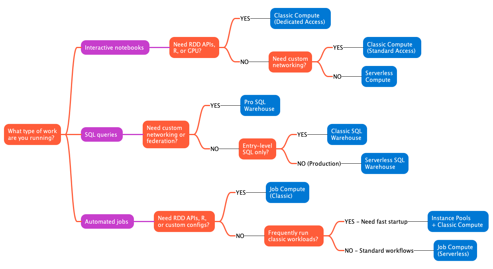
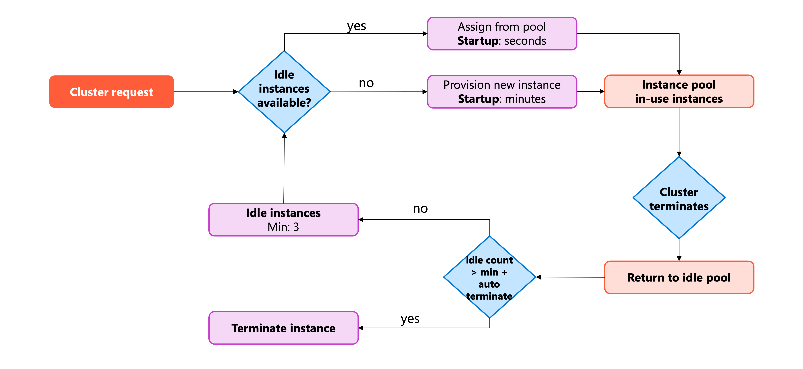
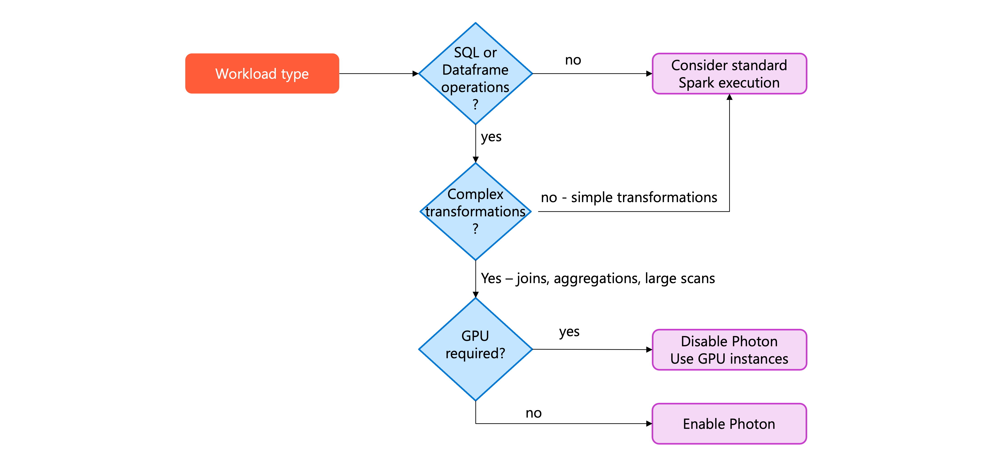
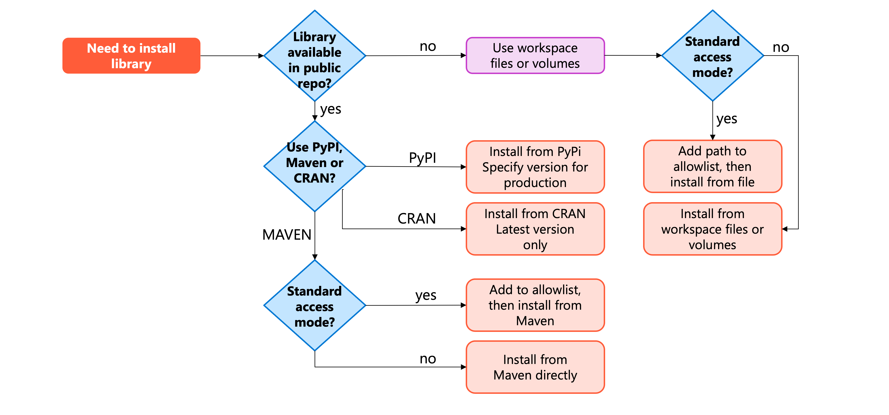
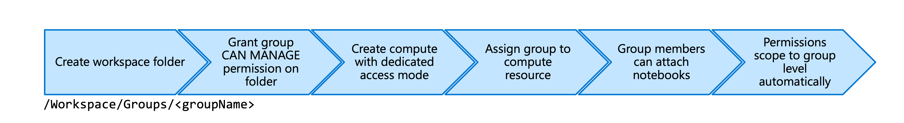

# Select and Configure Compute in Azure Databricks

> **Module:** Select and Configure Compute in Azure Databricks (9 Units · Intermediate · Data Engineer)
> **Source:** [Microsoft Learn](https://learn.microsoft.com/en-gb/training/modules/select-and-configure-compute/)
> **In one line:** Choose the right **compute type**, tune **performance** (nodes, autoscaling, termination), enable **features** (Photon, runtimes), manage **libraries**, and control **access** — with **serverless as the default starting point**.

---

## 📌 Learning objectives

By the end of this module you should be able to:

- Choose appropriate **compute types** for different workloads
- Configure **performance** settings (node types, autoscaling, termination)
- Enable **features** like Photon and select **Databricks Runtime** versions
- Configure compute **access permissions** and dedicated group access modes
- Install and manage **libraries** on compute resources

**Prerequisites:** Basic Databricks concepts · Unity Catalog & workspace management · Spark fundamentals & cluster architecture.

> 🔑 **Golden rule (repeated in the summary):** **Start with serverless** for new workloads → switch to **classic** only when you hit a specific limitation serverless doesn't support (RDD APIs, R, JARs, GPU, custom networking).

---

## 1. Choose an appropriate compute type

The right compute type affects **cost, performance, and operational complexity**.

### Serverless compute

- Fully managed by Databricks; runs in **Databricks' Azure subscription, not yours** (no VMs/networking in your subscription).
- **Startup: 2–6 seconds.** Auto-scales up/down; scales to zero when idle.
- **Requires Unity Catalog.** Available for: **Notebooks, Jobs, Pipelines (Lakeflow SDP), SQL warehouses.**
- **Versionless runtime** — Databricks auto-applies upgrades (always latest).
- ⚠️ **Limitations (notebooks):** no **Scala**, **R**, **JAR libraries**, or **RDD APIs**; restricted custom Spark configs. (JAR tasks in Lakeflow Jobs on serverless = Public Preview.)

**Serverless performance modes (jobs & pipelines):**

| Mode | Startup | Best for |
|------|---------|----------|
| **Performance-optimized** (default) | Seconds (warm pool) | Interactive, latency-sensitive jobs |
| **Standard** | 4–6 minutes | Scheduled batch — **up to 70% less DBU**; not for continuous pipelines or `runs/submit` one-time runs |

> Notebooks only support performance-optimized mode.

### Classic compute

Full control; runs in **your Azure subscription**. Startup **3–7 minutes**. You **select and manage the Runtime version** yourself.

**Access modes:**
- **Standard** — multiple users share one cluster; **Lakeguard** isolates user code. Collaborative engineering, cost via pooling.
- **Dedicated** — cluster assigned to a single user/group; full machine-level privileges. **Needed for RDD APIs, GPU, R, custom containers.**

**Cluster modes:**
- **Multi-node** — 1 driver + N workers; horizontal scaling; production/large data.
- **Single-node** — driver only, no workers; lightweight exploration, small data, ML (scikit-learn) that doesn't distribute. ⚠️ Can't scale horizontally, no fault-tolerance redundancy.

### SQL warehouses

Compute optimized for SQL/BI. Three types:

| Type | Startup | Features | Use when |
|------|---------|----------|----------|
| **Serverless** | 2–6 sec | Photon + Predictive IO + **Intelligent Workload Management** | Most SQL workloads (BI, ETL, ad hoc) |
| **Pro** | ~4 min | Photon + Predictive IO (no IWM) | Custom networking / federation / VNet |
| **Classic** | ~4 min | Photon only | Entry-level exploration; when serverless/pro unavailable |

### Instance pools

- Maintain **idle VMs ready for immediate use** → startup drops to **<1 minute**.
- You pay **VM costs while idle** (but not DBUs) — worth it for frequently-run classic workloads.
- Config: min idle instances + max capacity. Use **spot for workers, on-demand for drivers**.
- With serverless available, pools matter less — but still useful for classic-feature workloads.

### Job compute

- Clusters for **automated workflows**; **auto-terminate after tasks complete** (no idle cost).
- **Serverless job compute** — faster startup, lower cost, auto-managed.
- **Classic job compute** — more config; supports autoscaling + **spot instances** (up to **90% cheaper**; Azure reclaims with **30 sec notice**; Spark fault tolerance retries).
- **Job Compute policy** enforces latest LTS runtime + reliability defaults.

### Compare compute types (key rows)

| Compute type | Recommended for | Startup | Key limitation |
|--------------|-----------------|---------|----------------|
| **Serverless** | Interactive, ETL, BI | ⚡ 2–6 sec | No RDD/R/JAR |
| **Classic (Standard)** | Shared engineering | 3–7 min | Needs UC for governance |
| **Classic (Dedicated)** | RDD, GPU, R, containers | 3–7 min | Single user/group; higher cost |
| **Instance pools** | Frequent classic workloads | 🚀 <1 min | Pay for idle instances |
| **SQL WH (Serverless)** | SQL analytics, dashboards | ⚡ 2–6 sec | SQL only |
| **Job (Serverless)** | Production ETL | ⚡ 2–6 sec | Same as serverless |

**Decision questions:** What work? Which APIs/languages? How frequent? Custom networking? Performance needs? → **Default to serverless.**

---

## 2. Configure compute performance

Balance performance vs. cost — over-provisioning wastes money, under-provisioning causes instability.

### Compute resource components

- **Total executor cores** → max **parallelism** (8 workers × 4 cores = 32 cores).
- **Total executor memory** → data processed in memory before **spilling to disk** (joins/aggregations benefit).
- **Local storage** → temp space for **shuffle** and caching (fast local disk = faster shuffles).

### Node types & cluster size

| Instance family | Optimized for | Azure example |
|-----------------|---------------|---------------|
| **Memory-optimized** | Large joins, aggregations, in-memory | **E-series** |
| **Compute-optimized** | CPU-heavy calculations, straightforward ETL | **F-series** |
| **Storage-optimized** | Repeated reads, caching, high I/O | **L-series** (NVMe) |
| **GPU-accelerated** | ML, deep learning, image processing (10–100× faster) | **NC / ND-series** (needs **Runtime ML**) |

- **Fewer, larger workers** → less shuffle network traffic (good for analytical/shuffle-heavy).
- **More, smaller workers** → better parallelism (good for highly distributed batch).

### Flexible node types

- Avoid `CLOUD_PROVIDER_RESOURCE_STOCKOUT` errors by **auto-falling back** to compatible instance types (same vCPU, memory 100–110%, disk, CPU arch, OS).
- Admins enable via **Enable auto flexible node types** in Compute admin settings. Especially valuable for **spot instances**.
- Disable per-resource by setting `alternate_node_type_ids` to empty list via Clusters API.

### Autoscaling

- Set **min/max workers**; Databricks adds/removes based on demand.
- **Optimized autoscaling** (default): scales up in 2 steps; can scale down even when not idle (monitors shuffle files). Evaluates: **job compute every 40 sec**, **all-purpose every 150 sec**.
- Best for **variable** workloads; **fixed workers** better for predictable/steady-state.
- Pairs well with pools — set min workers ≤ pool's min idle instances.

### Termination settings

- **Auto-termination** after N minutes of inactivity (config remains for restart). **45 min** is a good default for interactive.
- Job compute terminates after job completes.
- **Spot instances:** great for **workers** (Spark handles failures); **always use on-demand for drivers** (driver loss = cluster fails).
- Enable **decommissioning** with spot → migrates shuffle/cached data to healthy workers before preemption.

### Instance pools (config)

- **Min idle instances** = typical concurrent needs; **max capacity** = cost cap / fair sharing.
- **Idle instance auto termination** removes excess above min after a period.
- **Preload a Runtime version** → near-instant cluster launches.
- Best for frequent create/destroy cycles; not for long-running dedicated clusters.

### Balance cost & performance

- Start conservative, monitor, adjust. Frequent disk spilling → add memory/cores; low utilization → shrink or autoscale.
- 📝 Use the **Spark UI**: Jobs Timeline (long stages), stage details for **Shuffle Spill (Memory/Disk)**.
- Prefer serverless when supported.

---

## 3. Configure compute features

Feature settings enable specific technologies/runtime environments.

### Photon acceleration

- **Photon** = native-code query engine replacing Spark components; accelerates SQL & DataFrame ops.
- Biggest gains: **joins, aggregations, scans** on large tables; wide tables; repeated transforms.
- **Enabled by default on Runtime 9.1 LTS+.**
- ⚠️ **Not supported on GPU clusters** — disable Photon for GPU/ML workloads.
- Minimal benefit for simple/small (<2 sec) ETL jobs — overhead may not justify cost.

### Databricks Runtime & Spark version

- **Runtime** = Spark + optimizations + preloaded packages. Version determines available features.
- **All-purpose / interactive** → use **latest** runtime (newest optimizations).
- **Job compute / production** → use **LTS (Long Term Support)** for stability; test before upgrading.
- **Spark version is tied to the runtime** (choosing runtime = choosing Spark version).

### Machine learning environments

- Use **Databricks Runtime ML** — pre-installed ML libraries, GPU drivers, CUDA.
- Start experimentation on a **single-node** large instance (minimizes shuffle).
- **GPU instances** for deep learning (hours → minutes). ⚠️ **Photon must be disabled with GPU.**

---

## 4. Install libraries for compute

Install **libraries** at cluster level so all notebooks/jobs share the same dependencies.

### Compute-scoped vs. notebook-scoped

- **Compute-scoped** — installs on the cluster, available to all notebooks/jobs; **auto-reinstalled on every restart**.
- **Notebook-scoped** — only for a specific notebook session.
- 📝 Requires **CAN MANAGE** permission on the cluster.
- Supports **Python wheels, Java JARs, R packages** from PyPI/Maven or files.
- ⚠️ Limitation: a library affects **every** notebook on the cluster → conflicting versions need separate clusters or notebook-scoped installs.

### From package repositories

| Repo | For | Notes |
|------|-----|-------|
| **PyPI** | Python | Pin versions for prod: `pymssql==2.3.9` |
| **Maven** | Java/Scala | Coordinates `groupId:artifactId:version`, e.g. `com.microsoft.sqlserver:mssql-jdbc:13.2.1.jre11`; can exclude transitive deps |
| **CRAN** | R | Always pulls latest; pin by storing files instead |

- ⚠️ **Standard access mode:** Maven coordinates & JAR paths require **`allowlist` approval** first.

### From files (workspace files / Unity Catalog volumes)

- **Workspace files** — 500 MB limit; path like `/Workspace/Users/you@example.com/libraries/mypackage-1.0.0-py3-none-any.whl`.
- **Unity Catalog volumes** — enhanced governance (audit logs, fine-grained permissions); path `/Volumes/main/engineering/libraries/...`; needs **READ VOLUME** permission.
- **`requirements.txt`** works with both (Runtime **15.0+**) — multiple deps in one file.
- Standard access mode → add file paths to **`allowlist`** first.

### Init scripts (advanced)

- Run shell commands at **cluster startup** (before Spark starts). **Not recommended for library installs** — use for system-level config (`apt-get`, env vars, monitoring agents).
- Store in **UC volumes** (Runtime **13.3 LTS+**); path `/Volumes/main/engineering/scripts/setup.sh`.
- Run **sequentially**; non-zero exit → cluster fails to start. Standard access mode → allowlist required.
- **Last resort** — prefer cluster policies for env vars/Spark configs.

### Allowlist for standard access mode

- A **metastore admin** adds Maven libs / JARs / init scripts to the **`allowlist`** via Catalog Explorer → metastore settings → **Allowed JARs/Init Scripts**.
- Allowlist formats: `groupId:artifactId:version`, `groupId:artifactId` (all versions), `groupId` (all artifacts); or file/directory paths (**prefix matching** — use trailing slash).
- Init scripts need **separate** allowlist entries. Allowlist grants path permission only — still need data access (e.g. READ VOLUME).

---

## 5. Configure compute access

Control who can attach notebooks, restart clusters, or modify configs via **permission levels**.

### Compute permission levels (four)

| Level | Capabilities |
|-------|-------------|
| **NO PERMISSIONS** | Can't see/attach/view — default private state |
| **CAN ATTACH TO** | Attach notebooks, view Spark UI + metrics; **no lifecycle control** |
| **CAN RESTART** | + start/stop/restart the compute |
| **CAN MANAGE** | + edit config, attach libraries, resize, modify permissions |

- Workspace admins get **CAN MANAGE** on all compute; creators own their compute.
- **Driver logs** viewable only by CAN MANAGE by default (logs expose secrets via stdout/stderr). Adjustable via `spark.databricks.acl.needAdminPermissionToViewLogs` (risky).
- ⚠️ **No isolation shared access mode** exposes service account keys to CAN ATTACH TO users → **legacy, avoid**; use Standard/Dedicated.

### Configure permissions

- Set via **workspace UI** (not Azure portal): Compute → resource → **Permissions**. Changes take effect **immediately** (no restart).
- 💡 **Grant to groups, not individuals** — simplifies management as membership changes.

### Workspace-level entitlements

- **Unrestricted cluster creation** ("Allow cluster creation") — lets non-admins create any-size clusters **without** full admin rights (least privilege).
- Grant via **Settings → Identity and access → Users/Groups → Entitlements**.

### Dedicated group access mode

- Access mode defaults to **Auto** → picks **Standard**, unless **Runtime ML** or **Runtime < 14.3** → picks **Dedicated**. So ML often uses dedicated automatically.
- **Dedicated** assigns compute to one user/group with **permission scoping** — a user's permissions temporarily reduce to the group's (prevents privilege escalation). Enables **Runtime ML, RDD APIs, R** in group collaboration.

- Requires **Unity Catalog + Runtime 15.4+**. Group needs **CAN MANAGE** on a workspace folder.
- Create at **Advanced → Access mode → Dedicated (formerly Single-user)** → pick the group. Only group members can attach.
- 💡 Use a folder `/Workspace/Groups/<groupName>` per group; grant the group CAN MANAGE.
- ⚠️ **Group owns objects** created on the cluster (e.g. `CREATE SCHEMA human_resources` → group owns it), not the individual.

### Best practices

- **Principle of least privilege:** CAN ATTACH TO (analysts) / CAN RESTART (engineers) / CAN MANAGE (admins & owners).
- Use **groups**; create **dedicated restricted compute** for production.
- Guard **driver log access** (secrets); use **secret scopes**, not hardcoded secrets.
- Monitor via **audit logs** (`system.access.audit` table). **Avoid No isolation shared mode** entirely.

---

## 6. Summary

- **Serverless** = fastest path, minimal overhead; **classic** = full control for specialized features; **SQL warehouses** optimize analytics; **job clusters** run automation without idle cost.
- **Performance:** node types, autoscaling, termination balance cost vs. responsiveness. Memory-optimized for joins, compute-optimized for CPU. **Photon** speeds SQL; **instance pools** cut startup when justified.
- **Access & libraries:** permission levels enforce least privilege; **dedicated group access** enables secure RDD/R collaboration; install libraries from repos/files/volumes with **allowlist** control.
- **Approach:** start serverless → move to classic only when a limitation requires it → monitor & optimize over time.

---

## 🧠 Quick revision cheat-sheet

| Topic | Remember this |
|-------|---------------|
| **Default choice** | Serverless first; classic only for RDD/R/JAR/GPU/custom networking |
| **Serverless startup** | 2–6 sec; runs in Databricks' subscription; **requires Unity Catalog** |
| **Serverless perf modes** | Performance-optimized (default, seconds) vs. Standard (4–6 min, −70% DBU) |
| **Classic access modes** | Standard (shared, Lakeguard) vs. Dedicated (single user/group, full privileges) |
| **Cluster modes** | Multi-node (driver + workers) vs. Single-node (driver only, ML/small data) |
| **SQL warehouses** | Serverless (IWM) / Pro (networking) / Classic (Photon only) |
| **Spot instances** | Workers only; drivers = on-demand; ~90% cheaper; 30-sec reclaim notice |
| **Node families** | E=memory, F=compute, L=storage/NVMe, NC/ND=GPU (needs Runtime ML) |
| **Fewer big vs. more small** | Fewer/larger = less shuffle; more/smaller = more parallelism |
| **Autoscaling checks** | Job 40 sec / all-purpose 150 sec; optimized autoscaling default |
| **Photon** | Default on Runtime 9.1 LTS+; joins/aggregations/scans; **disable on GPU** |
| **Runtime choice** | Interactive = latest; production/jobs = LTS |
| **Libraries** | Compute-scoped (all notebooks, reinstall on restart); needs CAN MANAGE |
| **Allowlist** | Standard access mode → metastore admin approves Maven/JAR/init scripts |
| **Permission levels** | NO PERM → CAN ATTACH TO → CAN RESTART → CAN MANAGE |
| **Driver logs** | CAN MANAGE only (secrets exposure) |
| **Dedicated group access** | UC + Runtime 15.4+; group owns created objects; permission scoping |
| **Avoid** | No isolation shared access mode (leaks service account keys) |