# Create and Organize Objects in Unity Catalog

> **Module:** Create and organize objects in Unity Catalog (12 Units · Intermediate · Data Engineer)
> **Source:** [Microsoft Learn](https://learn.microsoft.com/en-gb/training/modules/create-and-organize-objects-in-unity-catalog/)
> **In one line:** Use Unity Catalog's **three-layer namespace** (`catalog.schema.object`) to organize catalogs, schemas, tables, views, and volumes — plus foreign catalogs and AI/BI Genie — for centralized governance.

---

## 📌 Learning objectives

By the end of this module you should be able to:

- Apply effective **naming conventions**
- Create **catalogs** and **schemas** across environments
- Create **managed & external tables, views, and volumes**
- Implement **DDL operations** (functions, procedures, ALTER)
- Implement **foreign catalogs** for external databases
- Configure **AI/BI Genie** instructions for natural-language discovery

**Prerequisites:** Databricks workspaces · Unity Catalog fundamentals & governance · SQL.

> 🔑 **The namespace everything hangs off:** `catalog.schema.object` — Catalog (isolation) → Schema/database (logical grouping) → Objects (tables, views, volumes, functions, models).

---

## 1. Apply naming conventions

### Naming requirements (technical constraints)

- Names ≤ **255 characters**, **stored in lowercase** (case-insensitive matching): `SalesData` = `salesdata` = `SALESDATA`.
- **Prohibited chars:** periods `.`, spaces, forward slashes `/`, ASCII control chars. Periods are namespace separators.
- Use **backticks** for hyphens/special chars: `` `sales-data` `` is valid; `sales.data` is not.
- **Column names** — casing **preserved** (queries still case-insensitive); backticks allow special chars.

### Naming patterns

- **lowercase_with_underscores** (avoid camelCase/PascalCase — converted to lowercase anyway).
- **Descriptive but concise:** `sales_summary_gold` ✅ vs. `sales_final_report_v1_updated` ❌ (versions belong in metadata).
- **Medallion schema layers:** **bronze** (raw) → **silver** (cleaned/validated) → **gold** (aggregated/business).
- **Prefix specialized objects:** `vw_` (views), `tmp_` (temp staging).
- **Catalog strategy:** by **domain** (`sales_data`, `finance_data`) or **environment** (`dev`, `test`, `prod`).

### Environment isolation strategies

| Strategy | Pattern | Notes |
|----------|---------|-------|
| **Separate catalogs per env** | `sales_dev`, `sales_test`, `sales_prod` | Strong isolation; grant perms at catalog level |
| **Combine domain + env** | `{domain}_{environment}` → `sales_prod`, `marketing_dev` | Scales across domains; more catalogs to manage |
| **Layer within env catalogs** | schemas `sales_bronze/silver/gold` inside `prod` | Env separation at workspace level; simpler governance |

- **External sharing:** meaningful names without exposing internals (`customer_analytics_shared`).
- **External storage paths** mirror conventions: `abfss://datalake@company.dfs.core.windows.net/prod/gold/sales/monthly_revenue/`.

### Naming for compute & dev resources

| Resource | Pattern | Example |
|----------|---------|---------|
| **Clusters** | `{env}_{domain}_cluster` | `prod_etl_cluster` |
| **Jobs** | `job_{layer}_{purpose}` | `job_bronze_orders_ingestion` |
| **Pipelines (SDP)** | `pipe_{domain}` | `pipe_orders_processing` |
| **Streaming** | `stream_{source}_to_{target}` | `stream_kafka_to_bronze` |
| **Notebooks** | `notebook_{layer}_{purpose}` | `notebook_silver_orders_transformation` |
| **Repos** | `repo_{project}` | `repo_sales_project` |
| **Dashboards** | `dashboard_{domain}_{purpose}` | `dashboard_sales_performance` |
| **Queries** | `query_{purpose}` | `query_monthly_sales_report` |

### Enforce across the organization

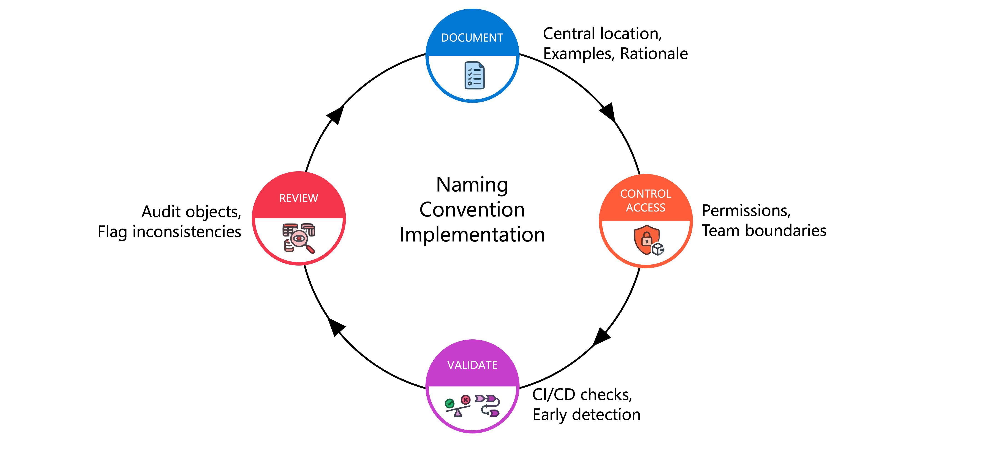

- **Document** conventions centrally (examples + rationale).
- **Control access** via UC permissions (restrict `CREATE TABLE`/`CREATE SCHEMA`).
- **Validate names in CI/CD**; **review existing objects** via information schema; **balance flexibility vs. standardization**.

---

## 2. Create catalog

### What is a catalog?

The **top-level container** in the three-layer namespace — the primary unit of **data isolation** and organization.

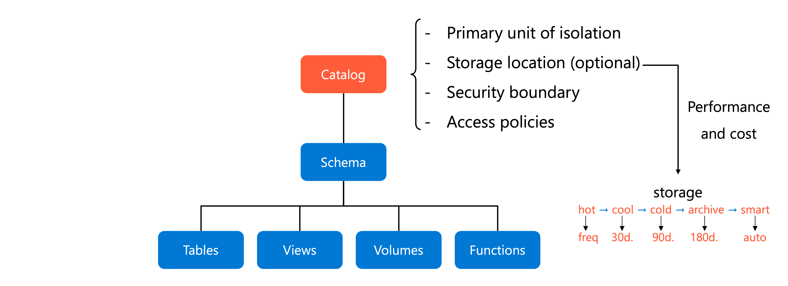

- Each catalog can have its own **storage location, security boundaries, access policies**.
- Typically maps to **business domains, security requirements, or lifecycle stages**.

**Isolation patterns:** environment-based (`prod_catalog`/`dev_catalog`) · sensitivity-based (customer vs. operational data) · performance/cost (per-catalog storage) · regional (metastores are per-region).

### Create a catalog

- Requires **metastore admin** or **CREATE CATALOG** privilege.
- Auto-creates two schemas: **`default`** and **`information_schema`**.

```sql
CREATE CATALOG IF NOT EXISTS dev_catalog
COMMENT 'Development environment for data engineering experiments';
```

- **Catalog Explorer:** Catalog → Create catalog → name → type **Standard** → (optional storage) → Create.
- Configure **workspace bindings** — by default accessible from all workspaces; restrict prod catalogs to prod workspaces.

### Configure managed storage

- Strongly recommended. Defines where UC stores files for **managed tables & volumes**. Without it, managed objects fall back to metastore default.
- Needs an **external location** + **CREATE MANAGED STORAGE** privilege.

```sql
CREATE CATALOG IF NOT EXISTS prod_catalog
MANAGED LOCATION 'abfss://prod-data@mystorageaccount.dfs.core.windows.net/catalog-root'
COMMENT 'Production catalog with dedicated ADLS Gen2 storage';
```

- Purposes: **physical data isolation** (dropped managed tables deleted after **8 days**) + **compliance** (specific accounts/regions).
- If the metastore has **no default storage**, you **must** specify managed storage when creating catalogs.

---

## 3. Create schema

### What is a schema?

The **second level** (`catalog.schema.table`) — logical organization within a catalog, typically a single use case, project, or team.

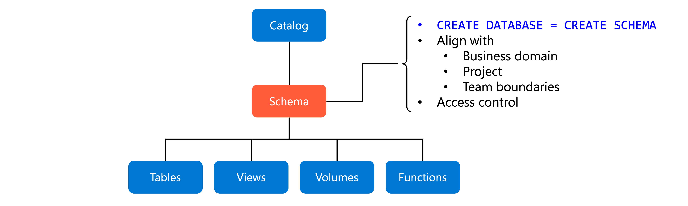

- 📝 Called a **"database"** in Databricks — `CREATE DATABASE` is an **alias** for `CREATE SCHEMA`.

**Organization patterns:** department-based (`marketing_analytics`, `financial_data`) · project-based (`customer_churn_model`) · functional/stage-based (`raw_data`, `cleansed_data`, `reporting_views`).

### Create a schema

- Requires **USE CATALOG** + **CREATE SCHEMA** on the parent catalog.

```sql
CREATE SCHEMA IF NOT EXISTS prod_catalog.customer_analytics
COMMENT 'Customer behavior and segmentation analysis';
```

- Users need **USE SCHEMA** to see/query; **CREATE TABLE** etc. to create objects. Includes its own **information_schema**.

### Managed storage (schema level)

- Optional; needs an **external location** + **CREATE MANAGED STORAGE**. Without it, managed tables use the **catalog's** storage (then metastore default).

```sql
CREATE SCHEMA IF NOT EXISTS prod_catalog.financial_data
MANAGED LOCATION 'abfss://finance@mystorageaccount.dfs.core.windows.net/schema-data'
COMMENT 'Financial transactions with dedicated storage';
```

> **Storage resolution reminder:** schema → catalog → metastore (most specific wins).

---

## 4. Create tables and views

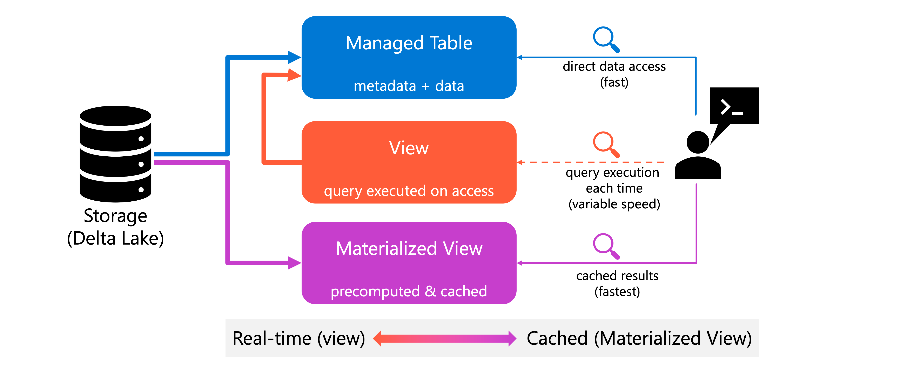

### Managed tables (the default)

- Databricks manages **metadata AND data files** (auto optimization, lifecycle, cleanup on drop). **Delta Lake** format by default → ACID, time travel, schema enforcement.

```sql
CREATE TABLE production.sales.sales_transactions (
  transaction_id BIGINT,
  customer_id INT,
  product_name STRING,
  amount DECIMAL(10,2),
  transaction_date DATE
);
```

- Supports **constraints** and **generated columns**:

```sql
CREATE TABLE customer_orders (
  order_id BIGINT NOT NULL,
  customer_email STRING NOT NULL,
  order_total DECIMAL(10,2),
  tax_amount DECIMAL(10,2) GENERATED ALWAYS AS (order_total * 0.08),
  CONSTRAINT valid_total CHECK (order_total > 0)
);
```

### Primary & foreign keys

- Available Runtime **11.3 LTS+** (GA in **15.2+**). ⚠️ **Informational only — NOT enforced.** PK columns are implicitly `NOT NULL`. Help the **query optimizer** (join strategies).

```sql
CREATE TABLE customers (
  customer_id BIGINT NOT NULL,
  customer_name STRING,
  CONSTRAINT customers_pk PRIMARY KEY (customer_id)
);
-- Composite PK: PRIMARY KEY (order_id, item_id)
-- FK: CONSTRAINT orders_customers_fk FOREIGN KEY (customer_id) REFERENCES customers(customer_id)
```

### External tables

- Reference data in external storage; **dropping removes only metadata** (files remain). Needs a `LOCATION` under a UC external location.

```sql
CREATE EXTERNAL TABLE archived_sales
USING CSV
LOCATION 'abfss://container@storage.dfs.core.windows.net/sales/archive'
OPTIONS (header 'true', inferSchema 'true');
```

> Prefer **managed tables** for new pipelines unless you specifically need external storage.

### Standard views

- Virtual layer; **store no data**, compute on demand; always current.

```sql
CREATE VIEW customer_order_summary AS
SELECT c.customer_id, c.customer_name, COUNT(o.order_id) AS total_orders, SUM(o.order_total) AS total_spent
FROM customers c
INNER JOIN orders o ON c.customer_id = o.customer_id
GROUP BY c.customer_id, c.customer_name;
```

### Dynamic views (access control)

- Add **row-level filters** and **column-level masks** based on the querying user via `is_account_group_member()`.

```sql
-- Column masking
CREATE VIEW sales_redacted AS
SELECT user_id,
  CASE WHEN is_account_group_member('auditors') THEN email ELSE 'REDACTED' END AS email,
  product, total
FROM sales_raw;

-- Row-level security
CREATE VIEW sales_filtered AS
SELECT user_id, product, total FROM sales_raw
WHERE CASE WHEN is_account_group_member('managers') THEN TRUE ELSE total <= 1000000 END;
```

- Require SQL warehouses, standard/dedicated access mode compute on **Runtime 15.4 LTS+**.

### Materialized views

- **Precompute & cache** results as a Delta table; much faster for complex aggregations. Refresh manually or on schedule.

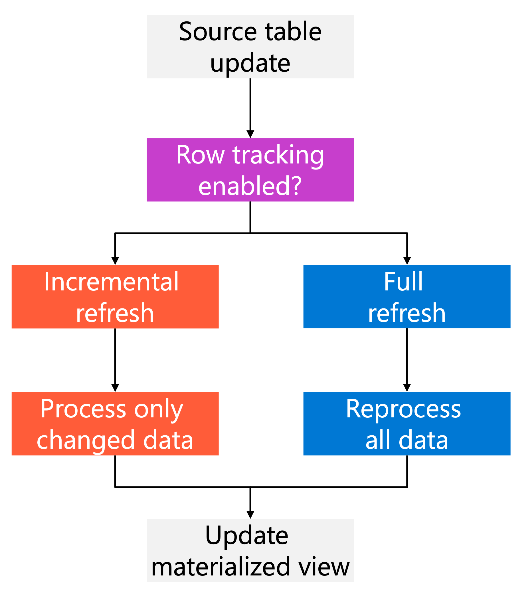

```sql
CREATE MATERIALIZED VIEW daily_sales_summary
SCHEDULE EVERY 1 DAY
AS SELECT transaction_date, COUNT(*) AS transaction_count, SUM(amount) AS total_sales
FROM sales_transactions
GROUP BY transaction_date;
```

- **Refresh strategies:** **incremental** (only changed data) vs. **full**. Incremental needs source Delta tables with **row tracking**:

```sql
ALTER TABLE sales_transactions SET TBLPROPERTIES (delta.enableRowTracking = true);
```

- ⚠️ Row tracking needs Runtime **14.1+**; enabling on existing tables assigns row IDs (slow for large tables), upgrades protocol, **can't be reversed**.

### Streaming tables

- **Streaming semantics** — process only **new rows** since last refresh. Backed by Delta + a dedicated serverless pipeline created by `CREATE OR REFRESH STREAMING TABLE`.
- Best for incremental ingestion (Auto Loader, Kafka, bronze/silver layers). Don't reprocess seen data.

```sql
CREATE OR REFRESH STREAMING TABLE bronze_orders
  SCHEDULE EVERY 1 HOUR
  AS SELECT * FROM STREAM read_files('/Volumes/prod_catalog/landing/raw_files/orders/', format => 'json');

-- Refresh when source updates (unpredictable arrival):
CREATE OR REFRESH STREAMING TABLE silver_orders
  TRIGGER ON UPDATE
  AS SELECT order_id, customer_id, order_total FROM STREAM bronze_orders;

REFRESH STREAMING TABLE silver_orders;  -- manual refresh
```

> **Streaming table vs. materialized view:** streaming = append-only/exactly-once incremental (Kafka, no full history); materialized view = aggregations over a complete dataset where periodic full recompute is OK.

### Best practices

- Start with **managed tables**; keep views focused (avoid deep layering); use **dynamic views** for security; choose standard vs. materialized by freshness vs. performance.
- Use **liquid clustering** (`CLUSTER BY`) instead of partitioning — auto-optimizes layout.

---

## 5. Create volumes

### What are volumes?

The **third-level** object (`catalog.schema.volume`) governing **files of any format** (CSV, JSON, Parquet, images, audio, ML artifacts) — the unstructured counterpart to tables.

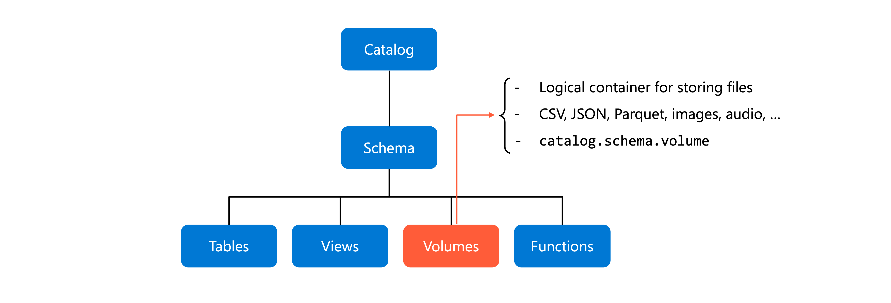

### Managed vs. external volumes

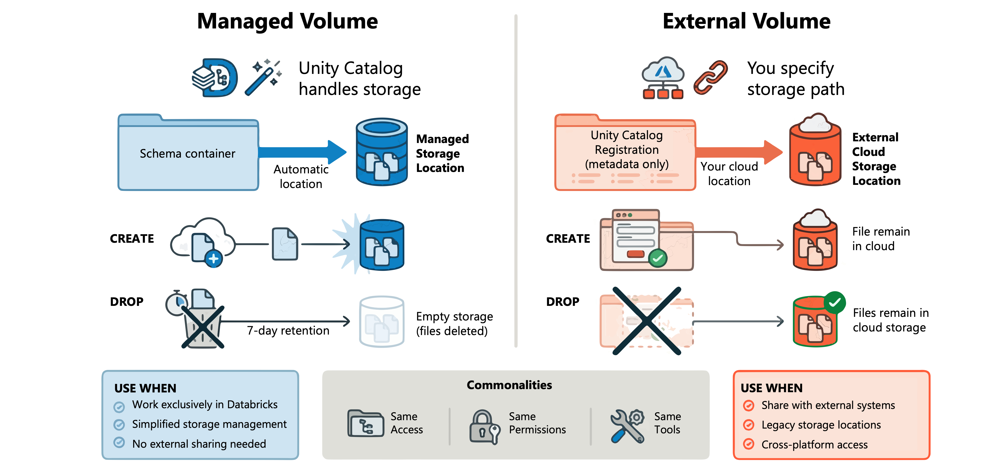

| | **Managed volume** | **External volume** |
|--|-------------------|---------------------|
| **Storage** | UC-managed (schema's managed location) | You specify the path |
| **On drop** | Files marked for deletion after **7-day** retention | Files **remain** (only registration removed) |
| **Use when** | Working exclusively in Databricks | Sharing with other systems / adding governance to legacy files |

### Create a volume

- Needs **CREATE VOLUME** on schema + **USE** on schema & catalog. External also needs **CREATE EXTERNAL VOLUME** on the external location.

```sql
-- Managed
CREATE VOLUME IF NOT EXISTS dev_catalog.bronze_schema.landing_files
COMMENT 'Landing area for CSV files';

-- External
CREATE EXTERNAL VOLUME prod_catalog.silver_schema.ml_models
LOCATION 'abfss://models@mystorageaccount.dfs.core.windows.net/production/';
```

### Access files

- POSIX-style path — **no cloud credentials needed** (works with Spark, pandas, SQL):

```txt
/Volumes/<catalog>/<schema>/<volume>/<path>/<filename>
```

```python
df = spark.read.format("csv").load("/Volumes/dev_catalog/bronze_schema/landing_files/data.csv")
dbutils.fs.ls("/Volumes/dev_catalog/bronze_schema/landing_files")   # file mgmt
```

```sql
SELECT * FROM csv.`/Volumes/dev_catalog/bronze_schema/landing_files/data.csv`;
```

### Permissions

| Privilege | Allows |
|-----------|--------|
| **READ VOLUME** | List & read files |
| **WRITE VOLUME** | Create/update/delete files |
| **CREATE VOLUME** | Create volumes in a schema |
| **CREATE EXTERNAL VOLUME** | Create external volumes on an external location |

```sql
GRANT READ VOLUME, WRITE VOLUME ON VOLUME dev_catalog.bronze_schema.landing_files TO `data-engineers`;
```

- Permissions **cascade** from parents; also need **USE** on catalog & schema.
- ⚠️ **No folder/subdirectory ACLs** — permissions apply to the **entire volume**. Separate security boundaries → separate volumes.

---

## 6. Implement DDL operations

### Functions (reusable logic)

Governed objects — **scalar** (single value) or **table-valued** (result set); **SQL** or **Python**.

```sql
-- SQL scalar
CREATE FUNCTION dev_catalog.finance_schema.calculate_discount(price DOUBLE, discount_rate DOUBLE)
RETURNS DOUBLE
RETURN price * (1 - discount_rate);

-- Python scalar
CREATE FUNCTION dev_catalog.analytics_schema.normalize_text(input_text STRING)
RETURNS STRING LANGUAGE PYTHON
AS $$ return input_text.lower().strip() if input_text else None $$;

-- Table-valued (SQL)
CREATE FUNCTION dev_catalog.utils_schema.split_to_rows(input_array ARRAY<STRING>)
RETURNS TABLE(value STRING)
RETURN SELECT explode(input_array) AS value;

-- Temporary (session-scoped, no catalog qualifier)
CREATE TEMPORARY FUNCTION calculate_tax(amount DOUBLE) RETURNS DOUBLE RETURN amount * 0.08;
```

- Python functions run on **serverless or pro SQL warehouses**.

### Procedures (multi-step)

- `CREATE PROCEDURE` needs UC + Runtime **17.0+**. Supports **IN/OUT/INOUT** params, control flow, error handling.

```sql
CREATE PROCEDURE dev_catalog.etl_schema.refresh_customer_summary(IN source_date DATE, OUT rows_processed INT)
LANGUAGE SQL SQL SECURITY INVOKER
BEGIN
  DELETE FROM dev_catalog.analytics_schema.customer_summary WHERE summary_date = source_date;
  INSERT INTO dev_catalog.analytics_schema.customer_summary
    SELECT customer_id, summary_date, SUM(amount) FROM dev_catalog.sales_schema.transactions
    WHERE transaction_date = source_date GROUP BY customer_id, summary_date;
  SET rows_processed = (SELECT COUNT(*) FROM dev_catalog.analytics_schema.customer_summary WHERE summary_date = source_date);
END;

CALL dev_catalog.etl_schema.refresh_customer_summary(DATE '2024-01-15', :rows);
```

- `SQL SECURITY INVOKER` → runs with the **caller's** permissions.

### ALTER CATALOG

```sql
ALTER CATALOG dev_catalog SET OWNER TO `data_engineering_team`;   -- transfer ownership (owner/admin/MANAGE)
ALTER CATALOG dev_catalog SET TAGS (environment = 'development', data_classification = 'internal');
ALTER CATALOG prod_catalog ENABLE PREDICTIVE OPTIMIZATION;         -- auto compaction/vacuum; tables inherit
```

### ALTER TABLE (needs MODIFY privilege)

```sql
ALTER TABLE ... ADD COLUMN shipping_carrier STRING;   -- existing rows get NULL
ALTER TABLE ... RENAME COLUMN customer_email TO email_address;   -- needs Delta column mapping
ALTER TABLE ... DROP COLUMN temporary_field;   -- drop dependent constraints first
ALTER TABLE ... ALTER COLUMN quantity TYPE BIGINT;   -- widen/compatible types
```

---

## 7. Implement foreign catalog

Query **external databases** directly (no migration) while keeping UC governance, lineage, and audit.

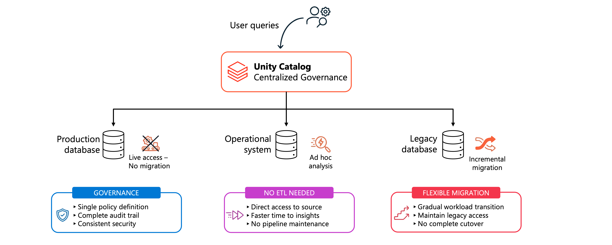

**Why:** consistent **governance & auditability** · **external access without ETL** (POCs, ad hoc, validation) · **incremental migration** support.

### Connections vs. foreign catalogs

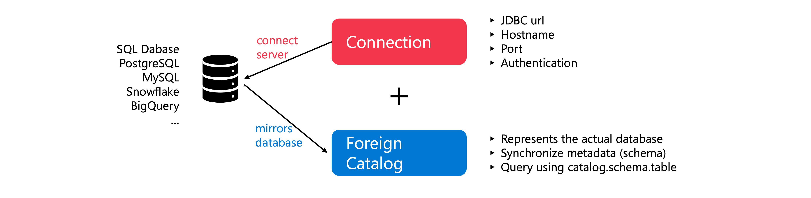

| | **Connection** | **Foreign catalog** |
|--|---------------|---------------------|
| **What** | Registered credential — JDBC URL, host, port, auth | Mirrors an external database in UC's namespace |
| **Scope** | Create once, reuse for many foreign catalogs | One per external database |

Supports PostgreSQL, MySQL, Snowflake, BigQuery, Azure SQL, etc.

### Create a connection

- Needs **CREATE CONNECTION** (or metastore admin), compute Runtime **13.3 LTS+** with Standard/Dedicated mode, network connectivity.

```sql
CREATE CONNECTION postgresql_prod TYPE postgresql
OPTIONS (
  host 'prod-db.example.com', port '5432',
  user secret ('prod-secrets','postgres-user'),
  password secret ('prod-secrets','postgres-password')
);
-- Azure SQL: TYPE SQLSERVER, host '...database.windows.net', port '1433'
```

- Use the `secret()` function — never embed passwords.

### Create the foreign catalog

- Needs **CREATE CATALOG** + connection ownership or **CREATE FOREIGN CATALOG** on the connection.

```sql
CREATE FOREIGN CATALOG IF NOT EXISTS prod_customer_data
USING CONNECTION postgresql_prod
OPTIONS (database 'customers');
```

- **Metadata syncs automatically** on each query. For high-frequency queries, refresh manually:

```sql
REFRESH FOREIGN CATALOG prod_customer_data;
REFRESH FOREIGN SCHEMA prod_customer_data.public;
REFRESH FOREIGN TABLE prod_customer_data.public.transactions;
```

- Schedule refreshes with **Lakeflow Jobs**.

### Grant & query

```sql
GRANT USE CATALOG ON CATALOG prod_customer_data TO `data-analysts`;
GRANT USE SCHEMA ON SCHEMA prod_customer_data.public TO `data-analysts`;
GRANT SELECT ON TABLE prod_customer_data.public.transactions TO `data-analysts`;
```

- **Query pushdown:** joins/aggregations/filters pushed to the external DB (uses its compute). ⚠️ Large result sets can OOM the Databricks executor → consider materialized views to cache.

---

## 8. Configure AI/BI Genie instructions

**AI/BI Genie** lets business users explore data via **natural-language questions** — but needs guidance to interpret your terminology/business logic via a **knowledge store**.

### Configure the knowledge store

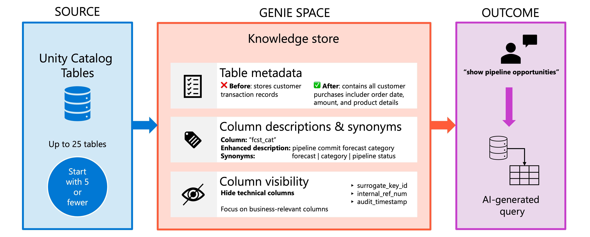

- Customize metadata at the **space level** without altering UC objects.
- Select up to **25 tables/views** per space — but start with **5 or fewer** focused on specific business questions.
- **Table descriptions** in business language; **column metadata** + **synonyms** (e.g. `fcst_cat` → "forecast", "pipeline status").
- **Hide columns** that don't serve business users (surrogate keys, audit timestamps).

### Data relationships & prompt matching

- UC **foreign keys** → Genie auto-builds `JOIN`s; or define **Joins** manually (e.g. `opportunity.accountid = accounts.id`, **Many to one**).
- **Prompt matching** gives Genie visibility into actual values:
  - **Format assistance** — representative values for all eligible columns.
  - **Entity matching** — curated distinct value lists for categorical columns (e.g. "California" → "CA"). Up to **1,024 distinct values per column** across **120 columns**.

### SQL instructions & examples

- **SQL expressions** — reusable business concepts (measures/filters/dimensions), e.g. gross margin `(revenue - cost) / revenue`.
- **Example SQL queries** — question + SQL for complex patterns; support `:parameter` substitution. Parameterized queries matching the exact question → marked **Trusted**; non-parameterized → context only.
- **Text** tab — global instructions, use **sparingly** (e.g. "fiscal year starts in February").

**Limits (prioritize quality over quantity):**
- **Instructions limit = 100** — example SQL queries (each 1), SQL functions (each 1), entire general text block (1). Column descriptions & prompt matching **don't** count.
- **Knowledge store snippets limit = 200** — table descriptions, join relationships, SQL expressions combined.

### Iterative refinement

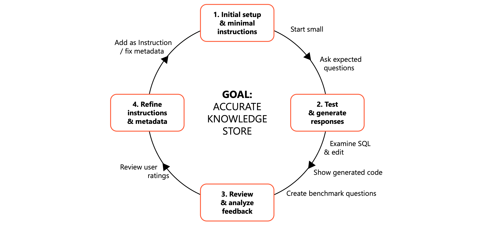

- Ongoing process: test questions → review generated SQL → **Show generated code** → edit → **Add as instruction**.
- Create **benchmark questions**; collect user **feedback** (Monitoring tab).
- **Knowledge mining:** on space creation Genie auto-saves PK/FK relationships; when you approve responses it may **suggest** new expressions/joins (for review, not auto-added).

---

## 9. Summary

- **Three-layer namespace** (catalogs → schemas → objects) organizes data with centralized security.
- **Catalogs** = environment/sensitivity isolation; **schemas** = logical grouping; **tables/views/volumes** = data.
- **Managed** objects simplify lifecycle; **external** objects govern existing data without migration.
- **Dynamic views** = row/column security; **materialized views** = performance; **streaming tables** = incremental ingestion.
- **Foreign catalogs** = govern external databases in place; **AI/BI Genie** = natural-language discovery.
- Effective **naming** + **metadata** keep data discoverable and maintainable. Start small, expand.

---

## 🧠 Quick revision cheat-sheet

| Concept | Remember this |
|---------|---------------|
| **Namespace** | `catalog.schema.object` (3 levels) |
| **Naming** | ≤255 chars, lowercase, no `. / space`; backticks for hyphens; medallion bronze/silver/gold |
| **Catalog** | Top-level isolation; auto `default` + `information_schema`; needs CREATE CATALOG |
| **Managed storage** | Resolution: schema → catalog → metastore; dropped managed tables purge after **8 days** |
| **Schema** | = "database" (`CREATE DATABASE` alias); needs USE CATALOG + CREATE SCHEMA |
| **Managed table** | Default; Delta; manages metadata + files; cleaned up on drop |
| **External table** | Drop removes metadata only; needs LOCATION under external location |
| **PK/FK** | Informational only, **not enforced**; help optimizer (11.3 LTS+/GA 15.2+) |
| **Standard view** | No data, computes on demand, always current |
| **Dynamic view** | Row filters + column masks via `is_account_group_member()`; Runtime 15.4 LTS+ |
| **Materialized view** | Cached Delta; incremental refresh needs **row tracking** (14.1+, irreversible) |
| **Streaming table** | Append-only incremental; `CREATE OR REFRESH STREAMING TABLE`; `TRIGGER ON UPDATE` |
| **Volume** | Files (any format); managed (drop = 7-day retention) vs. external (files remain) |
| **Volume path** | `/Volumes/<catalog>/<schema>/<volume>/...`; no folder-level ACLs |
| **Functions** | Scalar/table-valued, SQL/Python; temp = session-scoped |
| **Procedures** | `CREATE PROCEDURE`, Runtime 17.0+; IN/OUT/INOUT; SQL SECURITY INVOKER |
| **Foreign catalog** | Connection (credential) + foreign catalog (DB mirror); query pushdown; `REFRESH FOREIGN` |
| **Genie** | ≤25 tables (start ≤5); synonyms, joins, prompt/entity matching; limits 100 instructions / 200 snippets |