# Secure Unity Catalog Objects

> **Module:** Secure Unity Catalog objects (11 Units · Intermediate · Data Engineer)
> **Source:** [Microsoft Learn](https://learn.microsoft.com/en-gb/training/modules/secure-unity-catalog-objects/)
> **In one line:** Secure Unity Catalog through the **query lifecycle**, **privileges/inheritance**, **row & column security**, **Key Vault secrets**, **service principals**, and **managed identities**.

---

## 📌 Learning objectives

By the end of this module you should be able to:

- Understand the **query lifecycle** and how security is enforced
- Implement **access control** using inherited & explicit permissions
- Apply **fine-grained access control** (row filtering, column masking)
- Securely access **Azure Key Vault** secrets
- Authenticate data access with **service principals**
- Configure **managed identities** for credential-free resource access

**Prerequisites:** Databricks & Unity Catalog concepts · SQL & data access patterns · Microsoft Entra ID & Azure security fundamentals.

---

## 1. Understand the query lifecycle

### Query lifecycle in Unity Catalog

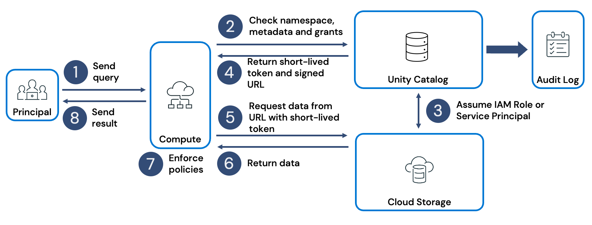

| Step | What happens |
|------|-------------|
| **1. Query submission** | A **principal** (user or service identity) issues a query from a cluster, job cluster, or SQL warehouse (incl. BI tools) |
| **2. Request validation** | Compute forwards to **Unity Catalog** (the control plane) → records in **audit log** + checks permissions. Denied → blocked & logged |
| **3. Assume cloud credentials** | For each object, UC assumes the right **cloud credential** (managed table → metastore storage; external → storage credential) |
| **4. Issue scoped tokens** | UC generates a **scoped temporary access token** + secure URL per object (no long-lived credentials exposed) |
| **5. Data access** | Compute uses the token/URL to read directly from **ADLS Gen2** (`abfss://` / `dfs.core.windows.net`) |
| **6. Data transfer** | Storage returns data to compute (repeated per object) |
| **7. Fine-grained filtering** | UC enforces **row- & column-level filters on the compute engine** — each principal sees only their entitled subset |
| **8. Return result** | Filtered result returned to the user/job/app |

> 📝 **Azure best practice:** grant UC access to ADLS Gen2 via **Managed Identity + Access Connector** (not pure service principals) — works with **network-restricted** storage and removes secret rotation.
> ⚠️ If storage has a firewall/VNet restriction, the **access connector / managed identity** must be explicitly allowed — a valid token is still rejected if the identity is blocked at the firewall.

### Query lifecycle with Apache Hive (legacy)

When a workspace is attached to a UC metastore, Hive appears as the **`hive_metastore`** catalog. ⚠️ **Legacy governance model.**

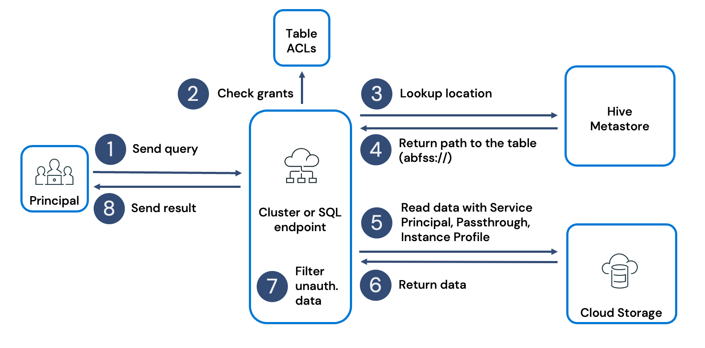

**How it differs from Unity Catalog:**
- No centralized fine-grained governance → manage **service accounts, secrets, instance profiles** manually.
- Needs **mount points, passthrough auth, storage policies**.
- Less integrated audit logging → inconsistent enforcement.
- Flow: submit → check **table ACLs** → look up location in Hive metastore → path returned (URI) → authenticate to storage (service principal / passthrough / instance profile) → data returned → last-mile filtering → result.

> UC reduces this overhead by automating credential handling, scoped tokens, and consistent policy enforcement.

---

## 2. Implement access control strategies

Four complementary access-control models:

| Mechanism | Applies to | Use case |
|-----------|-----------|----------|
| **Privileges & ownership** | Catalogs, schemas, tables | Baseline access & delegation (this unit) |
| **Attribute-based access control (ABAC)** | Tagged objects | Centralized, tag-driven policies (*Govern UC objects* module) |
| **Table-level row & column filters** | Individual tables | Per-table filtering/masking with UDFs (next units) |
| **Workspace bindings** | Catalogs, external locations, storage credentials | Restrict objects to specific workspaces |

**Metastore facts (Azure):** **region-bound** (assign only to same-region workspaces) · **one metastore per workspace** at a time → multi-region orgs create multiple metastores.

### The three-level permission requirement

To **query a table**, a principal needs privileges at **every level of containment**:

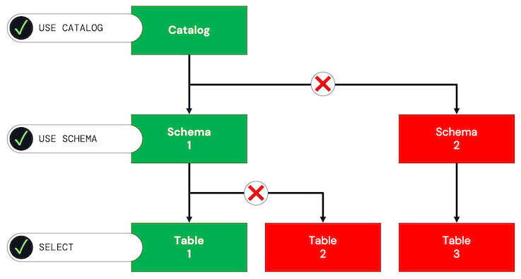

1. **USE CATALOG** on the catalog
2. **USE SCHEMA** on the schema
3. **SELECT** on the table

> ⚠️ Missing any one → query fails. This is the **explicit privilege model** — secure but high admin effort (every table granted individually).

### Inheritance from schema

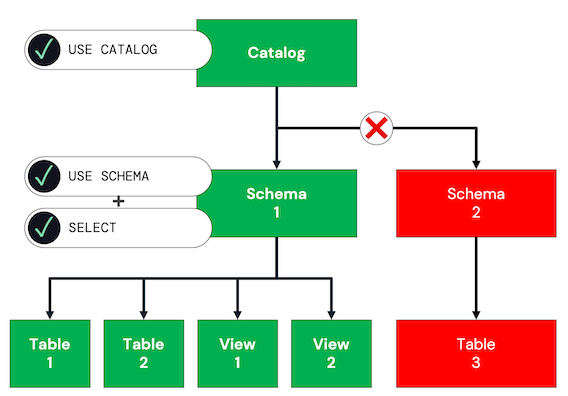

- Grant **SELECT on the schema** (+ USE SCHEMA + USE CATALOG) → SELECT on **all current & future** tables/views in that schema.
- Simpler management; less restrictive; other schemas remain inaccessible.

### Inheritance from catalog

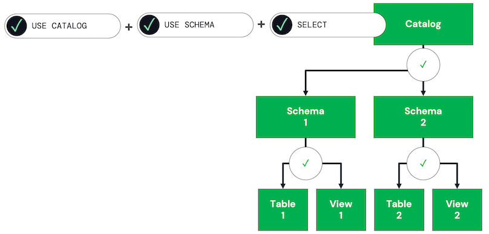

- Grant **USE CATALOG + ALL PRIVILEGES (or SELECT)** on the catalog → inherits on **all** schemas/tables/views (incl. future).
- **Most permissive** — convenient for broad analyst access; no schema/table granularity.

### Creating tables

- **Explicit (schema):** USE CATALOG + USE SCHEMA + **CREATE TABLE** on the target schema → create tables in that one schema.
- **Inherited (catalog):** USE CATALOG + USE SCHEMA + CREATE TABLE at the **catalog** → create in any schema (incl. future). Easier but riskier; best for collaborative/exploratory catalogs.

### Granting with ANSI SQL (DCL)

```sql
GRANT SELECT ON TABLE sales TO `analysts`;
GRANT USE SCHEMA ON SCHEMA finance TO `analysts`;
GRANT USE CATALOG ON CATALOG corpdata TO `analysts`;
GRANT CREATE TABLE ON SCHEMA finance TO `analysts`;
REVOKE SELECT ON TABLE sales FROM `analysts`;
```

- Also manageable via **Catalog Explorer → Permissions** tab.

### Verify grants

```sql
SHOW GRANTS ON TABLE sales.reporting.monthly_revenue;              -- all grants on object
SHOW GRANTS `finance-team` ON TABLE sales.reporting.monthly_revenue; -- for a principal
```

> ⚠️ **Inherited grants might NOT appear** in SHOW GRANTS on the table itself — check all levels of the hierarchy.

### Access Control Lists (ACLs)

An ACL associates a **principal** + **privilege** + **securable object**.

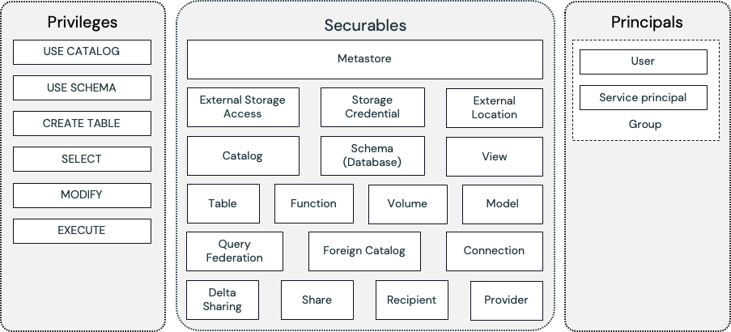

- **Privileges** — per-object-type operations. Table: `SELECT, MODIFY, MANAGE, ALL PRIVILEGES`; Schema: `USE SCHEMA, CREATE TABLE, ...`; Catalog: `USE CATALOG, CREATE SCHEMA, BROWSE, ...`. **`ALL PRIVILEGES`** auto-covers newly added privileges.
- **Securables** — hierarchical (metastore → catalog → schema → table/view/function/volume/external location…) → enables **inheritance**.
- **Principals** — **user**, **service principal**, or **group** (groups preferred). Backticks for special chars:

```sql
GRANT SELECT ON TABLE t TO `alice@company.com`;
GRANT SELECT ON TABLE t TO `aaaaaaaa-bbbb-cccc-1111-222222222222`; -- service principal
```

- **`account users`** = built-in principal for all account users (can grant to it; **not** to the workspace-local `users` group).

### Microsoft Entra ID integration

- **No workspace-local users/groups** — provision in **Microsoft Entra ID**; UC syncs them into the account.
- **Service principals** = registered Entra applications; credentials in **Key Vault** or **managed identities**.
- **`account users`** = all Entra ID users in the account.

---

## 3. Understand fine-grained access control

Expose only part of a dataset without duplicating tables. Two approaches:

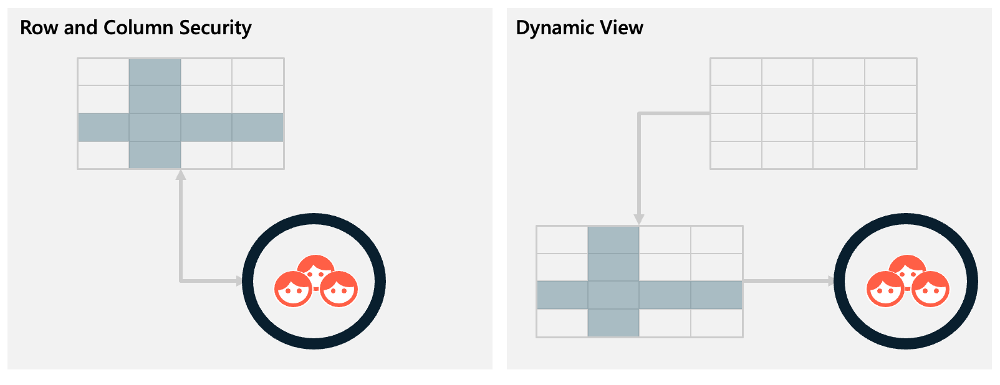

- **Row & Column Security** — the **preferred, modern** method (column masking + row filtering).
- **Dynamic Views** — earlier pattern, still valid in some cases.

**Objectives:** column masking (hide/transform sensitive values), row filtering (suppress records), partial transformation (keep utility, e.g. last 2 digits).

### Row & Column Security

- **Column masking** — associate a **masking function** with a column; UC invokes it per query (real value / redacted / transformed). One function per masked column.
- **Row filtering** — associate a **filter function** (returns boolean) with the table. One function governs all row rules.
- Functions are **securable UDFs** bound to the table's metadata → single authoritative definition.

**Characteristics:** centralized logic (less drift) · combinatorial flexibility (one function set for all users) · performance alignment (table layer, no view stacking) · operational simplicity.

### Dynamic Views

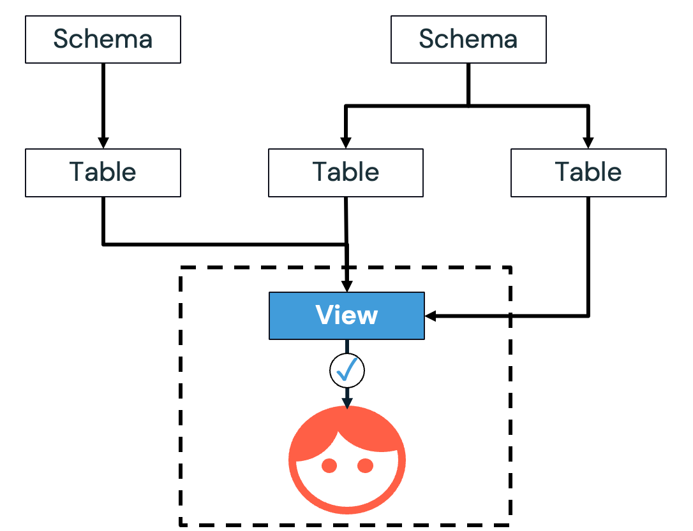

- A view with conditional logic (CASE for masking, predicates for rows). Users query the view **without** direct table access (view owner has it).
- **Characteristics:** full separation from source · **multi-table composition** · **read-only** · object-proliferation risk (a view per audience).

### Why Row & Column Security is preferred

Reduced object sprawl · easier maintenance · performance (enforced at source) · clearer governance/lineage · flexible combinations.

> 📝 **Both are *manual*, per-table.** Databricks also offers **ABAC** — centralized tag-based policies applied automatically across a schema/catalog with no per-table config. **ABAC is now recommended** for most cases (*Govern Unity Catalog objects* module).

### When dynamic views still make sense

Read-only interface contracts · multi-table logical datasets with consistent masking · strict abstraction (consumers shouldn't know underlying structure) · legacy migration.

### Comparison

| Dimension | Row & Column Security | Dynamic Views |
|-----------|----------------------|---------------|
| **Maintainability** | Security at table level, fewer moving parts | More objects if multiple views |
| **Flexibility** | Limited to the table | Combine multiple tables |
| **Object governance** | Fewer objects | More objects; grants at view + table |
| **Read/write** | Query & update with masking applied | Typically read-only; writes need table access |
| **Abstraction** | Exposes storage design | Presentation layer decoupled from storage |

**Common pitfalls:** duplicating tables per audience · many near-identical views · embedding complex transforms in masking functions (belongs upstream) · not securing the masking/filter functions themselves · **over-masking**.

---

## 4. Implement row filtering & column masking

Both approaches rely on group-membership checks like **`is_account_group_member()`**.

### Column masking (table-level)

```sql
CREATE OR REPLACE FUNCTION phone_mask(c_phone STRING)
  RETURN CASE WHEN is_account_group_member('metastore_admins')
    THEN c_phone
    ELSE 'REDACTED PHONE NUMBER'
  END;

ALTER TABLE customers ALTER COLUMN c_phone SET MASK phone_mask;
```

→ Only `metastore_admins` see real numbers; others see `REDACTED PHONE NUMBER`.

### Row filtering (table-level)

```sql
CREATE OR REPLACE FUNCTION nation_filter(c_nationkey INT)
  RETURN IF(is_account_group_member('admin'), true, c_nationkey = 21);

ALTER TABLE customers SET ROW FILTER nation_filter ON (c_nationkey);
```

→ Non-admins only see rows where `c_nationkey = 21`; admins see all.

### Dynamic view (alternative)

```sql
CREATE OR REPLACE VIEW vw_customers AS
SELECT c_custkey, c_name, c_address, c_nationkey,
  CASE WHEN is_account_group_member('admins') THEN c_phone
       ELSE 'REDACTED PHONE NUMBER' END AS c_phone,
  c_acctbal, c_mktsegment, c_comment
FROM customers_new
WHERE CASE WHEN is_account_group_member('admins') THEN TRUE
           ELSE c_nationkey = 21 END;

GRANT SELECT ON VIEW vw_customers TO `account users`;
```

→ Base table untouched; the view enforces the rules.

### Choosing between them

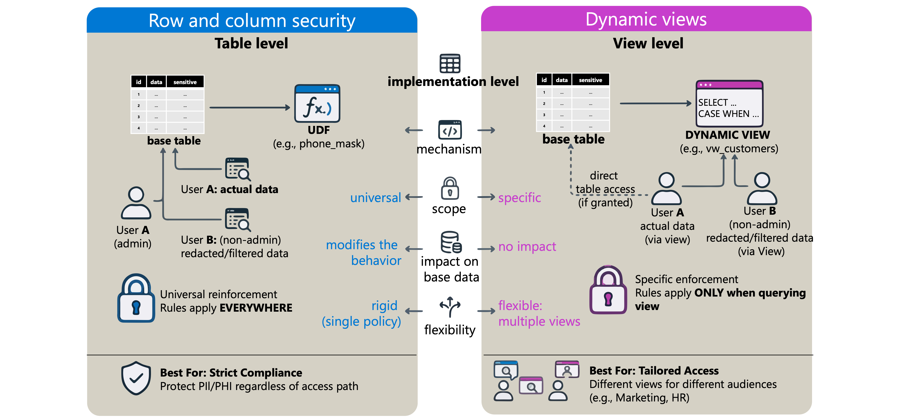

- **Row & Column Security** — embedded at the table; applies **everywhere** the table is used → strict enforcement.
- **Dynamic Views** — multiple views/rules for different audiences; base table stays unrestricted → adaptable, shareable.

---

## 5. Access Azure Key Vault secrets

Store credentials (passwords, connection strings, API keys) securely instead of hardcoding in notebooks.

### Secret scopes

A **secret scope** = named collection of secrets; permissions assigned at scope level.

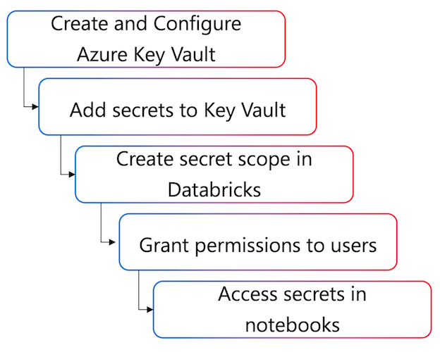

| Scope type | Storage |
|------------|---------|
| **Databricks-backed** | Encrypted DB managed by Databricks; manage via CLI/API |
| **Azure Key Vault-backed** | **Read-only** interface to secrets in Key Vault; manage secrets in Key Vault |

**Key Vault-backed advantages:** integrates with Azure security · supports network restrictions · no cross-system sync · secret updates apply after **cluster restart**.

> ⚠️ Permissions on a KV-backed scope apply to **all secrets** in the linked Key Vault → separate vaults for separate access boundaries.

### Creating a Key Vault-backed scope

- ⚠️ Key Vault must use the **Vault access policy** permission model — **Azure RBAC is NOT supported** (fails with 403). As of 2026, new vaults default to RBAC — verify: Key Vault → **Access configuration** → **Permission model** → **Vault access policy**.
- Allow **trusted Microsoft services** to bypass the firewall.
- Create via URL: `https://<databricks-instance>#secrets/createScope` (**case-sensitive** — uppercase `S` in `createScope`).
- **Manage Principal** — creator-only MANAGE requires **Premium** plan (Standard → must grant MANAGE to all workspace users).
- Provide the Key Vault **DNS Name** + **Resource ID** (from Properties). Databricks auto-grants the AD service principal **Get** and **List** on the vault (you need Contributor/Owner).

### Retrieving secrets

```python
username = dbutils.secrets.get(scope="jdbc", key="username")
password = dbutils.secrets.get(scope="jdbc", key="password")
dbutils.secrets.list("jdbc")   # metadata only, not values
```

- Values shown as **`[REDACTED]`** in output. Redaction stops accidental exposure, **not** intentional access by authorized cluster users.

**In SQL:**

```sql
SELECT secret('jdbc', 'username') AS db_username;
-- try_secret() returns NULL instead of erroring if missing
```

**In Spark config** (double curly braces, Advanced Options):

```txt
spark.storage.key {{secrets/storage/account-key}}
```
```python
storage_key = spark.conf.get("spark.storage.key")
```

**In environment variables** (init scripts):

```ini
STORAGE_KEY={{secrets/storage/account-key}}
```

> ⚠️ Any user with **CAN ATTACH TO** on the cluster can read env vars & Spark configs → they access secrets even without scope permission. Update a KV secret → **restart the cluster** (values cached at start).

### Scope permissions

Three levels: **READ** (retrieve), **WRITE** (add/update — **Databricks-backed only**), **MANAGE** (read + control permissions).

```bash
databricks secrets put-acl jdbc data-engineers READ
databricks secrets list-acls jdbc
databricks secrets get-acl jdbc data-engineers
databricks secrets delete-acl jdbc data-engineers
```

> ⚠️ For KV-backed scopes: manage only **who has access** via Databricks ACLs; secrets themselves are managed in Key Vault (**WRITE not applicable**).

---

## 6. Authenticate data access with service principals

A **service principal** = an identity for applications/services (automated user account) to access Azure resources.

**Three components:** **Application (client) ID** · **Directory (tenant) ID** · **Client secret** (password-like credential).

> 📝 Microsoft **recommends managed identities** where possible (no secret rotation, works with network-restricted storage). Service principals still useful when MI isn't available or you need explicit credential control.

### With Unity Catalog

A **storage credential** encapsulates the service principal's auth details; you reference it by name. UC assumes the SP identity → requests a temporary token from **Entra ID** → provides it to compute.

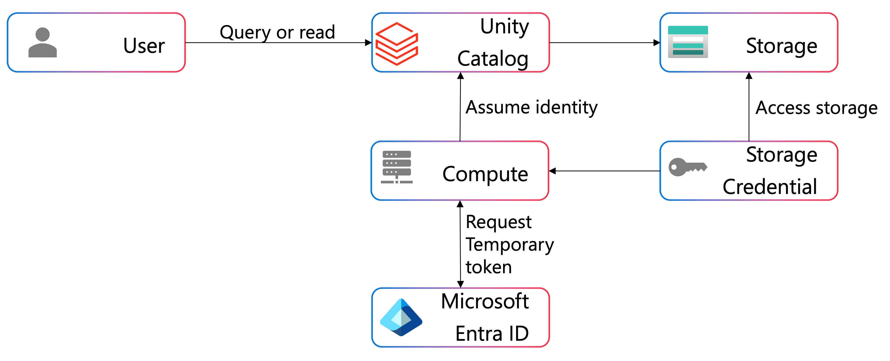

- Credentials never appear in code; audit logs record access; grant/revoke via UC permissions without code changes.
- 📝 **Data engineers typically don't create the storage credential** (admin task) — you use existing ones via external locations/tables:

```sql
SELECT * FROM catalog_name.schema_name.external_table;  -- UC handles auth automatically
```

### In notebooks (non-UC / legacy storage)

Configure Spark session properties (secret from a secure store, never hardcoded):

```python
service_credential = dbutils.secrets.get(scope="storage-secrets", key="sp-client-secret")

spark.conf.set("fs.azure.account.auth.type.<sa>.dfs.core.windows.net", "OAuth")
spark.conf.set("fs.azure.account.oauth.provider.type.<sa>.dfs.core.windows.net",
               "org.apache.hadoop.fs.azurebfs.oauth2.ClientCredsTokenProvider")
spark.conf.set("fs.azure.account.oauth2.client.id.<sa>.dfs.core.windows.net", "<application-id>")
spark.conf.set("fs.azure.account.oauth2.client.secret.<sa>.dfs.core.windows.net", service_credential)
spark.conf.set("fs.azure.account.oauth2.client.endpoint.<sa>.dfs.core.windows.net",
               "https://login.microsoftonline.com/<directory-id>/oauth2/token")

df = spark.read.parquet("abfss://<container>@<sa>.dfs.core.windows.net/path/to/data")
```

Uses the **OAuth 2.0 client credentials flow** to get a token from Entra ID.

### Best practices

- **Never hardcode secrets** (use Key Vault / Databricks secrets).
- **Secrets require rotation** — expire; expired secret → data access fails.
- **Least privilege** — SP accesses only what it needs.

---

## 7. Authenticate resource access with managed identities

**Managed identities** authenticate UC workspaces to storage **without managing credentials** — Azure handles the lifecycle (no rotation/secrets).

### How it works

Used through an **Azure Databricks access connector** (a first-party Azure resource bridging the managed identity and the Databricks account):

- **System-assigned MI** — auto-created; tied to the access connector's lifecycle (delete connector → MI deleted).
- **User-assigned MI** — created & managed separately; persists independently; attachable to multiple connectors.

**Two use cases:** (1) metastore root storage (managed tables), (2) external storage (external tables / reading files).

### Creating storage credentials with MI

1. In the **Azure portal**, create an **access connector** (same region as storage). Resource ID: `/subscriptions/{...}/providers/Microsoft.Databricks/accessConnectors/{name}`.
2. Grant the MI **Storage Blob Data Contributor** on the ADLS account (account or container level). Also grant **Storage Queue Data Contributor** for file-event notifications (efficient change detection).
3. In **Catalog Explorer → Credentials**, create a storage credential of type **Azure Managed Identity**, providing the access connector's resource ID (+ user-assigned MI resource ID if used).

> ⚠️ Needs **CREATE STORAGE CREDENTIAL** on the metastore (account/metastore admins have it by default).

### Accessing external storage

**Storage credentials + external locations** = governed access. An **external location** = storage credential + a specific `abfss://` path.

```sql
CREATE EXTERNAL TABLE sales_data
USING DELTA
LOCATION 'abfss://data@mystorageaccount.dfs.core.windows.net/sales/';

SELECT * FROM sales_data WHERE sale_date >= '2024-01-01';
```

- Multiple external locations can share one credential (different paths); grant different users different locations. Mark credentials **read-only** to prevent write locations.
- **Workspace binding** — restrict external locations/credentials to specific workspaces (e.g. prod data bound to prod workspace only).
- 📝 MI handles **authentication**, but **network connectivity** to restricted storage must already exist (private/service endpoints).

---

## 8. Summary

- UC enforces security across the **whole query lifecycle** — validate permissions, issue **scoped tokens**, filter rows/columns on compute.
- **Access control:** explicit vs. inherited grants (need USE CATALOG + USE SCHEMA + SELECT); ACLs = principal + privilege + securable; groups & Entra ID.
- **Fine-grained:** **Row & Column Security** (preferred, table-level) vs. **Dynamic Views** (flexible, multi-table); ABAC now recommended for scale.
- **Credentials & auth:** **Key Vault** secrets (KV-backed scopes) · **service principals** (explicit, rotate secrets) · **managed identities** (no credential management, network-restricted storage).

---

## 🧠 Quick revision cheat-sheet

| Concept | Remember this |
|---------|---------------|
| **Query lifecycle** | Submit → validate (audit log) → assume credential → **scoped token** → read ADLS → row/column filter on compute → return |
| **Query a table** | Needs **USE CATALOG + USE SCHEMA + SELECT** (all levels) |
| **Explicit model** | Per-table grants; secure, high effort |
| **Inheritance** | SELECT on schema/catalog → all current + future objects |
| **Create table** | USE CATALOG + USE SCHEMA + **CREATE TABLE** |
| **SHOW GRANTS** | Inherited grants may not show on the table — check all levels |
| **ACL** | principal + privilege + securable; `ALL PRIVILEGES` auto-covers new ones |
| **Metastore** | Region-bound; one per workspace |
| **Principals** | user / service principal / group (via Entra ID); `account users` built-in |
| **Fine-grained** | Row & Column Security (preferred) vs. Dynamic Views vs. ABAC (recommended at scale) |
| **Column mask** | `ALTER TABLE ... ALTER COLUMN ... SET MASK fn` |
| **Row filter** | `ALTER TABLE ... SET ROW FILTER fn ON (col)` |
| **Group check** | `is_account_group_member('group')` |
| **Secret scopes** | Databricks-backed (RW via CLI) vs. Key Vault-backed (read-only, manage in KV) |
| **Key Vault model** | Must be **Vault access policy** (RBAC not supported → 403) |
| **Get secrets** | `dbutils.secrets.get(scope, key)` / SQL `secret()`; shown as `[REDACTED]`; restart cluster after update |
| **Scope perms** | READ / WRITE (DB-backed only) / MANAGE |
| **Service principal** | client ID + tenant ID + client secret; OAuth client-credentials flow; rotate secrets |
| **Managed identity** | Via **access connector**; system-assigned (tied to connector) vs. user-assigned (independent); no secrets |
| **MI roles** | **Storage Blob Data Contributor** (+ Storage Queue Data Contributor for file events) |
| **Storage credential + external location** | credential = auth; external location = credential + `abfss://` path; workspace binding restricts |
| **Azure recommended** | Managed Identity + Access Connector over service principals (network-restricted storage, no rotation) |