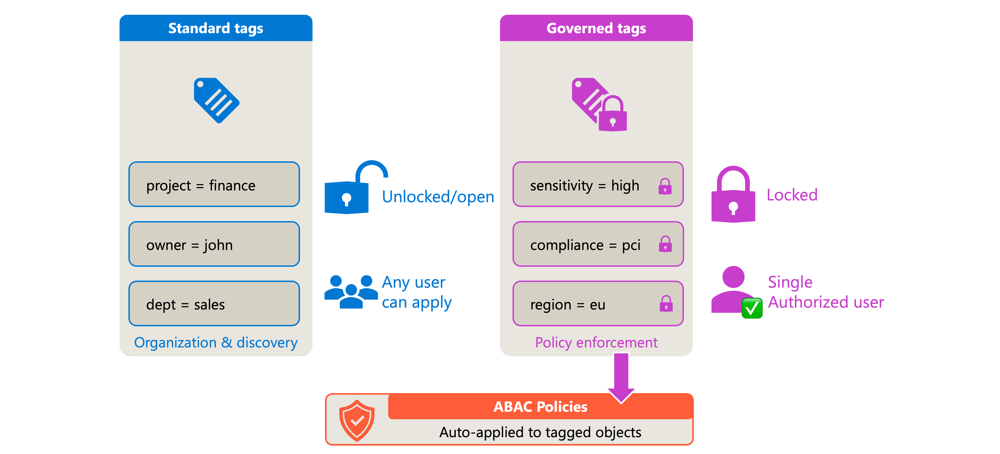
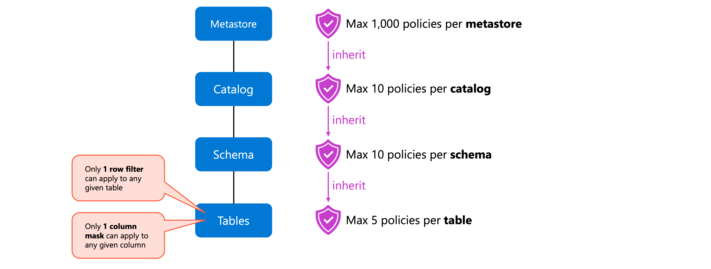
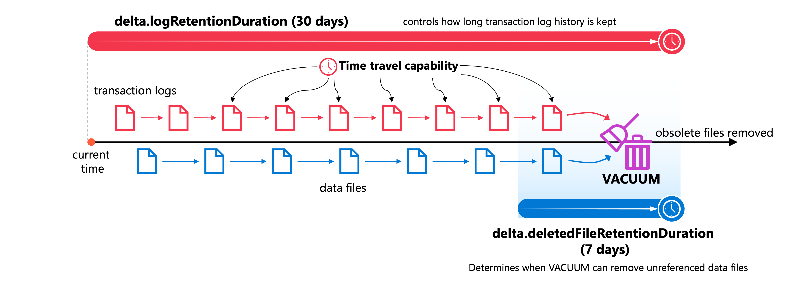
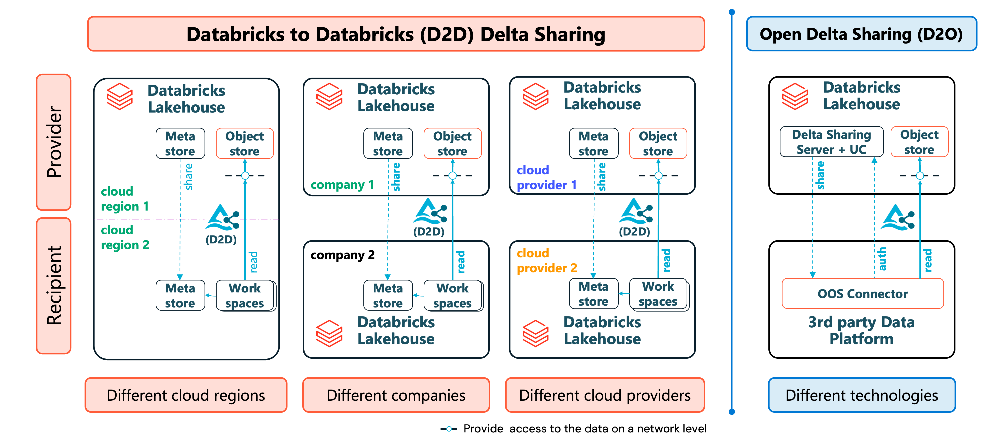

# Govern Unity Catalog Objects

> **Module:** Govern Unity Catalog objects (10 Units · Intermediate · Data Engineer)
> **Source:** [Microsoft Learn](https://learn.microsoft.com/en-gb/training/modules/govern-unity-catalog-objects/)
> **In one line:** Govern the data estate through **metadata (comments & tags)**, **ABAC policies**, **retention & VACUUM**, **lineage**, **audit logs**, and **Delta Sharing**.

---

## 📌 Learning objectives

By the end of this module you should be able to:

- Create and preserve **table & column definitions** for better data discovery
- Configure **attribute-based access control (ABAC)** using tags and policies
- Apply **data retention policies** to manage the data lifecycle
- Set up and manage **data lineage** to track data flow
- Configure **audit logging** for compliance and security monitoring
- Design a secure **Delta Sharing** strategy for external collaboration

**Prerequisites:** Azure Databricks workspaces & Unity Catalog basics · SQL & data engineering concepts.

---

## 1. Create and preserve table definitions

Well-documented metadata is the foundation of governance — and AI-driven discovery tools depend on it.

### Comments

Comments can be added to **any securable**: catalogs, schemas, tables, views, columns.

**Inline at creation:**

```sql
CREATE TABLE sales.customers.profiles (
    customer_id   BIGINT COMMENT 'Unique identifier for each customer',
    email         STRING COMMENT 'Customer primary email address',
    created_date  DATE   COMMENT 'Date when customer account was created',
    preferences   STRUCT<notifications: BOOLEAN, language: STRING>
                         COMMENT 'Customer preference settings'
);
```

**On existing objects:**

```sql
COMMENT ON TABLE sales.customers.profiles
IS 'Contains customer profile information including contact details and preferences';

ALTER TABLE sales.customers.profiles
ALTER COLUMN email COMMENT 'Primary email address used for account notifications';
```

**Markdown is supported** inside comments:

```sql
COMMENT ON TABLE sales.orders.transactions IS
'## Order Transactions
Contains all customer orders with the following key fields:
- **order_id**: Unique order identifier
- **customer_id**: Foreign key to customers table
- **order_date**: Date order was placed';
```

### AI-generated comments

Catalog Explorer → select table → **About this table** panel → **AI generate** → **Accept** / **Edit**. For columns, **AI generate** above the column list generates all column comments at once.

> ⚠️ AI comments are **suggestions** from schema analysis — always review. **Don't rely on them for data classification** (e.g. detecting PII).

### Permissions for comments

- **Ownership** of the object, **or**
- `MODIFY` + `SELECT` on the table
- `USE CATALOG` + `USE SCHEMA` on parents

Anyone with **`BROWSE`** can then view the comments in Catalog Explorer.

### Tags

**Tags** = key-value pairs for structured classification & search (comments = descriptive text).

```sql
ALTER TABLE sales.customers.profiles
SET TAGS ('domain' = 'sales', 'data_classification' = 'internal');

ALTER TABLE sales.customers.profiles
ALTER COLUMN email
SET TAGS ('pii' = 'email', 'sensitivity' = 'high');

ALTER TABLE sales.customers.profiles
UNSET TAGS ('domain');
```

**Governed tags** — admins define allowed keys/values at **account level** → consistent classification; shown with a **lock icon**. **System tags** = predefined governed tags from Databricks (classification, ownership, lifecycle).

**Tag constraints:**

| Limit | Value |
|-------|-------|
| Tags per securable | **50** |
| Column tags per table | **1,000** |
| Tag key length | 255 chars |
| Tag value length | 1,000 chars |
| Case sensitivity | Keys are **case-sensitive** |

### Explore & discover objects

**Catalog Explorer tabs:** **Columns** (names, types, comments) · **Sample Data** · **Details** (properties/metadata) · **History** (Delta versions) · **Insights** (frequent queries & users, last **30 days**).

**SQL discovery:**

```sql
SHOW CATALOGS;
SHOW SCHEMAS IN sales;
SHOW TABLES IN sales.customers;
DESCRIBE TABLE EXTENDED sales.customers.profiles;   -- details incl. comments
SHOW COLUMNS IN sales.customers.profiles;
SHOW TBLPROPERTIES sales.customers.profiles;

SHOW TABLES IN sales.customers LIKE 'profiles_*';   -- pattern matching
```

- **Search by tag** in the workspace search bar — only objects you have ≥ `BROWSE` on appear.
- **View relationships** → ERD from defined primary/foreign keys.
- **AI/BI Genie** uses comments & tags → better metadata directly improves natural-language search accuracy.

---

## 2. Configure ABAC with tags and policies

Instead of per-table/per-user grants, define **policies over attributes (tags)** — tagging a new table automatically brings it under existing policies.

### Governed tags vs standard tags



| Aspect | Standard tags | Governed tags |
|--------|--------------|---------------|
| **Scope** | Any key-value pair | Predefined keys & allowed values |
| **Control** | Any user with `APPLY TAG` | Only users with **`ASSIGN`** permission |
| **Purpose** | Organization & discovery | **Policy enforcement & compliance** |
| **Indicator** | None | **Lock icon** in Catalog Explorer |

**Create:** Catalog → **Governance** → **Governed Tags** → **Create governed tag** → key + optional description + allowed values (e.g. key `pii`, values `ssn`, `email`, `address`).

> ⚠️ Tag data is stored as **plain text** — never put sensitive information in tag names/values.

**Assign:**

```sql
ALTER TABLE customers.profiles
ALTER COLUMN SSN
SET TAGS ('pii' = 'ssn');

ALTER TABLE customers.profiles
SET TAGS ('sensitivity' = 'high');
```

> 📝 **Inheritance:** tags on **catalogs/schemas** inherit to all objects inside. Tags on **individual table columns are NOT inherited**.

### Row filter policies

UDF returns `TRUE` for visible rows, `FALSE` to hide:

```sql
CREATE OR REPLACE FUNCTION filter_non_eu(address STRING)
RETURNS BOOLEAN
RETURN NOT (
    LOWER(address) LIKE '%eu%' OR
    LOWER(address) LIKE '%europe%'
);

CREATE POLICY hide_eu_customers
ON CATALOG sales
ROW FILTER filter_non_eu
TO `analysts`
FOR TABLES
MATCH COLUMNS
    has_tag_value('pii', 'address') AS addr
USING COLUMNS (addr);
```

→ Applies to **any table in `sales`** with a column tagged `pii=address`; `analysts` see only rows where the function returns `TRUE`.

Also via Catalog Explorer → catalog/schema → **Policies** tab → **New policy**.

### Column mask policies

```sql
CREATE OR REPLACE FUNCTION mask_ssn(ssn STRING)
RETURNS STRING
DETERMINISTIC
RETURN '***-**-****';

CREATE POLICY mask_sensitive_ssn
ON SCHEMA customers
COLUMN MASK mask_ssn
TO `all_users`
EXCEPT `compliance_team`
FOR TABLES
MATCH COLUMNS
    has_tag_value('pii', 'ssn') AS ssn_col
ON COLUMN ssn_col;
```

→ Masks any column tagged `pii=ssn` in the `customers` schema for everyone **except** `compliance_team`.

### UDF best practices

UDFs run on **every query** against protected tables.

**Do:** keep logic simple (`CASE`, boolean exprs) · stay **deterministic** · avoid external calls/API lookups · reference **only table columns** (enables predicate pushdown) · test at **≥ 1M rows**.

**Avoid:** `is_account_group_member()` / `is_member()` **inside** UDFs · complex subqueries/joins · heavy regex on large text · non-deterministic logic (blocks caching).

> 📝 **Split of responsibility:** the **policy** says *who* the rules apply to; the **UDF** says *how* to transform data.

> ⚠️ When a user queries a **view or function** over an ABAC-protected table, filters/masks evaluate with the **session user's identity** (the caller), **not** the view/function owner. Callers still don't need direct table privileges, but design policies for the caller's identity.

### Policy inheritance, scope & quotas



Catalog-level policy → all schemas & tables. Schema-level policy → all tables in the schema.

| Quota | Limit |
|-------|-------|
| Policies per **catalog** | 100 |
| Policies per **schema** | 100 |
| Policies per **table** | 50 |
| Policies per **metastore** | 10,000 |
| Principals per policy (`TO` + `EXCEPT`) | 20 |

- **Only one row filter per table**, **only one column mask per column**. Multiple matching policies → Databricks **blocks access and throws an error**.

> ⚠️ Requires **Databricks Runtime 16.4+** or **serverless** compute to access ABAC-protected tables. Users *not* subject to the policy can use any runtime.

---

## 3. Apply data retention policies

### Delta Lake retention settings



| Property | Default | Purpose |
|----------|---------|---------|
| **`delta.logRetentionDuration`** | **30 days** | How long transaction-log history is kept |
| **`delta.deletedFileRetentionDuration`** | **7 days** | When `VACUUM` may remove unreferenced data files |

Together they define your **time travel** window — **set both**:

```sql
ALTER TABLE sales.customers.transactions
SET TBLPROPERTIES (
    'delta.logRetentionDuration' = 'interval 30 days',
    'delta.deletedFileRetentionDuration' = 'interval 30 days'
);

SHOW TBLPROPERTIES sales.customers.transactions;
```

> ⚠️ Longer retention = **higher storage cost**. Weigh compliance needs against budget.

### VACUUM

```sql
VACUUM sales.customers.transactions;                    -- default 7-day retention
VACUUM sales.customers.transactions RETAIN 168 HOURS;   -- explicit period
```

- Permanently deletes files older than the threshold → **time travel to those versions then fails**.
- **Deletion vectors enabled?** `VACUUM` alone does **not** remove data marked deleted by deletion vectors — also run:

```sql
REORG TABLE <table> APPLY (PURGE);
```

> 📝 **Deletion vectors** mark rows as deleted instead of rewriting the whole Parquet file (default behaviour rewrites the entire file containing the row).

### Compliance deletion ("right to be forgotten")

```sql
DELETE FROM bronze.users WHERE user_id = 12345;
```

**Bulk requests** via a control table:

```sql
MERGE INTO bronze.users AS target
USING (
    SELECT user_id
    FROM compliance.deletion_requests
    WHERE status = 'pending'
) AS source
ON target.user_id = source.user_id
WHEN MATCHED THEN DELETE;
```

**Propagate through medallion layers:**

- **Materialized views** — reflect deletions automatically **after a refresh**.
- **Streaming tables** — expect append-only data → use `skipChangeCommits`:

```python
spark.readStream.option('skipChangeCommits', 'true').table("bronze.users")
```

- Then run **`VACUUM`** to physically remove the files.

### Predictive optimization

Automates maintenance for **managed tables** in Unity Catalog:

- `VACUUM` (remove unreferenced files) · `OPTIMIZE` (file layout) · `ANALYZE` (statistics)

```sql
ALTER SCHEMA sales.customers ENABLE PREDICTIVE OPTIMIZATION;

DESCRIBE TABLE EXTENDED sales.customers.transactions;   -- check if enabled
```

- Monitor via system table **`system.storage.predictive_optimization_operations_history`** (when it ran, what ran, costs).
- 📝 **Enabled by default** for accounts created **on/after 11 November 2024**.

> 💡 Set your required `delta.deletedFileRetentionDuration` **before** enabling — the 7-day default may be shorter than compliance requires.

### Azure Storage lifecycle policies

Complement table-layer retention with storage-layer rules: move to **Cool/Archive** tiers · **delete** temp/staging data · cut cost for rarely queried data.

**Challenges with archiving Delta tables:**

- **Creation vs modification time** — Databricks relies on **file creation time**; `UPDATE`/`MERGE`/`DELETE`/`OPTIMIZE` rewrite Parquet files → resets creation time → **delays archival**.
- **Querying archived data** — **Archive (offline)** tier: queries **fail** unless restored. **Cool/Cold (online)**: queries succeed but **cost more**.
- Hard to stop users accidentally querying archived data.

**Strategies:**

- **Partition by date** (ingestion/transaction date) → easier to identify old files.
- **Define storage lifecycle rules** (e.g. Cool after 30 days, Archive after 365).
- **Set `delta.timeUntilArchived`** to match the policy so the optimizer knows those files aren't immediately available:

```sql
ALTER TABLE sales_data
SET TBLPROPERTIES (delta.timeUntilArchived = '365 days');
```

- **Views to restrict access:**

```sql
CREATE VIEW active_sales_data AS
SELECT * FROM sales_data
WHERE ingestion_date > CURRENT_DATE() - INTERVAL 365 DAYS;
```

- **Predicates on maintenance commands** so you don't touch (and retrieve) archived partitions:

```sql
OPTIMIZE sales_data
WHERE ingestion_date >= current_timestamp() - INTERVAL 30 days;
```

---

## 4. Set up and manage data lineage

UC captures **runtime lineage** automatically, across **all languages**, down to **column level**, including notebooks, jobs and dashboards.

### Compute requirements for lineage capture

Lineage is captured only on **Unity Catalog-enabled compute**:

- Clusters with UC access mode (**shared, single user, serverless**)
- **SQL warehouses** with UC enabled
- **Jobs** on UC-enabled clusters

> ⚠️ **No lineage** from non-UC clusters, or from queries using **direct file paths** instead of catalog names. Always use the **three-level namespace** `catalog.schema.table`.

- Lineage is **aggregated across all workspaces** on the same metastore → **cross-workspace visibility**.

> 📝 **Retention:** Catalog Explorer & the **lineage API** keep data **indefinitely** (events after **1 Sep 2024**). **Lineage system tables** (`system.access.table_lineage`, `system.access.column_lineage`) keep a **rolling 1 year**. Need > 1 year → use Catalog Explorer/API.

### Viewing lineage

Catalog (sidebar) → find table → **Lineage** tab → **See Lineage Graph**.

- Nodes = tables, arrows = data-flow direction; **one level** shown by default — **+** expands more.
- Click an arrow → **Lineage connection** panel: source/target tables, notebooks that created the relationship, jobs that ran the transformations.
- **Column-level lineage** — select a column to highlight contributing upstream & dependent downstream columns.
- **Job lineage** — Lineage tab → **Jobs** → **Downstream**. **Dashboard lineage** — Lineage tab → **Dashboards**. Both support **impact analysis** before schema changes.

### Ownership

Every securable has an **owner** with full privileges who can grant permissions.

Catalog Explorer → table → **Overview** → edit icon next to **Owner** → pick user/group/service principal → **Save**.

- Only the **current owner** or a **metastore admin** can transfer ownership; the previous owner **loses** privileges unless re-granted.
- Viewing lineage needs at least **`BROWSE`** on the parent catalog — objects you can't access appear as **masked nodes**.

### Table history

```sql
DESCRIBE HISTORY sales.customers.orders;
DESCRIBE HISTORY sales.customers.orders LIMIT 1;
```

| Column | Description |
|--------|-------------|
| `version` | Table version number |
| `timestamp` | When the operation occurred |
| `operation` | WRITE, UPDATE, DELETE, MERGE… |
| `userName` | Who performed it |
| `operationMetrics` | Rows affected, files modified… |

### Querying lineage programmatically

- **`system.access.table_lineage`** — read/write events at table level
- **`system.access.column_lineage`** — column-level dependencies

```sql
SELECT
  source_table_full_name,
  COUNT(DISTINCT event_id) AS query_count
FROM system.access.table_lineage
WHERE event_date > CURRENT_DATE() - INTERVAL 7 DAYS
  AND source_table_full_name IS NOT NULL
GROUP BY source_table_full_name
ORDER BY query_count DESC
LIMIT 10;
```

**Genie Code** (Catalog Explorer): `/getTableLineages` (upstream & downstream deps) · `/getTableInsights` (metadata-driven insights, user activity).

### Lineage limitations

- **Renamed objects lose lineage** to the previous name.
- Tables accessed **by path** (`delta.'abfss://...'`) show only the path, not the table name.
- **Global temp views** and `system.information_schema` tables aren't captured.
- Some **UDFs obscure column-level lineage** (hide source→target mapping).

---

## 5. Configure audit logging

Audit logging is **configured at the account level** and applies automatically to **all workspaces** in the account.

### The audit log system table

> ⚠️ **`system.access.audit`** is in **Public Preview**; an **account admin must enable system tables** first.

Records actions across **all workspaces** on the metastore → one centralized table to query.

| Column | Description |
|--------|-------------|
| `event_time` | Timestamp of the action |
| `event_date` | Calendar date |
| `user_identity` | Who initiated it |
| `workspace_id` | Workspace where it happened |
| `service_name` | e.g. `unityCatalog`, `notebook`, `clusters` |
| `action_name` | e.g. `getTable`, `createTable` |
| `request_params` | Request parameters |
| `response` | Status codes & results |
| `source_ip_address` | Origin IP |

- **Account-level events → `workspace_id = 0`**; workspace-level events carry the real ID.
- 📝 Databricks retains audit logs for **up to 1 year** — plan longer retention externally.

### Tracked services

**Workspace-level:** Unity Catalog (table create/delete/update, permission changes) · Notebooks (commands, create/modify/delete) · Clusters (create, resize, terminate) · Jobs (create, runs, failures) · Databricks SQL (queries, warehouses, alerts) · Accounts (logins, tokens, access control).

**Account-level:** Account management (users/groups) · Billable usage · **Delta Sharing** (provider & recipient actions).

> Example: querying a table logs `unityCatalog` → `getTable`; running a notebook cell logs `notebook` → `runCommand`.

### Common audit queries

**Who accessed a specific table (last 7 days):**

```sql
SELECT
  user_identity.email AS user_email,
  action_name AS access_type,
  event_time AS access_time
FROM system.access.audit
WHERE
  request_params.full_name_arg = 'catalog.schema.table_name'
  AND action_name IN ('getTable', 'createTable', 'deleteTable')
  AND event_date > CURRENT_DATE() - INTERVAL 7 DAYS
ORDER BY event_time DESC;
```

**Permission changes across the metastore:**

```sql
SELECT
  event_time,
  user_identity.email AS changed_by,
  request_params.securable_type,
  request_params.securable_full_name,
  request_params.changes
FROM system.access.audit
WHERE
  service_name = 'unityCatalog'
  AND action_name = 'updatePermissions'
ORDER BY event_time DESC;
```

**Failed login attempts:**

```sql
SELECT
  event_time,
  user_identity.email AS user_email,
  source_ip_address,
  action_name,
  response.error_message
FROM system.access.audit
WHERE
  service_name = 'accounts'
  AND response.status_code != 200
  AND event_date > CURRENT_DATE() - INTERVAL 30 DAYS
ORDER BY event_time DESC;
```

### Verbose audit logs

By default the **full text of commands is not captured**. Enable verbose logging to add:

| Service | Action | Description |
|---------|--------|-------------|
| `notebook` | `runCommand` | Full command text of a notebook cell |
| `jobs` | `runCommand` | Commands executed by job runs |
| `databrickssql` | `commandSubmit` | SQL commands submitted to warehouses |

**Enable:** sign in as admin → username menu → **Admin Settings** → **Advanced** tab → **Verbose Audit Logs**.

- Enabling/disabling is itself **logged as an auditable event**.

> ⚠️ Verbose logs capture command text, which may contain **sensitive values** (query params, hardcoded secrets) — account for this exposure in security policy.

### Log delivery to external systems

Via **Azure diagnostic settings** (configured at account level in the Azure portal):

| Destination | Best for |
|-------------|----------|
| **Azure Log Analytics** | Near-real-time (~15 min), **KQL** queries, interactive investigation, dashboards |
| **Azure Storage accounts** | Low-cost **long-term archival** / batch analysis, infrequent access |
| **Azure Event Hubs** | **Real-time streaming** to downstream consumers / SIEM platforms |

> 📝 Allow for ~**15 minutes ingestion latency** in alerting thresholds. Use the system table for ad-hoc investigation, external delivery for continuous monitoring.

---

## 6. Design secure Delta Sharing strategy

**Delta Sharing** shares **live data without copying it**, retaining control over who accesses what.

### Choosing a protocol



| Factor | **Databricks-to-Databricks** | **Open sharing** |
|--------|------------------------------|------------------|
| **Recipient platform** | Databricks with Unity Catalog | Any platform |
| **Authentication** | Platform-managed (**sharing identifier**) | **Bearer token** or **OIDC federation** |
| **Shareable assets** | Tables, views, volumes, notebook files, models | **Tables only** |
| **Token management** | Not required | Required |
| **Performance** | Optimized, supports **history sharing** | Standard |

- **Sharing identifier** = string with the recipient metastore's **cloud, region, unique ID**.
- Recipients on both platform types → create **multiple recipient objects** for the same logical organization.

### Authentication & access controls

**Token expiration** (open sharing) — account console → metastore → enable **Allow Delta Sharing with parties outside your organization** → set an **expiration period** (never indefinite).

**OIDC federation** — exchanges the recipient IdP's **JWT** for short-lived Databricks **OAuth** tokens → **no long-lived credentials**.

**IP access lists** — restrict open-sharing recipients to specific IPs/CIDR ranges; **up to 100 IP/CIDR values** per recipient. Unlisted address → **denied and logged**.

```sql
DESCRIBE RECIPIENT finance_partner;   -- shows IP restrictions
```

**Delegate privileges** instead of granting metastore admin (assign to **groups**, not individuals):

| Privilege | Allows |
|-----------|--------|
| `CREATE SHARE` | Create new shares |
| `CREATE RECIPIENT` | Create new recipients |
| `USE SHARE` + `SET SHARE PERMISSION` | Grant share access to recipients |
| `USE RECIPIENT` | View recipient details |

### Configuring shares and recipients

**Create a share** (securable holding tables, views, volumes, notebooks, models):

```sql
CREATE SHARE IF NOT EXISTS partner_analytics
COMMENT 'Sales analytics data for partner integration';
```

**Add assets:**

```sql
ALTER SHARE partner_analytics ADD TABLE catalog.schema.sales_summary;

-- alias for external-facing naming
ALTER SHARE partner_analytics ADD TABLE catalog.schema.internal_metrics
AS external_catalog.analytics.metrics;

-- share history for time travel
ALTER SHARE partner_analytics ADD TABLE catalog.schema.transactions
WITH HISTORY;

-- whole schema: all current AND future assets
ALTER SHARE partner_analytics ADD SCHEMA catalog.analytics_schema;

-- D2D only
ALTER SHARE partner_analytics ADD VOLUME catalog.schema.documentation;
ALTER SHARE partner_analytics ADD VIEW   catalog.schema.aggregated_sales;
```

> 📝 **Notebook files** must be added via Catalog Explorer: **Delta Sharing → Shared by me** → share → **Manage assets → Add notebook file**.

**Recipients:**

```sql
-- Databricks-to-Databricks (needs their sharing identifier)
CREATE RECIPIENT IF NOT EXISTS contoso_analytics
USING ID 'azure:westeurope:a1b2c3d4-e5f6-7890-abcd-ef1234567890'
COMMENT 'Contoso data analytics team';

-- Open sharing (token-based)
CREATE RECIPIENT IF NOT EXISTS external_partner
COMMENT 'External analytics platform integration';

DESCRIBE RECIPIENT external_partner;   -- retrieve the activation link
```

- Recipients find their own identifier with `SELECT CURRENT_METASTORE();`
- The **activation link** allows the credential file to be downloaded **once** — send it through a **secure channel**.

**Grant & manage:**

```sql
GRANT SELECT ON SHARE partner_analytics TO RECIPIENT contoso_analytics;
SHOW GRANT ON SHARE partner_analytics;
SHOW GRANTS TO RECIPIENT contoso_analytics;

SHOW SHARES;
DESCRIBE SHARE partner_analytics;
SHOW ALL IN SHARE partner_analytics;
SHOW RECIPIENTS;

ALTER SHARE partner_analytics REMOVE TABLE catalog.schema.deprecated_table;
REVOKE SELECT ON SHARE partner_analytics FROM RECIPIENT former_partner;
DROP RECIPIENT former_partner;
```

### Fine-grained access with dynamic views

Standard table sharing gives **all rows and columns** — use recipient **properties** + dynamic views to restrict:

```sql
ALTER RECIPIENT regional_partner SET PROPERTIES ('country_region' = 'US');

CREATE VIEW catalog.schema.regional_sales AS
SELECT * FROM catalog.schema.all_sales
WHERE region = CURRENT_RECIPIENT('country_region');
```

**Column-level masking per recipient:**

```sql
CREATE VIEW catalog.schema.customer_data AS
SELECT
  customer_id,
  CASE
    WHEN CURRENT_RECIPIENT('access_level') = 'full' THEN email
    ELSE 'REDACTED'
  END AS email,
  purchase_history
FROM catalog.schema.customers;
```

> ⚠️ The **provider can't query views using `CURRENT_RECIPIENT()` directly** — test by sharing with yourself as a recipient.

**Partition filtering** (simpler, no view needed):

```sql
ALTER SHARE partner_share ADD TABLE inventory
PARTITION (region = CURRENT_RECIPIENT('region'));
```

### Monitoring sharing activity

```sql
-- Share/recipient administration
SELECT event_time, user_identity.email AS performed_by, action_name, request_params
FROM system.access.audit
WHERE service_name = 'unityCatalog'
  AND action_name IN ('createShare', 'createRecipient', 'grantOnShare')
ORDER BY event_time DESC;

-- Recipient data access
SELECT event_time, request_params.recipient_name, request_params.share_name, action_name
FROM system.access.audit
WHERE service_name = 'unityCatalog'
  AND action_name IN ('deltaSharingQueriedTable', 'generateTemporaryTableCredential')
  AND event_date > CURRENT_DATE() - INTERVAL 7 DAYS;
```

- **`deltaSharingQueriedTable`** → **open sharing** queries.
- **`generateTemporaryTableCredential`** → **D2D** access **with history sharing**.

**Review cycles:** audit active recipients **monthly** · review share contents · verify token expiration settings unchanged · check failed access attempts (possible credential compromise).

> 💡 Route logs to **Event Hubs / Log Analytics** for real-time alerting on suspicious sharing activity.

### Best practices

- **Document sharing agreements** first — what, why, how long.
- **Share only what's necessary** — prefer partitions over whole tables; **schema sharing auto-includes future tables** (use with caution).
- **Defense in depth** — D2D auth + dynamic views + recipient properties + audit reviews.
- **Plan credential rotation** — rotating a token invalidates the old one **after its expiry**, giving recipients time to update.
- **Review shares on personnel/org changes** — confirm the sharing identifier still maps to the right metastore.

---

## 7. Summary

- **Metadata:** comments & tags (incl. **AI-generated** suggestions) drive discovery; governed tags add account-level control.
- **ABAC:** governed tags + `CREATE POLICY` (row filter / column mask) → policies scale automatically as new tables get tagged.
- **Lifecycle:** `logRetentionDuration` + `deletedFileRetentionDuration` define time travel; `VACUUM` (+ `REORG ... PURGE` with deletion vectors) purges; **predictive optimization** automates it.
- **Lineage:** automatic on UC-enabled compute, column-level, cross-workspace; supports impact analysis; renamed objects lose lineage.
- **Audit:** `system.access.audit` (account-level config, 1-year retention) + verbose logs + external delivery (Log Analytics / Storage / Event Hubs).
- **Delta Sharing:** D2D (platform-managed, richest assets) vs open sharing (tokens/OIDC, tables only); dynamic views + `CURRENT_RECIPIENT()` for fine-grained access.

---

## 🧠 Quick revision cheat-sheet

| Concept | Remember this |
|---------|---------------|
| **Comment on table/column** | `COMMENT ON TABLE ... IS` / `ALTER TABLE ... ALTER COLUMN ... COMMENT` (markdown allowed) |
| **Comment permissions** | Owner, **or** `MODIFY` + `SELECT` + `USE CATALOG`/`USE SCHEMA`; view with `BROWSE` |
| **AI comments** | Suggestions only — **never** for PII/classification |
| **Tags** | `SET TAGS` / `UNSET TAGS`; **50** per object, **1,000** column tags per table, keys case-sensitive |
| **Governed tags** | Account-defined keys + allowed values; **`ASSIGN`** permission; **lock icon**; stored as **plain text** |
| **Tag inheritance** | Catalog/schema tags inherit; **column tags do NOT** |
| **ABAC policy** | `CREATE POLICY ... ROW FILTER fn` / `COLUMN MASK fn` + `MATCH COLUMNS has_tag_value(...)` |
| **Policy quotas** | 100/catalog · 100/schema · 50/table · 10,000/metastore · **20 principals** per policy |
| **Policy conflicts** | 1 row filter per table, 1 mask per column — conflicts **block access** |
| **ABAC runtime** | **DBR 16.4+** or **serverless**; identity evaluated = **session user (caller)** |
| **UDF rules** | Simple, deterministic, table columns only; **no `is_account_group_member()` inside** |
| **Retention props** | `logRetentionDuration` **30d** · `deletedFileRetentionDuration` **7d** — set **both** |
| **VACUUM** | `VACUUM t RETAIN 168 HOURS`; breaks time travel to purged versions |
| **Deletion vectors** | Need `REORG TABLE ... APPLY (PURGE)` — `VACUUM` alone isn't enough |
| **Streaming deletes** | `.option('skipChangeCommits','true')` |
| **Predictive optimization** | `ALTER SCHEMA ... ENABLE PREDICTIVE OPTIMIZATION`; VACUUM+OPTIMIZE+ANALYZE; default on for accounts ≥ **11 Nov 2024** |
| **Archiving** | `delta.timeUntilArchived`; partition by date; Archive tier = query **fails** |
| **Lineage capture** | UC-enabled compute + **3-level namespace**; path-based access → no lineage |
| **Lineage retention** | Catalog Explorer/API **indefinite** (post 1 Sep 2024); **system tables = 1 year rolling** |
| **Lineage tables** | `system.access.table_lineage` · `system.access.column_lineage` |
| **Lineage limits** | Renames lose lineage · temp views & `information_schema` not captured · `BROWSE` needed (else masked nodes) |
| **Table history** | `DESCRIBE HISTORY t` → version, timestamp, operation, userName, operationMetrics |
| **Audit table** | **`system.access.audit`**, account-level config, **1-year** retention, account events → `workspace_id = 0` |
| **Verbose audit** | Admin Settings → **Advanced**; adds `runCommand` / `commandSubmit` full text |
| **Log delivery** | Log Analytics (KQL, ~15 min) · Storage (archival) · Event Hubs (streaming/SIEM) |
| **Delta Sharing D2D** | Sharing identifier (`SELECT CURRENT_METASTORE()`); tables, views, volumes, notebooks, models |
| **Open sharing** | Bearer token / OIDC; **tables only**; activation link = **one-time** download |
| **IP restrictions** | Up to **100** IP/CIDR per recipient |
| **Share privileges** | `CREATE SHARE` · `CREATE RECIPIENT` · `USE SHARE` + `SET SHARE PERMISSION` · `USE RECIPIENT` |
| **Recipient-aware views** | `CURRENT_RECIPIENT('prop')` + `ALTER RECIPIENT ... SET PROPERTIES` (provider can't test directly) |
| **Sharing audit events** | `deltaSharingQueriedTable` (open) · `generateTemporaryTableCredential` (D2D w/ history) |
