# Design and Implement Data Modeling with Azure Databricks

> **Module:** Design and implement data modeling with Azure Databricks (14 Units · Intermediate · Data Engineer)
> **Source:** [Microsoft Learn](https://learn.microsoft.com/en-gb/training/modules/design-implement-data-modeling-unity-catalog/)
> **In one line:** Design the model end-to-end — **ingestion logic & tools**, **table formats**, **partitioning vs clustering**, **SCDs & temporal tables**, **granularity**, and **managed vs external tables**.

---

## 📌 Learning objectives

By the end of this module you should be able to:

- Design **data ingestion logic** and configure data source connections
- Select the appropriate **data ingestion tool**
- Choose between **Delta Lake, Apache Iceberg** and other table formats
- Design and implement effective **data partitioning** schemes
- Select and implement **slowly changing dimension (SCD)** types
- Design and implement **temporal tables** for change tracking & auditing
- Choose appropriate **data granularity** for fact and dimension tables
- Design and implement **clustering strategies** for query optimization
- Evaluate when to use **managed vs external** tables

**Prerequisites:** Azure Databricks & Unity Catalog basics · SQL & data warehouse concepts · Delta Lake fundamentals.

---

## 1. Design ingestion logic & data source configuration

### Extraction types

**Full extraction** — reads the **entire dataset** every run.


Use when: source has **no change tracking** · volumes small · rebuilding destination periodically · relationships complex enough that incremental logic would be error-prone. Becomes impractical as volumes grow.

**Incremental extraction** — only new/changed records since the last run.


Requires: a reliable **change indicator** (timestamp, sequence number, version column) · **state management** of the last processed position · logic for **late-arriving / out-of-order** records.

**Streaming extraction** — continuous, **near real-time**; jobs stay active.


Use when: freshness measured in **seconds/minutes** · source publishes to message buses or change feeds · you must react to events. Needs **always-on infrastructure**.

### Change data capture (CDC)

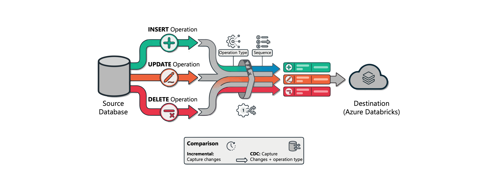

CDC captures **row-level changes and preserves the operation type** (insert/update/delete) — that's what separates it from plain incremental extraction.

**Sources of change records:**

- **Database transaction logs** — e.g. SQL Server's log-based CDC feature.
- **Change data feeds** — Delta tables, Azure Cosmos DB (built-in change tracking with metadata).
- **Periodic snapshots** — compare snapshots when the system has no continuous CDC.

Enables: replicating **deletes** accurately, audit trails, updates that modify key columns.

> ⚠️ CDC needs **sequencing information** (timestamp or sequence number) to handle **out-of-order events** correctly.

### Source file type characteristics

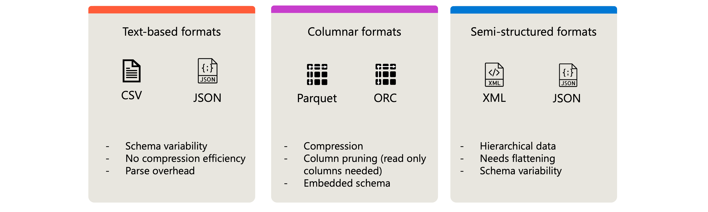

| Family | Formats | Characteristics |
|--------|---------|-----------------|
| **Text-based** | CSV, JSON | Human-readable, widely supported · **schema variability** · poor compression · **parse overhead** per value |
| **Columnar** | Parquet, ORC | Better **compression** · **column pruning** · **embedded schema** — prefer when you control the export |
| **Semi-structured** | XML, nested JSON | Plan schema extraction · decide **flatten vs preserve nesting** · handle varying document structures |

### Data source connection considerations

**Cloud object storage** (ADLS / S3 / GCS) — the most common landing zone:

- Govern paths with **Unity Catalog external locations**.
- Authenticate with **managed identity / service principals / storage credentials**.
- Design folder structures for efficient incremental processing.

**Folder patterns:**

```
# Date-based partitioning (enables partition pruning)
/data/sales/year=2025/month=11/day=28/
/data/sales/year=2025/month=11/day=29/

# Source-based organization
/landing/erp/orders/
/landing/crm/customers/
/landing/web/clickstream/

# Processing state folders
/incoming/     # New files arrive here
/processing/   # Currently being processed
/archive/      # Successfully processed
/failed/       # Failed processing
```

- **File discovery overhead** — flat structures with thousands of files slow listing; partitioned structures reduce enumeration.
- **Auto Loader compatibility** — align folders with how Auto Loader discovers & checkpoints files.
- **Hive-style partitioning (`key=value`)** → partition values are extracted as **columns automatically**, no content parsing.

**Database sources:** network connectivity · credentials in **secrets** (never hardcoded) · **connection pooling** & **query pushdown** · impact on source system performance.

**Streaming sources:** broker connection + auth · **consumer groups** for parallelism · **offset management** · **schema registry**.

**SaaS sources:** API **rate limits** · **pagination** · auth flows (OAuth / API keys / certificates) · available change tracking or webhooks.

### Requirements-driven design framework

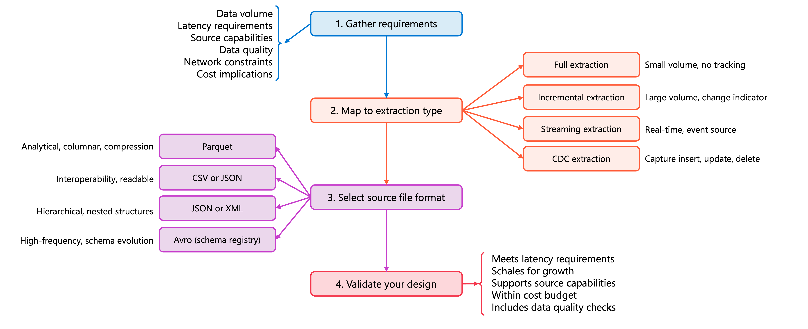

**Step 1 — Gather requirements:**

| Category | Questions |
|----------|-----------|
| **Data volume** | How much exists? How much changes per run? Growth rate? |
| **Latency** | How fresh must data be? Any SLAs? |
| **Source capabilities** | Change tracking / CDC / full only? Which formats can it produce? |
| **Data quality** | How reliable? What validation/cleansing is needed? |
| **Network** | Bandwidth? Firewall/VPN requirements? |
| **Cost** | Compute, storage and transfer costs of each approach? |

**Step 2 — Map requirements to extraction type:**

| If requirements indicate… | Choose |
|---------------------------|--------|
| Small volume (**< 100K rows**), no change tracking, rebuild acceptable | **Full extraction** |
| Large volume, reliable change indicator, hourly/daily freshness | **Incremental extraction** |
| Real-time freshness, source publishes events, streaming infra available | **Streaming extraction** |
| Need **deletes & operation types**, audit trail, transaction-log capture available | **CDC extraction** |

**Step 3 — Select source file format:**

| Scenario | Prefer |
|----------|--------|
| Large analytical datasets, columnar queries, compression | **Parquet** |
| Interoperability, human readability | **CSV / JSON** |
| Hierarchical / nested structures | **JSON / XML** |
| High-frequency streaming with schema evolution | **Avro + schema registry** |

**Step 4 — Validate:** extraction type meets latency · scales to projected growth · source supports the pattern · cost within budget · data-quality checks planned.

> 💡 Document design decisions and the rationale (a **design decision record** per pipeline) — it explains the trade-offs when requirements later change.

---

## 2. Choose a data ingestion tool

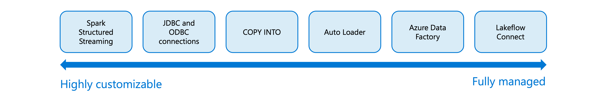

The spectrum runs from **fully managed** (**Lakeflow Connect**) to **fully customizable** (**Spark Structured Streaming**), with **Auto Loader**, **COPY INTO**, **JDBC/ODBC** notebooks and **Azure Data Factory** in between.

### Lakeflow Connect

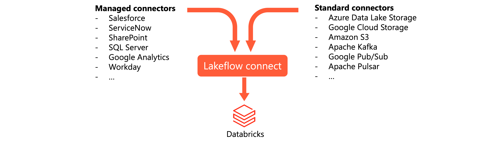

**Managed connectors — three types:**

| Type | Sources | Notes |
|------|---------|-------|
| **SaaS connectors** | Salesforce, ServiceNow, SharePoint, HubSpot, Jira, Dynamics 365, Workday, Zendesk… | Handle auth, incremental reads, **API rate limiting**, schema evolution, retries. Run on **serverless**, write to **streaming tables** in UC |
| **Database connectors** | MySQL, PostgreSQL, SQL Server (**CDC**) | Read **transaction logs** → require an **ingestion gateway** in your network + **staging storage volume** |
| **Community connectors** | Open-source | Extend to sources without a managed connector |

**Standard connectors** — cloud object storage (S3, ADLS, GCS via **Auto Loader**) and message buses (**Kafka, Google Pub/Sub, Apache Pulsar**).

Supports **scheduled** (hourly/daily/weekly) and **on-demand** triggers.

### Query-based connectors

Lightweight alternative to CDC database connectors: query the source table directly using a **cursor column** (monotonically increasing timestamp or integer = high-water mark).

- **No ingestion gateway, no staging storage** required.
- Sources: **Oracle, Teradata, SQL Server, MySQL, MariaDB, PostgreSQL** + all Lakehouse Federation sources.
- **History tracking modes:** **SCD Type 1** (overwrite) · **SCD Type 2** (versioned history) · **Append-only**.

| Choose… | When |
|---------|------|
| **Query-based** | No CDC/binlog infrastructure, but a reliable **cursor column** exists |
| **CDC connector** | You need **every intermediate row state** between runs, or **soft-delete tracking** |

> ⚠️ Trade-off: query-based connectors put **more load on the source tables**; CDC reads the binlog instead.

### Auto Loader

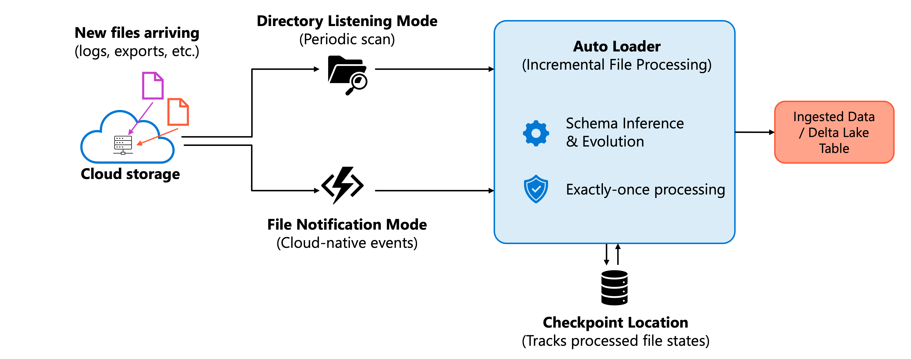

Incremental **file** processing from cloud storage; keeps state in a **checkpoint location**.

- **Discovery modes:** **directory listing** (periodic scan) vs **file notification** (cloud-native events, immediate).
- **Schema inference & evolution** · **exactly-once processing** · scales to **billions of files** (backfills/migrations).
- **Formats:** JSON, CSV, Parquet, Avro, ORC, XML, text, binary.
- Usable with **Lakeflow Spark Declarative Pipelines** (managed) or **Structured Streaming** (more control).

### COPY INTO

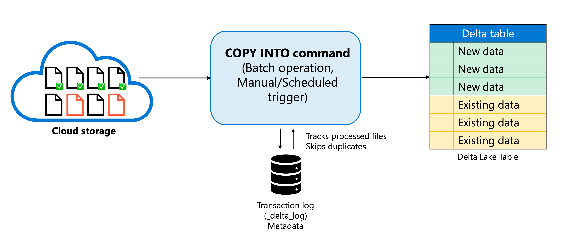

SQL command loading cloud storage → Delta tables as a **batch** operation (not a stream).

- **Idempotent** — tracks processed files, so re-running doesn't duplicate data.
- 📝 The tracking metadata lives in the Delta **transaction log** (`_delta_log`).
- **Choose COPY INTO** for **one-time / large batch loads** (hundreds of GB–TB), SQL-first workflows, simpler config with no streaming infrastructure.
- **Choose Auto Loader** for **ongoing incremental** ingestion at scale (better performance, more robust file discovery).

### Spark Structured Streaming

Sources: **Kafka & Azure Event Hubs** · **Delta Lake change feeds** · **cloud storage via Auto Loader** · socket/custom sources.

Choose it when you need **fine-grained control**: custom **watermarking/windowing**, or sources unsupported by higher-level abstractions.

### JDBC / ODBC connections

Notebook code connecting directly to relational databases; full or incremental loads via **watermark columns**.

Still valuable when: database unsupported by Lakeflow Connect · custom extraction logic needed · maintaining existing pipelines · specific **query pushdown** optimizations.

- Store credentials in **Databricks secrets**; throttle/schedule to protect the source system.
- **On-premises databases** need extra networking: **ExpressRoute/VPN** for direct JDBC, or **ADF with a Self-Hosted Integration Runtime** to land data in cloud storage first.

### Azure Data Factory

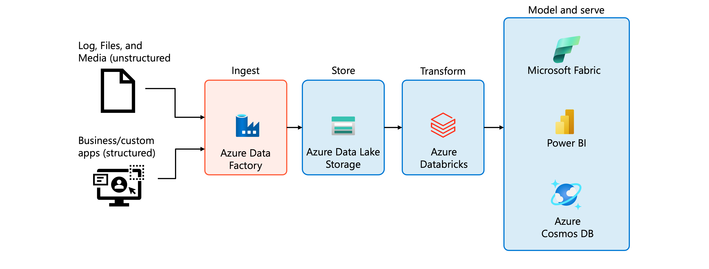

Use ADF for **orchestration** across Azure services, **initial data landing** into cloud storage, and **enterprise integration** where policy mandates it.

> ⚠️ **Avoid ADF for core ETL transformations** — it adds complexity and performs worse than Databricks-native processing. Let ADF move data in; transform inside Databricks.

### Decision framework

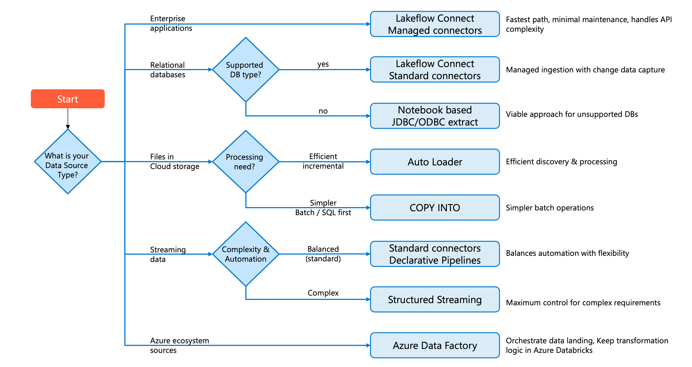

| Source type | Recommended |
|-------------|-------------|
| **Enterprise apps** (Salesforce, ServiceNow, SharePoint) | Lakeflow Connect **managed connectors** |
| **Relational DBs** (supported) | **Database connectors** (CDC, needs gateway) or **query-based connectors** (cursor column) |
| **Relational DBs** (unsupported) | Notebook **JDBC/ODBC** |
| **Files in cloud storage** | **Auto Loader**; `COPY INTO` for simple batch / SQL-first |
| **Message buses** (Kafka, Event Hubs, Pub/Sub) | **Standard connectors** + Declarative Pipelines; **Structured Streaming** for complex needs |
| **Azure ecosystem, multi-service** | **ADF** to land data — transformations stay in Databricks |

> 💡 **Start with the most managed option** that meets requirements; move to customizable approaches only when a requirement can't be met.

---

## 3. Choose a data table format

### File formats vs table formats


- **File format** (Parquet, CSV, JSON) = how data is **physically stored**.
- **Table format** (Delta Lake, Iceberg) = a **metadata layer** on top tracking transactions, schema changes, and file locations.
- Both Delta Lake and Iceberg use **Parquet** underneath — the difference is the metadata layer.

### How Parquet stores data

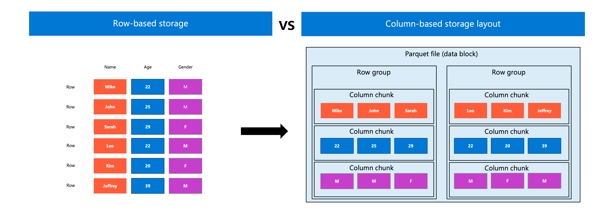

**Columnar**, not row-based. Organized into **row groups** → **column chunks**, each chunk storing **min/max statistics**.

- **Column pruning** — read only referenced columns → much less I/O.
- **Predicate pushdown** — filters checked against statistics first → whole row groups skipped.

### Delta Lake — the default

Default format for all tables in Azure Databricks. Adds a **transaction log** over Parquet:

- **ACID transactions** — concurrent readers/writers, all-or-nothing.
- **Time travel** — query previous versions by timestamp or version; roll back.
- **Schema enforcement & evolution** — validate incoming data; add/modify/rename columns without rewriting.
- **Unified batch & streaming** — same table as batch source, streaming source or sink.

> 📝 **Liquid clustering** and **predictive optimization** work for Delta **and** managed Iceberg tables in UC. **Change data feed is Delta-specific** (relies on its transaction log).

### Apache Iceberg — for cross-platform

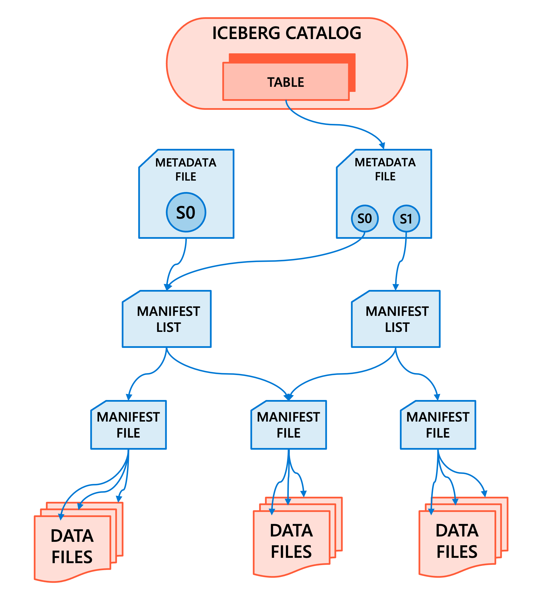

Also ACID + schema evolution + time travel over Parquet. Hierarchical structure supports **manifest pruning**, **file-level statistics**, **hidden partitioning** and **partition evolution**.

**Primary reason to choose it = interoperability** — Snowflake, Amazon Athena, Trino, Spark, Flink. UC can manage Iceberg tables directly (Databricks acts as an **Iceberg catalog** for external engines) or read foreign Iceberg tables from AWS Glue / Snowflake Horizon Catalog.

Choose Iceberg when: multiple engines outside Databricks access the data · the org standardized on Iceberg · integrating with systems that don't support Delta.

### When CSV/JSON still apply

Initial **landing zone** from external systems · human-readable debugging · text-only integrations · tiny volumes. **Convert to Delta tables during ingestion** for persistent analytical storage.

### Decision criteria

| Consideration | Delta Lake | Apache Iceberg | CSV/JSON |
|---------------|-----------|----------------|----------|
| Analytics performance | Excellent | Excellent | Poor |
| ACID transactions | Yes | Yes | No |
| Time travel | Yes | Yes | No |
| Azure Databricks integration | **Deep** | Supported | Basic |
| Cross-platform compatibility | Growing | **Wide** | Universal |
| Recommended for production | **Yes** | Yes (when interop required) | No (landing zone only) |

---

## 4. Design and implement a data partitioning scheme

**Partition pruning** = the engine reads only partitions matching the filter.

### When partitioning applies

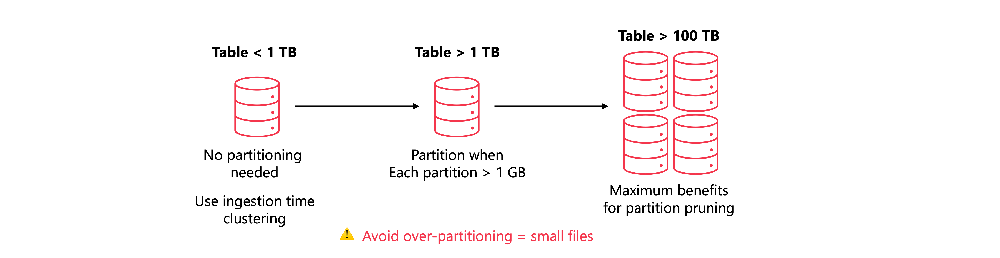

- ⚠️ **Don't partition tables under 1 TB** — metadata overhead + small files outweigh the benefit. Unpartitioned Delta tables get **ingestion time clustering** automatically in recent runtimes.
- Partitioning becomes valuable **above 1 TB**; also enables parallel processing across nodes.
- ⚠️ **Each partition should hold at least 1 GB** of data.

### Choosing partition keys

- **Low cardinality wins** — dates, regions, product categories, status fields. `sale_date` daily → ~365 partitions/year ✅; `sale_timestamp` per second → millions ❌.
- **Align with query patterns** — partition on the columns users filter on most. Only **one partitioning scheme per table**; for very different query patterns build separate **materialized views** or **summary tables**.
- **Consider growth** — year may be too coarse later, hour too fine for moderate volumes. Watch **uneven distribution** → skewed partitions cause processing bottlenecks.

### Implementation

```sql
CREATE TABLE sales.transactions (
    transaction_id STRING,
    customer_id STRING,
    product_id STRING,
    quantity INT,
    unit_price DECIMAL(10,2),
    total_amount DECIMAL(12,2),
    transaction_date DATE
)
PARTITIONED BY (transaction_date);

SELECT product_id, SUM(total_amount) AS revenue
FROM sales.transactions
WHERE transaction_date BETWEEN '2024-01-01' AND '2024-01-31'
GROUP BY product_id;
```

**PySpark:**

```python
df.write.format("delta") \
    .partitionBy("transaction_date") \
    .saveAsTable("sales.transactions")

new_transactions_df.write.format("delta") \
    .mode("append") \
    .partitionBy("transaction_date") \
    .saveAsTable("sales.transactions")
```

**Generated columns** — derive the partition value without storing redundant data:

```sql
CREATE TABLE sales.transactions (
    ...
    transaction_timestamp TIMESTAMP,
    transaction_date DATE GENERATED ALWAYS AS (CAST(transaction_timestamp AS DATE))
)
PARTITIONED BY (transaction_date);
```

> 💡 Delta then **generates partition filters automatically** when you query on the base **timestamp** column — pruning without explicit date filters.

### Common mistakes


- **Over-partitioning → small file problem.** Symptoms: slow queries despite pruning, many small files, long OPTIMIZE times → use coarser granularity (**target ≥ 1 GB/partition**).
- **High-cardinality partition keys fail** (customer ID, transaction ID) → millions of partitions.
- **Changing partitions requires rewriting the entire table** to a new location — plan before loading at scale.
- **Document partition decisions** — expected sizes, benefiting query patterns, constraints.

### Liquid clustering as an alternative

For **high-cardinality columns** or **uncertain query patterns**: adjust strategy **without rewriting data** · automatic maintenance · less overhead. **Recommended for new tables** where partitioning would limit performance.

> ⚠️ **Liquid clustering is not compatible with partitioned tables** — pick one.

---

## 5. Choose a slowly changing dimension (SCD) type

Scenario: customer **Hank Zoeng** moves Seattle → Portland. Three options: **overwrite**, **preserve + new version**, or **track limited history** in extra columns.

### SCD Type 0 — never update

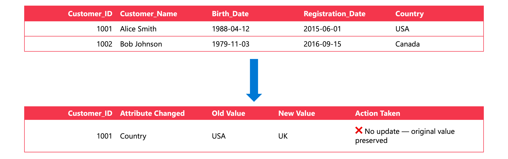

For **true constants** (birth date, original registration date), **audit requirements** (original value preserved exactly), and permanent **reference data**. Rarely used alone — usually per-column within a dimension.

### SCD Type 1 — overwrite

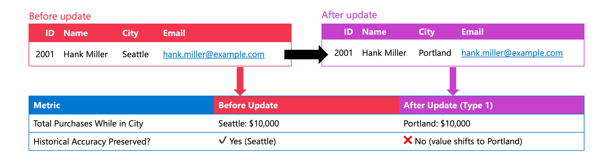

Table always reflects the **current state**. Use for error corrections, contact info (email/phone/address), descriptive text.

> ⚠️ **Type 1 rewrites history:** $10,000 of sales made while Hank lived in Seattle now appear attributed to **Portland** — misrepresenting historical regional performance.

### SCD Type 2 — full history via new rows

New row per version; same **natural key** (aka **business key** / source system key), different **surrogate key**.

| Attribute | Purpose |
|-----------|---------|
| **Surrogate key** | Unique identifier per version |
| **Validity start date** | When the version became effective |
| **Validity end date** | When it expired (often `9999-12-31` for current) |
| **Current flag** | Boolean marking the active version |

| SK | CustomerID | Name | City | ValidFrom | ValidTo | Current |
|----|-----------|------|------|-----------|---------|---------|
| 1001 | C-555 | Hank Zoeng | Seattle | 2020-01-15 | 2024-03-01 | FALSE |
| 1002 | C-555 | Hank Zoeng | Portland | 2024-03-01 | 9999-12-31 | TRUE |

Use when historical accuracy matters (sales by location **at time of purchase**), audit trails (territory/org changes), trend analysis. Costs: more storage, more rows, **fact tables reference specific versions by surrogate key**, higher query complexity.

> 💡 Don't apply Type 2 to every changing attribute — the overhead isn't justified for supplementary data like phone numbers.

### SCD Type 3 — limited history via extra columns

| CustomerID | Name | CurrentCity | PreviousCity |
|-----------|------|-------------|--------------|
| C-555 | Hank Zoeng | Portland | Seattle |

Use for before/after comparisons (reformulations, price tiers, policy updates) or when Type 2 would create too many rows. **Least common** — captures only one prior value, widens tables per tracked attribute, and semantic models struggle with it. Most Type 3 cases are better served by **Type 2**.

### Comparison

| Consideration | Type 0 | Type 1 | Type 2 | Type 3 |
|---------------|--------|--------|--------|--------|
| **History preserved** | Original only | None | **Complete** | Limited |
| **Storage impact** | Minimal | Minimal | High | Moderate |
| **Query complexity** | Simple | Simple | Complex | Moderate |
| **Common use cases** | Constants, audit | Error corrections, contact updates | Sales attribution, territory tracking | Before/after comparisons |
| **Fact table relationship** | Natural key | Natural key | **Surrogate key** | Natural key |

### Mixed strategies

Real dimensions combine types per column — e.g. **Type 0** registration date · **Type 1** email/phone · **Type 2** assigned sales region.

---

## 6. Implement SCD Type 2

### Table structure

```sql
CREATE TABLE sales.customer (
    customer_sk BIGINT GENERATED ALWAYS AS IDENTITY,
    customer_id STRING NOT NULL,
    customer_name STRING,
    email STRING,
    city STRING,
    region STRING,
    valid_from TIMESTAMP NOT NULL,
    valid_to TIMESTAMP NOT NULL,
    is_current BOOLEAN
)
USING DELTA
TBLPROPERTIES (
    delta.enableChangeDataFeed = true
);
```

- **`GENERATED ALWAYS AS IDENTITY`** → auto-incrementing **surrogate key**.
- **Change data feed** lets downstream processes capture incremental changes efficiently.

### Change capture with MERGE

Close the current version, then insert the new one:

```sql
MERGE INTO sales.customer AS target
USING (
    SELECT
        source.customer_id, source.customer_name, source.email,
        source.city, source.region,
        current_timestamp() AS valid_from,
        CAST('9999-12-31' AS TIMESTAMP) AS valid_to,
        true AS is_current
    FROM staging.customers AS source
) AS updates
ON target.customer_id = updates.customer_id AND target.is_current = true
WHEN MATCHED AND (
    target.customer_name <> updates.customer_name OR
    target.email <> updates.email OR
    target.city <> updates.city OR
    target.region <> updates.region
) THEN UPDATE SET
    target.valid_to = current_timestamp(),
    target.is_current = false
WHEN NOT MATCHED THEN INSERT (
    customer_id, customer_name, email, city, region,
    valid_from, valid_to, is_current
) VALUES (
    updates.customer_id, updates.customer_name, updates.email,
    updates.city, updates.region, updates.valid_from,
    updates.valid_to, updates.is_current
);

-- Insert new versions for updated records
INSERT INTO sales.customer
SELECT s.customer_id, s.customer_name, s.email, s.city, s.region,
       current_timestamp() AS valid_from,
       CAST('9999-12-31' AS TIMESTAMP) AS valid_to,
       true AS is_current
FROM staging.customers s
JOIN sales.customer h
    ON s.customer_id = h.customer_id
    AND h.valid_to = current_timestamp()
    AND h.is_current = false;
```

> 💡 **Lakeflow Spark Declarative Pipelines** with the **`AUTO CDC` API** automates SCD Type 2 processing and handles **out-of-order records**.

### Querying history

```sql
-- Point-in-time: exactly one row per customer
SELECT customer_id, customer_name, city
FROM sales.customer
WHERE valid_from <= '2023-06-15 12:00:00'
  AND valid_to   >  '2023-06-15 12:00:00';

-- Full history of one entity
SELECT customer_name, city, valid_from, valid_to
FROM sales.customer
WHERE customer_id = 'C-555'
ORDER BY valid_from;

-- Delta time travel
SELECT * FROM sales.customer TIMESTAMP AS OF '2024-01-15';
SELECT * FROM sales.customer VERSION AS OF 42;
```

> ⚠️ **Time travel defaults to 7 days retention.** For longer historical analysis rely on explicit **ValidFrom/ValidTo** columns, not time travel alone — or extend `delta.logRetentionDuration` + `delta.deletedFileRetentionDuration`.

---

## 7. Design and implement a temporal (history) table

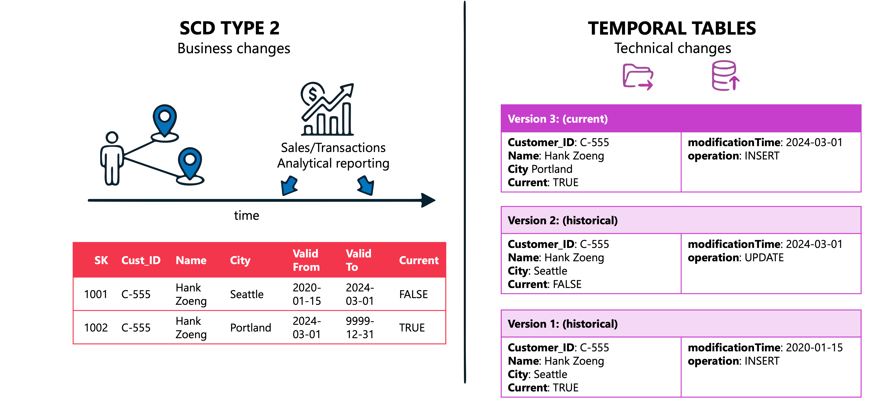

| | **SCD Type 2** | **Temporal (history) tables** |
|---|---------------|-------------------------------|
| **Purpose** | **Business** history for analytical reporting | **Technical** history for operational traceability |
| **Example** | Attribute sales to the customer's location at purchase time | Debug why a load went wrong: what values existed when, which files were processed |
| **Mechanism** | Explicit versions with start/end dates | Automatic row-level change capture |

Use temporal tables to: debug ingestion at specific timestamps · audit all changes for compliance · reproduce point-in-time analyses · track operational metadata (load times, source file).

### Enable change data feed

```sql
CREATE TABLE bronze.sales_transactions (
    transaction_id STRING,
    customer_id STRING,
    amount DECIMAL(10,2),
    transaction_date TIMESTAMP,
    source_file STRING,
    load_timestamp TIMESTAMP
)
USING DELTA
TBLPROPERTIES (delta.enableChangeDataFeed = true);

-- existing table
ALTER TABLE bronze.sales_transactions
SET TBLPROPERTIES (delta.enableChangeDataFeed = true);
```

> ⚠️ CDF is **disabled by default** and only records changes **after** you enable it — **past changes are not captured**. Enable before loading production data.

### Query the change feed

| Column | Description |
|--------|-------------|
| **`_change_type`** | `insert`, `update_preimage`, `update_postimage`, `delete` |
| **`_commit_version`** | Delta log version containing the change |
| **`_commit_timestamp`** | When the change was committed |

```sql
SELECT transaction_id, amount, _change_type, _commit_version, _commit_timestamp
FROM table_changes('bronze.sales_transactions', '2026-01-01', '2026-01-31')
WHERE _change_type IN ('insert', 'update_postimage')
ORDER BY _commit_timestamp;
```

### Time travel for point-in-time queries

```sql
SELECT * FROM bronze.sales_transactions TIMESTAMP AS OF '2026-01-15 14:30:00';
SELECT * FROM bronze.sales_transactions VERSION AS OF 42;
DESCRIBE HISTORY bronze.sales_transactions;
```

> 📝 Defaults: data files retained **7 days**, log files **30 days**.

### Persist change history for long-term auditing

Because time travel has retention limits, stream the change feed into a permanent history table:

```python
(spark.readStream
    .option("readChangeFeed", "true")
    .option("ignoreDeletes", "false")
    .table("bronze.sales_transactions")
    .writeStream
    .option("checkpointLocation", "/checkpoints/sales_history")
    .trigger(availableNow=True)
    .toTable("audit.sales_transactions_history")
)
```

- **`readChangeFeed`** → read row-level change events. **`ignoreDeletes = false`** → deletes are captured too (complete audit trail).
- 💡 Schedule after each data load; **`trigger(availableNow=True)`** processes all available changes as one batch.

### Retention for compliance

```sql
ALTER TABLE bronze.sales_transactions
SET TBLPROPERTIES (
    delta.logRetentionDuration = 'interval 90 days',
    delta.deletedFileRetentionDuration = 'interval 90 days'
);
```

**Both must be set together** — log retention controls history metadata; deleted-file retention controls how long files survive before `VACUUM`.

---

## 8. Choose granularity

**Granularity ("grain")** = the level of detail each **row** represents.

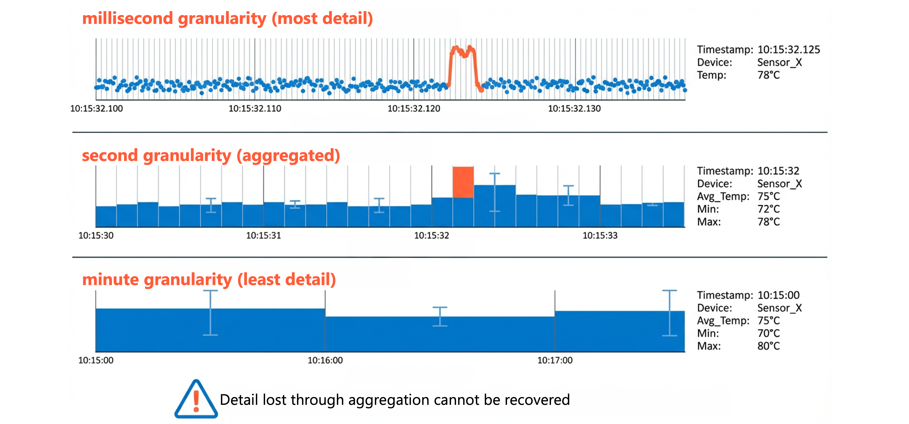

IoT example: **millisecond-level** (one row per reading) → **second aggregate** (avg/min/max per device per second) → **minute aggregate** (least detail, least storage).

> ⚠️ **Once you lose detail through aggregation, you can't recover it.** A minute-average of 75 °C can't tell you which millisecond spiked.

### Factors

- **Business requirements drive the grain** — what's the most detailed analysis required?

| Business requirement | Minimum granularity |
|----------------------|--------------------|
| Detect equipment vibration anomalies in real time | **Millisecond event level** |
| Temperature trends for predictive maintenance | Second aggregate |
| Hourly energy consumption per device | Minute aggregate |
| Daily production metrics by facility | Hourly aggregate |

- **Query patterns** — too fine = unnecessary processing per query; too coarse = can't drill down.
- **Storage & compute costs** — finer grain = more rows; aggregating ms → second/minute can cut row counts **99%+**.
- **Compliance & audit** — regulations may mandate **transaction-level detail** regardless of cost. Document the requirement.

### Fact tables

The grain is determined by the **combination of dimension keys**. "One row per product per customer per store per day" becomes "…per **hour**" if you add an hour-level time key — a large row-count increase.

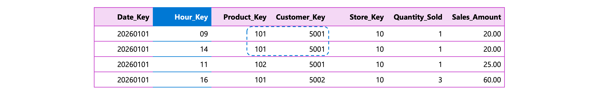

> ⚠️ **Declare the grain explicitly before adding any columns** — e.g. *"one row per sales order line item."* It's the contract guiding every later design decision.

| Grain type | Meaning |
|-----------|---------|
| **Atomic grain** | Most detailed level in the source → **maximum flexibility** (aggregate up, never disaggregate down) |
| **Aggregate grain** | Pre-summarized → **faster common queries**, fewer answerable questions |

Many organizations keep **both**, using **materialized views** to maintain the aggregates automatically.

### Dimension tables

- **One row per customer** — current state (SCD Type 1)
- **One row per customer per version** — SCD Type 2
- **One row per customer per time period** — periodic snapshots

The dimension grain must **align with the fact table grain** (a fact referencing customer version 5 must find that version).

### Trade-offs

| Consideration | Fine granularity | Coarse granularity |
|---------------|-----------------|--------------------|
| **Analytical flexibility** | High — detailed questions | Low — aggregate only |
| **Storage costs** | Higher | Lower |
| **Query performance** | Slower for aggregate queries | Faster for common patterns |
| **Historical analysis** | Point-in-time supported | May lose historical detail |
| **Compliance support** | Better for audit | May not meet regulations |

> 💡 When uncertain, **start finer** — you can always build aggregates later, but you can't recover detail you never captured (budget permitting).

---

## 9. Managed vs external tables

### Managed tables

Unity Catalog controls **metadata *and* data files**; data lands in the managed storage location of the schema/catalog/metastore. Exclusive features:

- **Predictive optimization** (automatic compaction & vacuum)
- **Automatic liquid clustering** (keys chosen & updated from query patterns)
- **Metadata caching** (in-memory, faster queries)
- **Automatic file cleanup** — files removed **8 days** after dropping the table

Always **Delta Lake or Apache Iceberg** format.

### External tables

UC manages **metadata only**; you own the files at a `LOCATION` pointing to a registered **external location**. Dropping the table leaves the **files intact**. Supports more formats.

### Comparison

| Characteristic | Managed tables | External tables |
|----------------|---------------|-----------------|
| **Data storage location** | UC managed location | User-specified external location |
| **Metadata management** | Unity Catalog | Unity Catalog |
| **Data file management** | **Unity Catalog** | **User managed** |
| **Supported formats** | Delta Lake, Apache Iceberg | Delta, CSV, JSON, Avro, Parquet, ORC, text |
| **Automatic optimization** | **Yes** (predictive optimization) | No |
| **Behavior on `DROP TABLE`** | Files deleted after **8 days** | Files **remain** in storage |
| **`UNDROP TABLE` support** | **Yes** (within 8 days) | No |

### Decision criteria

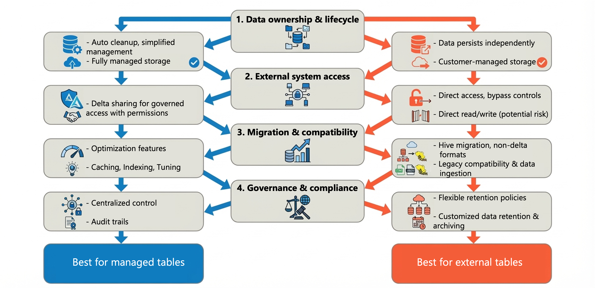

- **Ownership & lifecycle** — Databricks should control cleanup → **managed**. Data must outlive the workspace/table definition → **external**.
- **External system access** — other tools reading/writing files directly → external, but ⚠️ direct access **bypasses UC access controls and auditing**. Prefer **Delta Sharing** for governed cross-region/partner sharing.
- **Migration & compatibility** — external tables let you register existing Hive metastore data **without moving files**; convert to managed later. Non-Delta/non-Iceberg formats → external is the **only** option.
- **Governance & compliance** — managed = stronger centralized control; external = flexibility for policies defined outside Databricks.

> ⚠️ **Don't register the same table as external in multiple metastores** — changes don't propagate → consistency issues.

**Best practices:** Databricks recommends **managed tables for most use cases**. With external tables: limit external access to **reads** (writes through Databricks) · one external location **per schema** · plan migration to managed when the original reason expires.

---

## 10. Design and implement a clustering strategy

### Data skipping fundamentals

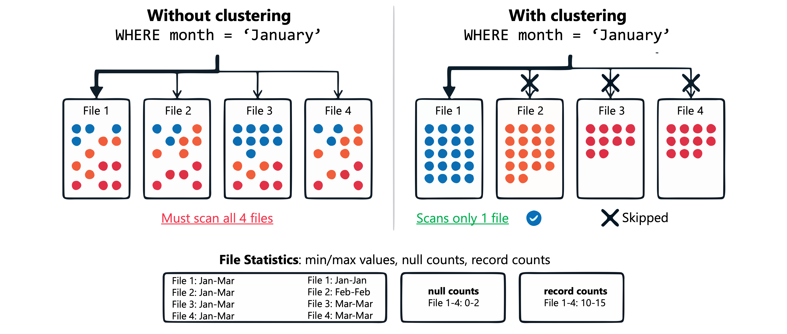

Delta collects per-file statistics (**min/max, null counts, record counts**). Queries check the stats first and skip files that can't match. **Effectiveness depends on related records being stored together** — that's exactly what clustering fixes.

### Liquid clustering (recommended for new tables)

Also in **Public Preview for managed Iceberg tables** in UC (**DBR 16.4 LTS+**). Key advantage over partitioning: **change the strategy without rewriting data**.

```sql
CREATE TABLE sales.transactions (
    transaction_id STRING,
    customer_id STRING,
    product_category STRING,
    region STRING,
    transaction_date DATE,
    amount DECIMAL(12,2)
)
CLUSTER BY (region, transaction_date);

OPTIMIZE sales.transactions;
```

- **Up to 4 clustering keys**; choose frequently filtered columns. **Key order matters less** — all keys optimize simultaneously.
- **Incremental** — each `OPTIMIZE` clusters only what needs reorganizing. Schedule **every 1–2 hours** for tables with frequent inserts/updates.
- 📝 For managed **Iceberg** tables in UC, a `PARTITION BY` clause is interpreted as **liquid clustering keys** — there's no separate Iceberg partition behaviour.

**Change keys later:**

```sql
ALTER TABLE sales.transactions CLUSTER BY (customer_id, transaction_date);
OPTIMIZE sales.transactions FULL;   -- re-cluster existing data
```

**Automatic key selection** (requires **predictive optimization**):

```sql
CREATE TABLE sales.orders CLUSTER BY AUTO;
ALTER TABLE sales.transactions CLUSTER BY AUTO;
```

### Z-ordering (legacy)

```sql
OPTIMIZE sales.legacy_transactions ZORDER BY (region, transaction_date);
```

| Aspect | **Liquid clustering** | **Z-ordering** |
|--------|----------------------|----------------|
| **Key flexibility** | Change keys **without rewrite** | Changing keys requires **full rewrite** |
| **Write performance** | Clusters **on write** for eligible operations | Applied **only during OPTIMIZE** |
| **Concurrent writes** | **Row-level** concurrency | Transaction-level concurrency |
| **Compatibility** | **DBR 13.3 LTS+** | All runtimes |

**Migrate:** `ALTER TABLE ... CLUSTER BY (...)` on the **unpartitioned** table, then `OPTIMIZE ... FULL`.

> ⚠️ **Liquid clustering is not compatible with partitioning** — for partitioned tables, weigh whether migrating to an unpartitioned structure is worth it.

### Deletion vectors

Default behaviour rewrites the **entire Parquet file** for a single row change. With deletion vectors, Delta **marks rows deleted in a separate metadata file**; reads merge the file + vector on the fly.

- **Enabled by default** for new tables on **DBR 14.1+**:

```sql
ALTER TABLE sales.transactions
SET TBLPROPERTIES ('delta.enableDeletionVectors' = true);
```

- Physically applied when files are rewritten: **`OPTIMIZE`**, **auto-compaction**, or **`REORG TABLE ... APPLY (PURGE)`**.
- **Compliance (physical removal):**

```sql
REORG TABLE sales.transactions APPLY (PURGE);
VACUUM sales.transactions;
```

- Also enables **row-level concurrency** — concurrent transactions modifying different rows without conflict.

---

## 11. Summary

- **Ingestion:** match extraction type (full / incremental / streaming / CDC) to source capability + latency; design folder layouts for efficient discovery.
- **Tools:** Lakeflow Connect (managed & query-based connectors) → Auto Loader → COPY INTO → Structured Streaming → JDBC/ODBC; ADF for orchestration & landing only.
- **Formats:** Delta Lake by default; **Iceberg for cross-platform interoperability**; CSV/JSON as landing zones only.
- **Physical layout:** partition only **> 1 TB** with **≥ 1 GB partitions** and low-cardinality keys; otherwise **liquid clustering** (incompatible with partitioning).
- **History:** SCD Types 0/1/2/3 for business history (Type 2 = surrogate key + validity dates + current flag); **temporal tables + change data feed** for technical/audit history.
- **Granularity:** declare the fact grain explicitly; **atomic = flexible**, aggregate = fast; you can't recover lost detail.
- **Storage:** **managed tables** recommended (predictive optimization, auto clustering, UNDROP within 8 days); external only when files must live independently or use other formats.

---

## 🧠 Quick revision cheat-sheet

| Concept | Remember this |
|---------|---------------|
| **Full extraction** | Entire dataset each run; no change tracking, small volumes (< 100K rows) |
| **Incremental** | Needs change indicator + state management + late-arrival handling |
| **Streaming** | Always-on infra; seconds/minutes freshness |
| **CDC** | Preserves **operation type** (insert/update/delete); needs **sequencing** column |
| **Hive-style folders** | `key=value` → partition values become columns automatically |
| **Lakeflow Connect** | SaaS / Database (CDC, needs **gateway + staging volume**) / Community connectors; serverless → streaming tables |
| **Query-based connectors** | **Cursor column** high-water mark; no gateway/staging; SCD1 / SCD2 / append-only; more load on source |
| **Auto Loader** | Checkpoint-tracked incremental files; **directory listing vs file notification**; exactly-once; billions of files |
| **COPY INTO** | Batch, **idempotent** (tracked in `_delta_log`); best for **one-time large loads** |
| **ADF** | Orchestration + landing only — **not** for core transformations |
| **File vs table format** | File = physical (Parquet); table = metadata layer (Delta/Iceberg) — both use Parquet |
| **Parquet** | Row groups → column chunks + **min/max stats** → **column pruning** + **predicate pushdown** |
| **Delta vs Iceberg** | Delta = default, deepest integration, **change data feed is Delta-only**; Iceberg = **interoperability** (Snowflake, Athena, Trino, Flink) |
| **Partition threshold** | **Don't partition < 1 TB**; each partition **≥ 1 GB** |
| **Partition keys** | **Low cardinality**, match query filters, one scheme per table |
| **Changing partitions** | Requires **rewriting the whole table** |
| **Generated column** | `GENERATED ALWAYS AS (CAST(ts AS DATE))` → pruning from timestamp filters |
| **SCD 0 / 1 / 2 / 3** | Never change / overwrite / new row per version / previous-value column |
| **SCD Type 2 columns** | Surrogate key + ValidFrom + ValidTo (`9999-12-31`) + current flag; facts join on **surrogate key** |
| **SCD Type 1 risk** | Rewrites historical attribution (Seattle sales become Portland sales) |
| **SCD2 implementation** | `GENERATED ALWAYS AS IDENTITY` + `MERGE` (close old row, insert new); `AUTO CDC` API automates it |
| **Time travel retention** | **7 days** by default — use explicit ValidFrom/ValidTo for longer history |
| **Change data feed** | `delta.enableChangeDataFeed = true`; **only captures changes after enabling** |
| **CDF columns** | `_change_type` (insert/update_preimage/update_postimage/delete), `_commit_version`, `_commit_timestamp`; read via `table_changes()` |
| **Persist history** | `readChangeFeed=true` + `ignoreDeletes=false` + `trigger(availableNow=True)` → audit table |
| **Retention defaults** | Data files **7 days**, log **30 days**; set **both** properties together |
| **Grain** | Declare **before** adding columns; **atomic = flexible**, aggregate = fast; lost detail is unrecoverable |
| **Dimension grain** | Must align with fact grain (version referenced must exist) |
| **Managed tables** | UC owns files; predictive optimization, auto liquid clustering, metadata caching; **drop → deleted after 8 days**, **UNDROP** within 8 days |
| **External tables** | UC owns metadata only; files remain on drop; more formats; **bypasses UC controls** on direct access |
| **Data skipping** | Per-file min/max, null & record counts → skip non-matching files |
| **Liquid clustering** | `CLUSTER BY (...)` **max 4 keys**, key order not critical, change keys without rewrite, `OPTIMIZE ... FULL` to re-cluster; **DBR 13.3 LTS+**; **incompatible with partitioning** |
| **CLUSTER BY AUTO** | Automatic key selection; **requires predictive optimization** |
| **Z-order** | `OPTIMIZE ... ZORDER BY (...)`; key change = full rewrite; transaction-level concurrency |
| **Deletion vectors** | Default on **DBR 14.1+**; mark instead of rewrite; purge via `REORG ... APPLY (PURGE)` + `VACUUM`; enables **row-level concurrency** |
