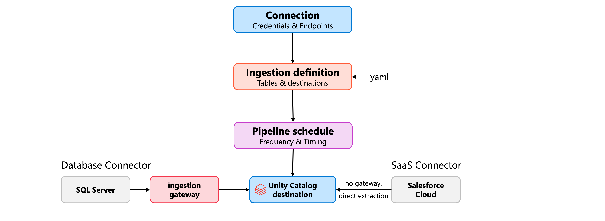
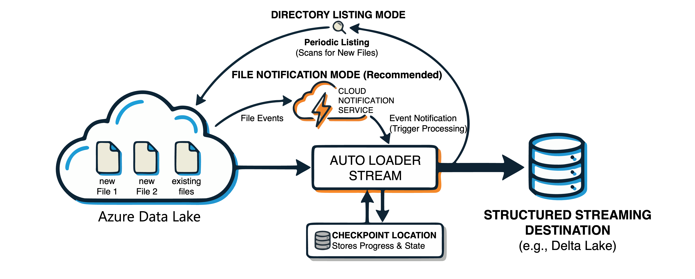
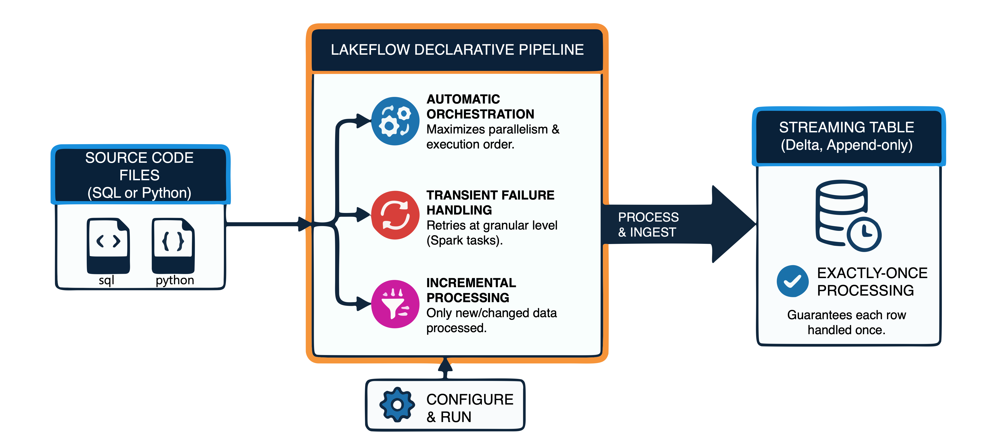

# Ingest Data into Unity Catalog

> **Module:** Ingest data into Unity Catalog (11 Units · Intermediate · Data Engineer)
> **Source:** [Microsoft Learn](https://learn.microsoft.com/en-gb/training/modules/ingest-data-into-unity-catalog/)
> **In one line:** Seven ways to land data in UC — **Lakeflow Connect**, **notebooks**, **SQL commands**, **AUTO CDC**, **Structured Streaming**, **Auto Loader**, and **Declarative Pipelines**.

---

## 📌 Learning objectives

By the end of this module you should be able to:

- Configure **Lakeflow Connect** to ingest from external sources using managed connectors
- Ingest **batch and streaming** data in notebooks with DataFrames & Structured Streaming
- Use SQL commands (**COPY INTO**, **CTAS**) for file-based ingestion
- Process **CDC feeds** with the **AUTO CDC API**
- Configure **Spark Structured Streaming** for Kafka & Event Hubs
- Set up **Auto Loader** with schema inference & evolution
- Orchestrate ingestion with **Lakeflow Spark Declarative Pipelines**

**Prerequisites:** Azure Databricks & Unity Catalog basics · SQL & Python · batch/streaming concepts.

---

## 1. Ingest data with Lakeflow Connect

### Connector types

| Connector type | Description |
|----------------|-------------|
| **SaaS connectors** | Salesforce, HubSpot, Jira, Workday… — extraction directly through the **source API** |
| **Database connectors (CDC)** | MySQL, PostgreSQL, SQL Server — continuously extract changes from the source **`binlog`** via an **ingestion gateway** |
| **Query-based connectors** | Query the source on a schedule using a **cursor column** (monotonically increasing timestamp/integer) — **no gateway, no staging storage** |

### Ingestion pipelines



Three core components:

- **Connection** — credentials + endpoint for the source; created once, **reused across pipelines**.
- **Ingestion definition** — which tables/objects to extract and their destination catalog/schema.
- **Pipeline schedule** — when and how often data flows.

> 📝 **Database connectors also create an ingestion gateway** that continuously extracts change data and stages it. **SaaS connectors need no gateway** — the connector extracts directly.

### Configuring a pipeline

Create via **UI**, **Asset Bundles**, **notebooks** or the **CLI**. UI path: workspace → **Data Ingestion** → source (e.g. SQL Server) → create gateway → pick connection → choose tables → set destination catalog/schema (data lands as **streaming tables**).

```yaml
resources:
  pipelines:
    pipeline_sqlserver:
      name: customer-orders-pipeline
      catalog: sales
      schema: bronze
      ingestion_definition:
        ingestion_gateway_id: ${resources.pipelines.gateway.id}
        objects:
          - table:
              source_schema: dbo
              source_table: orders
              destination_catalog: sales
              destination_schema: bronze
```

### Extraction behaviour & SCD type

Choice between **snapshot** and **incremental**. With CDC enabled at the source, the gateway captures inserts/updates/deletes incrementally → later runs process **only changed records**.

| SCD type | Behaviour |
|----------|-----------|
| **SCD type 1** | Overwrites existing records — destination always reflects **current state** |
| **SCD type 2** | Marks the previous version inactive and adds the new version → adds **`__START_AT`** and **`__END_AT`** columns |

```yaml
table_configuration:
  scd_type: SCD_TYPE_2
  sequence_by: last_modified
```

### Column selection & refresh

```yaml
table_configuration:
  include_columns:
    - customer_id
    - order_date
    - total_amount
```

> ⚠️ With **`include_columns`**, newly added source columns **won't** appear in the destination. With **`exclude_columns`**, new columns **are** included by default.

- **Full refresh** — clears the destination and reloads everything; used when incremental processing can't recover from schema changes/inconsistencies. Existing data is kept until the new snapshot completes (minimal downtime).
- **Full refresh window** — schedules those operations away from peak hours.

### Multiple destinations

One pipeline can write to **multiple catalogs/schemas** (isolated copies per team); the same source table can even go to the same schema twice using a custom `destination_table` name.

```yaml
objects:
  - table:
      source_table: customers
      destination_catalog: sales
      destination_schema: analytics
  - table:
      source_table: customers
      destination_catalog: marketing
      destination_schema: campaigns
```

Lakeflow Connect automatically creates **jobs** per schedule, so you can append processing tasks after ingestion.

---

## 2. Ingest data with notebooks

### Batch with DataFrames

```python
df = (spark.read
    .format("csv")
    .option("header", "true")
    .option("inferSchema", "true")
    .load("/Volumes/catalog/schema/volume/data.csv"))
```

**Other formats:**

```python
df_json = spark.read.format("json").load("/path/to/data.json")
df_parquet = spark.read.format("parquet").load("/path/to/data.parquet")

df_xml = (spark.read
    .format("xml")
    .option("rowTag", "record")      # which element = one row
    .load("/path/to/data.xml"))
```

> 📝 **`rowTag`** names the XML element that maps to a row — with `<data><record>…</record></data>`, `rowTag = "record"`.

### JDBC to external databases

```python
df_jdbc = (spark.read
    .format("jdbc")
    .option("url", "jdbc:sqlserver://server.database.windows.net:1433;database=mydb")
    .option("dbtable", "schema.tablename")
    .option("user", dbutils.secrets.get(scope="jdbc", key="username"))
    .option("password", dbutils.secrets.get(scope="jdbc", key="password"))
    .load())
```

**Query pushdown** — put a subquery in `dbtable`:

```python
pushdown_query = "(SELECT id, name, amount FROM orders WHERE order_date > '2024-01-01') AS filtered_orders"
df = spark.read.format("jdbc").option("dbtable", pushdown_query).load()
```

### Writing to Unity Catalog

```python
df.write.mode("overwrite").saveAsTable("catalog.schema.table_name")
```

| Mode | Behaviour |
|------|-----------|
| **`overwrite`** | Replaces table contents entirely |
| **`append`** | Adds rows |
| **`ignore`** | Does nothing if the table exists |
| **`error`** | Throws if the table exists (**default**) |

### Streaming with Structured Streaming

```python
df_stream = (spark.readStream
    .format("kafka")
    .option("kafka.bootstrap.servers", "broker:9092")
    .option("subscribe", "topic-name")
    .option("startingOffsets", "latest")     # or "earliest"
    .load())
```

> 📝 Once a **checkpoint location** is configured on the write stream, later runs resume from the last processed offset and **`startingOffsets` is ignored**.

**File-based streams:**

```python
df_file_stream = (spark.readStream
    .format("csv")
    .option("header", "true")
    .schema(defined_schema)          # explicit schema required
    .load("/Volumes/catalog/schema/volume/incoming/"))
```

> ⚠️ **Schema inference isn't supported for streaming sources** — it would require reading the whole dataset. Define the schema explicitly.

**Writing streams:**

```python
(df_stream
    .writeStream
    .format("delta")
    .outputMode("append")
    .option("checkpointLocation", "/checkpoints/my-stream")
    .toTable("catalog.schema.streaming_table"))
```

| Output mode | Writes |
|-------------|--------|
| **`append`** | Only new rows (default for most operations) |
| **`update`** | Changed rows |
| **`complete`** | All rows rewritten (used with aggregations) |

### Semi-structured data with VARIANT

```python
from pyspark.sql.functions import parse_json, variant_get, col

df = spark.read.text("/path/to/data.json")
df_variant = df.select(parse_json(col("value")).alias("data"))

df_variant.select(variant_get(col("data"), "$.customer.name", "string")).display()
```

Works well when the JSON schema **varies between records or evolves** over time.

---

## 3. Ingest data with SQL methods

### CTAS — create table as select

```sql
CREATE TABLE catalog.schema.customers AS
SELECT
    customer_id,
    UPPER(customer_name) AS customer_name,
    email,
    created_date
FROM external_staging.raw_customers
WHERE customer_status = 'active';
```

Schema is **derived from the query**; Delta format by default. Read files via the **`read_files`** table-valued function:

```sql
CREATE TABLE catalog.schema.sales_data AS
SELECT * FROM read_files(
    '/Volumes/catalog/schema/volume/sales/*.parquet',
    format => 'parquet'
);
```

> ⚠️ CTAS **fails if the table exists**. `IF NOT EXISTS` skips execution entirely rather than updating the table.

### CREATE OR REPLACE TABLE — full refresh

```sql
CREATE OR REPLACE TABLE catalog.schema.daily_metrics AS
SELECT
    report_date,
    SUM(revenue) AS total_revenue,
    COUNT(DISTINCT customer_id) AS unique_customers
FROM catalog.schema.transactions
WHERE report_date >= CURRENT_DATE - INTERVAL 30 DAYS
GROUP BY report_date;
```

**Preserves table history, granted privileges, row filters and column masks** — unlike drop + recreate. Downstream users need no reconfiguration.

> ⚠️ It's a **full replacement** — for incremental adds use `COPY INTO`.

### COPY INTO — incremental file loading

```sql
CREATE TABLE IF NOT EXISTS catalog.schema.events (
    event_id STRING,
    event_type STRING,
    event_timestamp TIMESTAMP,
    payload STRING
);

COPY INTO catalog.schema.events
FROM '/Volumes/catalog/schema/volume/events/'
FILEFORMAT = JSON
FORMAT_OPTIONS ('multiline' = 'true');
```

- **Target table must already exist**; appends and is **idempotent** (already-loaded files are skipped).

**File selection:**

```sql
COPY INTO catalog.schema.orders
FROM '/Volumes/catalog/schema/volume/orders/'
FILEFORMAT = PARQUET
PATTERN = 'orders_2024*.parquet';

COPY INTO catalog.schema.orders
FROM '/Volumes/catalog/schema/volume/orders/'
FILEFORMAT = PARQUET
FILES = ('orders_001.parquet', 'orders_002.parquet');
```

**Schema evolution & validation:**

```sql
COPY INTO catalog.schema.sensor_data
FROM '/Volumes/catalog/schema/volume/sensors/'
FILEFORMAT = CSV
FORMAT_OPTIONS ('header' = 'true', 'inferSchema' = 'true')
COPY_OPTIONS ('mergeSchema' = 'true');

-- validate without loading
COPY INTO catalog.schema.sensor_data
FROM '/Volumes/catalog/schema/volume/sensors/'
FILEFORMAT = CSV
VALIDATE ALL;
```

`VALIDATE` checks parsing, schema match, nullability and check constraints.

### Choosing a method

| Method | Best for | Behaviour |
|--------|----------|-----------|
| **CTAS** | Initial loads, one-time migrations, tables from queries | Creates a new table; **fails if it exists** |
| **CREATE OR REPLACE** | Periodic full refreshes, staging tables | Replaces the whole table; **preserves permissions** |
| **COPY INTO** | Ongoing file ingestion, incremental loads | **Appends**; skips already-loaded files |

> ⚠️ `COPY INTO` suits **thousands** of files over time. For **millions**, use **Auto Loader** — more efficient discovery, richer schema evolution, no directory-listing overhead. Databricks also recommends **streaming tables backed by Auto Loader** as the long-term SQL file-ingestion path.

---

## 4. Ingest data with a CDC feed


A CDC feed record contains:

- **Data columns** — the field values
- **Operation type** — INSERT / UPDATE / DELETE
- **Sequence column** — timestamp or sequence number establishing order

**Advantages:** reduced latency (minutes not hours) · lower cost (fewer records) · **minimal source impact** (reading change logs beats full table scans).

### AUTO CDC API (Python)

**SCD Type 1** — current version only:

```python
from pyspark import pipelines as dp
from pyspark.sql.functions import col, expr

@dp.temporary_view
def employees_cdf():
    return spark.readStream.table("bronze.employee_changes")

dp.create_streaming_table("employees")

dp.create_auto_cdc_flow(
    target="employees",
    source="employees_cdf",
    keys=["employee_id"],
    sequence_by=col("sequence_num"),
    apply_as_deletes=expr("operation = 'DELETE'"),
    except_column_list=["operation", "sequence_num"],
    stored_as_scd_type=1
)
```

**SCD Type 2** — full history (adds **`__START_AT`** / **`__END_AT`**):

```python
dp.create_streaming_table("employees_history")

dp.create_auto_cdc_flow(
    target="employees_history",
    source="employees_cdf",
    keys=["employee_id"],
    sequence_by=col("sequence_num"),
    apply_as_deletes=expr("operation = 'DELETE'"),
    except_column_list=["operation", "sequence_num"],
    stored_as_scd_type=2
)
```

> 📝 **Partial update records** (only changed columns) would overwrite unchanged columns with nulls. Use **`ignore_null_updates`** (Python) / **`IGNORE NULL UPDATES`** (SQL) so nulls in the incoming record leave existing values intact.

### AUTO CDC in SQL

```sql
CREATE OR REFRESH STREAMING TABLE employees;

CREATE FLOW employees_cdc_flow
AS AUTO CDC INTO employees
FROM stream(bronze.employee_changes)
KEYS (employee_id)
APPLY AS DELETE WHEN operation = 'DELETE'
SEQUENCE BY sequence_num
COLUMNS * EXCEPT (operation, sequence_num)
STORED AS SCD TYPE 1;
```

**Limit which columns create history** with `TRACK HISTORY ON`:

```sql
CREATE FLOW employees_history_flow
AS AUTO CDC INTO employees_history
FROM stream(bronze.employee_changes)
KEYS (employee_id)
SEQUENCE BY sequence_num
COLUMNS * EXCEPT (operation, sequence_num)
STORED AS SCD TYPE 2
TRACK HISTORY ON * EXCEPT (last_login);
```

→ Changes to `last_login` update in place; changes to other columns create **new historical versions**.

### Out-of-order events


The API compares **sequence values**: if a newer update has already been applied and an older one arrives late, the **late record is ignored** — no hand-written merge logic comparing timestamps/versions.

---

## 5. Ingest data with Spark Structured Streaming

Data is treated as an **unbounded table**; **checkpoints** track processed records so restarts resume without reprocessing or data loss.

**Three steps:** configure source (`spark.readStream`) → apply transformations → write to sink (`writeStream` + checkpoint).

### Kafka & Event Hubs (Kafka-compatible)

```python
df_stream = (spark.readStream
    .format("kafka")
    .option("kafka.bootstrap.servers", "broker-server:9092")
    .option("subscribe", "sensor-readings")
    .option("startingOffsets", "latest")
    .load())
```

**Event Hubs** via its Kafka endpoint — the difference is **SASL authentication**:

```python
kafka_options = {
    "kafka.bootstrap.servers": f"{eh_namespace}.servicebus.windows.net:9093",
    "subscribe": eh_name,
    "kafka.sasl.mechanism": "PLAIN",
    "kafka.security.protocol": "SASL_SSL",
    "kafka.sasl.jaas.config": f'kafkashaded.org.apache.kafka.common.security.plain.PlainLoginModule required username="$ConnectionString" password="{connection_string}";'
}

df_stream = spark.readStream.format("kafka").options(**kafka_options).load()
```

**Kafka schema:** `key`, `value`, `topic`, `partition`, `offset`, `timestamp`. `key`/`value` are **binary** → cast and parse:

```python
from pyspark.sql.functions import col, from_json
from pyspark.sql.types import StructType, StringType, DoubleType

schema = StructType() \
    .add("device_id", StringType()) \
    .add("temperature", DoubleType()) \
    .add("timestamp", StringType())

parsed_df = (df_stream
    .select(col("value").cast("string").alias("json_value"))
    .select(from_json(col("json_value"), schema).alias("data"))
    .select("data.*"))
```

### Native Event Hubs connector

```python
events = (spark.readStream
    .format("eventhubs")
    .option("eventhubs.connectionString", connection_string)
    .option("eventhubs.consumerGroup", "$Default")
    .option("eventhubs.startingPosition", '{"offset": "-1", "seqNo": -1, "enqueuedTime": null, "isInclusive": true}')
    .load())

payload = events.selectExpr("CAST(body AS STRING) AS payload")
```

> ⚠️ Different schema from the Kafka interface — the payload is in **`body`** (not `value`), plus Event Hubs metadata columns. `startingPosition` **`-1`** = latest.

### Checkpoints

```python
query = (parsed_df.writeStream
    .format("delta")
    .option("checkpointLocation", "/checkpoints/sensor-ingestion")
    .toTable("catalog.schema.sensor_readings"))
```

> ⚠️ **Every streaming query needs its own unique checkpoint location** — sharing checkpoints between queries causes processing errors. Store them in durable storage (ADLS) with backup/retention policies.

### Triggers

| Trigger | Behaviour |
|---------|-----------|
| **Default (none)** | Processes the next batch as soon as the previous one completes |
| **`processingTime="10 seconds"`** | Fixed intervals |
| **`availableNow=True`** | Processes **all available data, then stops** |
| **`once=True`** | One micro-batch then stops (**deprecated**) |

```python
(parsed_df.writeStream
    .format("delta")
    .option("checkpointLocation", checkpoint_path)
    .trigger(availableNow=True)
    .toTable("catalog.schema.table_name"))
```

> 💡 `availableNow` + **Databricks Jobs** = streaming efficiency (only new data) with batch predictability.

### Monitoring

Spark UI → **Structured Streaming** tab, or programmatically:

```python
print(query.isActive)
print(query.status)
print(query.recentProgress)

try:
    query.awaitTermination()
except Exception as e:
    print(f"Stream failed: {e}")
```

Streaming metrics include **lag** information — whether processing keeps pace with arrivals.

---

## 6. Ingest data with Auto Loader



A **Structured Streaming source** that monitors cloud storage and incrementally processes new files with **exactly-once** guarantees.

| Detection mode | How |
|----------------|-----|
| **Directory listing** | Periodically lists the input directory; no extra configuration |
| **File notification** | Cloud notification services push events on arrival — **more efficient at scale** |

> 💡 For most production workloads Databricks recommends **file notification mode with file events enabled** on the UC external location → lower latency and cloud API costs.

### Configuration

```python
base_path = "abfss://container@storage.dfs.core.windows.net/autoloader/orders"
schema_path = f"{base_path}/schema"
checkpoint_path = f"{base_path}/checkpoint"

(spark.readStream
  .format("cloudFiles")
  .option("cloudFiles.format", "json")
  .option("cloudFiles.schemaLocation", schema_path)
  .load("abfss://container@storage.dfs.core.windows.net/incoming/orders/")
  .writeStream
  .option("checkpointLocation", checkpoint_path)
  .trigger(availableNow=True)
  .toTable("sales.bronze.orders"))
```

- **Formats:** JSON, CSV, Parquet, Avro, ORC, XML, text, binary.
- **`cloudFiles.schemaLocation`** stores the inferred schema. It *can* equal the checkpoint location, but keeping them **separate lets you reset a stream without losing the schema**.

### SQL syntax with read_files

```sql
SELECT * FROM read_files(
  'abfss://container@storage.dfs.core.windows.net/incoming/orders/',
  format => 'json',
  schemaHints => 'order_id INT, amount DECIMAL(10,2)'
);

CREATE OR REFRESH STREAMING TABLE bronze_orders
AS SELECT * FROM STREAM read_files(
  'abfss://container@storage.dfs.core.windows.net/incoming/orders/',
  format => 'json'
);
```

> 📝 With **streaming tables in Declarative Pipelines**, Auto Loader capabilities turn on automatically and the pipeline manages **checkpointing & schema evolution**. 💡 Keep checkpoint/schema locations in a **managed storage location** for consistent governance.

### Schema inference & evolution

- JSON/CSV columns are inferred as **strings by default** (conservative, avoids type-mismatch data loss). Enable type detection with **`cloudFiles.inferColumnTypes = true`**.

| `cloudFiles.schemaEvolutionMode` | Behaviour |
|----------------------------------|-----------|
| **`addNewColumns`** | Stream **fails**; new columns added to schema; continues on restart. **Default when no schema is provided** |
| **`addNewColumnsWithTypeWidening`** | As above **+ widens supported type changes** (e.g. INT → LONG); unsupported changes land in `_rescued_data`. **Requires DBR 16.4+** |
| **`rescue`** | Schema never evolves, **stream does not fail**; new columns captured in `_rescued_data` |
| **`failOnNewColumns`** | Stream fails and won't restart until the schema is updated or the offending file removed |
| **`none`** | New columns ignored, no rescue unless `rescuedDataColumn` is set. **Default when a schema is provided** |

**Rescued data column** — `_rescued_data` captures anything not matching the schema (type mismatches, unexpected columns); added automatically when inferring. Rename with `.option("rescuedDataColumn", "my_rescued_data")`.

**Schema hints** override inferred types:

```python
.option("cloudFiles.schemaHints", "order_date DATE, amount DECIMAL(10,2)")
```

### Monitoring & throughput

```sql
SELECT * FROM cloud_files_state('/path/to/checkpoint');
```

Metrics: **`numFilesOutstanding`** (discovered, not yet processed) · **`numBytesOutstanding`**.

Rate limiting per micro-batch:

```python
.option("cloudFiles.maxFilesPerTrigger", "1000")
.option("cloudFiles.maxBytesPerTrigger", "1g")
```

> ⚠️ **Don't let storage lifecycle policies delete checkpoint files** — that corrupts stream state and forces a restart from scratch.

**File metadata** via the hidden `_metadata` column (`file_path`, `file_name`, `file_size`, `file_modification_time`):

```python
(spark.readStream
  .format("cloudFiles")
  .option("cloudFiles.format", "parquet")
  .load(source_path)
  .select("*", "_metadata.file_path", "_metadata.file_modification_time"))
```

---

## 7. Ingest data with Lakeflow Spark Declarative Pipelines



Declare **what** you want; the framework handles orchestration, retries and incremental processing. Ingestion targets are usually **streaming tables** (Delta tables with built-in streaming support, each row processed exactly once).

**Benefits:** automatic orchestration (execution order + parallelism) · **transient failure handling** (retries at the most granular level, starting with individual Spark tasks) · **exactly-once processing** · **incremental processing**.

### Streaming tables

```sql
CREATE OR REFRESH STREAMING TABLE orders_bronze
AS SELECT *
FROM STREAM read_files(
  'abfss://container@storage.dfs.core.windows.net/incoming/orders/',
  format => 'json'
)
```

```python
from pyspark import pipelines as dp

@dp.table
def orders_bronze():
    return (
        spark.readStream.format("cloudFiles")
            .option("cloudFiles.format", "json")
            .load("abfss://container@storage.dfs.core.windows.net/incoming/orders/")
    )
```

The **`STREAM`** keyword = incremental processing. **The pipeline manages checkpoints internally** — no manual checkpoint configuration.

> 💡 Keep pipeline source in a **Git folder**. The Lakeflow Pipelines Editor uses `transformations` for source code and `explorations` for ad-hoc analysis.

### Flows — multiple sources into one table

A **flow** defines how data moves source → target. A default flow is created with the table; explicit flows let several sources append to one table **without `UNION`**:

```sql
CREATE OR REFRESH STREAMING TABLE orders_us;

CREATE FLOW orders_west_flow
AS INSERT INTO orders_us BY NAME
SELECT * FROM STREAM(orders_west);

CREATE FLOW orders_east_flow
AS INSERT INTO orders_us BY NAME
SELECT * FROM STREAM(orders_east);
```

```python
dp.create_streaming_table("orders_us")

@dp.append_flow(target="orders_us")
def orders_west_flow():
    return spark.readStream.table("orders_west")

@dp.append_flow(target="orders_us")
def orders_east_flow():
    return spark.readStream.table("orders_east")
```

New source flows can be added **without modifying existing ones or triggering a full refresh**.

> ⚠️ **Flow names identify streaming checkpoints.** Renaming a flow loses the checkpoint — the renamed flow reprocesses **from the beginning** as a new flow.

### Message buses

Supported: **Kafka, Azure Event Hubs, Amazon Kinesis, Google Pub/Sub**.

```sql
CREATE OR REFRESH STREAMING TABLE events_raw
AS SELECT *
FROM STREAM read_kafka(
  bootstrapServers => 'kafka_server:9092',
  subscribe => 'events_topic'
)
```

```python
KAFKA_OPTIONS = {
    "kafka.bootstrap.servers": f"{EH_NAMESPACE}.servicebus.windows.net:9093",
    "subscribe": EH_NAME,
    "kafka.sasl.mechanism": "PLAIN",
    "kafka.security.protocol": "SASL_SSL",
    "kafka.sasl.jaas.config": f'kafkashaded.org.apache.kafka.common.security.plain.PlainLoginModule required username="$ConnectionString" password="{EH_CONN_STR}";'
}

@dp.table
def events_bronze():
    return spark.readStream.format("kafka").options(**KAFKA_OPTIONS).load()
```

> 📝 Secrets for sensitive values; **pipeline parameters** (settings) for non-sensitive config like namespace names.

### Schema inference & evolution with from_json

```sql
CREATE STREAMING TABLE events_parsed AS
SELECT
    from_json(value, NULL,
        map('schemaLocationKey', 'events_schema',
            'schemaEvolutionMode', 'addNewColumns')) AS parsed
FROM STREAM read_kafka(
    bootstrapServers => 'kafka_server:9092',
    subscribe => 'events_topic'
)
```

Schema `NULL` = **automatic inference**; **`schemaLocationKey`** identifies where the schema is stored.

| Mode | Behaviour |
|------|-----------|
| **`addNewColumns`** | New columns added automatically (**default**) |
| **`rescue`** | New columns captured in `_rescued_data` |
| **`failOnNewColumns`** | Pipeline fails on new columns |
| **`none`** | New columns ignored, not rescued |

> 📝 For strict control use schema hints instead: `map('schemaHints', 'order_id INT, amount DECIMAL(10,2)')`

**Monitoring:** pipeline **event log** + Lakeflow Pipelines Editor (execution insights, data previews, **DAG** of table dependencies); configure **notifications** in pipeline settings.

---

## 8. Summary

- **Lakeflow Connect** — managed connectors (SaaS / CDC database / query-based) with built-in CDC & SCD support.
- **Notebooks** — full control via DataFrames (`spark.read` / `write.saveAsTable`) and Structured Streaming.
- **SQL** — CTAS (create), CREATE OR REPLACE (full refresh), COPY INTO (idempotent incremental appends).
- **AUTO CDC API** — applies inserts/updates/deletes as SCD 1 or 2, handling out-of-order records automatically.
- **Structured Streaming** — Kafka/Event Hubs with checkpoints, output modes, triggers.
- **Auto Loader** — `cloudFiles` with automatic file detection, schema inference/evolution, `_rescued_data`.
- **Declarative Pipelines** — streaming tables + flows with automatic orchestration, retries and exactly-once processing.

**Matching method to source:** managed connectors for common enterprise sources · notebooks for complex/custom logic · Auto Loader for file-based streaming · Declarative Pipelines to orchestrate it all.

---

## 🧠 Quick revision cheat-sheet

| Concept | Remember this |
|---------|---------------|
| **Lakeflow Connect components** | **Connection** (reusable creds) + **ingestion definition** + **schedule** |
| **Ingestion gateway** | Created for **database (CDC)** connectors; **not** for SaaS connectors |
| **Query-based connector** | **Cursor column**, no gateway/staging; SCD1 / SCD2 / append-only |
| **SCD 2 columns (Connect & AUTO CDC)** | **`__START_AT`** and **`__END_AT`** |
| **include vs exclude columns** | `include_columns` → **new source columns excluded**; `exclude_columns` → new columns **included** |
| **Batch write modes** | `overwrite` / `append` / `ignore` / **`error` (default)** |
| **JDBC pushdown** | Subquery in the `dbtable` option; credentials from **secrets** |
| **Streaming file source** | **Must define schema explicitly** — inference unsupported |
| **Output modes** | `append` (default) / `update` / `complete` (aggregations) |
| **`startingOffsets`** | `latest` / `earliest`; **ignored once a checkpoint exists** |
| **VARIANT** | `parse_json()` + `variant_get(col, "$.a.b", "string")` for varying JSON |
| **CTAS** | Creates table from query; **fails if exists**; `IF NOT EXISTS` skips entirely |
| **CREATE OR REPLACE** | Full replacement but **keeps history, privileges, row filters & masks** |
| **COPY INTO** | **Table must exist**; appends; **idempotent**; `PATTERN` / `FILES` / `mergeSchema` / `VALIDATE ALL` |
| **COPY INTO vs Auto Loader** | COPY INTO ≈ thousands of files; **Auto Loader for millions** |
| **`read_files`** | Table-valued function for file reads in SQL; `STREAM read_files(...)` = Auto Loader |
| **CDC feed record** | Data columns + **operation type** + **sequence column** |
| **AUTO CDC (Python)** | `create_streaming_table()` + `create_auto_cdc_flow(keys, sequence_by, apply_as_deletes, except_column_list, stored_as_scd_type)` |
| **AUTO CDC (SQL)** | `CREATE FLOW ... AS AUTO CDC INTO t FROM stream(...) KEYS (...) SEQUENCE BY ... STORED AS SCD TYPE n` |
| **`TRACK HISTORY ON * EXCEPT (col)`** | That column updates in place instead of creating a new version |
| **`ignore_null_updates`** | Stops **partial update records** overwriting columns with nulls |
| **Out-of-order events** | Compared by **sequence column**; late/older records ignored |
| **Kafka schema** | `key`, `value`, `topic`, `partition`, `offset`, `timestamp` — key/value are **binary** |
| **Event Hubs (Kafka)** | Port **9093**, `SASL_SSL` + `PLAIN`, username `$ConnectionString` |
| **Native EH connector** | `format("eventhubs")`; payload in **`body`**; `startingPosition` `-1` = latest |
| **Checkpoints** | **Unique per streaming query**; durable storage; never delete via lifecycle policy |
| **Triggers** | default / `processingTime` / **`availableNow=True`** (all data then stop) / `once` (deprecated) |
| **Auto Loader format** | `format("cloudFiles")` + `cloudFiles.format`; **`cloudFiles.schemaLocation`** separate from checkpoint |
| **Detection modes** | **Directory listing** vs **file notification** (recommended, with file events on the UC external location) |
| **Type inference** | JSON/CSV → **strings by default**; enable `cloudFiles.inferColumnTypes` |
| **Schema evolution modes** | `addNewColumns` (default, no schema) · `addNewColumnsWithTypeWidening` (**DBR 16.4+**) · `rescue` (**never fails**) · `failOnNewColumns` · `none` (default with schema) |
| **`_rescued_data`** | Captures non-conforming data; rename via `rescuedDataColumn` |
| **Auto Loader monitoring** | `cloud_files_state('<checkpoint>')`; `numFilesOutstanding` / `numBytesOutstanding`; `maxFilesPerTrigger` / `maxBytesPerTrigger` |
| **`_metadata`** | Hidden column: `file_path`, `file_name`, `file_size`, `file_modification_time` |
| **Streaming table** | Delta table, exactly-once, target for declarative ingestion; pipeline manages checkpoints |
| **Flows** | `CREATE FLOW ... INSERT INTO t BY NAME` / `@dp.append_flow` — many sources, one table, no UNION |
| **Renaming a flow** | **Loses the checkpoint** → reprocesses from the beginning |
| **Pipeline `from_json` evolution** | `addNewColumns` (default) / `rescue` / `failOnNewColumns` / `none`; `schemaLocationKey` names the store |