# Cleanse, Transform, and Load Data into Unity Catalog

> **Module:** Cleanse, transform, and load data into Unity Catalog (11 Units · Intermediate · Data Engineer)
> **Source:** [Microsoft Learn](https://learn.microsoft.com/en-gb/training/modules/cleanse-transform-load-data-into-unity-catalog/)
> **In one line:** **Profile → choose types → de-dupe & handle nulls → filter/group/aggregate → join & set operators → denormalize/pivot → load (INSERT / OVERWRITE / MERGE)**.

---

## 📌 Learning objectives

By the end of this module you should be able to:

- **Profile data** with SQL commands and data profiling features
- Choose appropriate **column data types**
- Identify and resolve **duplicate, missing and null** values
- Apply **filtering, grouping and aggregation**
- Combine datasets with **joins** and **set operators** (UNION / INTERSECT / EXCEPT)
- Reshape data with **denormalization, pivot and unpivot**
- Load data with **INSERT, MERGE and overwrite** operations

**Prerequisites:** Azure Databricks & Unity Catalog basics · SQL & Python · data quality/transformation concepts.

---

## 1. Profile data

### Summary statistics with SQL

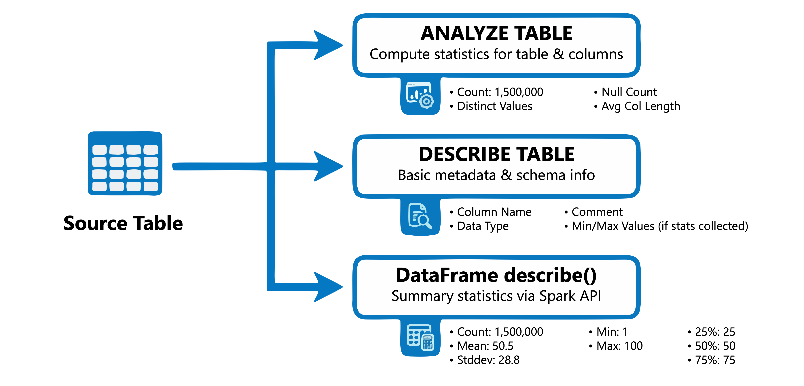

```sql
ANALYZE TABLE sales.transactions COMPUTE STATISTICS;                       -- row count + size
ANALYZE TABLE sales.transactions COMPUTE STATISTICS FOR COLUMNS
    transaction_id, amount, customer_id;
ANALYZE TABLE sales.transactions COMPUTE STATISTICS FOR ALL COLUMNS;

DESC EXTENDED sales.transactions amount;      -- column-level stats
DESCRIBE TABLE EXTENDED sales.transactions;   -- stats + table metadata
```

`DESC EXTENDED <table> <column>` returns **min, max, num nulls, distinct count, avg column length, max column length**.

**PySpark equivalent:**

```python
df = spark.table("sales.transactions")
df.describe().show()     # count, mean, stddev, min, max for numeric columns
```

> 💡 Run `ANALYZE TABLE` after **bulk loads or significant changes** so the optimizer plans well. For UC **managed tables, predictive optimization runs `ANALYZE` automatically**.

### Data quality monitoring in Unity Catalog

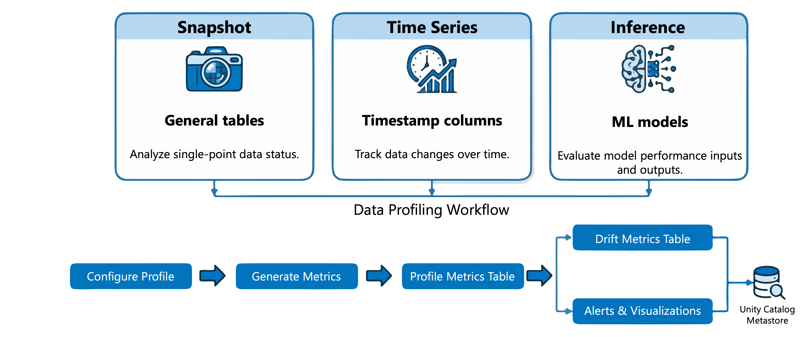

Two capabilities under one umbrella:

| Capability | Scope | What it does |
|-----------|-------|--------------|
| **Anomaly detection** | **All tables in a schema**, enabled once at **schema level** | Evaluates **freshness** (how recently updated) and **completeness** (expected row counts) from historical patterns — automated broad coverage, no per-table config |
| **Data profiling** | **Per table**, configured individually | Deep statistical analysis: distributions, null percentages, **drift metrics**, model performance over time |

> Use anomaly detection as the **early-warning system** across all tables; data profiling for **in-depth monitoring of key tables**.

**Profile types:**

| Type | Use case | Characteristics |
|------|----------|-----------------|
| **Snapshot** | General-purpose tables | Metrics over the **entire table** each refresh |
| **Time series** | Tables with timestamp columns | Tracks metrics **across time windows** to detect trends |
| **Inference** | ML inference tables | Monitors model inputs, predictions, accuracy |

**Create via UI:** table → **Quality** tab → **Enable** (or **Configure** if anomaly detection is on) → **Data Quality Monitoring** dialog → **Data profiling → Configure** → choose type, granularity, schedule.

→ Produces **two metric tables**: a **profile metrics** table and a **drift metrics** table.

**Create via SDK:**

```python
%pip install "databricks-sdk>=0.68.0"
```
```python
from databricks.sdk import WorkspaceClient
from databricks.sdk.service.dataquality import Monitor, DataProfilingConfig, SnapshotConfig

w = WorkspaceClient()
table  = w.tables.get(full_name="main.sales.transactions")
schema = w.schemas.get(full_name="main.sales")

w.data_quality.create_monitor(
    monitor=Monitor(
        object_type="table",
        object_id=table.table_id,
        data_profiling_config=DataProfilingConfig(
            output_schema_id=schema.schema_id,
            assets_dir="/Workspace/Users/user@example.com/monitoring",
            snapshot=SnapshotConfig()
        )
    )
)
```

### Interpreting results

| Metric | What it reveals |
|--------|-----------------|
| `count`, `num_nulls` | **Completeness** — high null % may signal ingestion issues |
| `distinct_count` | **Cardinality** — "unique" IDs that aren't unique |
| `min`, `max`, `avg`, `stddev` | Distribution — outliers, skew |
| `frequent_items` | Dominant categories or duplicates |
| `quantiles` | Value distribution / skewness |

**Red flags:** high null percentages · unexpected distinct counts · values outside valid bounds (e.g. negative amounts) · **distribution changes over time (drift)**.

> 📝 Drift metrics use the **Kolmogorov-Smirnov (KS) test** for numeric columns and the **chi-squared test** for categorical columns.

---

## 2. Choose column data types

### Type categories

**Numeric:**

| Category | Types | Use case |
|----------|-------|----------|
| **Integral** | `TINYINT`, `SMALLINT`, `INT`, `BIGINT` | Whole numbers |
| **Decimal** | `DECIMAL(p,s)` | **Exact precision** for financial data |
| **Floating point** | `FLOAT`, `DOUBLE` | Scientific calculations (approximate) |

| Type | Range | Storage | Common use |
|------|-------|---------|-----------|
| **`TINYINT`** | −128 … 127 | **1 byte** | Status codes, small counters |
| **`SMALLINT`** | −32,768 … 32,767 | **2 bytes** | Year values, limited ranges |
| **`INT`** | ±2.1 billion | **4 bytes** | Most identifiers, counts |
| **`BIGINT`** | ±9.2 quintillion | **8 bytes** | Large IDs, row counts |

**Date-time:** `DATE` (calendar date only) · `TIMESTAMP` (with **session timezone**) · `TIMESTAMP_NTZ` (**no timezone**).

**Text/binary:** `STRING` (variable-length text) · `BINARY` (raw bytes).

**Complex:** `ARRAY` (ordered sequence) · `MAP` (key-value) · `STRUCT` (named fields).

### Numeric selection

```sql
CREATE TABLE orders (
    order_id INT,
    status_code TINYINT,
    total_items SMALLINT,
    transaction_id BIGINT
);

CREATE TABLE transactions (
    transaction_id INT,
    amount DECIMAL(10,2),         -- exact: up to 99,999,999.99   (p = total digits, s = decimals)
    tax_rate DECIMAL(5,4)         -- exact: up to 9.9999
);

CREATE TABLE measurements (
    sensor_id INT,
    temperature DOUBLE,           -- approximate, large range
    pressure DOUBLE
);
```

> ⚠️ **Use `DECIMAL` for financial data.** `FLOAT`/`DOUBLE` use binary representation and introduce **rounding errors** with base-10 values like currency.

### Temporal types

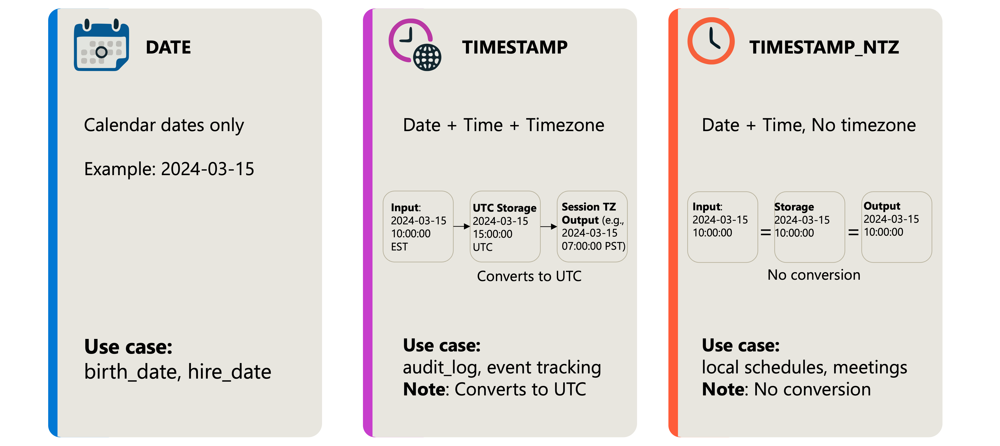

```sql
CREATE TABLE employees (employee_id INT, hire_date DATE, birth_date DATE);

-- TIMESTAMP: normalizes to UTC internally, applies session timezone on read
CREATE TABLE audit_log (log_id BIGINT, event_time TIMESTAMP, user_id INT);

-- TIMESTAMP_NTZ: no timezone conversion — time stays as entered
CREATE TABLE schedules (schedule_id INT, local_meeting_time TIMESTAMP_NTZ);
```

**`TIMESTAMP`** ensures consistent ordering across time zones but can surprise you if you expected values to stay unchanged → use **`TIMESTAMP_NTZ`** then.

### Complex types

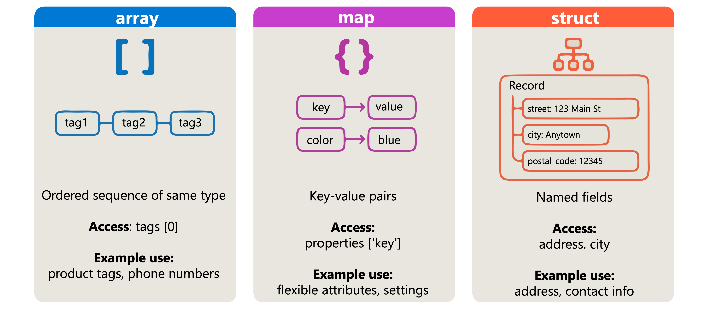

```sql
-- ARRAY: multiple values of the same type
CREATE TABLE products (product_id INT, name STRING, tags ARRAY<STRING>);
SELECT product_id, tags[0] AS primary_tag FROM products;

-- MAP: key-value pairs with dynamic keys
CREATE TABLE devices (device_id INT, properties MAP<STRING, STRING>);
SELECT device_id, properties['firmware_version'] AS firmware FROM devices;

-- STRUCT: fixed set of named fields
CREATE TABLE customers (
    customer_id INT,
    address STRUCT<street: STRING, city: STRING, postal_code: STRING>
);
SELECT customer_id, address.city FROM customers;
```

> 💡 Complex types reduce extra tables and joins but make some operations harder — **consider query patterns** before choosing them over normalized tables.

### Best practices

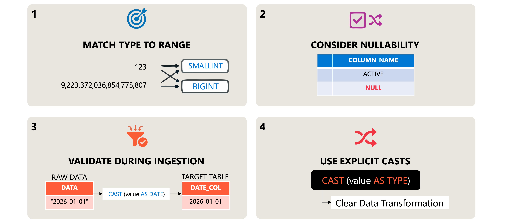

- **Match type to data range** — don't use `BIGINT` for values in the thousands; extra bytes multiply across millions of rows.
- **Consider nullability** — add **`NOT NULL`** constraints where a column should never be null.
- **Validate types during ingestion** — cast early to catch mismatches:

```sql
INSERT INTO target_table
SELECT
    CAST(raw_id AS INT) AS id,
    CAST(raw_amount AS DECIMAL(10,2)) AS amount,
    CAST(raw_date AS DATE) AS transaction_date
FROM staging_table;
```

- **Use explicit casts** — implicit conversions can **silently lose data**.

---

## 3. Resolve duplicates and nulls

### Identify duplicates

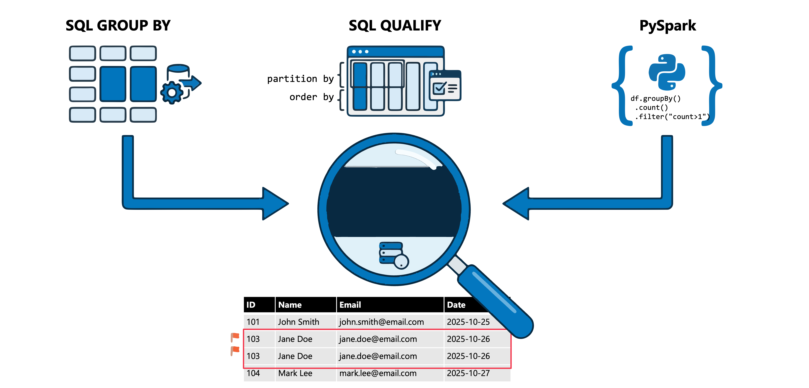

**GROUP BY + HAVING** (counts):

```sql
SELECT customer_id, email, COUNT(*) AS occurrence_count
FROM sales.customers
GROUP BY customer_id, email
HAVING COUNT(*) > 1
ORDER BY occurrence_count DESC;
```

**QUALIFY + window function** (the actual rows, no subquery needed):

```sql
SELECT *
FROM sales.customers
QUALIFY COUNT(*) OVER (PARTITION BY customer_id, email) > 1;
```

**PySpark:**

```python
from pyspark.sql.functions import count
from pyspark.sql.window import Window

window_spec = Window.partitionBy("customer_id", "email")
duplicates_df = (df.withColumn("row_count", count("*").over(window_spec))
                   .filter("row_count > 1")
                   .drop("row_count"))

# or set-difference approach
df_duplicates = df.exceptAll(df.dropDuplicates(["customer_id", "email"]))
```

> 📝 **`exceptAll()` preserves duplicates** (set difference keeping multiplicity): 3 identical rows in the original vs 1 in the deduplicated set → returns **2 rows**. Plain `except()` removes all matching rows and returns **distinct** results.

### Remove duplicates

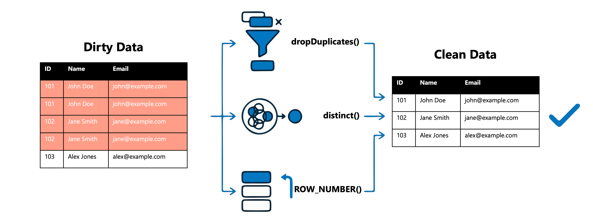

```python
df_clean  = df.dropDuplicates(["customer_id", "email"])   # by chosen columns, keeps first
df_unique = df.distinct()                                  # full-row deduplication
```

**Keep a specific row** (e.g. most recent) with `ROW_NUMBER()` + `QUALIFY`:

```sql
SELECT *
FROM sales.customers
QUALIFY ROW_NUMBER() OVER (
    PARTITION BY customer_id
    ORDER BY updated_at DESC
) = 1;
```

### Handle nulls

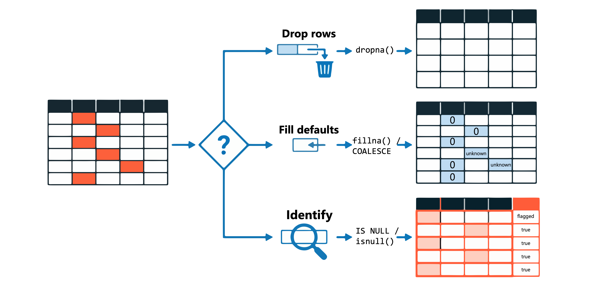

**Identify:**

```sql
SELECT * FROM sales.transactions
WHERE amount IS NULL OR customer_id IS NULL;

-- count nulls per column
SELECT
    COUNT(*) AS total_rows,
    COUNT(*) - COUNT(amount)      AS null_amount_count,
    COUNT(*) - COUNT(customer_id) AS null_customer_count
FROM sales.transactions;
```

**Drop:**

```python
df_clean = df.dropna()                                   # any column null (default how="any")
df_clean = df.dropna(how="all")                          # only when all are null
df_clean = df.dropna(subset=["customer_id", "amount"])   # specific columns
```

**Fill:**

```python
df_filled = df.fillna(0)
df_filled = df.fillna({"amount": 0, "status": "Unknown", "quantity": 1})
```

```sql
SELECT customer_id,
       COALESCE(amount, 0) AS amount,
       COALESCE(status, 'Unknown') AS status
FROM sales.transactions;
```

**Strategy:**

| Scenario | Approach |
|----------|----------|
| Nulls in **required fields** (identifiers) | **Drop the rows** |
| Nulls in numeric fields for aggregation | Fill with **zero or mean** |
| Nulls in optional categorical fields | Fill with placeholder (**"Unknown"**) |
| Nulls that would skew analysis | Drop or fill based on domain knowledge |

> 💡 **Document null-handling decisions** — future analysts need to know why values were replaced or removed.

---

## 4. Transform with filters and aggregations

### Filtering


```python
from pyspark.sql.functions import col

df_filtered = df_customer.filter(col("c_acctbal") > 1000)      # filter() == where()

# multiple conditions: & = AND, | = OR, parentheses around each condition
df_filtered = df_customer.filter((col("c_nationkey") == 20) & (col("c_acctbal") > 1000))
df_filtered = df_customer.filter((col("c_custkey") == 412446) | (col("c_custkey") == 412447))
```

```sql
SELECT * FROM orders
WHERE o_orderstatus = 'F' AND o_totalprice > 50000;
```

**Null filtering:**

```python
df_valid = df.filter(col("order_amount").isNotNull())
df_nulls = df.filter(col("order_amount").isNull())
df_valid = df.filter(df.order_amount.isNotNull())    # column object syntax
```

> ⚠️ **`!= None` doesn't reliably filter nulls** — SQL null comparisons return **null**, not true/false. Always use **`isNull()` / `isNotNull()`** (or `IS NULL` / `IS NOT NULL` in SQL).

### Grouping

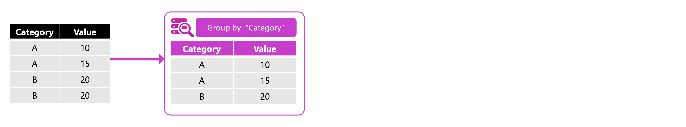

```python
df_grouped = df_customer.groupBy("c_mktsegment")
df_grouped = df_customer.groupBy("c_mktsegment", "c_nationkey")
```

> 📝 `groupBy()` alone returns a **`GroupedData` object** — you must apply an aggregation to see results. In SQL, every `SELECT` column must be in `GROUP BY` **or** wrapped in an aggregate function.

### Aggregating


| Function | Description |
|----------|-------------|
| `count()` | Rows per group |
| `sum()` | Adds values |
| `avg()` | Mean |
| `min()` / `max()` | Smallest / largest value |

```python
from pyspark.sql.functions import avg, sum, count, min, max

df_order_stats = df_order.groupBy("o_orderpriority").agg(
    count("o_orderkey").alias("order_count"),
    sum("o_totalprice").alias("total_revenue"),
    avg("o_totalprice").alias("avg_order_value"),
    max("o_totalprice").alias("max_order")
)
```

```sql
SELECT id,
       COUNT(*) AS total_orders,
       SUM(quantity) AS total_quantity,
       AVG(quantity) AS avg_quantity,
       MAX(quantity) AS max_quantity
FROM dealer
GROUP BY id
ORDER BY total_quantity DESC;

-- HAVING filters groups AFTER aggregation
SELECT id, SUM(quantity) AS total_quantity
FROM dealer
GROUP BY id
HAVING SUM(quantity) > 20;
```

### Chaining transformations

```python
df_result = (
    df_order
    .filter(col("o_orderstatus") == "F")
    .groupBy("o_orderpriority")
    .agg(count("o_orderkey").alias("n_orders"))
    .sort(col("n_orders").desc())
)
display(df_result)
```

**Lazy evaluation** — nothing runs until an **action** (`display()`, `show()`); Spark optimizes the whole sequence.

> 💡 **Place filters early** in the chain to reduce the data volume later operations must process.

---

## 5. Transform with joins and set operators

### Joins (horizontal)


| Join type | Description | Use case |
|-----------|-------------|----------|
| **`INNER`** | Only matching rows from both | Orders with valid customers |
| **`LEFT`** | All left rows; NULLs for unmatched right | All customers, even without orders |
| **`RIGHT`** | All right rows; NULLs for unmatched left | All departments, even without employees |
| **`FULL`** | All rows both sides; NULLs for non-matches | Find gaps on either side |
| **`SEMI`** | Left rows **that have a match** (no right columns) | Customers who placed orders |
| **`ANTI`** | Left rows **with no match** | Customers who never ordered |
| **`CROSS`** | Cartesian product | All possible combinations |

```sql
SELECT e.id, e.name, e.deptno, d.deptname
FROM employee e
INNER JOIN department d ON e.deptno = d.deptno;

SELECT e.id, e.name, e.deptno, d.deptname
FROM employee e
LEFT JOIN department d ON e.deptno = d.deptno;   -- unmatched → NULL deptname

SELECT * FROM employee LEFT SEMI JOIN department ON employee.deptno = department.deptno;
SELECT * FROM employee LEFT ANTI JOIN department ON employee.deptno = department.deptno;
```

```python
df_inner = df_employee.join(df_department,
                            on=df_employee.deptno == df_department.deptno,
                            how="inner")

df_left = df_employee.join(df_department, on="deptno", how="left")
df_full = df_employee.join(df_department, on="deptno", how="full")
df_semi = df_employee.join(df_department, on="deptno", how="semi")
df_anti = df_employee.join(df_department, on="deptno", how="anti")
```

> 💡 When the join column has the **same name in both DataFrames**, pass it as a **string** — this avoids duplicate columns in the result.

### Set operators (vertical)


| Operator | Returns | Duplicates |
|----------|---------|-----------|
| **`UNION`** | Rows from both queries | **Removed by default** — use `UNION ALL` to keep |
| **`INTERSECT`** | Rows in **both** queries | Removed by default |
| **`EXCEPT`** (= **`MINUS`**) | Rows in the **first** but not the second | Removed by default |

Both queries need the **same number of columns with compatible types**. Add `ALL` to any of them to preserve duplicates.

```sql
SELECT customer_id, name, email FROM active_customers
UNION
SELECT customer_id, name, email FROM archived_customers;

SELECT customer_id, name, email FROM active_customers
UNION ALL                                    -- keeps duplicates, faster (no dedup step)
SELECT customer_id, name, email FROM archived_customers;

SELECT customer_id FROM active_customers
INTERSECT
SELECT customer_id FROM archived_customers;

SELECT customer_id FROM active_customers
EXCEPT                                        -- MINUS is a synonym
SELECT customer_id FROM archived_customers;
```

```python
df_combined = df_active.union(df_archived)              # ⚠️ behaves like UNION ALL
df_distinct = df_active.union(df_archived).distinct()
```

> 💡 **`INTERSECT` has higher precedence** than `UNION` and `EXCEPT` — use parentheses to control evaluation order.

### Joins vs set operators

| Use **joins** to… | Use **set operators** to… |
|-------------------|---------------------------|
| Enrich records with columns from related tables | Append records from sources with identical schemas |
| Match records on key relationships | Find common records across datasets |
| Filter on existence in another table (semi/anti) | Identify records unique to one dataset |

---

## 6. Denormalization, pivot and unpivot

### Denormalization

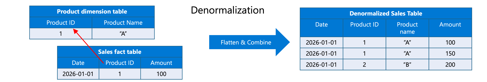

Flatten related tables into fewer, wider tables → **no joins at query time**.

```sql
CREATE OR REPLACE TABLE sales.orders_denormalized AS
SELECT o.order_id, o.order_date,
       c.customer_name, c.region,
       p.product_name, p.category,
       o.quantity, o.total_price
FROM orders o
JOIN customers c ON o.customer_id = c.customer_id
JOIN products  p ON o.product_id  = p.product_id;
```

**Trade-off:** more storage + must refresh when sources change. Common for **star schemas and data marts**.

> 💡 **Denormalize in the gold layer** where query performance beats storage efficiency; keep **bronze/silver normalized** for flexibility.

### Pivot (rows → columns)

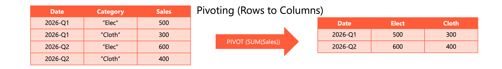

> ⚠️ `PIVOT` **requires an aggregate function** — multiple source rows may map to the same cell. `FOR … IN` names the values that become columns.

```sql
SELECT year, region, Q1, Q2, Q3, Q4
FROM quarterly_sales
PIVOT (
  SUM(revenue)
  FOR quarter IN (1 AS Q1, 2 AS Q2, 3 AS Q3, 4 AS Q4)
);
```

| year | region | Q1 | Q2 | Q3 | Q4 |
|------|--------|----|----|----|----|
| 2024 | East | 150000 | 175000 | 160000 | 200000 |
| 2024 | West | 180000 | 165000 | 190000 | 210000 |
| 2025 | East | 165000 | 185000 | null | null |

**Multiple aggregations in one pivot:**

```sql
SELECT year, Q1_total, Q1_avg, Q2_total, Q2_avg
FROM (SELECT year, quarter, revenue FROM quarterly_sales)
PIVOT (
  SUM(revenue) AS total,
  AVG(revenue) AS avg
  FOR quarter IN (1 AS Q1, 2 AS Q2)
);
```

### Unpivot (columns → rows)

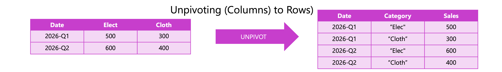

```sql
SELECT *
FROM regional_targets
UNPIVOT (
  target_amount FOR month IN (jan, feb, mar, apr)
);
```

| region | month | target_amount |
|--------|-------|---------------|
| North | jan | 50000 |
| North | feb | 55000 |
| … | … | … |

> ⚠️ **`UNPIVOT` excludes nulls by default** — use `UNPIVOT INCLUDE NULLS (...)` to keep them. Requires **DBR 12.2 LTS or later**.

**Custom aliases:**

```sql
SELECT *
FROM regional_targets
UNPIVOT (
  target_amount FOR month IN (
    jan AS `January`, feb AS `February`, mar AS `March`, apr AS `April`
  )
);
```

**Choosing:** denormalize for fast dashboard/report queries · pivot for side-by-side comparison · unpivot to normalize wide data for aggregation or ML pipelines.

---

## 7. Load data with merge, insert and append

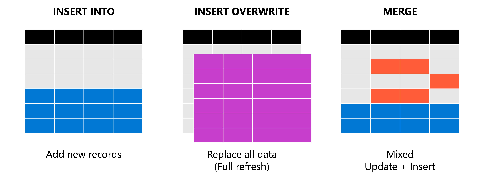

### INSERT INTO — append

```sql
INSERT INTO sales.transactions (transaction_id, amount, transaction_date)
VALUES ('TXN001', 150.00, '2026-01-15'),
       ('TXN002', 275.50, '2026-01-15');

INSERT INTO sales.transactions
SELECT * FROM staging.daily_transactions
WHERE transaction_date = current_date();
```

```python
df_new_transactions.write.mode("append").saveAsTable("sales.transactions")
df_new_transactions.write.insertInto("sales.transactions")
```

> ⚠️ **INSERT INTO does not check for duplicates** — load the same batch twice and you get duplicate rows. Deduplicate before loading.

### INSERT OVERWRITE — replace

```sql
-- replace entire table contents
INSERT OVERWRITE sales.daily_summary
SELECT region, SUM(amount) AS total_sales, COUNT(*) AS transaction_count
FROM sales.transactions
WHERE transaction_date = current_date()
GROUP BY region;

-- replace one partition
INSERT OVERWRITE sales.monthly_report
PARTITION (report_month = '2026-01')
SELECT region, product_category, SUM(amount) AS revenue
FROM sales.transactions
WHERE transaction_date BETWEEN '2026-01-01' AND '2026-01-31'
GROUP BY region, product_category;

-- REPLACE WHERE: delete rows matching a condition, then insert
INSERT INTO sales.transactions
REPLACE WHERE transaction_date BETWEEN '2026-01-01' AND '2026-01-07'
SELECT * FROM staging.corrected_transactions;
```

```python
df_refreshed.write.mode("overwrite").saveAsTable("sales.daily_summary")
df_january.write.mode("overwrite").partitionBy("report_month").saveAsTable("sales.monthly_report")
```

> ⚠️ SQL **`INSERT OVERWRITE PARTITION` + `partitionOverwriteMode=dynamic` is restricted to classic compute** — it does **not** work on SQL warehouses or serverless. Python/Scala DataFrame writes with `partitionOverwriteMode=dynamic` work on **all** compute types. For new pipelines Databricks recommends **`REPLACE USING`**, because partition overwrite can use **stale data when partitioning changes**.

### REPLACE USING / REPLACE ON

**`REPLACE USING`** — recommended dynamic overwrite; works on **all compute types**, no Spark session config, and supports **partitioned, unpartitioned and liquid-clustered** tables.

```sql
INSERT INTO sales.monthly_report
  REPLACE USING (report_month)
  SELECT region, product_category, SUM(amount) AS revenue, report_month
  FROM staging.corrected_transactions
  GROUP BY region, product_category, report_month;
```

Atomically **deletes rows matching the incoming rows on `report_month`**, then inserts; non-matching rows are untouched.

> 📝 **DBR 16.3–17.1:** the `USING` columns must be the table's **full set of partition columns** (legacy). **DBR 17.2+:** any columns, any table type.

**`REPLACE ON`** — custom/NULL-safe matching conditions (**requires DBR 17.1+**):

```sql
INSERT INTO sales.transactions
  REPLACE ON (target.transaction_id = source.transaction_id)
  SELECT * FROM staging.corrected_transactions AS source;
```

Use **`REPLACE WHERE`** when you need condition-based replacement **without a source table reference**.

### MERGE — upsert

```sql
MERGE INTO customers AS target
USING customer_updates AS source
ON target.customer_id = source.customer_id
WHEN MATCHED THEN
    UPDATE SET target.email = source.email,
               target.phone = source.phone,
               target.last_updated = current_timestamp()
WHEN NOT MATCHED THEN
    INSERT (customer_id, name, email, phone, created_date, last_updated)
    VALUES (source.customer_id, source.name, source.email, source.phone,
            current_timestamp(), current_timestamp());
```

**Conditional logic per clause:**

```sql
MERGE INTO products AS target
USING product_feed AS source
ON target.sku = source.sku
WHEN MATCHED AND source.price <> target.price THEN
    UPDATE SET target.price = source.price, target.updated_at = current_timestamp()
WHEN MATCHED AND source.discontinued = true THEN
    DELETE
WHEN NOT MATCHED THEN
    INSERT *;                     -- all columns when schemas match
```

**PySpark (Delta Lake API):**

```python
from delta.tables import DeltaTable

target_table = DeltaTable.forName(spark, "customers")

target_table.alias("target").merge(
    source_df.alias("source"),
    "target.customer_id = source.customer_id"
).whenMatchedUpdate(set={
    "email": "source.email",
    "phone": "source.phone",
    "last_updated": "current_timestamp()"
}).whenNotMatchedInsert(values={
    "customer_id": "source.customer_id",
    "name": "source.name",
    "email": "source.email",
    "phone": "source.phone",
    "created_date": "current_timestamp()",
    "last_updated": "current_timestamp()"
}).execute()

# convenience form when schemas match
target_table.alias("target").merge(
    source_df.alias("source"),
    "target.customer_id = source.customer_id"
).whenMatchedUpdateAll().whenNotMatchedInsertAll().execute()
```

> ⚠️ **MERGE requires a unique match** — if multiple source rows match the same target row, the operation **fails**. Deduplicate the source first.

### Choosing a loading strategy

| Scenario | Operation | When to use |
|----------|-----------|-------------|
| **New records only** | `INSERT INTO` / append | Daily logs, event streams, incremental extracts |
| **Full refresh** | `INSERT OVERWRITE` | Lookup tables, aggregations, reprocessing failed batches |
| **Mixed updates & inserts** | **`MERGE`** | CDC feeds, dimension tables, synchronization |
| **Selective replacement by predicate** | `REPLACE WHERE` | Correcting specific date ranges / logical conditions |
| **Dynamic overwrite (all compute types)** | **`REPLACE USING`** | Recommended row-level overwrites on any table type |
| **Custom-condition replacement** | `REPLACE ON` | NULL-safe or complex matching (DBR 17.1+) |

---

## 8. Summary

- **Profile first:** `ANALYZE TABLE` + `DESCRIBE`/`describe()`, plus UC **anomaly detection** (schema-wide) and **data profiling** (per table, snapshot/time series/inference).
- **Types matter:** size integrals to the range, **`DECIMAL` for money**, `TIMESTAMP` vs `TIMESTAMP_NTZ`, complex types for nested data; cast explicitly at ingestion.
- **Cleanse:** find duplicates with `GROUP BY … HAVING` / `QUALIFY`, resolve with `dropDuplicates()` / `ROW_NUMBER()`; handle nulls with `dropna()`, `fillna()`, `COALESCE`.
- **Transform:** filter → group → aggregate (`HAVING` filters *after* aggregation); joins combine **horizontally**, set operators **vertically**.
- **Reshape:** denormalize for query speed, `PIVOT` for cross-tab, `UNPIVOT` to normalize wide data.
- **Load:** `INSERT INTO` (append) · `INSERT OVERWRITE` / `REPLACE WHERE` / **`REPLACE USING`** (replace) · **`MERGE`** (upsert).

---

## 🧠 Quick revision cheat-sheet

| Concept | Remember this |
|---------|---------------|
| **`ANALYZE TABLE`** | `COMPUTE STATISTICS [FOR COLUMNS … / FOR ALL COLUMNS]`; run after bulk loads; automatic on UC managed tables via predictive optimization |
| **Column stats** | `DESC EXTENDED tbl col` → min, max, num nulls, distinct count, avg/max column length |
| **`df.describe()`** | count, mean, stddev, min, max for numeric columns |
| **Anomaly detection vs data profiling** | Schema-level, freshness + completeness, automatic vs **per-table**, distributions/nulls/drift |
| **Profile types** | **Snapshot** (whole table) · **Time series** (timestamp windows) · **Inference** (ML models) |
| **Profile outputs** | **Profile metrics** table + **drift metrics** table (KS test numeric, chi-squared categorical) |
| **Integral sizes** | TINYINT 1B (−128…127) · SMALLINT 2B · INT 4B (±2.1B) · BIGINT 8B |
| **Money** | **`DECIMAL(p,s)`** — never FLOAT/DOUBLE (binary rounding errors) |
| **`TIMESTAMP` vs `TIMESTAMP_NTZ`** | UTC + session timezone on read vs **no conversion** |
| **Complex types** | `ARRAY<T>` → `tags[0]` · `MAP<K,V>` → `props['key']` · `STRUCT<…>` → `address.city` |
| **Find duplicates** | `GROUP BY … HAVING COUNT(*) > 1` or **`QUALIFY COUNT(*) OVER (PARTITION BY …) > 1`** |
| **`exceptAll()` vs `except()`** | Preserves duplicate multiplicity vs removes all matches + distinct |
| **Remove duplicates** | `dropDuplicates([cols])` (first occurrence) · `distinct()` (full row) |
| **Keep newest row** | `QUALIFY ROW_NUMBER() OVER (PARTITION BY k ORDER BY updated_at DESC) = 1` |
| **Nulls PySpark** | `dropna(how="any"/"all", subset=[…])` · `fillna(value or dict)` |
| **Nulls SQL** | `IS NULL` / `IS NOT NULL` · `COALESCE(col, default)` |
| **Null filter trap** | **`!= None` doesn't work** — use `isNull()` / `isNotNull()` |
| **`filter()` vs `where()`** | Identical; combine conditions with `&` / `|` and **parentheses** |
| **`groupBy()` alone** | Returns a **`GroupedData`** object — needs an aggregation |
| **`WHERE` vs `HAVING`** | Rows before aggregation vs **groups after aggregation** |
| **Lazy evaluation** | Transformations queue; actions (`display()`, `show()`) execute — **filter early** |
| **Join types** | INNER / LEFT / RIGHT / FULL / **SEMI** (matches, left cols only) / **ANTI** (no match) / CROSS |
| **PySpark join** | `how="inner|left|right|full|semi|anti"`; pass shared column **as a string** to avoid duplicates |
| **`UNION` vs `UNION ALL`** | Dedups by default vs keeps duplicates (**faster**); PySpark `union()` = **UNION ALL** |
| **`INTERSECT` / `EXCEPT`** | Common rows / first-not-second; **`MINUS` = EXCEPT**; both dedup unless `ALL`; **INTERSECT has higher precedence** |
| **Denormalization** | Flatten joins into wide tables — **gold layer**; costs storage + refresh |
| **`PIVOT`** | **Requires an aggregate**; `FOR col IN (v1 AS a, v2 AS b)`; supports multiple aggregates |
| **`UNPIVOT`** | `value FOR name IN (cols)`; **excludes nulls by default** (`INCLUDE NULLS`); **DBR 12.2 LTS+** |
| **`INSERT INTO`** | Append; **no duplicate checking** |
| **`INSERT OVERWRITE`** | Full table or `PARTITION (...)`; dynamic partition overwrite in SQL = **classic compute only** |
| **`REPLACE WHERE`** | Delete rows matching a predicate, then insert — no source table reference |
| **`REPLACE USING (cols)`** | **Recommended** dynamic overwrite, all compute types & table types; DBR 16.3–17.1 = full partition columns, **17.2+ = any columns** |
| **`REPLACE ON (cond)`** | Custom / NULL-safe matching — **DBR 17.1+** |
| **`MERGE`** | `WHEN MATCHED [AND cond] THEN UPDATE/DELETE` · `WHEN NOT MATCHED THEN INSERT [*]`; **fails on multiple source matches** |
| **Delta Python merge** | `DeltaTable.forName(...).alias().merge(src, cond).whenMatchedUpdateAll().whenNotMatchedInsertAll().execute()` |