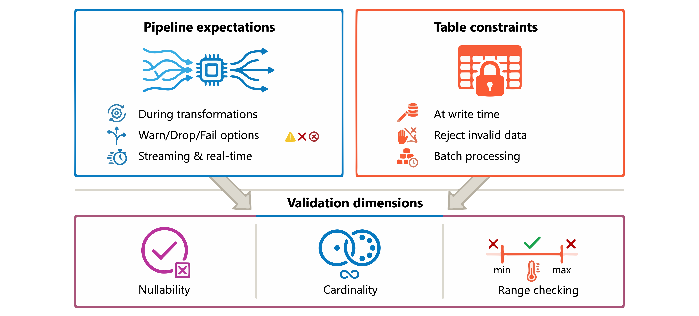
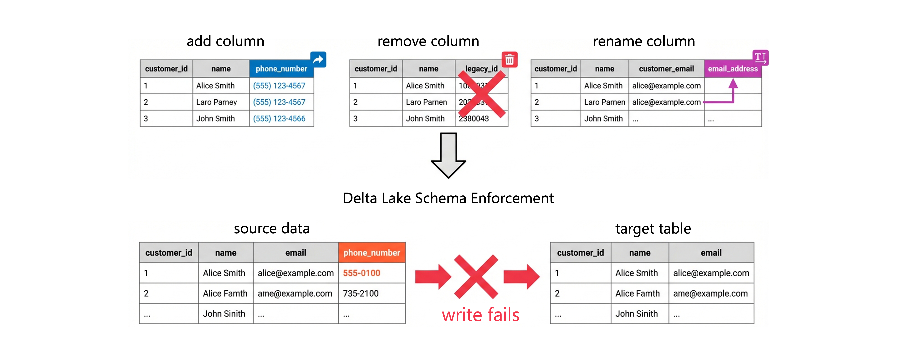
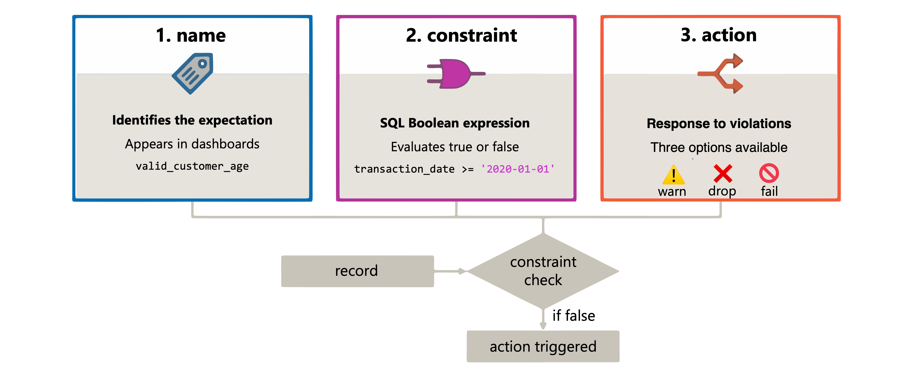

# Implement and Manage Data Quality Constraints

> **Module:** Implement and manage data quality constraints with Azure Databricks (8 Units · Intermediate · Data Engineer)
> **Source:** [Microsoft Learn](https://learn.microsoft.com/en-gb/training/modules/implement-manage-data-quality-constraints-unity-catalog/)
> **In one line:** Defense in depth — **table constraints** + **schema enforcement/casting** + **schema drift handling** + **pipeline expectations** (warn / drop / fail).

---

## 📌 Learning objectives

By the end of this module you should be able to:

- Implement **validation checks** for nullability, cardinality and range constraints
- Implement **data type checks** using schema enforcement and explicit casting
- Enforce schema and manage **schema drift** with Auto Loader and Delta Lake
- Manage data quality using **pipeline expectations** in Lakeflow Spark Declarative Pipelines

**Prerequisites:** Azure Databricks workspaces & Unity Catalog basics · SQL and data engineering concepts.

---

## 1. Implement validation checks

### Two validation approaches



| Approach | Where it runs | Behaviour | Best for |
|----------|--------------|-----------|----------|
| **Pipeline expectations** | During transformations in **Lakeflow Spark Declarative Pipelines** | **Warn**, **drop** invalid records, or **fail** the pipeline | Streaming tables & materialized views needing real-time quality control |
| **Table constraints** | Directly on **Delta Lake tables** | **Reject invalid data at write time** | Batch processing, strict data integrity guarantees |

Three dimensions to validate: **nullability** (required values exist) · **cardinality** (uniqueness where expected) · **range** (values within bounds).

### Nullability checks

**Pipeline expectations (Python):**

```python
from pyspark import pipelines as dp

@dp.table
@dp.expect_or_drop("valid_email", "email IS NOT NULL")
@dp.expect_or_drop("valid_customer_id", "customer_id IS NOT NULL")
def customers():
    return spark.readStream.table("raw.customers")
```

**SQL:**

```sql
CREATE OR REFRESH STREAMING TABLE customers(
    CONSTRAINT valid_email       EXPECT (email IS NOT NULL)       ON VIOLATION DROP ROW,
    CONSTRAINT valid_customer_id EXPECT (customer_id IS NOT NULL) ON VIOLATION DROP ROW
) AS SELECT * FROM STREAM(raw.customers);
```

**Delta tables outside pipelines — `NOT NULL`:**

```sql
CREATE TABLE customers (
    customer_id INT NOT NULL,
    email STRING NOT NULL,
    first_name STRING,
    last_name STRING
);

ALTER TABLE customers ALTER COLUMN email SET NOT NULL;
```

> ⚠️ Adding `NOT NULL` to an **existing** table **verifies all existing rows first** — the operation **fails if any nulls exist**.

### Cardinality (uniqueness) checks

```python
from pyspark.sql.window import Window
from pyspark.sql.functions import count

@dp.table
@dp.expect("unique_ssn_per_person", "ssn_count = 1")
def employees():
    df = spark.table("raw.employees")
    w = Window.partitionBy("ssn")
    return df.withColumn("ssn_count", count("*").over(w))
```

**Detect duplicates with a materialized view:**

```sql
CREATE OR REFRESH MATERIALIZED VIEW order_validation AS
SELECT order_id, COUNT(*) AS occurrence_count
FROM orders
GROUP BY order_id
HAVING COUNT(*) > 1;
```

**Primary key constraints:**

```sql
CREATE TABLE orders (
    order_id INT NOT NULL,
    customer_id INT,
    order_date DATE,
    CONSTRAINT orders_pk PRIMARY KEY (order_id)
);
```

> ⚠️ **Delta primary key constraints are informational — NOT enforced.** They help query optimization and document the model. Use **pipeline expectations to actually enforce uniqueness**.

### Range checks

```python
@dp.table
@dp.expect_or_fail("valid_age", "age BETWEEN 0 AND 150")
@dp.expect_or_fail("valid_salary", "salary >= 0")
@dp.expect_or_fail("valid_hire_date", "hire_date <= current_date()")
def employees():
    return spark.readStream.table("raw.employees")
```

```sql
CREATE OR REFRESH STREAMING TABLE transactions(
    CONSTRAINT valid_amount   EXPECT (amount > 0)                        ON VIOLATION DROP ROW,
    CONSTRAINT valid_date     EXPECT (transaction_date <= current_date()) ON VIOLATION DROP ROW,
    CONSTRAINT valid_quantity EXPECT (quantity BETWEEN 1 AND 10000)       ON VIOLATION DROP ROW
) AS SELECT * FROM STREAM(raw.transactions);
```

**Delta `CHECK` constraints — enforced at write time:**

```sql
ALTER TABLE employees    ADD CONSTRAINT valid_age       CHECK (age >= 18 AND age <= 120);
ALTER TABLE transactions ADD CONSTRAINT positive_amount CHECK (amount > 0);
```

**Multi-condition business rules:**

```python
@dp.expect("valid_discount", """
    discount_percent >= 0
    AND discount_percent <= 100
    AND (discount_percent <= 50 OR customer_tier = 'PREMIUM')
""")
```

### Actions on failure

| Action | Use case | Behaviour |
|--------|----------|-----------|
| **Warn** (default) | Monitoring & analysis | Invalid records **still written**; metrics logged |
| **Drop** | Data cleansing | Invalid records **removed before write** |
| **Fail** | Critical data integrity | Pipeline **stops**; transaction **rolls back** |

```python
@dp.expect("has_phone", "phone_number IS NOT NULL")                              # warn
@dp.expect_or_drop("complete_address", "street IS NOT NULL AND city IS NOT NULL") # drop
@dp.expect_or_fail("valid_account_balance", "balance >= 0")                       # fail
```

Metrics: pipeline UI → select a dataset with expectations → **Data quality** tab.

---

## 2. Implement data type checks

### Schema enforcement (automatic)

Delta Lake validates types on write, attempts a **safe cast**, and **errors if the cast fails**.

**Rules during insert:** all inserted columns must **exist in the target table** · all types must **match or be safely castable**.

```sql
CREATE TABLE inventory (product_id INT, quantity INT, last_updated DATE);

INSERT INTO inventory VALUES (1, '100', '2026-01-15');    -- ✅ '100' casts to INT
INSERT INTO inventory VALUES (2, 'fifty', '2026-01-15');  -- ❌ fails, 'fifty' can't cast
```

### Explicit casting

| Function | On failure |
|----------|-----------|
| **`cast()`** | **Raises an error** |
| **`try_cast()`** | Returns **`NULL`** |

```sql
-- strict: stops processing on invalid data
SELECT cast(raw_amount AS DECIMAL(10,2)) AS amount,
       cast(raw_date AS DATE) AS transaction_date
FROM staging_data;

-- lenient: flag invalid values without failing
SELECT raw_amount,
       try_cast(raw_amount AS DECIMAL(10,2)) AS validated_amount,
       CASE WHEN try_cast(raw_amount AS DECIMAL(10,2)) IS NULL
            THEN 'Invalid amount format' ELSE 'Valid' END AS validation_status
FROM staging_data;
```

### Type validation with CHECK constraints

```sql
-- numeric-looking strings via regex
ALTER TABLE orders
ADD CONSTRAINT valid_order_total CHECK (order_total REGEXP '^[0-9]+(\\.[0-9]+)?$');

-- valid date strings via try_cast
ALTER TABLE events
ADD CONSTRAINT valid_event_date CHECK (try_cast(event_date_str AS DATE) IS NOT NULL);
```

> ⚠️ Adding a constraint to an existing table **verifies all existing rows** — plan for that on large tables.

### Quarantine pattern

```sql
-- valid records → silver
INSERT INTO silver_transactions
SELECT transaction_id,
       cast(amount AS DECIMAL(10,2)) AS amount,
       cast(transaction_date AS DATE) AS transaction_date
FROM bronze_transactions
WHERE try_cast(amount AS DECIMAL(10,2)) IS NOT NULL
  AND try_cast(transaction_date AS DATE) IS NOT NULL;

-- invalid records → quarantine
INSERT INTO quarantine_transactions
SELECT transaction_id,
       amount AS raw_amount,
       transaction_date AS raw_date,
       current_timestamp() AS quarantined_at,
       'Type validation failed' AS reason
FROM bronze_transactions
WHERE try_cast(amount AS DECIMAL(10,2)) IS NULL
   OR try_cast(transaction_date AS DATE) IS NULL;
```

### Type checks as expectations

```python
@dp.table
@dp.expect_or_drop("valid_amount", "try_cast(amount AS DECIMAL(10,2)) IS NOT NULL")
@dp.expect_or_drop("valid_date", "try_cast(event_date AS DATE) IS NOT NULL")
def validated_transactions():
    return spark.readStream.table("raw_transactions")
```

```sql
CREATE OR REFRESH STREAMING TABLE validated_transactions (
    CONSTRAINT valid_amount EXPECT (try_cast(amount AS DECIMAL(10,2)) IS NOT NULL) ON VIOLATION DROP ROW,
    CONSTRAINT valid_date   EXPECT (try_cast(event_date AS DATE) IS NOT NULL)      ON VIOLATION DROP ROW
) AS SELECT * FROM STREAM(raw_transactions);
```

> 📝 **Defense in depth:** schema enforcement → explicit casting → constraints → pipeline expectations. Each layer catches what the others miss.

---

## 3. Detect and manage schema drift



**Schema drift ≠ type validation.** Type validation checks that *values* match expected types; **schema drift is the *structure* changing** — columns added, removed or renamed (`customer_email` → `email_address`).

Delta Lake's schema enforcement **blocks structural mismatches by default** (fail-fast): a source adding `phone_number` stops writes until you decide to reject it, add it, or preserve it.

### Fail on schema mismatch (strictest)

```python
(spark.readStream
    .format("cloudFiles")
    .option("cloudFiles.format", "json")
    .option("cloudFiles.schemaLocation", "/path/to/schema")
    .option("cloudFiles.schemaEvolutionMode", "failOnNewColumns")
    .load("/path/to/source")
    .writeStream
    .option("checkpointLocation", "/path/to/checkpoint")
    .toTable("target_table")
)
```

→ New column ⇒ stream stops with **`UnknownFieldException`**; update the schema or remove the offending data to resume.

### Adapt automatically

```python
(df.write
    .format("delta")
    .mode("append")
    .option("mergeSchema", "true")
    .saveAsTable("target_table"))
```

```sql
MERGE WITH SCHEMA EVOLUTION INTO target_table t
USING source_data s
ON t.customer_id = s.customer_id
WHEN MATCHED THEN UPDATE SET *
WHEN NOT MATCHED THEN INSERT *
```

> ⚠️ Automatic evolution may introduce **columns you didn't expect**.

### Auto Loader schema evolution modes

| Mode | Behaviour on new column / type change |
|------|----------------------------------------|
| **`addNewColumns`** (default) | Stream **stops**; new columns added to schema on restart. Existing column types unchanged |
| **`rescue`** | Schema **never evolves**; unexpected data → rescued data column. **Stream continues** |
| **`failOnNewColumns`** | Stream stops; needs manual schema update or removal of offending data |
| **`none`** | Schema never evolves; new columns **silently ignored** unless `rescuedDataColumn` is set |
| **`addNewColumnsWithTypeWidening`** | Stream stops; new columns added **and supported type changes widened** (e.g. `INT` → `LONG`). **DBR 16.4+ (Public Preview)** |

> 📝 `addNewColumnsWithTypeWidening` suits sources whose numeric ranges grow (row counts exceeding `INT`) — the column widens on restart instead of the records being rescued. **Unsupported changes (e.g. `INT` → `STRING`) still go to the rescued data column.**

**Rescue unexpected data:**

```python
(spark.readStream
    .format("cloudFiles")
    .option("cloudFiles.format", "json")
    .option("cloudFiles.schemaEvolutionMode", "rescue")
    .option("rescuedDataColumn", "_rescued_data")
    .load("/path/to/source")
    .writeStream
    .option("checkpointLocation", "/path/to/checkpoint")
    .toTable("target_table")
)
```

Captures **new columns, type mismatches and case differences** in a JSON column — pipeline keeps running.

### Error handling strategies

**Drop:**

```python
@dp.table
@dp.expect_or_drop("required_columns_present",
    "customer_id IS NOT NULL AND email IS NOT NULL")
def validated_customers():
    return spark.readStream.table("raw_customers")
```

**Fail:**

```sql
CREATE OR REFRESH STREAMING TABLE validated_orders (
    CONSTRAINT valid_structure
    EXPECT (order_id IS NOT NULL AND product_id IS NOT NULL)
    ON VIOLATION FAIL UPDATE
) AS SELECT * FROM STREAM(raw_orders);
```

**Quarantine (balanced) — two tables from one source:**

```python
@dp.table
def valid_transactions():
    return (spark.readStream.table("raw_transactions")
            .filter("amount IS NOT NULL AND transaction_date IS NOT NULL"))

@dp.table
def quarantine_transactions():
    return (spark.readStream.table("raw_transactions")
            .filter("amount IS NULL OR transaction_date IS NULL"))
```

### Best practices

- **Document expected schemas** in version control alongside pipeline code.
- **Alert on schema drift** even when handled automatically — early awareness of evolving data.
- **Consistent naming conventions** reduce case-sensitivity issues.
- **Test schema handling in development** with edge-case data before production.
- Weigh **strictness vs flexibility**: strict catches problems early but needs maintenance; evolution reduces overhead but allows surprises.

---

## 4. Manage data quality with pipeline expectations



Every expectation = **name** + **constraint** + **action**.

- **Name** — appears in monitoring dashboards. `valid_customer_age` ≫ `check_1`.
- **Constraint** — a SQL **Boolean expression**. ⚠️ **Not allowed:** custom Python functions, external service calls, **subqueries**.
- **Action** — warn / drop / fail.

```python
@dp.expect("valid_transaction_date",
           "transaction_date >= '2020-01-01' AND transaction_date <= current_date()")
```
```sql
CONSTRAINT valid_transaction_date
EXPECT (transaction_date >= '2020-01-01' AND transaction_date <= current_date())
```

### Actions

| Action | When to use | Behaviour | Python | SQL |
|--------|-------------|-----------|--------|-----|
| **Warn** (default) | Track quality trends without blocking | Invalid records **flow through**; metrics captured | `@dp.expect` | `EXPECT (...)` |
| **Drop** | Filter out bad records automatically | Invalid records **removed**, valid continue | `@dp.expect_or_drop` | `ON VIOLATION DROP ROW` |
| **Fail** | Critical violations | Update **fails immediately**, partial updates **atomically rolled back** | `@dp.expect_or_fail` | `ON VIOLATION FAIL UPDATE` |

```python
@dp.expect("non_null_email", "email IS NOT NULL")
@dp.expect_or_drop("valid_price", "price >= 0 AND price <= 10000")
@dp.expect_or_fail("required_customer_id", "customer_id IS NOT NULL")
```

> 📝 With **multiple parallel flows**, a failure in one flow **doesn't fail the others** — flows operate independently.

### Combining expectations

**Stacked decorators:**

```python
@dp.expect("valid_amount", "amount > 0")
@dp.expect("valid_currency", "currency IN ('USD', 'EUR', 'GBP')")
@dp.expect("valid_timestamp", "created_at <= current_timestamp()")
def validated_payments():
    return spark.readStream.table("raw.payments")
```

**Grouped as a dictionary** — `expect_all`, `expect_all_or_drop`, `expect_all_or_fail` apply **one action to the whole group**:

```python
payment_rules = {
    "valid_amount": "amount > 0",
    "valid_currency": "currency IN ('USD', 'EUR', 'GBP')",
    "valid_timestamp": "created_at <= current_timestamp()"
}

@dp.expect_all_or_drop(payment_rules)
def clean_payments():
    return spark.readStream.table("raw.payments")
```

**SQL — comma-separate the constraints:**

```sql
CREATE OR REFRESH STREAMING TABLE validated_payments(
    CONSTRAINT valid_amount    EXPECT (amount > 0),
    CONSTRAINT valid_currency  EXPECT (currency IN ('USD', 'EUR', 'GBP')),
    CONSTRAINT valid_timestamp EXPECT (created_at <= current_timestamp())
) AS SELECT * FROM STREAM(raw.payments);
```

### Store rules in a Unity Catalog table

> 💡 In-memory dictionaries embed rules in the notebook. For **production across multiple pipelines**, store expectations in a **UC Delta table** → version-controlled, auditable, queryable, with **lineage, access control and audit logs**.

```sql
CREATE OR REPLACE TABLE governance.data_quality.rules AS
SELECT col1 AS name, col2 AS constraint, col3 AS tag
FROM (
  VALUES
    ('valid_amount',    'amount > 0',                             'financial'),
    ('valid_currency',  'currency IN (''USD'', ''EUR'', ''GBP'')', 'financial'),
    ('non_null_email',  'email IS NOT NULL',                      'customer'),
    ('valid_hire_date', 'hire_date <= current_date()',            'hr')
);
```

```python
from pyspark import pipelines as dp
from pyspark.sql.functions import col

def get_rules(tag):
    df = spark.read.table("governance.data_quality.rules").filter(col("tag") == tag).collect()
    return {row["name"]: row["constraint"] for row in df}

@dp.table
@dp.expect_all_or_drop(get_rules("financial"))
def validated_payments():
    return spark.readStream.table("raw.payments")

@dp.table
@dp.expect_all_or_drop(get_rules("customer"))
def validated_customers():
    return spark.readStream.table("raw.customers")
```

→ Update a constraint by **editing one row** — no pipeline notebook changes.

### Monitoring results

**Jobs & Pipelines** (sidebar) → select pipeline → select a dataset with expectations → **Data quality** tab (right sidebar).

- **warn / drop** → violation counts recorded.
- **fail** → pipeline stops **before metrics are recorded**, but the error message includes the violating record:

```
[EXPECTATION_VIOLATION.VERBOSITY_ALL] Flow 'sensor-pipeline' failed to meet
the expectation. Violated expectations: 'temperature_in_valid_range'.
Input data: '{"id":"TEMP_001","temperature":-500,"timestamp_ms":"1710498600"}'.
```

Metrics are also queryable via the **Declarative Pipelines event log** → custom dashboards & threshold-based alerts.

---

## 5. Summary

- **Schema enforcement** is the first line of defense — Delta rejects writes it can't safely cast.
- **`cast()` vs `try_cast()`** controls whether mismatches fail or become NULL (→ quarantine pattern).
- **CHECK / NOT NULL constraints** enforce rules on the table; **PRIMARY KEY is informational only**.
- **Schema drift:** fail fast (`failOnNewColumns`), adapt (`mergeSchema` / `MERGE WITH SCHEMA EVOLUTION` / `addNewColumns`), or **rescue** into `_rescued_data`.
- **Pipeline expectations** = name + constraint + action → **warn** (log), **drop** (filter), **fail** (stop & roll back); metrics in the pipeline **Data quality** tab.
- Start with schema enforcement + CHECK constraints, add expectations for streaming, and quarantine to isolate bad records without blocking the main flow.

---

## 🧠 Quick revision cheat-sheet

| Concept | Remember this |
|---------|---------------|
| **Two validation mechanisms** | **Pipeline expectations** (warn/drop/fail during transformation) vs **table constraints** (reject at write time) |
| **Expectation anatomy** | **name + constraint + action**; constraint = SQL Boolean, **no Python UDFs, external calls or subqueries** |
| **Warn** | `@dp.expect` / `EXPECT (...)` — invalid records **still written**, metrics logged (**default**) |
| **Drop** | `@dp.expect_or_drop` / **`ON VIOLATION DROP ROW`** |
| **Fail** | `@dp.expect_or_fail` / **`ON VIOLATION FAIL UPDATE`** — stops update, **rolls back atomically** |
| **Group decorators** | `expect_all`, `expect_all_or_drop`, `expect_all_or_fail` — one action for a **dict of rules** |
| **Rules in UC table** | Store name/constraint/tag rows; `get_rules(tag)` → dict → version control, lineage, audit |
| **Parallel flows** | One flow failing **doesn't fail the others** |
| **`NOT NULL` on existing table** | Verifies all rows first — **fails if nulls exist** |
| **`PRIMARY KEY`** | **Informational, NOT enforced** — use expectations for real uniqueness |
| **`CHECK` constraint** | Enforced at write; adding one **validates all existing rows** |
| **Schema enforcement rules** | Columns must exist in target + types must match or be **safely castable** |
| **`cast()` vs `try_cast()`** | Error vs **NULL** on failure |
| **Quarantine pattern** | `WHERE try_cast(...) IS NOT NULL` → target; `IS NULL` → quarantine table with reason + timestamp |
| **Schema drift vs type checks** | Structure changing (columns added/removed/renamed) vs values not matching types |
| **`failOnNewColumns`** | Stream stops with **`UnknownFieldException`** |
| **`addNewColumns`** | **Default**; stream stops, columns added, continues on restart |
| **`rescue`** | Schema never evolves, **stream never fails**, data → rescued column |
| **`none`** | New columns **silently ignored** unless `rescuedDataColumn` set |
| **`addNewColumnsWithTypeWidening`** | Adds columns **+ widens types** (INT→LONG); **DBR 16.4+ Public Preview**; INT→STRING still rescued |
| **Batch schema evolution** | `.option("mergeSchema", "true")` · **`MERGE WITH SCHEMA EVOLUTION INTO`** |
| **`_rescued_data`** | Captures new columns, **type mismatches and case differences** as JSON |
| **Monitoring** | Jobs & Pipelines → pipeline → dataset → **Data quality** tab; `fail` records **no metrics** (error message has the row); event log for custom alerts |