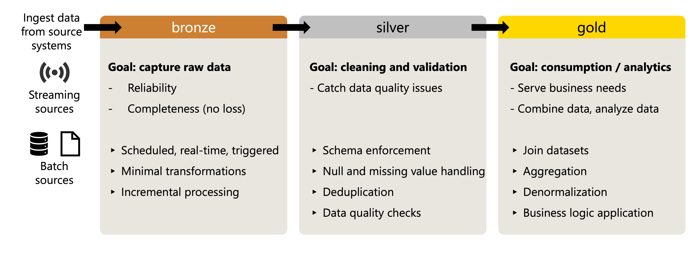
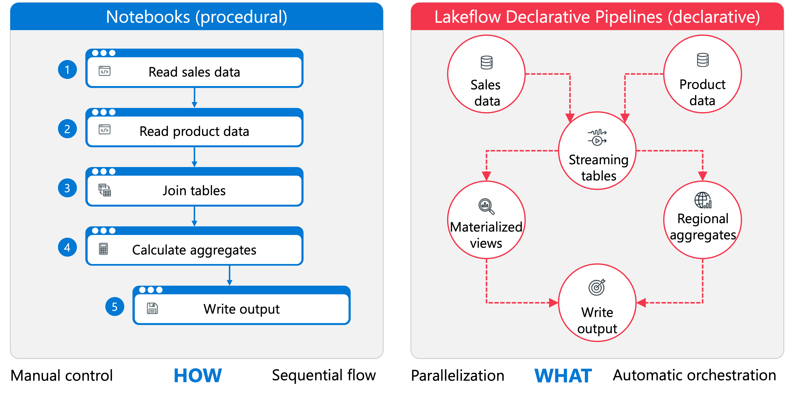
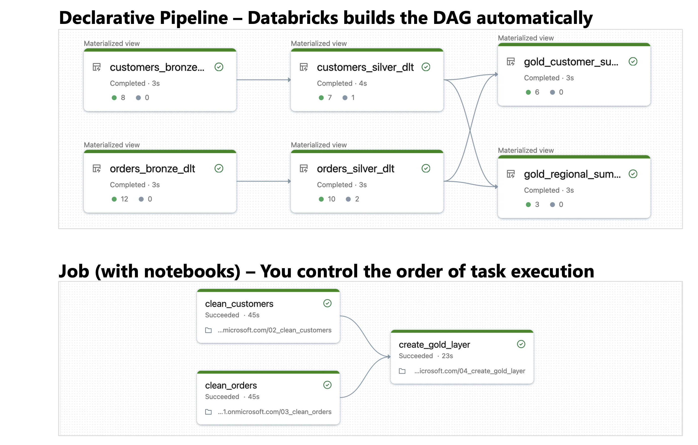
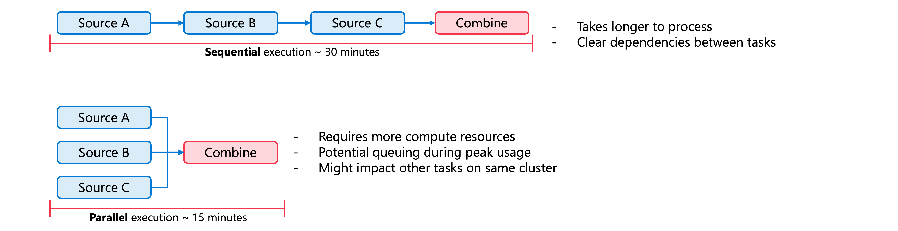
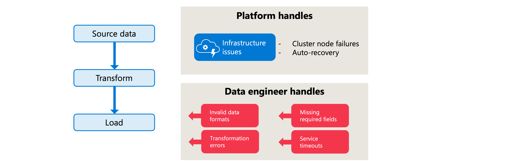

# Design and Implement Data Pipelines

> **Module:** Design and implement data pipelines with Azure Databricks (10 Units · Intermediate · Data Engineer)
> **Source:** [Microsoft Learn](https://learn.microsoft.com/en-gb/training/modules/design-implement-data-pipelines/)
> **In one line:** **Order of operations (medallion)** → **notebooks vs declarative pipelines** → **Lakeflow Job task logic (DAG, conditions, For each, parameters)** → **error handling** → build it both ways.

---

## 📌 Learning objectives

By the end of this module you should be able to:

- Design the **order of operations** for pipelines, from ingestion to serving
- Choose between **notebooks** and **Lakeflow Spark Declarative Pipelines**
- Design **task logic, dependencies and execution patterns** for Lakeflow Jobs
- Implement **error handling** — retry policies, expectations, notifications
- Create pipelines using **both** notebooks and declarative pipelines

**Prerequisites:** Azure Databricks workspaces · Unity Catalog fundamentals & governance · SQL and data organization principles.

---

## 1. Design the order of operations



The pipeline mirrors the **medallion architecture** — raw data flows through progressively refined layers.

### Ingest (bronze)

Goal = **reliability and completeness**; no data lost in transfer.

- **Source characteristics** — streaming sources (message queues) deliver continuously; batch sources (databases, file systems) at intervals.
- **Data preservation** — store with **minimal transformation**; the **raw state** lets you reprocess when downstream requirements change.
- **Incremental processing** — only new/changed data → less time and compute.

### Clean and validate (silver)

Catch quality issues early so they don't propagate:

- **Schema enforcement** — consistent types and structures.
- **Null/missing value handling** — fill defaults, drop, or flag for review.
- **Deduplication** — records entering via multiple ingestion paths or retries.
- **Data quality checks** — business constraints (valid date ranges, required fields).

> 📝 Separating cleaning from ingestion keeps **raw data for auditing** while giving transformations a reliable foundation.

### Transform (business logic)

- **Joining datasets** — unified views (customers + transactions).
- **Aggregation** — daily totals, monthly averages, regional summaries.
- **Denormalization** — flatten to optimize **query performance**.
- **Business logic** — calculations, categorizations, derived metrics.

Transformation logic should be **clear and testable** so requirement changes don't disrupt the rest of the pipeline.

### Load (gold)

- **Table design** — structure for common query patterns; **partitioning** aligned to how users filter.
- **Write patterns** — **full refresh** vs **incremental append** vs **merge**, based on volume and freshness.
- **Schema evolution** — plan for structural change without breaking dependents.

### Serve

- **Views and access layers** shaped for dashboards, reports, analytical queries.
- **Performance optimization** — compute and caching for latency requirements.
- **Access control** — consumers see only what they're authorized to see.

### Monitor and optimize

- **Processing metrics** — execution times, record counts, resource utilization → find bottlenecks.
- **Data quality trends** — detect gradual **drift** or spikes in invalid records.
- **Cost and performance** — right-size clusters, move non-urgent work off-peak.

---

## 2. Notebooks vs Lakeflow Spark Declarative Pipelines



- **Notebooks** = **procedural** — you specify **how** to process data, step by step, with full control over flow, error handling and optimization.
- **Declarative pipelines (SDP)** = you declare **what** the end result should be (streaming tables, materialized views); the engine handles **orchestration, parallelization and error recovery**.

> 📝 The foundational processing unit in SDP is a **flow** — reads a source, applies transformation logic, writes to a streaming table, materialized view or **sink**. Defining a streaming table or MV creates the flow **implicitly**. Because SDP analyses relationships between flows, it derives execution order and **maximizes parallelism with no orchestration code**.

### When notebooks fit best

- **Complex business logic** — conditional branching, loops over external APIs, custom retry logic that doesn't fit a declarative model.
- **Rapid prototyping** — iterate cell by cell, inspect intermediate results.
- **External library dependencies** — specialized ML libraries, custom connectors, legacy code.
- **Fine-grained performance tuning** — manual control of partitioning, caching, Spark configs.

### When declarative pipelines fit best

- **Standardized ETL patterns** — ingestion, schema evolution, SCDs → thousands of lines become a few statements.
- **Built-in data quality** — **expectations** defined in the pipeline; violations tracked, processing halted when quality degrades.
- **Automatic dependency management** — engine derives execution order and refreshes only **affected downstream tables**.
- **Operational visibility** — **lineage, execution graphs, monitoring dashboards** with no extra configuration.
- **External streaming targets** — **sinks** to Kafka, Azure Event Hubs, Delta tables and custom Python data sources → good fit for event-driven architectures.

### Comparison

| Criteria | **Notebook** | **Lakeflow Declarative Pipeline** |
|----------|-------------|-----------------------------------|
| **Control level** | Full control over execution | System manages execution |
| **Code complexity** | Verbose for standard patterns | Concise for common ETL |
| **Error handling** | Custom implementation required | **Built-in retry logic** |
| **Data quality** | Manual validation code | **Declarative expectations** |
| **Lineage tracking** | Requires external tooling | **Automatic** |
| **Team skillset** | Coding required | SQL-friendly, lower barrier |
| **Best for** | Custom logic, prototyping | **Production, repeatable pipelines** |

**Decision questions:** Does it need procedural logic that's hard to express declaratively? One-time analysis or recurring production workload? How much operational monitoring? Who maintains it — seasoned developers or a broader team?

> 💡 **Hybrid is common:** notebooks for custom preprocessing or ML training, declarative pipelines for the core ETL. You can also **refactor a successful notebook prototype into a declarative pipeline** once the logic stabilizes.

---

## 3. Design Lakeflow job logic

### Task relationships (DAG)



Lakeflow Jobs represent tasks and relationships as a **Directed Acyclic Graph (DAG)**. Dependencies determine execution order **and how failures propagate**.

| Dependency condition (**Run if**) | Behaviour |
|-----------------------------------|-----------|
| **All succeeded** | Runs only when **all** upstream tasks succeed |
| **At least one succeeded** | Runs when **any** upstream task succeeds |
| **None failed** | Runs when no upstream task failed, **even if some are skipped** |
| **All done** | Runs after all upstream tasks finish, **regardless of outcome** |
| **At least one failed** | Runs only when **at least one** upstream task fails |
| **All failed** | Runs only when **all** upstream tasks fail |

> Example: give a **cleanup task "All done"** so temporary resources are released whether or not earlier tasks succeeded.

> 💡 When debugging, **disable a task instead of deleting it** — a disabled task is skipped at runtime but keeps its configuration, dependencies and run history, so you can re-enable it without rebuilding.

### Execution patterns



Tasks without dependencies on each other **run simultaneously**, cutting total duration.

- ⚠️ Parallel execution needs **more compute**. Azure Databricks **limits concurrent task runs per workspace** → highly parallel jobs can **queue** during peak usage.
- Tasks on **shared compute** start faster but **share memory and CPU**; put resource-intensive tasks on **dedicated clusters**.

### Conditional logic

**If/else condition task** — branch on values or state, using task values, job parameters or dynamic references:

```
{{tasks.quality_check.values.invalid_count}} > 100
```

→ true branch runs remediation, false branch continues to standard transformation.

**Run if conditions** — branch on **upstream task outcomes** rather than data values (notify on failure, cleanup regardless, proceed when at least one source succeeded). Evaluated automatically from task state, no explicit value comparison.

### For each — iterative processing

Defines **one nested task** that runs once per element of an input array. Good for: files from a list of paths · multiple regions or date ranges · analysis across product categories.

The array can be literal JSON, a **task value** from a preceding task, or a job parameter:

```python
regions = ["us-east", "us-west", "eu-central"]
dbutils.jobs.taskValues.set(key="regions_to_process", value=regions)
```

The For each task then references `{{tasks.get_regions.values.regions_to_process}}` and runs its nested task three times.

> **Concurrency** is configurable — more parallel iterations = faster but more compute.

### Parameters

Patterns worth designing in:

- **Date/time parameters** — same job for scheduled runs and **backfills**.
- **Environment parameters** — dev/staging/prod catalog names, storage paths, connection settings.
- **Processing parameters** — batch sizes, filter criteria, output formats.

Reference a job parameter in a task with **`{{job.parameters.<name>}}`**, then read it in the notebook:

```python
target_catalog = dbutils.widgets.get("target_catalog")
spark.sql(f"USE CATALOG {target_catalog}")
```

**Dynamic value references** inject runtime context: **`{{job.trigger.time.iso_date}}`** (scheduled trigger date) · **`{{backfill.iso_datetime}}`** (backfill timestamp).

### Compute per task type

| Task type | Recommended compute |
|-----------|--------------------|
| **Notebooks, Python scripts** | Serverless **jobs compute** |
| **SQL queries and files** | Serverless **SQL warehouse** |
| **Lakeflow Spark Declarative Pipelines** | Serverless **pipeline compute** |
| **JAR and Spark Submit** | **Classic jobs compute** |

- Tasks in the same job **can use different compute**; a common pattern puts SQL tasks on a warehouse and notebook transformations on jobs compute.
- ⚠️ A **shared cluster stays active until all its tasks complete** → less startup time, but cost during idle gaps.
- **Serverless** removes cluster management and autoscales; **classic** gives control over Spark versions, custom libraries and instance types.

---

## 4. Design error handling



> 📝 **Division of responsibility:** the platform handles **infrastructure-level issues** (cluster node failures) automatically. **You handle data-level errors and application logic failures.**

Typical error sources: invalid formats / missing required fields · transformation logic hitting unexpected values · external service timeouts · compute unavailability. Each warrants a different response.

### Expectations in declarative pipelines

| Action | Behaviour | Use case |
|--------|-----------|----------|
| **Warn** | Invalid records **written to target**; metrics logged | Monitoring quality trends |
| **Drop** | Invalid records **excluded** from target | Preventing bad data propagating |
| **Fail** | Pipeline **stops immediately** | Critical constraints that must never be violated |

> 💡 When a **fail** expectation triggers, **only that flow stops** — other parallel flows in the same pipeline keep processing. This isolation stops one data quality issue halting the whole platform.

### Job-level error handling

**Retry policies** — for transient failures (network timeouts, temporary resource constraints, brief outages):

- **Retry count** — attempts before marking failed (**typically 1–3**).
- **Retry interval** — time between attempts.
- **Continuous jobs** automatically apply **exponential backoff** — each consecutive failure increases the wait.

**Timeouts:**

- **Expected duration** → triggers a **warning notification** if exceeded.
- **Maximum duration** → **terminates** the task if exceeded.
- **Streaming backlog metric thresholds** (task config → **Metric thresholds**) fire a notification when a source's backlog exceeds your threshold — early warning of lag. **Public Preview.**

**Notifications** — email · Slack · Microsoft Teams · PagerDuty · custom webhooks; triggered on **start, success, failure or duration thresholds**.

> ⚠️ **Task-level notifications fire on every retry attempt.** Select **"Mute notifications until the last retry"** to avoid notification fatigue.

**Conditional task flows** — **All succeeded** (continue on full success) · **At least one failed** (trigger error handling/cleanup) · **All done** (cleanup regardless).

### Error handling in notebooks

**Catch specific exceptions:**

```python
from pyspark.errors import PySparkException

try:
    df = spark.read.table("source_data")
    transformed = df.filter("amount > 0")
    transformed.write.mode("append").saveAsTable("target_data")
except PySparkException as e:
    if e.getErrorClass() == "TABLE_OR_VIEW_NOT_FOUND":
        print(f"Source table not found: {e.getMessageParameters()['relationName']}")
    else:
        raise  # re-raise unexpected errors
```

- **`PySparkException`** = base class for PySpark errors · **`getErrorClass()`** returns a standardized code (`TABLE_OR_VIEW_NOT_FOUND`) · **`getMessageParameters()`** gives context (the missing table name).
- **Re-raise what you don't explicitly handle** so unexpected issues aren't silently ignored.

**Retry with exponential backoff:**

```python
import time

def run_with_retry(operation, max_retries=3, base_delay=10):
    for attempt in range(max_retries + 1):
        try:
            return operation()
        except Exception as e:
            if attempt == max_retries:
                raise
            delay = base_delay * (2 ** attempt)
            print(f"Attempt {attempt + 1} failed, retrying in {delay}s: {e}")
            time.sleep(delay)
```

**Signal results to the job:**

```python
try:
    records_processed = process_data()
    dbutils.notebook.exit(f"SUCCESS: Processed {records_processed} records")
except Exception as e:
    dbutils.notebook.exit(f"FAILED: {str(e)}")
```

Downstream tasks can use these values in conditional logic or reporting.

### Best practices

**Fail fast for critical errors** (corrupt data downstream is worse) · **log meaningful context** (timestamps, record counts, error classifications — without exposing sensitive data) · **plan for recovery** (idempotent operations; only failed tasks need re-running) · **monitor trends** (rising dropped-record counts signal upstream change) · **test failure scenarios** deliberately in development.

---

## 5. Create a pipeline with notebooks

### Notebook tasks and the DAG

Each notebook task is a **node in the DAG**. Without dependencies, notebooks could run simultaneously — the transformation notebook would try to read data that hasn't been ingested yet.

**Add a dependency:** select a task in the DAG → **Depends on** field → choose the upstream task → **Save task**.

> 💡 If a task is **selected when you create a new task**, the new task **automatically depends on it** — quick way to build sequential pipelines.

```
Task 1 (ingest_data)
    ├── Task 2 (transform_customers)
    └── Task 3 (transform_orders)
            └── Task 4 (generate_report)
```

→ Task 1 runs first; **Tasks 2 and 3 run in parallel**; Task 4 starts only after both finish.

### Creating the job

1. **Jobs & Pipelines** (sidebar) → **Create** → **Job**
2. Task name describing its purpose (e.g. `ingest_sales_data`)
3. **Type** → **Notebook**
4. **Source** → **Workspace**
5. **Path** → browse to the notebook
6. Configure **Compute**
7. **Create task**

### Passing parameters

Task config → **Parameters** → **Add** → **Key** / **Value** → **Save task**. In the notebook:

```python
dbutils.widgets.text("process_date", "2024-01-01", "Process Date")
process_date = dbutils.widgets.get("process_date")

df = spark.read.table("sales_raw").filter(f"date = '{process_date}'")
```

### Best practices

- **Descriptive task names** (`bronze_ingest_orders`, `silver_transform_customers`) make the DAG self-explanatory.
- **Organize notebooks in folders** mirroring the pipeline (`/pipelines/sales/bronze/`, `/pipelines/sales/silver/`).
- **Minimize dependencies** — excessive ones reduce parallelism; add them only where a **true data relationship** exists.
- ⚠️ **Use workspace notebooks (not Git-folder notebooks) for production jobs that track MLflow** — notebooks run from remote Git repos are **ephemeral** and can't reliably track MLflow runs or models.
- ⚠️ **Output limits:** notebook cell output is capped at **20 MB total**, **8 MB per cell** — write large results to tables instead of displaying them.

---

## 6. Create a pipeline with Lakeflow Spark Declarative Pipelines

### Three benefits of the declarative approach

- **Automatic orchestration** — the framework analyses dependencies and derives execution order (a silver table reading bronze → bronze processes first).
- **Incremental processing** — streaming tables process each record **exactly once**; materialized views process **only changed data** where possible, avoiding full recomputation.
- **Built-in retry logic** — retries at the **most granular level first**: **Spark task → flow → pipeline**.

### Streaming tables (ingestion)

A **streaming table** = Delta table optimized for **append-only** processing, each record handled **exactly once**.

```sql
CREATE OR REFRESH STREAMING TABLE customers_bronze
AS SELECT * FROM STREAM read_files(
  "/Volumes/raw_data/customers",
  format => "json"
);
```

```python
from pyspark import pipelines as dp

@dp.table
def customers_bronze():
  return (
    spark.readStream.format("cloudFiles")
     .option("cloudFiles.format", "json")
     .option("cloudFiles.inferColumnTypes", "true")
     .load("/Volumes/raw_data/customers")
  )
```

The **`STREAM`** keyword makes the source a streaming dataset → each update processes **only new files**.

### Materialized views (transformations)

Cache query results and stay **synchronized with upstream changes**; handle **aggregations, complex joins, updates and deletes**.

```sql
CREATE OR REPLACE MATERIALIZED VIEW customer_transactions
AS SELECT c.customer_id, c.customer_name, c.region,
          t.transaction_date, t.amount
FROM customers c
INNER JOIN transactions t ON c.customer_id = t.customer_id;
```

```python
@dp.materialized_view
def regional_sales():
  customers_df = spark.read.table("customers")
  transactions_df = spark.read.table("transactions")
  return (customers_df.join(transactions_df, on="customer_id", how="inner")
          .groupBy("region")
          .agg({"amount": "sum"}))
```

> 💡 **Streaming table** when the source is **append-only** and you need low latency. **Materialized view** for aggregations, complex joins, or when the source has **updates and deletes**.

### Expectations

| Action | Behaviour |
|--------|-----------|
| **`EXPECT`** (default) | **Retains** invalid records, tracks violation counts in metrics |
| **`ON VIOLATION DROP ROW`** | Removes invalid records from the output |
| **`ON VIOLATION FAIL UPDATE`** | Stops the **current flow**; other flows continue. **Manual intervention required** before reprocessing |

### Lakeflow Pipelines Editor

> ⚠️ These are **pipeline definitions, not interactive notebook code** — the `pyspark.pipelines` module and streaming-table DDL are **only available in the Lakeflow pipeline runtime**. Validate with **Dry run**, then run the pipeline through Jobs & Pipelines.

Editor features:

- **Genie Code** — describe the pipeline in natural language; agentic creation, updating and debugging, from data discovery through execution and resolving data quality issues.
- **Dry run** — validates code **without processing data** (syntax errors, missing dependencies).
- **Selective execution** — run individual files or a **single table definition** for faster iteration.
- **Interactive DAG** — visualize dependencies, select multiple tables for targeted refreshes, inspect metrics.
- **Data preview** — sample data from streaming tables and MVs in the editor.

Default folder structure separates **transformation source code**, **exploratory notebooks** and **utility modules**.

---

## 7. Summary

- **Order of operations** follows the medallion model: ingest (raw preserved) → clean/validate → transform → load → serve → monitor.
- **Notebooks** for flexibility, prototyping and custom integrations; **declarative pipelines** for production ETL with automatic orchestration, incremental processing and dependency analysis — **combine both** where each is strongest.
- **Lakeflow Jobs**: DAG with six dependency conditions, If/else branching, **For each** iteration, job parameters + dynamic value references, per-task compute.
- **Error handling**: expectations (warn/drop/fail) in pipelines · retry policies, timeouts and notifications at job level · try/except, backoff and `dbutils.notebook.exit()` in notebooks.

---

## 🧠 Quick revision cheat-sheet

| Concept | Remember this |
|---------|---------------|
| **Pipeline stages** | Ingest (bronze) → clean/validate (silver) → transform → load (gold) → serve → monitor |
| **Why separate ingest & clean** | Raw data preserved for **auditing** and reprocessing |
| **Notebook vs SDP** | Procedural "how" (full control) vs declarative "what" (engine orchestrates) |
| **SDP flow** | Reads source → transforms → writes to streaming table, MV or **sink**; created implicitly by table definitions |
| **SDP sinks** | Kafka, Azure Event Hubs, Delta tables, custom Python data sources |
| **Notebooks best for** | Complex/procedural logic, prototyping, external libraries, manual tuning |
| **SDP best for** | Standard ETL, expectations, automatic dependencies, **automatic lineage**, streaming targets |
| **Job DAG** | **Directed Acyclic Graph**; dependencies control order **and failure propagation** |
| **Run if conditions** | All succeeded · At least one succeeded · **None failed** (skips OK) · **All done** (any outcome) · At least one failed · All failed |
| **Cleanup task** | Use **All done** so it runs regardless of upstream outcome |
| **Debugging tasks** | **Disable** rather than delete — keeps config, dependencies and run history |
| **Parallelism limits** | Workspace caps **concurrent task runs** → highly parallel jobs may queue |
| **Shared vs dedicated compute** | Faster startup, shared memory/CPU vs isolation for heavy tasks; **shared cluster stays up until all tasks finish** |
| **If/else task** | Branch on values: `{{tasks.<task>.values.<key}} > 100` |
| **For each** | One nested task per array element; array from JSON, **task value** or job parameter; **configurable concurrency** |
| **Set a task value** | `dbutils.jobs.taskValues.set(key=..., value=...)` |
| **Job parameter reference** | **`{{job.parameters.<name>}}`** → read with `dbutils.widgets.get()` |
| **Dynamic values** | `{{job.trigger.time.iso_date}}` · `{{backfill.iso_datetime}}` |
| **Compute per task type** | Notebooks/Python → serverless **jobs compute** · SQL → **SQL warehouse** · SDP → **pipeline compute** · **JAR/Spark Submit → classic** |
| **Error responsibility** | Platform = infrastructure (node failures); **you = data-level & application logic** |
| **Expectation actions** | Warn (written + logged) · Drop (excluded) · **Fail (only that flow stops; others continue)** |
| **Retry policy** | Count (typically **1–3**) + interval; **continuous jobs use exponential backoff** |
| **Timeouts** | **Expected duration** → warning · **Maximum duration** → terminates |
| **Streaming backlog thresholds** | Task config → **Metric thresholds**; notification on lag (**Public Preview**) |
| **Notification fatigue** | Task notifications fire **per retry** → enable **"Mute notifications until the last retry"** |
| **Notification channels** | Email, Slack, Teams, PagerDuty, custom webhooks |
| **PySpark exceptions** | `PySparkException` + `getErrorClass()` (e.g. `TABLE_OR_VIEW_NOT_FOUND`) + `getMessageParameters()`; **re-raise the unexpected** |
| **Notebook → job result** | `dbutils.notebook.exit("SUCCESS: …")` |
| **Auto-dependency in UI** | Creating a task while another is selected makes it **depend on the selected task** |
| **Notebook output limits** | **20 MB total**, **8 MB per cell** → write big results to tables |
| **Git-folder notebooks** | **Ephemeral** — can't reliably track MLflow runs/models; use workspace notebooks in production |
| **SDP retry granularity** | **Spark task → flow → pipeline** |
| **Streaming table vs MV** | Append-only, exactly-once, low latency vs aggregations/joins/updates & deletes |
| **`STREAM` keyword** | Marks a streaming source → only new files processed each update |
| **Pipeline code caveat** | `pyspark.pipelines` + streaming-table DDL **only run in the pipeline runtime**, not in a plain notebook |
| **Editor features** | **Genie Code** · **Dry run** (validate, no data processed) · selective execution · interactive DAG · data preview |