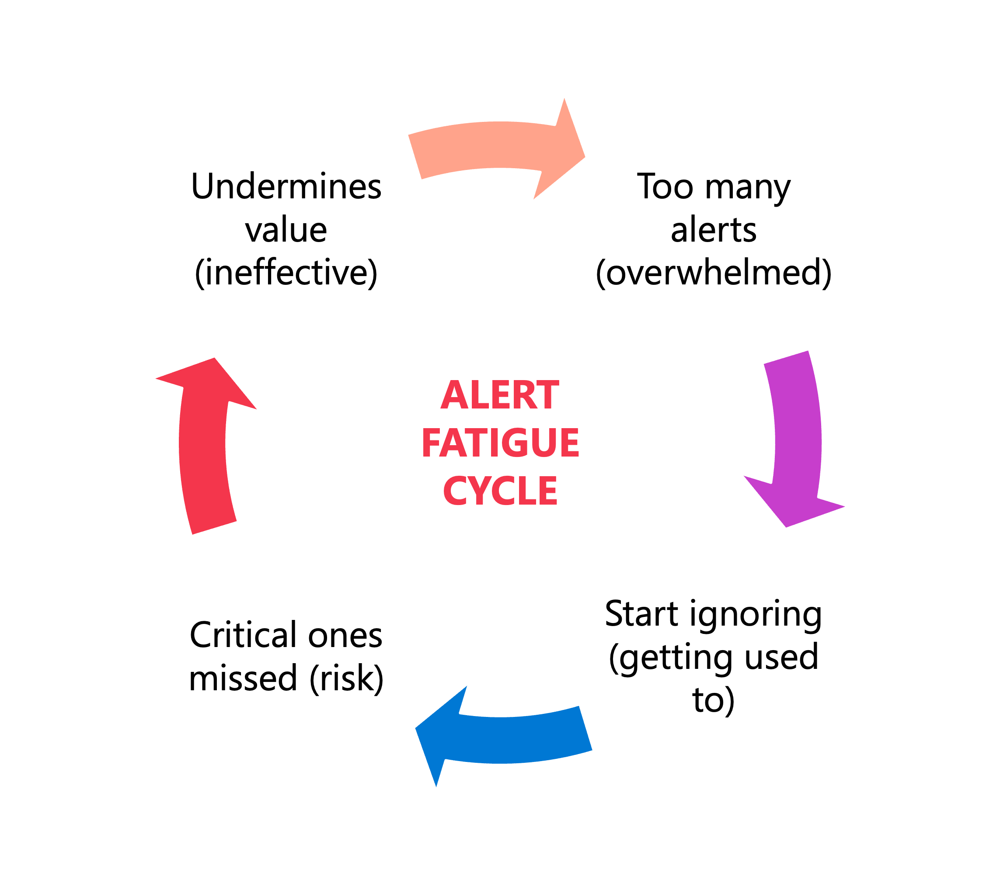
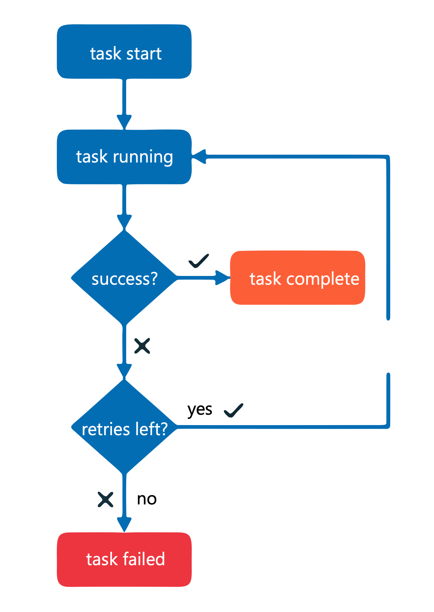
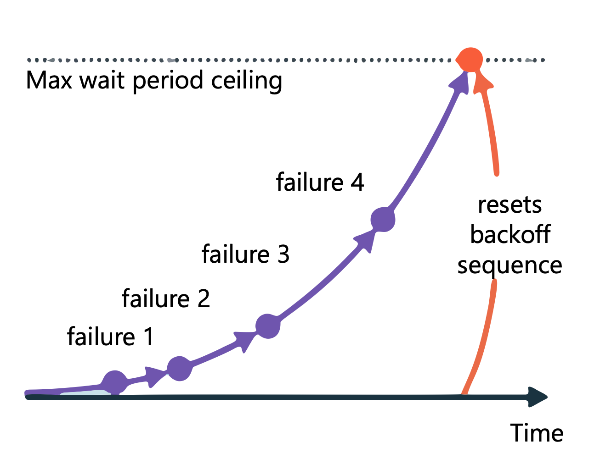
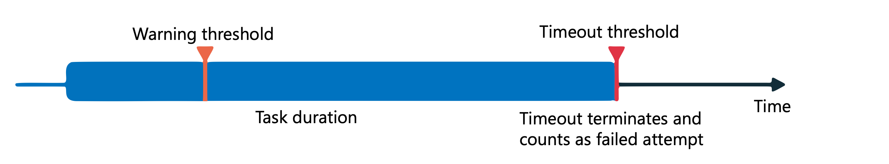

# Implement Lakeflow Jobs

> **Module:** Implement Lakeflow Jobs with Azure Databricks (9 Units · Intermediate · Data Engineer)
> **Source:** [Microsoft Learn](https://learn.microsoft.com/en-gb/training/modules/implement-lakeflow-jobs/)
> **In one line:** Build the job (**tasks, compute, dependencies, permissions**) → fire it (**triggers & cron schedules**) → watch it (**alerts**) → keep it alive (**retries, backoff, timeouts**).

---

## 📌 Learning objectives

By the end of this module you should be able to:

- Create and configure **Lakeflow Jobs** with tasks and compute resources
- Configure **job triggers** including table updates and file arrivals
- **Schedule** jobs using intervals and cron expressions
- Configure **job alerts and notifications**
- Configure **automatic restarts** and retry policies

**Prerequisites:** Azure Databricks workspaces · data engineering concepts.

---

## 1. Create job setup and configuration

### Job structure

A job = one or more **tasks** organized as a **Directed Acyclic Graph (DAG)**.

**Every job needs at minimum:** a **task** (the logic) · a **compute resource** · a **unique name**.

### Task types

| Task type | Key configuration | Compute options |
|-----------|------------------|-----------------|
| **Notebook** | Notebook path, parameters | Serverless, classic jobs, all-purpose |
| **Python script** | Script path, CLI arguments | Serverless, classic jobs, all-purpose |
| **Python wheel** | Wheel package path, entry point | Serverless, classic jobs, all-purpose |
| **SQL** | Query or file, SQL warehouse | **Serverless or pro SQL warehouse** |
| **Pipeline** | Existing pipeline selection | Serverless or classic pipeline compute |
| **dbt / dbt platform** | dbt project, profiles | Serverless or classic jobs compute |
| **JAR** | Main class, JAR path | **Classic jobs compute** |
| **Spark Submit** | Spark parameters | **Classic jobs compute** |
| **Run Job** | Existing job selection | Determined by the referenced job |

Plus control-flow types: **If/else** (condition → different downstream paths) and **For each** (same logic over every item in an array).

**Create:** sidebar → **Jobs & Pipelines** → **Create** → **Job** → name → **Task name** + **Type** → **Create task**.

### Task sources

| Source | Details |
|--------|---------|
| **Workspace** | Code stored in the workspace; browse to the notebook/script. Good for development and simple workflows |
| **Git provider** | Repository URL + branch/tag + relative path. **All tasks in a job share the same Git reference**; Databricks **snapshots the code at run time** so the job runs against a specific commit |
| **DBFS/ADLS** (Python scripts) | Full URI, e.g. `abfss://container@storage.dfs.core.windows.net/path/script.py` |

### Compute

- **Serverless compute** — **default** for supported task types; no cluster settings, autoscales, less operational overhead.
- **Classic jobs compute** — control over Spark version, instance types, autoscaling policies; needed for unsupported configurations/libraries.
- **SQL warehouses** — for SQL tasks (serverless or pro).

> ⚠️ When tasks **share** a compute resource, the **cluster stays active until all of them complete** — faster task-to-task startup, but cost during idle gaps.

**View/modify:** open job → **Job details** panel → **Compute** → **Configure** (classic) or **Swap** (change compute for all tasks using that resource).

### Dependencies and Run if

Select a task → **Depends on** (upstream tasks) → **Run if** condition:

| Condition | Task runs when |
|-----------|----------------|
| **All succeeded** | All upstream tasks succeeded |
| **At least one succeeded** | Any upstream task succeeded |
| **None failed** | No upstream task failed (**some may be skipped**) |
| **All done** | All upstream tasks finished, **regardless of outcome** |
| **At least one failed** | At least one upstream task failed |
| **All failed** | All upstream tasks failed |

> **All done** → cleanup tasks that must run regardless. **At least one failed** → error-handling logic.

### Job parameters

**Job details** panel → **Parameters** → **Add** → key-value pair. Available to all tasks that accept key-value inputs.

- **Notebooks:** `dbutils.widgets.get("parameter_name")`
- **Python scripts:** received as **command-line arguments**
- **Dynamic values:** e.g. `{{job.trigger.time.iso_date}}` inserts the trigger date

### Tags

**Job details** → **+ Tag** → key (+ optional value). Group jobs by team, project or environment.

> 📝 Tags **propagate to job clusters** → consistent monitoring and **cost attribution**.

### Permissions

| Level | Capabilities |
|-------|-------------|
| **CAN VIEW** | View configuration, task definitions, run history |
| **CAN RUN** | + trigger runs manually |
| **CAN MANAGE RUN** | + cancel runs, view output, restart failed runs |
| **CAN MANAGE** | + edit configuration, modify tasks, change schedules, **set permissions** |

Configure: **Jobs & Pipelines** → job → **Permissions** tab. **Job creators and workspace admins get `CAN MANAGE` automatically.**

> ⚠️ A job runs with the **job owner's** (or configured **service principal's**) permissions — **not the triggering user's**.

**Production pattern:** `CAN MANAGE` → pipeline team · `CAN RUN` → users needing manual execution · `CAN VIEW` → stakeholders.

### Run identity & Unity Catalog access

The **run identity** is the principal whose permissions UC evaluates. Default = **job owner**; for production use a **service principal** so the job doesn't depend on an individual account.

| Operation | Required UC privilege |
|-----------|----------------------|
| Read from a table | **`SELECT`** on the table |
| Write to a table | **`MODIFY`** on the table |
| Create tables in a schema | **`CREATE TABLE`** + **`USE SCHEMA`** on the schema |
| Access a volume | **`READ VOLUME`** / **`WRITE VOLUME`** |

```sql
GRANT SELECT, MODIFY ON TABLE catalog.schema.table TO `service-principal-id`;
GRANT USE SCHEMA ON SCHEMA catalog.schema TO `service-principal-id`;
```

> ⚠️ Missing privileges → the job **fails at runtime with an authorization error even though the configuration is valid**. Verify UC access before scheduling production jobs.

---

## 2. Configure job triggers

| Trigger type | Behaviour |
|--------------|-----------|
| **Table update** | Runs when monitored tables receive new data or modifications |
| **File arrival** | Runs when new files appear in a UC storage location |
| **Continuous** | Runs immediately after the previous run **completes or fails** |

**Add:** open job → **Job details** pane → **Schedules & Triggers** → **Add trigger**.

### Table update triggers

Monitors UC tables for **inserts, updates, merges, deletes** — no continuously running cluster needed.

**Supported table types:** UC **Delta and Iceberg managed** tables · UC **external tables backed by Delta Lake** · **materialized views and streaming tables** · **UC views depending on supported tables**.

**With multiple tables:**

- **Any table is updated** → run when any monitored table changes (faster response).
- **All tables are updated** → wait until **every** monitored table has been updated (when logic needs all sources current).

**Advanced timing:**

- **Minimum time between triggers** — waiting period after a job completes before the next run may start, even if tables changed during the window.
- **Wait after last change** — delay after an update, **resetting if more updates arrive** → batches rapid successive updates into one run.

**Dynamic parameter values:**

```
{{job.trigger.table_update.updated_tables}}
{{job.trigger.table_update.<catalog.schema.table>.commit_timestamp.iso_datetime}}
{{job.trigger.table_update.<catalog.schema.table>.version}}
```

> 💡 Enable **file events** on the external location holding the tables — cloud change notifications track updates far more efficiently (one-time setup).

### File arrival triggers

Monitors an external location or volume **recursively** (all subdirectories); **best-effort check roughly every minute** (cloud storage performance affects timing).

```
/Volumes/mycatalog/myschema/myvolume/
/Volumes/mycatalog/myschema/myvolume/incoming/
```

**Prerequisites:** Unity Catalog-enabled workspace · **READ** on the storage location · **CAN MANAGE** on the job.

> ⚠️ **Only new files trigger a run — overwriting an existing file with the same name does NOT.** Design deliveries to use **unique file names** per batch.

> ⚠️ **Without file events enabled:** max **50 jobs** with file arrival triggers per workspace, and each monitored location may contain at most **10,000 files**. **With file events enabled these limits don't apply.**

Also supports **Minimum time between triggers** and **Wait after last change**.

### Continuous triggers

New run starts immediately after the previous completes **or fails** → resilient to transient errors. Suits streaming/low-latency processing, always-on monitoring, high-volume ETL.

> ⚠️ **Cost:** continuously consumes compute. Serverless helps by autoscaling.

> ⚠️ **Continuous jobs on serverless compute only support bounded Structured Streaming triggers** such as **`Trigger.AvailableNow`**. **`Trigger.ProcessingTime` and `Trigger.Continuous` are NOT supported on serverless** — use **classic jobs compute** for those, or **Declarative Pipelines in continuous mode** for low-latency streaming on serverless.

> 📝 Resuming a paused continuous trigger while a run is still active → the scheduler **waits for that run to complete** before triggering a new one.

### Trigger lifecycle

**Job details** → **Schedules & Triggers** → **Pause** / **Resume**. Pausing stops new runs but **lets active runs finish**, keeping the configuration.

Configure notifications to catch **trigger evaluation failures** (permission changes, deleted tables).

---

## 3. Schedule a job

### Simple schedules

**Job details** → **Add trigger** → **Trigger type: Scheduled** → **Schedule type: Simple** → interval (minutes/hours/days/weeks) → **Save**.

> ⚠️ You **can't control when the first run happens** — the scheduler picks a time when you save; subsequent runs follow the interval.

> 📝 **Minimum interval between job runs = 10 seconds**, regardless of configuration.

### Advanced schedules (cron)

**Add trigger** → **Scheduled** → **Advanced** → period, starting time, time zone → optionally **Show Cron Syntax** → **Save**.

| Field | Required | Allowed values | Special characters |
|-------|----------|----------------|--------------------|
| **Seconds** | Yes | 0–59 | `, - * /` |
| **Minutes** | Yes | 0–59 | `, - * /` |
| **Hours** | Yes | 0–23 | `, - * /` |
| **Day of month** | Yes | 1–31 | `, - * ? / L W` |
| **Month** | Yes | 1–12 or JAN–DEC | `, - * /` |
| **Day of week** | Yes | 1–7 or SUN–SAT | `, - * ? / L #` |
| **Year** | **No** | empty, 1970–2099 | `, - * /` |

**Special characters:**

- **`*`** — all values in the field
- **`?`** — "no specific value"; use in day-of-month **or** day-of-week when you've specified the other
- **`-`** — ranges (`10-12`)
- **`,`** — lists (`MON,WED,FRI`)
- **`/`** — increments (`0/15` in minutes = every 15 minutes from 0)
- **`L`** — "last" (last day of month; **`6L`** = last Friday)
- **`#`** — nth occurrence (**`6#3`** = third Friday of the month)

| Expression | Schedule |
|------------|----------|
| `0 0 12 * * ?` | Every day at noon |
| `0 15 10 ? * MON-FRI` | Weekdays at 10:15 AM |
| `0 0 8 1 * ?` | First day of every month at 8:00 AM |
| `0 30 6 ? * 6L` | **Last Friday** of every month at 6:30 AM |
| `0 0 */2 * * ?` | Every 2 hours |

### Time zones

> ⚠️ **DST time zones cause skipped or shifted runs** when daylight saving starts/ends. For consistent absolute-time execution, **use UTC**.

Consider: **business alignment** (stakeholders expecting 8 AM local → local zone, accept DST shifts) · **data consistency** (UTC-timestamped sources → UTC) · **cross-region coordination** (UTC as single reference).

### Concurrency

**Maximum concurrent runs** — how many instances of the same job may run at once. **Default allows multiple**; set to **1** for jobs that must not overlap (e.g. writing to the same tables). Configure in **Job details**.

**When the limit is reached:**

| Behaviour | Description | Use case |
|-----------|-------------|----------|
| **Queue the run** | Waits for a slot, then executes | Jobs that must **eventually run** — no triggers missed |
| **Cancel the run** | Immediately canceled | Stale triggers aren't valuable |
| **Skip the run** | Doesn't execute | Missing occasional runs is acceptable |

**Example** — hourly job whose run takes 75 minutes, concurrency 1 + queue: first run continues → second enters the queue → starts immediately when the first completes. Sequential, non-overlapping, no lost runs.

> 📝 **Queued runs consume no compute** while waiting.

### Production considerations

The scheduler **isn't designed for low-latency requirements** — network or cloud issues can delay starts by several minutes; jobs run immediately once service recovers.

- Schedule **buffer time** between dependent pipelines
- Don't rely on **sub-minute precision**
- Monitor run history for scheduling patterns/delays
- Remember the **10-second minimum** when planning high-frequency jobs

---

## 4. Configure job alerts

### Notification events

| Event | Fires when | Use case |
|-------|-----------|----------|
| **Start** | Run begins | Confirm scheduled jobs started |
| **Success** | Job completes successfully | Verify completion, trigger downstream |
| **Failure** | Job terminates with error | Investigate, incident response |
| **Duration warning** | Run exceeds threshold | Performance degradation, runaway jobs |
| **Streaming backlog** | Backlog exceeds threshold **for 10 minutes** | Streaming job health |

> ⚠️ **"Succeeded with failures"** — some tasks failed but the job finished — is **counted as a success**. For visibility into partial failures, configure Success notifications accordingly or add **task-level notifications**.

### Destinations

**Email addresses** or **system destinations**: **Slack** · **Microsoft Teams** · **PagerDuty** · **HTTP webhooks**.

> System destinations must first be created by a **workspace administrator**: **Admin Settings** → **Notifications**. Each needs credentials (webhook URLs for Slack/Teams, integration keys for PagerDuty).

> 💡 Use **different credentials per destination** — a compromised endpoint can then be revoked without affecting the others.

> 📝 **Up to three system destinations per event type**, per job or task.

### Adding notifications

**Job-level:** job → **Job details** → **Job notifications** → **Edit notifications** → **Add notification** → destination → event types → **Save**.

> ⚠️ **Job-level notifications are NOT sent when individual tasks fail and retry.**

**Task-level:** edit job → select task → **Notifications** → **Add** → destination + events → save. Fires per **task run** — you learn immediately which step failed.

> 📝 **Databricks retries failed tasks three times by default.** Select **"Mute notifications until the last retry"** to avoid one alert per attempt.

### Reducing noise



- **Mute notifications for skipped runs / canceled runs.** ⚠️ These mute options apply **only to job-level notifications** — set the same filters on **each task** separately if you use task-level notifications.
- **Duration warnings based on history** — a job that usually takes 30 min warrants a warning at 45, not 35.
- **Separate task and job notifications** — do you need to know *that* the job failed, or *which task* failed?
- **Document alert logic** — why it exists, what triggers it, what the recipient should do.

### HTTP webhooks

JSON payload with event type, workspace ID, job and run details:

```json
{
  "event_type": "jobs.on_failure",
  "workspace_id": "your_workspace_id",
  "run": { "run_id": "run_id" },
  "job": { "job_id": "job_id", "name": "job_name" }
}
```

Full control over message structure — useful for monitoring platforms with specific schema requirements.

### Azure Data Factory monitoring

When ADF orchestrates Databricks jobs, the Azure portal adds visual monitoring of **pipeline runs, activity status and duration**, plus alerts on **pipeline run status** (failed/succeeded/canceled), **activity run counts** and **Integration Runtime utilization**.

Configure at **Monitor → Alerts & metrics** in the Data Factory portal (conditions, severity, action groups for email/SMS).

> Layered approach: **Databricks notifications** for job-level events + **ADF alerts** for orchestration-level metrics.

---

## 5. Configure automatic restarts

### Default retry behaviour

> ⚠️ **For most job configurations the default is NOT to retry tasks on failure** — you must configure retry policies explicitly. Two exceptions:

- **Serverless jobs** — **auto-optimize retries by default** so critical workloads complete.
- **Continuous jobs** — **exponential backoff** policy that automatically retries the whole job on failure.

> 📝 Jobs that must execute exactly once (**non-idempotent operations**) require **disabling auto-optimization**.

### Task-level retry policies



**Jobs & Pipelines** → job → **Tasks** tab → select task → **+ Add** next to **Retries** → number of attempts + interval.

> 📝 The **retry interval is measured in milliseconds from the start of the failed run** to the retry run. Interval 60,000 ms (1 min) and the task failed after 30 s → the retry starts **30 seconds after the failure**.

> 💡 **1–3 retries** for most workloads; **never unlimited** — persistent failures just waste resources.

> ⚠️ With both timeout and retry configured, the **timeout applies to each retry attempt**. A timeout counts as a failed attempt and triggers a retry if attempts remain.

### Continuous jobs

**Job details** → **Add trigger** → **Trigger type: Continuous** → optionally **Task retry mode** → **Save**.

| Task retry mode | Behaviour |
|-----------------|-----------|
| **On failure** (**default for new continuous jobs**) | Retry failed tasks within a job |
| **Never** | Retry only at the **job** level |

> 📝 Converting an **existing** job to continuous mode may require selecting **Configure retry mode** first before the task retry mode option appears.



**Exponential backoff:**

1. Consecutive failures exceed a threshold → the job **waits** before the next retry.
2. Each subsequent failure **increases the wait**, up to a system maximum.
3. A successful run — or running without failure for a threshold period — **resets the backoff sequence**.

> ⚠️ **Continuous jobs don't support task dependencies or traditional task-level retry policies** — use **Task retry mode** instead.

Monitor backoff state in the **Job details** panel: consecutive failures, success threshold period, time until the next retry.

### Timeout thresholds



Task configuration → **Metric thresholds** → **Metric: Run duration** →

- **Warning** field → notification when the task exceeds expected completion time
- **Timeout** field → **terminates** the task past maximum completion time

A timed-out task gets status **"Timed Out"** and follows the retry policy: retries remaining → restart; exhausted → task fails and dependents react per the job's dependency configuration.

### Combining restarts with notifications

Alert when: a task **exceeds its warning threshold** · a task **fails after exhausting retries** · a continuous job **enters exponential backoff**. Use **"Mute notifications until the last retry"** to avoid alert fatigue.

### Best practices

- **Match retry strategy to failure type** — network timeouts → quick retries, short intervals; resource failures → longer intervals to let systems recover.
- **Reasonable limits** — max **3 retries**, intervals **30 s to 5 min** for most transient failures.
- **Monitor retry patterns** — rising retry usage signals infrastructure or data quality problems.
- **Design for idempotency** — safe re-execution makes automatic restarts predictable.
- **Document your configuration** — why those limits and intervals.

---

## 6. Summary

- **Jobs** = tasks in a **DAG** + compute + a name; task types range from notebooks to JAR/Spark Submit (classic compute only); sources are Workspace, Git (snapshot at run time) or DBFS/ADLS.
- **Permissions** (VIEW → RUN → MANAGE RUN → MANAGE) are separate from compute permissions; the job runs as the **owner or service principal**, which needs the right **Unity Catalog privileges**.
- **Triggers:** table update (any/all, with batching windows), file arrival (new files only; limits without file events), continuous (restarts on completion or failure).
- **Schedules:** simple intervals (**10-second minimum**) or **cron** (6–7 fields); **prefer UTC** to avoid DST surprises; control overlap with **max concurrent runs** + queue/cancel/skip.
- **Alerts:** start / success / failure / duration warning / streaming backlog → email, Slack, Teams, PagerDuty, webhooks (**max 3 system destinations per event type**); mute skipped, canceled and retry noise.
- **Restarts:** no retries by default (except serverless auto-optimize and continuous exponential backoff); timeouts apply **per attempt**; design for **idempotency**.

---

## 🧠 Quick revision cheat-sheet

| Concept | Remember this |
|---------|---------------|
| **Job minimum** | A **task** + **compute** + **unique name**; tasks form a **DAG** |
| **Classic-compute-only tasks** | **JAR** and **Spark Submit** |
| **SQL task compute** | **Serverless or pro SQL warehouse** |
| **Git source** | All tasks share one Git reference; code is **snapshotted at run time** (specific commit) |
| **Shared compute** | Cluster stays active **until all its tasks complete** |
| **Run if conditions** | All succeeded · At least one succeeded · **None failed** · **All done** · At least one failed · All failed |
| **Job parameters** | `dbutils.widgets.get()` in notebooks; **CLI args** for Python scripts; `{{job.trigger.time.iso_date}}` for dynamic values |
| **Tags** | Propagate to job clusters → **cost attribution** |
| **Permission levels** | CAN VIEW → CAN RUN → **CAN MANAGE RUN** (cancel, restart) → CAN MANAGE (edit, permissions) |
| **Run identity** | Job runs as **owner / service principal**, **not the triggering user** — needs SELECT / MODIFY / CREATE TABLE+USE SCHEMA / READ-WRITE VOLUME |
| **Trigger types** | **Table update** · **File arrival** · **Continuous** (+ scheduled) |
| **Table update tables** | UC managed **Delta & Iceberg**, external Delta-backed, MVs & streaming tables, dependent views |
| **Any vs All tables** | Run on any change vs wait until **every** table updated |
| **Batching options** | **Minimum time between triggers** · **Wait after last change** (resets on new changes) |
| **File arrival trap** | **Overwriting a file with the same name doesn't trigger** — use unique names |
| **File arrival limits** | Without file events: **50 jobs/workspace**, **10,000 files/location**; with file events: no limits |
| **File arrival prerequisites** | UC-enabled workspace · **READ** on location · **CAN MANAGE** on job |
| **Continuous on serverless** | Only **bounded** triggers (`Trigger.AvailableNow`); `ProcessingTime`/`Continuous` need **classic compute** |
| **Pausing triggers** | Stops new runs; **active runs finish**; configuration retained |
| **Simple schedule** | Interval only — **first run time not controllable**; **10-second minimum** |
| **Cron fields** | Seconds, Minutes, Hours, Day-of-month, Month, Day-of-week (**required**) + **Year (optional)** |
| **Cron specials** | `*` all · `?` no specific value · `-` range · `,` list · `/` increments · **`L` last** (`6L` = last Friday) · **`#` nth** (`6#3` = 3rd Friday) |
| **Cron examples** | `0 0 12 * * ?` noon daily · `0 15 10 ? * MON-FRI` weekdays 10:15 · `0 0 */2 * * ?` every 2 hours |
| **Time zone** | **Use UTC** for exact intervals — DST zones skip/shift runs |
| **Max concurrent runs** | Default allows multiple; **set to 1** for non-overlapping writes |
| **Overlap behaviour** | **Queue** (nothing missed) · Cancel · Skip; **queued runs use no compute** |
| **Notification events** | Start · Success · Failure · **Duration warning** · **Streaming backlog (10 min over threshold)** |
| **"Succeeded with failures"** | Counted as a **success** at job level |
| **Destination limit** | **3 system destinations per event type** (Slack, Teams, PagerDuty, webhooks; admin-configured) |
| **Job vs task notifications** | Job-level **not sent** for individual task failure + retry; task-level fires per task run |
| **Default task retries** | **3 retries** by default for notifications purposes; **"Mute notifications until the last retry"** |
| **Mute skipped/canceled** | Applies to **job-level only** — repeat per task |
| **Retry defaults** | Most jobs **don't retry**; **serverless auto-optimizes**; **continuous uses exponential backoff** |
| **Retry interval** | Milliseconds **from the start of the failed run**, not from failure |
| **Timeout + retry** | Timeout applies **per attempt**; timed-out task = failed attempt, status **"Timed Out"** |
| **Continuous jobs** | No task dependencies / traditional retry policies; **Task retry mode: On failure (default) or Never** |
| **Backoff reset** | Successful run — or no failure for a threshold period — **resets the sequence** |
| **Metric thresholds** | **Warning** → notification · **Timeout** → terminates the task |
| **Production retry sizing** | ≤ **3 retries**, **30 s – 5 min** intervals; design for **idempotency** |
