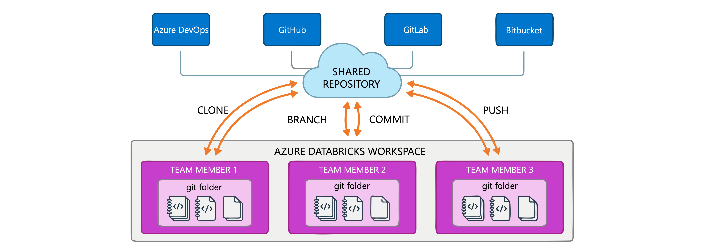
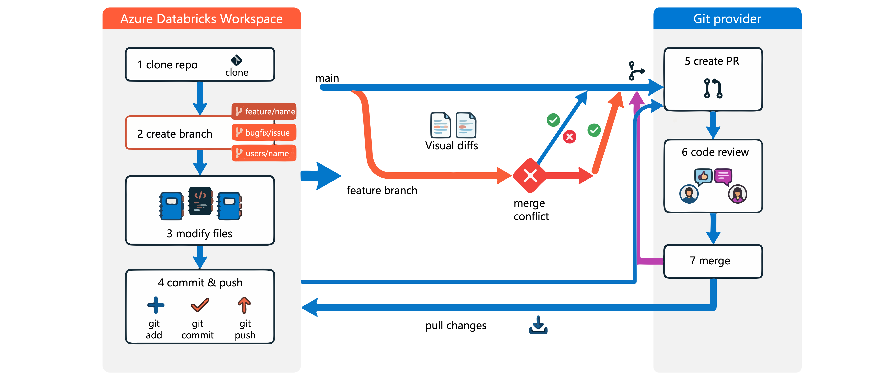
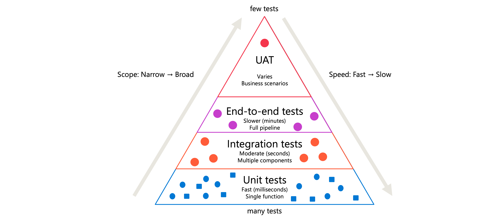
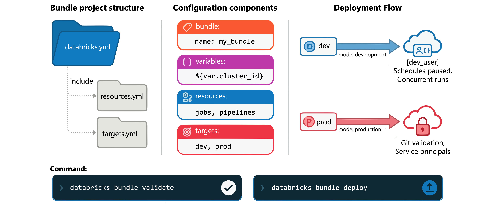

# Implement Development Lifecycle Processes

> **Module:** Implement development lifecycle processes in Azure Databricks (9 Units · Intermediate · Data Engineer)
> **Source:** [Microsoft Learn](https://learn.microsoft.com/en-gb/training/modules/implement-development-lifecycle-processes-in-azure-databricks/)
> **In one line:** **Git folders** for version control → **branches & pull requests** for collaboration → the **testing pyramid** → **Declarative Automation Bundles** (infrastructure-as-code) deployed with the **Databricks CLI**.

---

## 📌 Learning objectives

By the end of this module you should be able to:

- Apply **Git version control** best practices using Git folders
- Manage **branching, pull requests and conflict resolution**
- Implement a **testing strategy** — unit, integration, end-to-end and UAT
- Configure and customize **Declarative Automation Bundles**
- **Deploy bundles** with the Databricks CLI across environments

**Prerequisites:** Git concepts · Azure Databricks workspaces · Python & notebooks · data engineering fundamentals.

---

## 1. Git version control best practices



**Git folders** bring a **visual Git client** (and API) into the workspace — clone, branch, commit and push without leaving Databricks.

Providers: **Azure DevOps, GitHub, GitLab, Bitbucket**. The folder mirrors the repository structure (notebooks, Python files, SQL scripts and other supported assets).

> 💡 **Each team member should work in their own Git folder** connected to the shared repo. Sharing one folder means one user's branch switch affects everyone and causes conflicts.

### Clone a repository

1. Sidebar → **Workspace** → navigate to the target location
2. **Create** → **Git folder**
3. Repository URL (`https://example.com/organization/project.git`)
4. Select the **Git provider**
5. Name the folder
6. **Create Git folder**

### Pull changes

Open the Git dialog → **Pull** (fetch + merge) → resolve conflicts in the conflict resolution interface if needed.

> ⚠️ **Pulling changes that modify notebook source code resets the notebook state** — cell outputs, comments and version history clear to reflect the updated content.

**Pull regularly**, especially before starting new work, to minimize integration issues.

### Keeping the repository organized

- **`.gitignore`** for temporary outputs, credentials, environment-specific configs. ⚠️ **Files already tracked by Git must be explicitly removed before `.gitignore` applies to them.**
- **Structure folders logically**; Git folders support structures at any depth under your user directory.
- **Remove stale branches** from the provider after merging. 📝 **Local branches persist for up to 30 days after the remote branch is deleted.**

> ⚠️ **Size constraints:** working branches limited to **1 GB**; Databricks recommends **fewer than 20,000 assets**. For large repos use **sparse checkout** to work with only the directories you need.

---

## 2. Branching and pull requests



### Branches

**Create:** Git dialog (branch button next to the notebook name) → **Create branch** → descriptive name → base it on the appropriate source branch (typically `main`).

**Naming conventions:**

- **`feature/feature-name`** — new functionality
- **`bugfix/issue-description`** — fixes
- **`users/username/description`** — personal development work

> 📝 When you switch branches, **uncommitted changes carry over** if they don't conflict. Discard them first if you don't want them on the new branch.

> ⚠️ **Switching branches may delete workspace assets** when the new branch doesn't contain them. Verify the asset exists on the target branch before switching — especially for shared or bookmarked notebooks.

### Commit and push

1. Open the Git dialog from the notebook or workspace browser
2. Review the changed files (the UI shows **visual diffs**)
3. Enter a descriptive commit message (what changed **and why**)
4. **Commit & Push**

> If you lack permission to commit directly to a **protected branch** like `main`, create a feature branch and raise a pull request from your provider's interface.

> 📝 **Notebook outputs aren't committed by default** for source formats (`.py`, `.scala`, `.sql`, `.r`). Use **IPYNB format** if you need outputs under version control.

### Pull request workflow

Pull requests are **created and reviewed in the Git provider** (GitHub, Azure DevOps, GitLab, Bitbucket) — Databricks supplies the branching and committing.

1. Clone the repository into the workspace
2. Create a feature branch from `main`
3. Modify notebooks and files
4. Commit and push
5. Create the pull request in the provider's website
6. Review with the team and address feedback
7. Merge into the deployment branch

Then pull the updated branch to sync your workspace.

### Merge conflicts

Occur when multiple users modify the same lines — during **pull**, **merge** or **rebase**.

**Resolution options:**

- **Keep all current changes** / **Take all incoming changes** — kebab menu next to the file, when you want one side wholesale.
- **Manual resolution** — edit the file, removing the markers:

```text
<<<<<<< HEAD
Your current changes
=======
Incoming changes
>>>>>>> branch-name
```

Then **Mark As Resolved** → **Continue Merge** / **Continue Rebase**. **Abort** cancels and returns to the previous state.

> 💡 **Pull frequently** — small, frequent merges are far easier to resolve than large ones.

---

## 3. Testing strategy



| Test type | Purpose | Scope | Speed |
|-----------|---------|-------|-------|
| **Unit tests** | Individual functions work correctly | Single function/class | **Fast (milliseconds)** |
| **Integration tests** | Components work together | Multiple components | Moderate (seconds) |
| **End-to-end tests** | Complete workflows produce expected results | Full pipeline | Slower (minutes) |
| **UAT** | Solution meets **business requirements** | Business scenarios | Varies |

Many fast unit tests at the base; few comprehensive end-to-end/UAT scenarios at the top.

### Unit tests with pytest

Function under test:

```python
def filter_country_region(df, country_region="USA"):
    return df[df.iso_code == country_region]
```

Test file — pytest naming convention: **start with `test_` or end with `_test.py`**:

```python
import pytest
import pandas as pd
from transforms import filter_country_region

@pytest.fixture
def sample_data():
    """Create test data that mimics production structure."""
    return pd.DataFrame({
        'iso_code': ['USA', 'USA', 'CAN', 'GBR'],
        'value': [100, 200, 150, 175]
    })

def test_filter_country_region_default(sample_data):
    result = filter_country_region(sample_data)
    assert len(result) == 2
    assert all(result.iso_code == 'USA')

def test_filter_country_region_specific(sample_data):
    result = filter_country_region(sample_data, country_region='CAN')
    assert len(result) == 1
    assert result.iloc[0]['value'] == 150
```

**`@pytest.fixture`** creates **reusable test data** — **synthetic datasets** that mirror the production structure without exposing sensitive information.

**Run in a notebook:**

```python
%pip install pytest

import pytest
retcode = pytest.main([".", "-v", "-p", "no:cacheprovider"])
assert retcode == 0, "Tests failed. Check the output above."
```

> 💡 **Design functions to return predictable, single-type outputs.** A function returning either a DataFrame **or** `False` is hard to test — always return a DataFrame, even an empty one.

### Integration tests

Verify multiple components work together; often run against **actual Databricks resources** rather than mocks.

```python
def test_pipeline_integration(spark):
    """Test that transformation pipeline produces expected schema."""
    input_df = spark.sql("SELECT * FROM test_catalog.test_schema.raw_data")
    result_df = transform_pipeline(input_df)

    expected_columns = ['id', 'processed_date', 'category', 'amount']
    assert result_df.columns == expected_columns
    assert result_df.schema['amount'].dataType.simpleString() == 'decimal(10,2)'
```

> ⚠️ **Never run integration tests against production tables.** Create **dedicated test schemas/catalogs** with data mirroring the production structure but containing **no sensitive information**.

### End-to-end tests

Complete workflows, start to finish:

```python
def test_daily_processing_pipeline():
    """Validate complete daily data processing workflow."""
    test_date = "2024-01-15"
    setup_test_input_files(test_date)                   # Setup

    run_daily_pipeline(test_date)                       # Execute

    result = spark.sql(f"""                             # Verify
        SELECT COUNT(*) as row_count,
               SUM(amount) as total_amount
        FROM production.daily_summary
        WHERE process_date = '{test_date}'
    """)
    row = result.first()
    assert row.row_count == 1000, f"Expected 1000 rows, got {row.row_count}"
    assert abs(row.total_amount - 50000.00) < 0.01

    cleanup_test_data(test_date)                        # Cleanup
```

> 💡 They're slow — schedule them **off-peak** or in the **deployment pipeline**, not on every code change.

### User acceptance testing (UAT)

Stakeholders validate that the solution delivers **business value** (previous types check technical correctness).

**Planning:** define **acceptance criteria with stakeholders before development** · create a **staging environment** mirroring production · prepare scenarios from **real business use cases** · document expected outcomes · establish a feedback process.

```python
# UAT Scenario: Monthly revenue reconciliation
# Expected outcome: Total matches finance system within 1%

finance_total = 1_250_000.00  # From finance system

pipeline_result = spark.sql("""
    SELECT SUM(revenue) as total_revenue
    FROM reporting.monthly_revenue
    WHERE month = '2024-01'
""").first()

variance = abs(pipeline_result.total_revenue - finance_total) / finance_total
print(f"Variance: {variance:.2%}")
```

### Test structure

```
project/
├── src/
│   └── transforms.py
├── tests/
│   ├── unit/
│   │   └── test_transforms.py
│   ├── integration/
│   │   └── test_pipeline.py
│   └── e2e/
│       └── test_daily_workflow.py
├── notebooks/
│   └── run_tests.py
└── requirements.txt
```

> 📝 **Databricks recommends storing functions and their unit tests OUTSIDE notebooks** for Python projects — better code reuse and simpler testing. Keep them in `.py` files in a Git folder and import into notebooks.

**Test runner notebook:**

```python
%pip install -r ../requirements.txt

import pytest
import sys

sys.dont_write_bytecode = True    # prevent caching to a readonly filesystem

retcode = pytest.main(["tests/", "-v", "-p", "no:cacheprovider"])
assert retcode == 0, "Test suite failed"
```

**Automate** by creating a Databricks job that runs the test notebook before deploying to production → catches **regressions**.

---

## 4. Configure and package Declarative Automation Bundles



**Declarative Automation Bundles** (formerly **Databricks Asset Bundles**) = **infrastructure-as-code** for Databricks: jobs, pipelines and other resources described in **YAML**.

> 📝 Bundle configuration can also be expressed in **Python (Public Preview)** instead of YAML.

### Configuration structure

**`databricks.yml`** must exist at the **root of the bundle project**.

```yaml
bundle:
  name: my-data-pipeline

include:
  - resources/*.yml

workspace:
  host: https://adb-1234567890123456.7.azuredatabricks.net

resources:
  jobs:
    daily-ingestion-job:
      name: daily-ingestion-job
      tasks:
        - task_key: ingest-data
          notebook_task:
            notebook_path: ./notebooks/ingest.py

targets:
  dev:
    default: true
  prod:
    workspace:
      host: https://adb-9876543210987654.3.azuredatabricks.net
```

| Mapping | Purpose |
|---------|---------|
| **`bundle`** | The bundle's programmatic name |
| **`include`** | Reference additional YAML files |
| **`workspace`** | Workspace host |
| **`resources`** | Databricks resources to deploy (jobs, pipelines…) |
| **`targets`** | **Deployment environments**, each with its own workspace/config |

> 💡 Split configuration into separate files for resources and targets; pull them in with **`include`**.

### Variables

```yaml
variables:
  cluster_id:
    description: The cluster to use for job execution
    default: 1234-567890-abcde123
  environment:
    description: The deployment environment name
    default: development

resources:
  jobs:
    my-job:
      name: ${var.environment}-data-pipeline
      tasks:
        - task_key: process-data
          existing_cluster_id: ${var.cluster_id}
          notebook_task:
            notebook_path: ./notebooks/process.py
```

**Substitution syntax: `${var.variable_name}`.**

**Ways to supply values:**

- **Default** in the variable definition
- **Override in target-specific configuration**
- **Command line:** `--var="cluster_id=5678-901234-fghij567"`
- **Environment variables** with the **`BUNDLE_VAR_`** prefix

```yaml
targets:
  dev:
    default: true
    variables:
      cluster_id: 1234-567890-abcde123
      environment: development
  prod:
    variables:
      cluster_id: 9876-543210-zyxwv987
      environment: production
```

### Resources and tasks

```yaml
resources:
  jobs:
    etl-pipeline:
      name: etl-pipeline
      tasks:
        - task_key: extract-task
          notebook_task:
            notebook_path: ./notebooks/extract.py
        - task_key: transform-task
          depends_on:
            - task_key: extract-task
          notebook_task:
            notebook_path: ./notebooks/transform.py
            base_parameters:
              source_table: ${var.source_table}
```

Task types include **`notebook_task`** and **`spark_python_task`**; **`depends_on`** creates dependencies; **`base_parameters`** passes runtime values.

> ⚠️ **Use paths relative to the bundle root** — the CLI resolves them at deploy time.

**Job clusters:**

```yaml
resources:
  jobs:
    my-job:
      job_clusters:
        - job_cluster_key: shared-cluster
          new_cluster:
            spark_version: 14.3.x-scala2.12
            node_type_id: Standard_DS3_v2
            num_workers: 2
      tasks:
        - task_key: my-task
          job_cluster_key: shared-cluster
          notebook_task:
            notebook_path: ./notebooks/analysis.py
```

### Targets and modes

**Development mode:**

```yaml
targets:
  dev:
    default: true
    mode: development
```

→ **prefixes resource names with `[dev username]`**, **pauses all schedules**, and **enables concurrent job runs** — so dev resources don't interfere with production.

**Production mode:**

```yaml
targets:
  prod:
    mode: production
    workspace:
      host: https://adb-prod.7.azuredatabricks.net
```

→ **validates that your local Git branch matches the specified branch** and **recommends service principals** for deployment.

**Presets** — fine-tune without relying on mode defaults (useful for staging):

```yaml
targets:
  staging:
    presets:
      name_prefix: staging_
      trigger_pause_status: PAUSED
      tags:
        environment: staging
```

---

## 5. Deploy a bundle with the Databricks CLI


> 📝 CLI deployment is **recommended for CI/CD**. Bundles can also be managed through the **workspace UI (Public Preview)** for ad-hoc collaboration without the CLI.

### Validate

```bash
databricks bundle validate
```

```output
Name: my_data_pipeline
Target: dev
Workspace:
  Host: https://adb-1234567890123456.7.azuredatabricks.net
  User: someone@example.com
  Path: /Users/someone@example.com/.bundle/my_data_pipeline/dev

Validation OK!
```

Confirms **bundle name, target environment and workspace details**; reports missing required fields or invalid property names.

### Plan (preview)

```bash
databricks bundle plan
databricks bundle plan -t production
```

```output
Building python_artifact...
create jobs.data_ingestion_job
create pipelines.transform_pipeline
```

Shows **exactly what will be created, updated or removed** — without making changes.

### Deploy

```bash
databricks bundle deploy              # uses the default target
databricks bundle deploy -t dev       # specific target
databricks bundle deploy -t production --auto-approve   # CI/CD: skip prompts
```

The CLI **stores state in the workspace tracking which resources it created**, so:

- **New resources** in the configuration are **created**
- **Existing** previously-deployed resources are **updated**
- **Removed** resources (no longer in the configuration) are **deleted from the workspace**

> ⚠️ **Deployment identity = bundle name + target name + deploying user's identity.** If multiple team members deploy the same bundle to the same target, **their deployments conflict** — agree who deploys to shared environments.

### Verify

```bash
databricks bundle summary
databricks bundle open data_ingestion_job
```

`summary` lists deployed resources with **direct workspace URLs** (note the `[dev someone]` name prefix from development mode); `open` launches the browser at that resource.

### Troubleshooting

| Issue | Fix |
|-------|-----|
| **Authentication errors** | Reauthenticate: `databricks auth login --host https://adb-….azuredatabricks.net` |
| **Lock conflicts** (interrupted deployment left a lock) | `databricks bundle deploy --force-lock` |
| **Active run conflicts** (bundle jobs/pipelines running) | Deployment **fails by default** to prevent disruption; `--fail-on-active-runs` to fail explicitly, or handle running resources in your strategy |
| **Validation warnings** about unknown properties | CLI/workspace may not support that feature — **update the CLI** or check property names against the current schema |

---

## 6. Summary

- **Git folders** = visual Git client in the workspace; one folder per developer; pull often (**it resets notebook state**); mind the **1 GB / 20,000 asset** limits.
- **Branching**: `feature/`, `bugfix/`, `users/`; commits exclude notebook outputs unless IPYNB; **PRs happen in the Git provider**; resolve conflicts in the UI or manually then Continue/Abort.
- **Testing pyramid**: many unit tests (pytest + fixtures, functions outside notebooks) → integration tests (dedicated test catalogs, **never production**) → end-to-end → **UAT** with stakeholders in staging.
- **Bundles**: `databricks.yml` at the root with `bundle` / `include` / `workspace` / `resources` / `targets`; variables via `${var.x}`; **development mode** prefixes names, pauses schedules, allows concurrent runs; **production mode** validates the Git branch.
- **CLI flow**: **validate → plan → deploy → summary/open**; deployments are tracked in state (removed resources get deleted) and are identified by bundle + target + user.

---

## 🧠 Quick revision cheat-sheet

| Concept | Remember this |
|---------|---------------|
| **Git folders** | Visual Git client + API in the workspace; Azure DevOps, GitHub, GitLab, Bitbucket |
| **One folder per person** | Shared folders → one user's branch switch affects everyone |
| **Pull side effect** | Modifying notebook source **resets notebook state** (outputs, comments, version history) |
| **`.gitignore`** | **Already-tracked files must be removed explicitly** before it applies |
| **Stale branches** | Local branches persist **up to 30 days** after the remote is deleted |
| **Git folder limits** | Branch **1 GB**; keep assets **< 20,000**; use **sparse checkout** for large repos |
| **Branch naming** | `feature/…` · `bugfix/…` · `users/username/…` |
| **Switching branches** | Uncommitted changes **carry over**; ⚠️ **may delete workspace assets** missing on the target branch |
| **Notebook outputs in Git** | **Not committed** for `.py`/`.scala`/`.sql`/`.r` — use **IPYNB** to version outputs |
| **Pull requests** | Created/reviewed **in the Git provider**, not in Databricks |
| **Conflict markers** | `<<<<<<< HEAD` / `=======` / `>>>>>>> branch`; then **Mark As Resolved** → **Continue Merge/Rebase**, or **Abort** |
| **Testing pyramid** | Unit (ms) → integration (s) → end-to-end (min) → UAT (business) |
| **pytest naming** | Files start with **`test_`** or end with **`_test.py`** |
| **`@pytest.fixture`** | Reusable **synthetic** test data — protects production data |
| **Run pytest in a notebook** | `pytest.main([".", "-v", "-p", "no:cacheprovider"])`; assert `retcode == 0` |
| **Testable function design** | Return a **predictable single type** (always a DataFrame, even if empty) |
| **Integration tests** | Run against **dedicated test schemas/catalogs — never production tables** |
| **Where to keep code** | Functions + unit tests **outside notebooks**, in `.py` files in a Git folder |
| **Bundles** | **Declarative Automation Bundles** = former **Databricks Asset Bundles**; infrastructure-as-code in YAML (Python in Public Preview) |
| **Root file** | **`databricks.yml`** at the bundle root |
| **Top-level mappings** | `bundle` · `include` · `workspace` · `resources` · `targets` |
| **Variable syntax** | **`${var.name}`**; values from default, target override, **`--var=`**, or **`BUNDLE_VAR_`** env vars |
| **Task paths** | **Relative to the bundle root** |
| **Development mode** | **`[dev username]` name prefix** + **schedules paused** + **concurrent runs enabled** |
| **Production mode** | **Validates the local Git branch** matches; recommends **service principals** |
| **Presets** | `name_prefix`, `trigger_pause_status`, `tags` — fine-tune outside mode defaults |
| **CLI sequence** | **`validate`** → **`plan`** (preview create/update/remove) → **`deploy`** → **`summary`** / **`open`** |
| **Deploy flags** | **`-t <target>`** · **`--auto-approve`** (CI/CD) · **`--force-lock`** · `--fail-on-active-runs` |
| **Deployment state** | Tracked in the workspace — **resources removed from config get deleted** |
| **Deployment identity** | **bundle name + target + deploying user** → concurrent deploys by different people **conflict** |
| **Active runs** | Deployment **fails by default** when bundle jobs/pipelines are running |