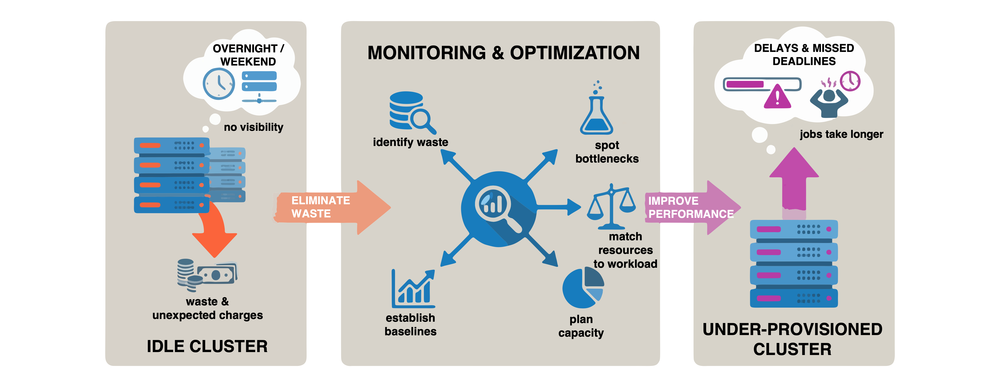
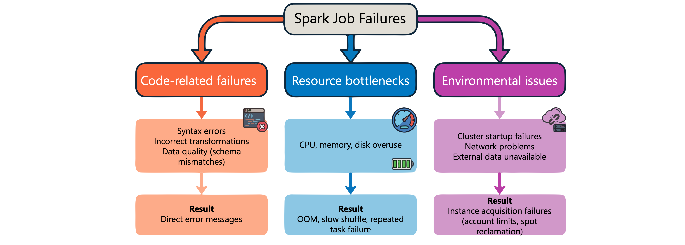
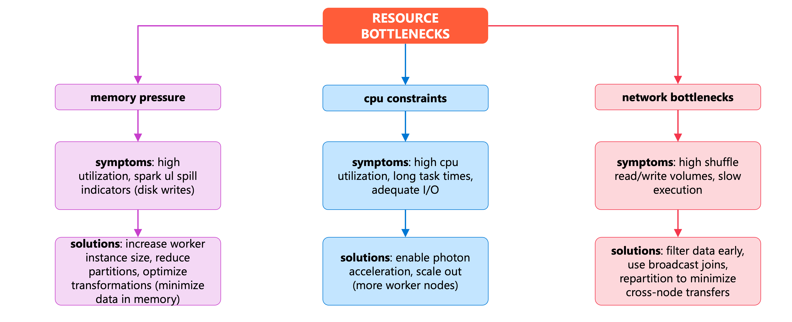
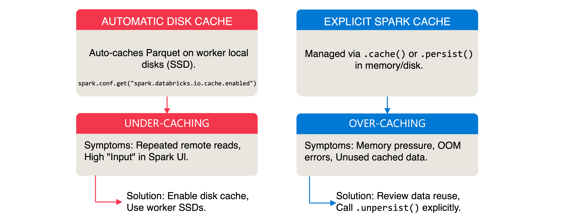
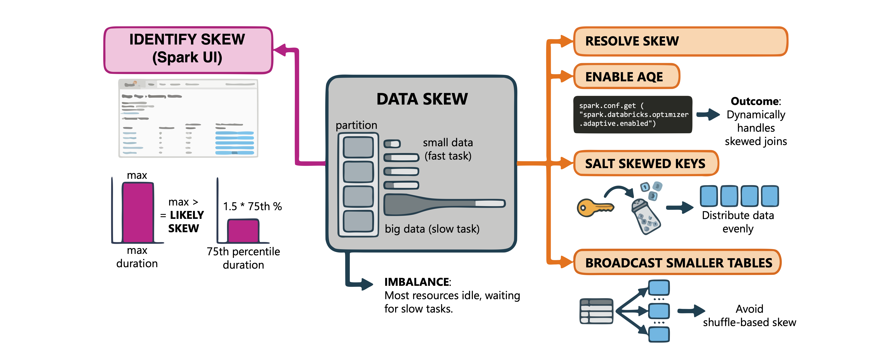
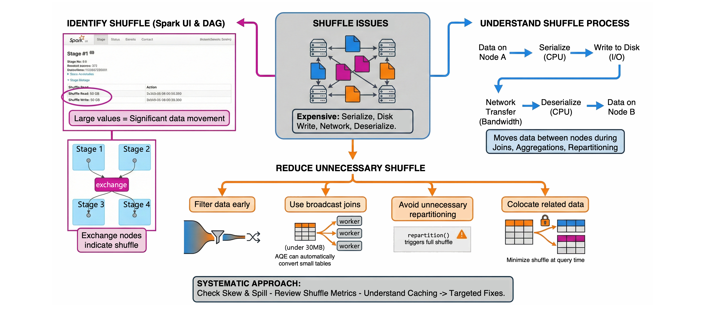
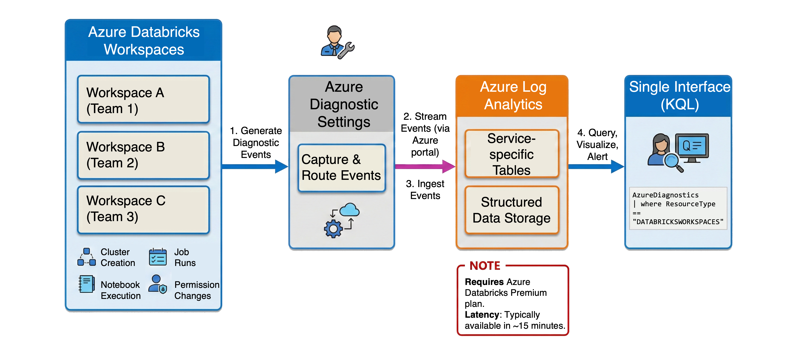

# Monitor, Troubleshoot and Optimize Workloads

> **Module:** Monitor, troubleshoot and optimize workloads in Azure Databricks (9 Units · Intermediate · Data Engineer)
> **Source:** [Microsoft Learn](https://learn.microsoft.com/en-gb/training/modules/monitor-troubleshoot-optimize-workloads-azure-databricks/)
> **In one line:** **Cluster consumption & cost** → **repair failed jobs** → **diagnose Spark with the Spark UI** → **fix cache / skew / spill / shuffle** → **centralize logs in Log Analytics**.

---

## 📌 Learning objectives

By the end of this module you should be able to:

- Monitor and manage **cluster consumption** with metrics, auto-termination and budgets
- Troubleshoot and **repair failed Lakeflow Jobs**
- Diagnose **Spark job failures and resource bottlenecks** with the Spark UI and compute metrics
- Investigate and resolve **caching, data skew, memory spill and shuffle** issues
- Implement **log streaming to Azure Log Analytics**

**Prerequisites:** Databricks workspaces & clusters · Apache Spark concepts & notebooks · data engineering fundamentals · Azure portal navigation.

---

## 1. Monitor and manage cluster consumption



**Both directions cost you:** an **idle cluster** running overnight/over a weekend generates significant charges; **under-provisioned clusters** make jobs slow and miss deadlines. The goal is to **match resources precisely to workload requirements**, not just minimize cost.

### Compute metrics

**Compute** (sidebar) → select the resource → **Metrics** tab. Three categories:

| Category | What it shows |
|----------|--------------|
| **Hardware metrics** | **CPU utilization** (working hard vs idle) · **Memory utilization** (scale up or reduce instance size) · **Network throughput** (transfer bottlenecks) |
| **Spark metrics** | **Active tasks** (parallelism) · failed/completed task counts (job health) · **shuffle read/write** (data movement problems) |
| **GPU metrics** | Specialized compute utilization — **Databricks Runtime ML 13.3+** |

- Filter by time range — data from the **past 30 days**.
- Select individual nodes from the Compute dropdown, or view aggregated metrics across all nodes.

> 📝 **Serverless compute for notebooks and jobs uses query insights instead of the metrics UI.**

### SQL warehouse monitoring

SQL warehouse → **Monitoring** tab:

- **Live statistics** — status, running queries, queued queries, current cluster count (real-time).
- **Peak query count** — max concurrent queries (running + queued); spikes = the warehouse struggled with demand.
- **Running clusters** — allocation over time; **sustained maximum → increase the maximum cluster count**.
- **Query history** — start time, duration, user; filter for **long-running queries** or heavy users.

### Auto-termination and autoscaling

**Auto-termination** shuts down idle clusters. **30–60 minutes** is typical for development.

> ⚠️ A cluster counts as inactive only when **all** commands have finished — Spark jobs, **Structured Streaming**, and **JDBC calls**.

> ⚠️ **Auto-termination doesn't monitor DStreams activity.** For DStream workloads, disable auto-termination or migrate to Structured Streaming.

**Autoscaling** adjusts worker count between **minimum and maximum node counts** → typically **20–40% cost reduction** vs fixed-size clusters.

### Budgets, system tables and tags

- **Budgets** — financial targets with **email notifications** when spending approaches/exceeds limits; filter by team, project or workspace. ⚠️ **Account admin permissions required** to create/manage budgets (workspace admins can usually only view).
- **System tables** — **`system.billing.usage`** for detailed usage; join with **`system.compute.clusters`** to see which owners consume the most **DBUs**.
- **Tags** propagate from clusters/workspaces to billing records → accurate **chargeback**. ⚠️ **Apply tags from the start — they can't be added retroactively to historical usage.**

**Daily DBU consumption trend:**

```sql
SELECT usage_date, sum(usage_quantity) as DBUs_Consumed
FROM system.billing.usage
WHERE sku_name = "STANDARD_ALL_PURPOSE_COMPUTE"
GROUP BY usage_date
ORDER BY usage_date ASC
```

**Jobs consuming the most DBUs:**

```sql
SELECT usage_metadata.job_id as job_id, sum(usage_quantity) as total_dbus
FROM system.billing.usage
WHERE usage_metadata.job_id IS NOT NULL
GROUP BY job_id
ORDER BY total_dbus DESC
```

**Costs by cluster owner:**

```sql
SELECT c.owned_by, sum(u.usage_quantity) as total_dbus
FROM system.billing.usage u
JOIN system.compute.clusters c
  ON u.usage_metadata.cluster_id = c.cluster_id
WHERE u.usage_metadata.cluster_id IS NOT NULL
GROUP BY c.owned_by
ORDER BY total_dbus DESC
```

**Usage by custom tag:**

```sql
SELECT sku_name, usage_unit, sum(usage_quantity) as total_usage
FROM system.billing.usage
WHERE custom_tags['project'] = 'sales-analytics'
GROUP BY sku_name, usage_unit
```

> 📝 **Serverless billing:** filter **`product_features.is_serverless = true`**; **`identity_metadata.run_as`** identifies the user/service principal. ⚠️ **A single serverless job run can produce multiple billing records** — always use **`SUM()`**, don't expect one row per run.

---

## 2. Troubleshoot and repair Lakeflow Jobs

### Failure states

> 📝 Job run status is determined by the outcome of **leaf tasks** — tasks with no downstream dependencies.

| State | Meaning |
|-------|---------|
| **Failed** | One or more **leaf tasks** didn't complete successfully |
| **Succeeded with failures** | Some tasks failed, but **all leaf tasks succeeded** |
| **Skipped** | Exceeded maximum concurrent runs for the job or workspace |
| **Timed Out** | Exceeded configured maximum duration |
| **Canceled** | Stopped by a user or automated process |

**Disabled** (task status) — explicitly disabled, or automatically disabled because an **upstream dependency is disabled**; shown with a circle-off icon in the DAG.

> 📝 During a **repair run**, the **run state — not the disabled state — determines what re-runs**; you can force a disabled task to run by including it explicitly in the repair request.

### Identifying the cause

1. **Jobs & Pipelines** → job name
2. **Runs** tab → hover a **failed (red) task** in the **matrix view** → start/end time, status, duration, error message
3. Select the task → **Task run details** page with full output and logs

**Pattern reading:** the same task failing repeatedly → **its code or configuration**. Random failures across different tasks → a **cluster or resource problem**.

> 💡 The **Diagnose Error** button calls **Genie Code** to analyse error messages and suggest fixes.

### Common causes and fixes

| Cause | Fix |
|-------|-----|
| **Configuration issues** | **Edit task** — notebook paths, parameters, timeout values |
| **Insufficient compute** | Add workers, change instance types, switch to a shared all-purpose cluster; ask an admin to raise workspace quotas |
| **Maximum concurrent runs exceeded** | Wait for existing runs, or increase **Maximum concurrent runs** |
| **External dependencies** | Fix the external issue, then **repair** the run rather than starting over |

### Repair runs

Re-runs **only the unsuccessful tasks and their dependents**.

1. Select the failed run (**Start time** column or matrix view)
2. **Repair run**
3. Review the task list — **failed tasks plus dependents**
4. Optionally modify parameters — **overrides apply to this repair run only**
5. **Repair run**

The matrix view then adds a **new column** with the repaired results.

> ⚠️ **Repair is available only for jobs with two or more tasks.** If tasks share a job cluster, repair **creates a new cluster instance** (e.g. `my_job_cluster_v1`) so you can compare settings.

### Stop and restart

- **Stop an active run** — **Runs** tab → stop button; or **Cancel runs** / **Cancel all queued runs** from the dropdown.
- **Restart continuous jobs** — repeated failures put the job into **exponential backoff**; **Job details** shows consecutive failures and time to next retry. **Restart run** cancels the active run, **resets the retry period**, and starts immediately — use it after fixing the underlying issue to bypass the backoff wait.

### Proactive monitoring

**Configure notifications** (email, Slack, webhook) · **review run history** in the matrix view for patterns · **query the `system.lakeflow` schema** to analyse job performance account-wide.

---

## 3. Troubleshoot Spark jobs and notebooks

### Common causes of failure



| Category | Examples |
|----------|----------|
| **Code-related** | Syntax errors, incorrect transformations, **schema mismatches** — error messages usually point at the code |
| **Resource bottlenecks** | **OOM errors**, slow shuffle, repeatedly failing tasks → adjust cluster config or optimize code |
| **Environmental** | Cluster startup failures, network problems, unavailable data sources, **failure to acquire cloud instances** (account limits, **spot instance reclamation**) |

### Spark UI

Cluster page → **Spark UI** tab. Start with the **Jobs Timeline** and look for:

- **Failing jobs** — red status; select to view the failed stage and reason (with links to task-level detail).
- **Long-running jobs** — one job far longer than the others is the prime target.
- **Gaps in execution** — short gaps are normal (driver coordinating), but **gaps longer than a minute mid-pipeline suggest an overloaded driver or a cluster malfunction**.

Then drill into the longest stage and examine **Input**, **Output**, **Shuffle Read**, **Shuffle Write**.

> 💡 **Task count is diagnostic:** a stage with **only one task** = insufficient parallelism; **uneven task durations** = data skew.

### Resource bottlenecks



| Bottleneck | Signals | Fixes |
|-----------|---------|-------|
| **Memory pressure** | High memory utilization on workers/driver; **spill indicators** in the Spark UI | Larger worker instances · fewer rows per partition · optimize transformations holding data in memory |
| **CPU constraints** | High CPU with long task times despite adequate I/O | Enable **Photon** for compatible workloads · scale out with more workers |
| **Network** | High shuffle read/write with slow execution | Filter earlier · **broadcast joins** for small tables · repartition to reduce cross-node transfer |

**Compute → Metrics → Server load distribution** uses colour coding: **red = heavily loaded**, **blue = idle**.

> 💡 **Driver red while workers are blue → the driver is overloaded** and may need a larger instance type.

### Restarting clusters

Check the **Event log** tab first — instance acquisition failures, spot reclamation, executor terminations.

**Compute** → cluster → **Restart**, or:

```bash
databricks clusters restart CLUSTER_ID     # find IDs with: databricks clusters list
```

> ⚠️ **Restarting terminates running jobs and resets the Spark UI history** — save diagnostic information first. For long-running streaming clusters, schedule regular restarts during maintenance windows so they run on current images.

Validate the fix by monitoring the next run: execution times back to normal, no new errors.

---

## 4. Caching, skew, spill and shuffle

### Diagnostic tools

| Tool | What it gives you |
|------|-------------------|
| **DAG** | The query's **execution plan** — data flow through operators, where transformations occur |
| **Spark UI** | Stages, tasks, resource consumption; timeline views, stage durations, task distributions |
| **Query profile** | Per-operator breakdown for **SQL warehouse** workloads — time spent, rows processed, memory. **Query History** → select query → **See query profile** |

> 💡 **Start with the DAG** for overall flow, then drill into the Spark UI or query profile for the expensive stages.

### Caching



**Disk cache** (formerly **Delta cache**) automatically caches **Parquet data files** on worker nodes.

```python
spark.conf.get("spark.databricks.io.cache.enabled")
```

| Problem | Signal | Fix |
|---------|--------|-----|
| **Under-caching** | High **Input** values for stages reading the same data repeatedly | Enable disk cache; use worker nodes with **SSD storage** |
| **Over-caching** | Memory pressure / OOM | Check cached data is actually reused |

> 📝 **Spark cache** (`.cache()` / `.persist()`) requires **explicit management** — call **`.unpersist()`** when done. Disk cache is automatic.

### Data skew



Some partitions hold much more data → a few tasks run long while the rest of the cluster idles.

> **Detection:** stage page → **Summary Metrics** → compare **Max** duration to the **75th percentile**. **Max more than 50% higher than the 75th percentile ⇒ likely skew.**

**Common causes:** uneven key distribution (one customer ID in 90% of records) · **null values all routing to one partition** · time-based partitioning where recent dates dominate.

**Fixes:**

- **Adaptive Query Execution (AQE)** handles skewed joins dynamically:

```python
spark.conf.get("spark.databricks.optimizer.adaptive.enabled")
```

- **Salt skewed keys** — add a random component to spread data across partitions.
- **Broadcast smaller tables** to avoid shuffle-based skew.

### Memory spill


Spark runs out of memory and writes intermediate data to disk — common during shuffles, aggregations, or with oversized partitions.

> **Detection:** top of each stage page → **Shuffle Spill (Memory)** and **Shuffle Spill (Disk)**. **Any non-zero spill indicates memory pressure.**

**Fixes:**

- **Increase partition count**:

```python
spark.conf.set("spark.sql.shuffle.partitions", "auto")
```

- **Add memory** — higher memory-to-core ratio, or more workers.
- **Optimize data size** — select only needed columns, filter early.

> ⚠️ **Spill often accompanies skew** — a single oversized partition spills. **Fix skew first** and spill often resolves itself.

### Shuffle



Moving data between nodes for joins, aggregations and repartitioning — expensive because it **serializes, writes to disk, transfers over the network and deserializes**.

> **Detection:** **Shuffle Read** / **Shuffle Write** columns per stage; the DAG shows shuffles as **exchange nodes**.

**Fixes:**

- **Filter early**, before joins/aggregations.
- **Broadcast joins** when one table is small (**under 30 MB by default**). **AQE can convert sort-merge joins to broadcast joins at runtime** when it detects a small table.
- **Avoid unnecessary repartitioning** — every **`repartition()` triggers a full shuffle**.
- **Colocate related data** — bucket or partition frequently joined tables similarly.

In SQL warehouse **query profiles**, shuffles appear as **Exchange** nodes — select one for data size and partitions exchanged.

---

## 5. Log streaming with Azure Log Analytics



**Flow:** Databricks generates audit/diagnostic events → **Azure diagnostic settings** capture and stream them → Log Analytics ingests into **service-specific tables** → you query/visualize/alert with **KQL**.

> ⚠️ Diagnostic logs require the **Azure Databricks Premium plan**; logs appear in Log Analytics within about **15 minutes**.

> 📝 For querying audit logs **inside** Databricks, use the **`system.access.audit`** system table. Use **Log Analytics** when you need **cross-service centralized monitoring, KQL alerting, or Azure Monitor integration**.

### Log tables

| Table | Contents |
|-------|----------|
| **`DatabricksClusters`** | Creation, termination, resizing, configuration changes |
| **`DatabricksJobs`** | Job creation, runs, failures, schedule modifications |
| **`DatabricksNotebook`** | Notebook execution, creation, modification |
| **`DatabricksSQL`** | SQL warehouse operations and query events |
| **`DatabricksTables`** | Table creation, deletion, access, permission changes |
| **`DatabricksWorkspace`** | Workspace-level and administrative operations |
| **`DatabricksSecrets`** | Secret scope and secret access events |

**Standard columns:** `TimeGenerated` · `OperationName` · `Identity` · `SourceIPAddress` · `RequestParams` · `Response`.

### KQL queries

**Recent job events:**

```kusto
DatabricksJobs
| where TimeGenerated > ago(24h)
| project TimeGenerated, OperationName, Identity, SourceIPAddress
| order by TimeGenerated desc
| take 100
```

**Failure patterns:**

```kusto
DatabricksJobs
| where TimeGenerated > ago(7d)
| where Response contains "error" or Response contains "failed"
| summarize FailureCount = count() by OperationName, bin(TimeGenerated, 1h)
| order by FailureCount desc
```

**Cluster event types:**

```kusto
DatabricksClusters
| where TimeGenerated > ago(7d)
| summarize EventCount = count() by OperationName
| order by EventCount desc
```

**Table access (security/compliance):**

```kusto
DatabricksTables
| where TimeGenerated > ago(24h)
| where OperationName has "create" or OperationName has "delete" or OperationName has "update"
| project TimeGenerated, Identity, OperationName, RequestParams
| order by TimeGenerated desc
```

> 💡 Save frequently used queries to **Query explorer**, organize into folders, share with the team.

### Alerts

Run the query → **New alert rule** → configure the **Condition** (thresholds) → define an **Action group** (who is notified and how — email, SMS, Azure mobile app, ITSM integrations).

**Job failures over threshold:**

```kusto
DatabricksJobs
| where TimeGenerated > ago(1h)
| where Response contains "error" or Response contains "failed"
| summarize FailureCount = count()
| where FailureCount > 5
```

**Unusual out-of-hours table operations:**

```kusto
DatabricksTables
| where TimeGenerated > ago(1h)
| where hourofday(TimeGenerated) < 6 or hourofday(TimeGenerated) > 20
| where OperationName has "create" or OperationName has "delete"
| summarize OperationCount = count() by Identity
| where OperationCount > 5
```

Also worth alerting on **cluster creation spikes** (runaway automation or unauthorized activity).

### Troubleshooting patterns

- **Job failures** — start with `DatabricksJobs`, cross-reference `DatabricksClusters` for cluster issues, check `DatabricksNotebook` for notebook code.
- **Performance** — cluster events for scaling patterns; **frequent autoscaling suggests undersized initial configuration**.
- **Security incidents** — `DatabricksTables` + `DatabricksSecrets`, correlated with **`SourceIPAddress`**.
- **Cost attribution** — combine cluster and job logs with Azure cost data.

---

## 6. Summary

- **Consumption:** compute metrics (hardware / Spark / GPU, 30 days), SQL warehouse monitoring, **auto-termination** (30–60 min dev) and **autoscaling** (20–40% savings); budgets, **`system.billing.usage`** and **tags applied from day one**.
- **Jobs:** run state is decided by **leaf tasks**; the matrix view reveals patterns; **repair run** re-executes only failed tasks + dependents (needs ≥ 2 tasks); restart clears exponential backoff.
- **Spark:** Jobs Timeline for failures, long jobs and gaps; one-task stages = no parallelism, uneven tasks = skew; Server load distribution shows an overloaded driver.
- **Performance quartet:** cache (disk cache automatic, Spark cache needs `.unpersist()`) · **skew** (Max vs 75th percentile, AQE/salting/broadcast) · **spill** (any non-zero is bad; fix skew first) · **shuffle** (filter early, broadcast < 30 MB, avoid `repartition()`).
- **Log Analytics:** diagnostic settings → Databricks* tables → KQL queries and alerts; Premium plan, ~15-minute latency.

---

## 🧠 Quick revision cheat-sheet

| Concept | Remember this |
|---------|---------------|
| **Compute metrics** | Compute → **Metrics** tab; hardware / Spark / **GPU (DBR ML 13.3+)**; **past 30 days** |
| **Serverless monitoring** | Uses **query insights**, not the metrics UI |
| **SQL warehouse tab** | **Monitoring** — live statistics, **peak query count**, running clusters, query history |
| **Auto-termination** | 30–60 min for dev; inactive only when **all** commands (incl. Structured Streaming, JDBC) finish; ⚠️ **doesn't monitor DStreams** |
| **Autoscaling saving** | Roughly **20–40%** vs fixed-size clusters |
| **Budgets** | Require **account admin**; email notifications on approaching/exceeding limits |
| **Billing system table** | **`system.billing.usage`**; join **`system.compute.clusters`** for owner attribution |
| **Tags** | Propagate to billing for chargeback — **cannot be applied retroactively** |
| **Serverless billing** | `product_features.is_serverless = true`; `identity_metadata.run_as`; **multiple rows per run → use `SUM()`** |
| **Job run status** | Determined by **leaf tasks** (no downstream dependencies) |
| **Job states** | Failed · **Succeeded with failures** (leaf tasks OK) · Skipped (concurrency) · Timed Out · Canceled |
| **Disabled tasks** | Explicit, or auto-disabled via a disabled upstream; in repair, **run state — not disabled state — decides** what re-runs |
| **Repair run** | Re-runs **failed tasks + dependents**; ⚠️ **needs ≥ 2 tasks**; shared job cluster → new instance (`..._v1`); parameter overrides apply to that repair only |
| **Restart run** | Cancels the active run and **resets exponential backoff** for continuous jobs |
| **Job system tables** | **`system.lakeflow`** schema for account-wide job analysis |
| **Spark UI start point** | **Jobs Timeline** → failing jobs, long-running jobs, **gaps > 1 minute** (overloaded driver / cluster malfunction) |
| **Task-count signals** | **One task in a stage = insufficient parallelism**; **uneven durations = skew** |
| **Server load distribution** | **Red = loaded, blue = idle**; **red driver + blue workers → bigger driver** |
| **Cluster restart** | `databricks clusters restart CLUSTER_ID`; ⚠️ **terminates jobs and resets Spark UI history** |
| **Three diagnostic tools** | **DAG** (plan) · **Spark UI** (metrics) · **query profile** (SQL warehouses, via Query History) |
| **Disk cache** | Formerly **Delta cache**; automatic, **Parquet files** on workers; `spark.databricks.io.cache.enabled` |
| **Spark cache** | `.cache()` / `.persist()` — **manual**, release with **`.unpersist()`** |
| **Skew detection** | **Max > 75th percentile by more than 50%** in Summary Metrics |
| **Skew causes** | Uneven keys · **nulls in one partition** · time-based partitioning |
| **Skew fixes** | **AQE** (`spark.databricks.optimizer.adaptive.enabled`) · **salting** · broadcast |
| **Spill detection** | **Shuffle Spill (Memory)** / **(Disk)** — **any non-zero = memory pressure** |
| **Spill fixes** | `spark.sql.shuffle.partitions = "auto"` · more memory · fewer columns, filter early; **fix skew first** |
| **Shuffle detection** | **Shuffle Read/Write** columns; **Exchange nodes** in the DAG / query profile |
| **Broadcast threshold** | **Under 30 MB by default**; AQE can convert sort-merge → broadcast at runtime |
| **`repartition()`** | **Always triggers a full shuffle** |
| **Log streaming needs** | **Premium plan**; ~**15-minute** latency; configured via **Azure diagnostic settings** |
| **Log tables** | DatabricksClusters · DatabricksJobs · DatabricksNotebook · DatabricksSQL · DatabricksTables · DatabricksWorkspace · DatabricksSecrets |
| **Standard log columns** | `TimeGenerated`, `OperationName`, `Identity`, `SourceIPAddress`, `RequestParams`, `Response` |
| **In-workspace audit** | **`system.access.audit`**; Log Analytics for **cross-service monitoring and KQL alerting** |
| **Alerts** | Query → **New alert rule** → Condition + **Action group** (email, SMS, mobile app, ITSM) |